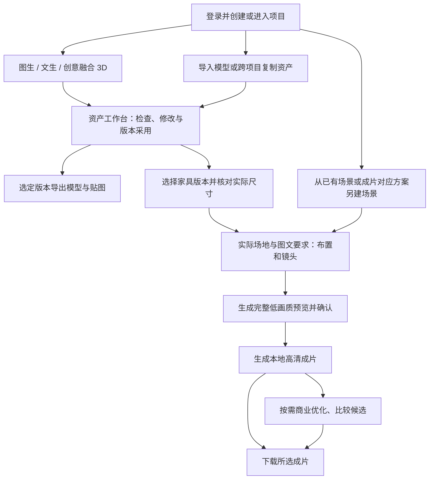

# 产品范围与候选构想

当前仍处于产品头脑风暴与范围细化阶段。用户已确认 1.0.0 的总体功能路径，本文统一记录已确认范围、业务约束、候选交互与待验证问题。范围确认不代表技术方案已定、能力已实现或验收通过；当前没有可运行应用。

首版范围收敛遵循用户的减负要求：新增交互须说明对完成设计与交付的直接价值，不能仅为后续分析或知识积累要求员工额外操作；优先复用正常工作过程中已有的输入、任务与版本记录。用户进一步要求把评估口径与 B/S 产品形态、查看入口和实际操作一起讨论；不能把试点研究所需的指标自动转化为产品功能。竞品研究须区分官方操作流程、经验性文章与实际验证，未在教程中列出不等于功能不存在。

业务决策方式已明确：涉及行业操作习惯与最佳实践时，先研究相关竞品的官方流程与适用前提，再形成简洁的产品建议；不凭假设限定需求或反复要求用户选择缺乏依据的方案。区分竞品文档描述、实测结果及本产品推论，现有产品能力不能直接证明企业实际需求或本产品实现可行。用户明确要求以证据独立判断：证据与用户提议冲突时，应直接指出具体问题、依据和替代建议；同样修正 agent 自己的错误推论。没有找到依据不等于已证明错误，不为迎合用户或维护既有建议将自拟分类包装成行业标准。

用户补充确认：功能决策前须做基础技术可行性评估。后续建议同时说明业务依据、可利用的技术能力、浏览器与服务端的职责、主要限制和待验证条件，再决定功能范围；已有决定中尚缺技术依据的关键能力补做评估，不将范围确认等同于可实现保证。评估深度与风险相称，常规能力可依据官方资料判断路径，影响核心交付的生成质量、结构联动与硬件性能须保留样本实测要求；未验证项明确标注，不为每个功能另建技术方案，也不自动开始开发。

## 产品讨论总体进度

按用户要求，后续每轮报告「形成可评审的 1.0.0 PRD」的总体百分比，并说明当前议题与主要剩余项。2026-09-29 的人工评估为约 **91%**，采用下表固定权重估算；这是产品定义准备度，不是功能开发、实测通过率或已花工时占比。各项完成度是依据已确认范围与剩余缺口作出的估计，不按确认轮数或文档字数递增。

| 阶段 | 权重 | 当前完成度估计 | 依据与剩余事项 |
| --- | --- | --- | --- |
| 1. 产品定位与总体路径 | 10% | 100% | 内部报价员与设计人员、提速目标、项目到资产再到视频的主路径已确认 |
| 2. 1.0.0 核心功能范围 | 20% | 100% | 资产生成与编辑、跨项目复用、场景视频、本地与商业模型边界已确认；附带候选能力仍须按验证结果收敛，不能当作已承诺交付 |
| 3. 业务规则与关键交互 | 40% | 94% | 权限、任务、版本、知识与材质复用等主要规则已明确；创意参考输入、融合图迭代确认、两版比较及共用资产工作台的连续路径已收敛；保存接续、素材复用、场景分区、预览到出片与下载交付已成组收敛；商业优化、从零商业生成、需求卡冲突与协作接续已确认；企业知识方向、分类维护及任务内使用已确认；可视工作台与 Agent 共用业务对象、任务级审批原则、聊天默认私密与主动共享、交接和 30 天回收、开放／选项澄清及运行中补充与打断已收敛。自然语言执行提交边界已确认；知识条目录入、修订与创作衔接已确认；结构模板范围仍待收口；服务适配及异常细节仍待补齐 |
| 4. 验收指标与试点条件 | 20% | 80% | 已确认质量基准、主要部件粒度与两条软件往返路线；桌椅三种输入、跨项目改款、材质复用、软件往返、场景出片与再交付的完整案例及关键异常覆盖已确认，本地／商业分支和验证记录分工明确，限定试用、按证据重新商定发布范围的原则已确认；业务成功标准已确认为同等质量与交付范围下首版合格方案更快、总人工投入不增加，实验室与企业试用的证据分工已整理；验收行为已对应到产品页面和证据，待测指标已明确前置条件及最迟锁定时点；具体素材、软件版本、硬件分级、精度及性能阈值仍待锁定，企业真实订单在可试用后补充 |
| 5. PRD 收敛与整体复核 | 10% | 70% | 已完成首轮主路径文档核对，并同步本轮成果卡片操作及明确组合分流；需求与版本衔接、失败出片方案保留、预览复用及完整结果／临时文件边界已确认，页面入口与后台组织已对应已有功能并获确认；模型配置变更边界已确认；任务、用量与审计记录默认持续保留的首版规则已确认；页面级权限矩阵与交付目标、候选、后置及硬件目标分类已完成文档核对；知识维护与材质删除保护已确认；验收条件与证据记录已归并，知识分类及主动维护路径已确认，剩余具体交互与最终一致性仍需收敛；自进化后置和四范围复用已确认 |

加权估计：10% × 100% + 20% × 100% + 40% × 94% + 20% × 80% + 10% × 70% = 90.6%，对外取约 91%。本次按已收敛的模块重新估计：知识条目录入与维护全路径、有限联动的验证方向、成果卡片操作及创意探索与明确组合分流已有决定，业务规则完成度由 92% 调整至 94%；整体验收与最终复核尚未完成，其完成度保持不变。不是按确认次数递增。企业知识、主动 AI 维护的模式、审批、资料、来源和线上调用边界已明确，分类维护已确认；知识条目及日常维护路径已确认，剩余重点为结构模板候选边界和整体一致性，知识质量与实际交互仍待验证。数值阈值、模型、硬件与业务效果仍待验证，当前没有可运行应用。PRD 准备度 100% 表示定义可评审及剩余验证条件明确，不代表功能已开发或验证通过。

主要页面路径与交付方式已收敛。自然语言执行提交边界已确认；剩余讨论沿「登录与项目—需求与资产—跨项目复用—场景视频—交付」核对完整路径、知识维护与异常接续、候选能力及验证条件；不重新逐项确认已有主流程。常规按钮、字段与提示优先沿用已确认原则，依赖样本的数值保留验证条件，不逐项要求用户选择。详细缺口维护在文末，不另建进度文档。

## 已确认的业务背景与约束

| 项目 | 内容 |
| --- | --- |
| 服务对象 | 一家大型定制家具生产企业，主要订单为定制订单 |
| 直接使用者 | 企业内部报价员或设计人员 |
| 产品形态 | 1.0.0 采用 B/S 架构，员工通过浏览器使用；具体前后端技术栈、服务部署与硬件配置尚未确定 |
| 现有流程 | 客户提供一系列产品图片或描述，报价员制作 3D 效果图，交客户确认后报价 |
| 核心问题 | 现有流程耗时、耗人，希望更快展示效果并推进报价 |
| 长期知识目标 | 随产品迭代形成完整的企业设计知识库，使生成资产更符合企业需求，减少重复沟通与反复调整；完整知识库不是 1.0.0 一次性交付范围 |
| 结果用途 | 模型能导入现有设计软件，继续修改和制作效果图；主要部件必须独立，可分别选择、修改或替换，作为 1.0.0 交付标准；仅在线查看不足以满足目标 |
| 推理路线 | 同时支持本地模型与线上成熟商业模型，默认本地；新家具可主动选择商业生成，无须先执行本地尝试。资产和本地高清成片另可按需商业优化；单次选择不改变后续默认，不因本地失败自动外发，视频保持既定场景渲染路径 |
| 数据边界 | 默认在企业本地处理，新项目默认关闭线上模型调用；当前项目负责人和超级管理员可设置项目是否允许调用线上模型。项目允许时，有编辑权限的成员均可主动调用已配置的线上模型，按需发送相关原始图片、需求描述或 3D 资产；只读成员不能调用。首版以项目开关控制，不增加逐次或细分资料授权 |
| 硬件目标 | 优先争取单张家用游戏显卡可支持；若该限制使效果明显低于业务要求并带来较大口碑风险，可优先考虑效果而放宽。首批拟覆盖的六款 GPU 与实验室 RTX 4070 12 GB 已由用户提供，分级支持建议见下文；性能门槛尚未确定 |
| 首批同时使用规模 | 预计 4～10 名员工同时操作平台，并可能提交生成任务；不是总账号数，也不代表要求 GPU 同时执行 4～10 个任务 |
| 软件选择原则 | 遵循国内行业主流做法，企业实际软件清单尚未提供 |
| 首批试点品类 | 优先用桌椅类家具验证，沿用定制桌与礼堂场景，贯通创意融合、资产微调和成套视频；具体款式与样本数量待确定 |

## 1.0.0 总体功能路径

用户确认的主路径为「登录 → 创建项目 → 创建一系列 3D 资产 → 选择资产并描述场景 → 生成场景演示视频」。资产创建也可以从其他项目复制已有款式开始，再按当前项目的要求微调。同一家具的真实多角度照片在目标明确且模型支持时可直接生成 3D。创意模式支持多图与文字，以及「已有 3D 资产 + 图片 + 文字」混合输入；多资产组合采用一个主模型与多个部件来源；创意方向尚未确定时先确认融合效果图，已有几何、关系和目标明确且工具支持时直接形成 3D 组合预览。

创意融合的输入可以包含图片、文字和已有 3D 资产；跨款特征融合或新造型探索先确认融合效果图，同件真实多视图还原可直接生成 3D，明确且受支持的已有几何组合直接预览 3D。资产修改已确认采用「AI 候选比较后采用、手动调整保存新版本、历史版本可找回」的规则。图中列出已确认的主流程与交付边界；场景工作台分区及预览确认与出片提交的合并交互已确认，控件与异常细节另按对应章节细化。

| 环节 | 已确认的功能方向 | 待细化或验证 |
| --- | --- | --- |
| 登录与项目 | 超级管理员统一创建员工独立账号；采用账号和密码登录，初次登录及管理员重置密码后均须修改临时密码；项目邀请从已开通账号中选择；普通员工仅可访问当前负责或受邀加入且仍有权限的项目，邀请时区分「可编辑」与「只读」；只读仅浏览预览和查看项目用量，不允许下载或跨项目复制；超级管理员默认可查看并管理全部项目，无须受邀 | 初始凭据交付、账号重新启用与交接的具体交互、邀请与移除流程、负责人与编辑成员的操作边界 |
| 资产创建 | 图生 3D（含同件真实多视图直接生成）、文生 3D、创意融合；新家具默认本地，也可按授权与服务能力主动选择商业生成；创意融合支持多图与文字，以及一个主模型、多个部件来源与图文混合输入；创意探索先确认融合图，明确且受支持的已有几何组合直接预览 3D；不同资产组合创建独立新资产，同一资产的历史部件组合保存为新候选版本；支持平台资产和外部 3D 文件导入；生成资产的主要部件必须逐件独立；首批试点优先验证桌椅类 | 格式版本与导入质量处理、输入数量及限制、按已确认分件边界核对样本、桌椅具体款式与复杂度、其他品类支持边界、生成与编辑质量 |
| 工作路径 | One-Click 承接目标明确的单图／文字／同件真实多视图快速生成；Build & Refine 承接多图融合、多资产组合、外部模型编辑和生成后的精修；快速生成结果可转入精修，沿用同一资产与版本记录 | 共用资产工作台、连续路径及保存接续已确认；控件细节、暂存清理及已确认协作规则下的异常恢复仍待细化 |
| 跨项目复用 | 复制选定版本的完整资产，包括模型、贴图、独立部件、尺寸及材质信息，保留受权限约束的来源记录，不携带原始客户资料与全部历史；完成的复制件独立保留，不受源资产更新或删除影响；无源项目权限时仅显示来源受限提示；普通员工须同时具备源项目与目标项目的编辑权限，当前项目负责人具备其负责项目的相应权限；超级管理员可跨全部项目复制 | 来源记录的具体交互及源资产删除后的展示、跨项目阻断任务的提示与协调 |
| 资产微调 | 支持修改、替换、新增和删除部件，用自然语言或图文表达要求；已有部件支持单选与多选；新增部件支持位置方案预览；已有与新增部件共用手动拖动、旋转和位置数值调整；整件家具及独立部件均支持尺寸数值调整，采用有限范围的结构联动；未选中部件严格保持不变，需要联动修改时先提示用户扩大修改范围 | 定位原点、语义尺寸测量依据与精度、连接关系的表达与检查覆盖范围、部件选择与扩大修改范围的具体交互、不变性验证方法、失败与重试体验 |
| 材质创建与复用 | 内置材质、上传纹理、项目内复用和轻量 AI 图文创建材质；生成材质可保存、复用、分享，并引用结合图文二次创作或微调；当前项目负责人或超级管理员可发布到企业共享材质区，员工浏览、有目标项目编辑权限时取用 | 共享发布与撤回的具体交互、版本引用与衍生规则、素材生命周期、纹理可用性与跨软件一致性 |
| 成套视频 | 多选资产，配合自然语言及参考图片输出场景演示视频；可从平台已有场景或成片对应方案另建场景，跨项目按权限复制必要成果；按实际长宽高搭建矩形简化场地，添加简化舞台、柱子、门口等结构；初始家具布局支持文字、参数及单选／多选后的拖动、旋转、位置数值调整，原始资产保持不变；通过自然语言和镜头模板生成镜头，预览后可调整展示对象、顺序和时长；必须确认完整时长的低画质预览后才能生成高清成片，修改布局或镜头后需重新预览确认；成片默认 30 秒，可调整为 15～30 秒，采用 1080p、16:9 横屏、MP4 | 必要结构的参数与定位交互、布局编辑细节与重新生成规则、尺度精度、镜头对象与时长调整交互、预览规格、等待时间和交付质量 |
| 交付导出 | 整件家具选定版本导出 FBX、GLB 或 OBJ，必要依赖自动打包；成片下载 MP4；资产与场景可导出当前视角 PNG 沟通图片，沿用下载权限 | 格式与目标软件兼容、图片分辨率与清晰度、版本及场景状态对应；不含独立静态渲染工作台 |
| 商业优化 | 3D 资产和场景演示视频都支持可选的商业模型优化，两处分别选择；项目允许线上调用时，有编辑权限的成员均可使用；资产可改善材质纹理及明确指定部件的局部形体细节，保留已确认尺寸、独立部件和未选中部分；视频只改善光照、清晰度和质感，保持家具款式、数量、尺寸、布局及镜头不变 | 服务商能力、保真验证、结果检查与任务交互 |
| API 配置与用量统计 | 超级管理员配置相关 API 并分析全部项目用量，员工可查看有权限项目的用量；本地记录生成次数与处理耗时，线上记录调用次数及可取得的原始用量，分开展示；不统计具体费用、不提供费用估算，1.0.0 不引入付费额度管理 | API 配置项、用量字段来源与已确认计数口径的映射、筛选与明细的具体呈现 |
| 需求澄清与知识支持 | Agent 默认分析材料、按影响分级澄清，采用项目共性要求与单件可编辑需求卡，允许明确设置单件例外；新建卡使用最新共性要求，已有卡提示后由员工选择同步；提供基础品类模板与超级管理员维护的结构化企业规则；已确认按家具细类及本体关系逐步组织设计方法、标准与案例，具体维护交互继续细化；规则冲突提醒后可由员工选择继续概念设计，保留实现条件待核实状态 | 同步提示与例外恢复继承、冲突提示与继续操作交互、条目字段与生效范围、已确认需求卡协作规则下的保存时机与提示、知识质量与专业效果验证 |

### One-Click 与 Build & Refine 双路径

双路径分工已确认：1.0.0 提供 One-Click 与 Build & Refine。目标明确的单图／文字／同件真实多视图需求进入快速生成，跨款多图融合、多资产组合和外部模型编辑进入构建与精修；快速生成结果可继续进入精修，沿用同一资产与版本记录。两条路径遵循相同的部件独立、局部保留、版本采用和线上调用规则，共用资产工作台、主要阶段衔接及保存接续已确认，具体控件与失败恢复仍待细化。

查阅的 [Tripo Studio 官方教程](https://www.tripo3d.ai/blog/tripo-studio-tutorial-english)将 One-Click 描述为图片或文字输入后直接得到带材质的模型，Build & Refine 则先生成无贴图基础模型，编辑部件后再制作材质，并提供 Generate in Parts 选项。这是官方功能说明，尚未实测，不代表本项目已具备相同能力或需要接入 Tripo。

| 已确认路径 | 主要场景与输入 | 流程方向 | 交付与衔接 |
| --- | --- | --- | --- |
| One-Click／快速生成 | 单图、文字或同件真实多视图需求较明确，先取得完整候选 | 输入要求 → 系统连续完成几何、部件处理和材质 → 预览完整 3D 候选 → 用户采用 | 结果仍须满足主要部件逐件独立；需要进一步调整时转入 Build & Refine，沿用同一资产和版本记录 |
| Build & Refine／构建与精修 | 多图创意融合、多资产组合、外部模型导入后编辑，或普通生成后的细化 | 输入与方案确认 → 基础几何及部件检查 → 部件与尺寸编辑 → 材质完善 → 候选比较与采用 | 汇集已确认的单选、多选、局部修改、部件增删、手动定位和尺寸调整；成果进入共用项目资产库，供导出和场景视频使用 |

创意融合在 Build & Refine 中继续执行已确认的融合效果图确认步骤；One-Click 按连续生成完整候选的路径执行，中间不要求用户确认效果图。已有模型导入或继续精修时保留已有可用几何与材质，按需进入相应步骤。路径切换保留输入与已有成果；输入暂存及未保存手动调整按已确认的保存与离开规则处理，具体控件待细化。

One-Click 减少中间操作，仍需用户预览并采用候选；未满足主要部件独立等标准的结果不能仅因快速路径而视为合格，提示转入精修处理。输入自动暂存已确认；自动检查的范围及失败恢复体验仍需细化，实际生成效果尚未验证。

两条路径共用项目权限、资产版本、导出、用量统计和场景视频入口。工作路径与推理路线分别选择，均沿用本地优先、线上调用须项目允许且操作人可编辑的规则，不因选择快速路径而自动付费外发。新家具创建可主动选择商业路线；仅以图片或文字从零生成，与必须保留已有模型几何的局部修改及部件复用分别处理，不能将后者静默变成整件重生成。

## 运行方式、质量与成本边界

本节细化[已确认的业务约束](#已确认的业务背景与约束)中的运行方向。线上调用须满足项目允许且操作人具备编辑权限，相关资料按任务需要发送；单卡目标不是已经验证的最低配置或不可变的硬性上限。用量统计与超级管理员的 API 配置职责已确认，以下具体使用体验和统计方法仍需细化。

### B/S 形态与基础技术可行性

B/S 形态已确认。建议员工浏览器承担输入、模型与场景预览、选择和编辑交互；企业内网服务承担权限校验、项目与版本存储、任务调度、模型推理、文件转换和视频渲染，按既有项目授权规则发起商业调用。此为职责划分建议，尚未选定框架、引擎或部署方案。本地推理优先按企业管理的 GPU 计算资源评估，不要求每名员工的浏览器执行生成模型；单机是否能兼顾服务、推理与渲染需实测，不能把 B/S 理解为所有计算都在浏览器完成。

2026-09-27 基础研究：[Three.js GLTFLoader 官方文档](https://threejs.org/docs/pages/GLTFLoader.html)提供 glTF 2.0 加载及多类扩展支持，说明浏览器侧模型加载有现成能力可参考；[Blender 命令行说明](https://docs.blender.org/manual/en/4.0/advanced/command_line/arguments.html)支持后台渲染，说明服务端组织渲染任务存在可利用的基础能力。这里只作为路线依据，不代表选定 Three.js 或 Blender，也不证明格式往返、家具编辑或最终视频质量已通过验证。

| 能力 | 当前基础判断 | 决策与验证边界 |
| --- | --- | --- |
| 浏览器资产预览与场景交互 | 有现成三维加载与展示能力可利用 | 需验证员工电脑与目标浏览器下的模型面数、贴图内存、多家具场景流畅度；服务端有 GPU 不代表浏览器没有性能要求 |
| 内网任务执行与可选商业调用 | 可采用浏览器提交、服务端执行和持久保存状态的方式 | 权限、线上开关与凭据保护须由服务端执行；验证关闭页面后继续执行、断线恢复及结果归属，服务端重启恢复按已确认规则执行，具体状态核对与恢复能力仍须验证 |
| FBX、GLB、OBJ 导入导出 | 已确认格式范围，具体转换工具与往返保真尚未验证 | 建议服务端转换并提供浏览器预览；逐格式检查独立部件、材质贴图、单位与朝向，不能以能加载文件代替可编辑交付 |
| 独立部件生成、局部修改与有限结构联动 | 核心高风险能力，B/S 本身不能解决 | 需验证真实生成网格的部件对应、规则适用性与未选中内容保护；保持已确认范围，验证不足时明确缺口，再讨论收敛或替代路径 |
| 本地推理与场景视频 | 推理、渲染可作为服务端任务组织；单卡效果与耗时未知 | 需验证显存、资产与视频任务争用、4～10 人提交时的排队与完整等待时间；不承诺同时执行多个 GPU 任务 |
| 商业最终稿优化 | 接口可用不等于符合产品保真要求 | 需验证指定部位优化、未选中内容保护、视频家具与布局一致性，并核对模型许可、内网部署条件或商业接口能力 |

以上为文档层面的初步评估，没有运行模型、格式转换或渲染性能试验。后续功能讨论统一给出「已有技术依据／依赖条件／尚待实测」的简短判断；不得以技术建议静默替换用户已经确认的业务边界。

### 本地处理与商业优化的使用体验

已确认本地优先，资产与视频两处可分别选择商业优化，本地结果合格时直接交付；项目开关承担线上调用与外发许可，不新增个人授权或逐次审批。用户已确认以下两处入口的「就近发起、简要说明外发内容、明确提交、比较后采用」交互；从零商业生成按下文已确认边界执行，不扩展为所有阶段统一切换到线上。

| 用户位置 | 已确认的操作与呈现 | 已确认规则的落实 |
| --- | --- | --- |
| 日常生成与编辑 | 默认清楚标明「本地处理」，由企业配置的本地服务执行；创建新家具时可按下文主动选择商业生成，员工不填写 API key 或 GPU 参数 | 本地排队或失败不自动改用商业服务；离开页面后按已确认任务规则继续执行 |
| 资产选定版本 | 点击「商业优化」，在同一侧栏选定允许优化的部件与目标；已有明确选择直接带入，不重复填写 | 显示资产与基础版本；保持已确认尺寸、部件独立和未选中内容。能力不支持时说明限制，不偷偷改成整件重生成 |
| 已生成的本地高清成片 | 从该成片发起「商业优化」，显示原片及需改善的画面目标 | 仅改善画面质量，不修改布局、家具或镜头，不要求普通预览先商业优化 |
| 提交前 | 用简短摘要显示处理对象、服务商／模型，以及本次实际发送的模型、贴图、图片、描述或视频等材料；点击「开始商业优化」提交 | 摘要是调用说明，提交即主动发起本次任务；项目已授权时不再加审批、授权勾选或费用预算表。只发送任务必需材料，不默认带上全部项目与历史 |
| 结果返回 | 显示「商业优化候选」，在原有模型比较或视频查看流程中与原版比较，再决定采用 | 不覆盖原版，不因付费标成质量已合格；已发生的用量归所属项目，失败或未采用也按原规则记录 |

项目关闭线上调用时，入口就近说明由项目负责人或超级管理员开启；API 未配置时说明需超级管理员配置，员工不被引导填写密钥。已配置不等于模型支持当前优化目标或服务必然可用；已知不支持或失败时说明原因并保留原结果。单次查询超时不直接认定生成失败，不自动重复收费调用，沿用原任务核对与手动重试规则。一次选择商业优化不改变后续操作的本地优先默认值。

界面示例：资产工作台选中「餐椅 V3 的椅背」→ 商业优化侧栏带入目标部件与基础版本 → 显示「将发送：本次所需模型、贴图及修改描述」并标明服务商 → 员工开始优化 → 返回新候选并与 V3 比较。示例中的实际发送项必须依据适配器需求生成；如果服务商需要整件模型，不能因只选椅背就在摘要中声称只发送椅背。API 配置项和支持的服务仍待技术选型与验证。

依据与基础可行性（2026-09-27）：[Chaos AI Enhancer 官方介绍](https://blog.chaos.com/introducing-chaos-ai-enhancer)将增强入口放在现有设计工作流中，处理后保留新结果供与原图比较。这里只借鉴就近发起与原结果保留，不据此证明其支持本产品的 3D 局部保真或视频优化。本产品 B/S 可由浏览器展示任务摘要、服务端校验权限并持有凭据；发送内容应来自实际请求准备过程，不能靠模型自行描述来证明未外发其他资料。字段完整性、开关关闭与提交并发、失败核对及优化保真仍需验证；本轮未调用商业服务。

### 从零商业生成的范围

用户已选择方案 A：1.0.0 默认本地，允许员工主动选择商业模型，从原始图片或文字直接创建新家具；这与既有资产／视频商业优化共同构成已确认范围。选择商业路线仍须满足项目开关、当前编辑权限、服务配置及任务能力要求。

创建全新家具时可主动选择商业生成，同时保留默认本地。适用输入为单图、文字、同一家具的真实多角度照片，以及不要求复用已有 3D 几何的已确认融合方案图；多视图须匹配实际已适配能力，不能静默丢弃图片；不要求员工先执行一次失败的本地任务。只有项目已允许、员工可编辑、管理员已配置且服务支持该任务时才可提交，提交摘要与用量记录复用商业优化交互，不新增审批或自动失败切换。一次选择只作用于明确提交的生成任务，不变更整个项目或后续任务的默认路线；若本地任务已经受理，不能改写为线上任务，主动另行提交时须能分辨两次任务及各自用量。

商业生成的新家具仍须经过相同的主要部件独立、尺寸、材质与可编辑交付检查，先保存为候选；商业品牌或 API 成功不等于产品质量合格。基于已有模型的局部修改、多资产真实部件复用不能走整件重新生成冒充保真编辑，仍按原范围验证和执行。跨款多图创意仍先确认融合方案图，不能因为选择商业服务就绕过该步骤；目标明确的同件真实多视图按已确认直接生成路径处理；融合图的线上生成与修改范围不由本次范围确认自动扩大。

新建资产工作台复用处理方式选择：「本地生成（默认）」与「商业生成」。选择商业后就近呈现服务商和发送材料，按明确按钮提交；本地合格结果仍可直接交付。视频继续以实际 3D 场景和已确认的本地高清成片为基础，商业只作已有范围内的画面优化，不将本次家具创建选项扩展为任意图生视频、云端场景渲染或完整线上工作流。

理由与可行性（2026-09-27）：[Meshy Image to 3D API](https://docs.meshy.ai/en/api/image-to-3d)提供直接提交参考图片创建模型的任务接口，说明从原图走商业服务有具体集成路径；这并不要求先上传本地生成的 3D。对赶时间或本地结果不理想的任务，允许员工自愿选择商业路线可能减少无价值的前置尝试，仍需通过实际用量与结果质量验证收益。文字等其他输入路径须逐项核对供应商能力，本次不承诺全部输入及部件要求均已支持。还需验证格式、独立部件、文件持久保存、服务异常及权限变化；未接入、未上传素材、未实测。从零商业生成的产品范围已确认，具体服务、输入能力与交付质量仍待选型和验证，不代表已经接入。

### 浏览器终端范围

用户已确认 1.0.0 的完整工作流优先面向台式机和笔记本浏览器，以键盘、鼠标为主要输入；Chrome 与 Edge 作为优先兼容验证对象。首版暂不把手机、平板的触屏编辑和移动端页面适配列为交付要求；这不限制通过现有企业交付方式播放已导出的视频，也不新增客户访问入口。客户端操作系统、支持的浏览器版本区间、屏幕尺寸和最低图形配置须在兼容试验时明确，不能因服务端采用 Ubuntu 就认定客户端必须同系统，也不能把任意电脑、集成显卡或同内核浏览器视为已兼容。

业务理由是首批用户需要频繁进行部件多选、拖动旋转、尺寸输入、图文整理和方案比较；优先验证桌面交互可减少同时维护触控手势和小屏布局的范围。行业依据（2026-09-27）：[SketchUp for Web 使用条件](https://help.sketchup.com/en/sketchup-web/what-you-need)推荐鼠标键盘，并说明滚轮鼠标有利于旋转、缩放和准确定位；其浏览器及硬件建议只作为设计参照，不复制其最低配置或宣称桌面是唯一可行方式。

基础可行性：浏览器三维预览与输入存在前述技术路线，但客户端仍需满足选定渲染引擎的图形能力；服务端推理 GPU 不能替代客户端的预览性能。需用桌椅资产、独立部件操作、多家具场景、贴图和视频预览测试目标浏览器、硬件加速及文件上传下载，能力不足时给出明确提示并保护已保存内容。若要求平板承担完整编辑，需要另外验证触控选择、视角与物体拖动冲突、软键盘和浏览器内存限制，不能仅缩放桌面页面后认定支持。暂未开展兼容验证或选定图形技术栈。

### 浏览器预览质量与交付质量

用户已确认首版三维工作区提供「流畅预览／清晰预览」两个简单选项，日常编辑优先流畅，检查外观时切换清晰。流畅模式可降低视口分辨率、实时阴影和反射等显示开销，仍保留家具完整性、部件选择与位置、尺寸及基本材质表达；不通过自动删件、修改几何或降低保存成果质量获得流畅。清晰模式用于检查当前材质与细节，不承诺与最终渲染逐像素一致，也不等同于专业色彩校准。当前模式须可见，降低显示效果不能被理解为原材质已丢失。

模式只影响交互视口，不改已保存资产、导出模型、场景配置或高清成片质量，不触发 AI 调用、不因切换生成资产新版本。此视口不是视频制作前必须确认的完整时长低画质预览；仍须按既有流程生成并确认视频预览，不能用静态清晰视图替代。色彩、纹理、反射等外观确认不应仅依据削弱效果的流畅视图，须有清晰查看或既有渲染预览的核对路径。若设备仍无法完成要求的查看和编辑，应明确提示能力限制，不自动降低交付标准。首版不由此增加自动网格减面、代理模型或新的云渲染服务；是否需要其他优化依据性能试验再讨论。

行业与基础技术依据（2026-09-27）：[D5 预览质量](https://docs.d5render.com/user-guide/view/what-is-the-difference-between-different-preview-qualities)区分流畅和精确预览，并说明正式渲染质量独立于预览设置；[SketchUp Fast Styles](https://help.sketchup.com/en/sketchup/speeding-rendering-fast-styles)通过减少显示效果改善建模性能。本产品借鉴交互与交付质量分开的设计，不复制 D5 对精确预览一致性的保证。浏览器可研究分辨率和实时效果分级，具体引擎尚未选定；此类调整无法独自解决过高面数、贴图内存或客户端图形能力不足，需用目标电脑测试单件家具、多家具礼堂、部件选择、材质检查和模式切换，并核对切换不改成果与单位。目前没有性能验证或帧率承诺。

### 项目用量统计与超级管理员

用户已确认：1.0.0 将项目花费统计简化为项目用量统计，只显示用量，不统计具体费用，以降低接入复杂度与对服务商费用数据的依赖。此前商业 API 金额统计的决定由本规则替代；实际金额、费用估算、单价配置、账单对账和本地成本折算均不纳入首版。超级管理员在后台设定相关 API，并分析全部项目用量；普通员工（含只读成员）只能查看有权限项目的用量，不能借统计查看无权访问的项目。项目或员工额度、超额拦截、额度追加和逐次费用审批仍不纳入本版。项目允许线上调用时，有编辑权限的成员均可发起商业调用。

| 后台能力 | 当前范围 | 待细化建议 |
| --- | --- | --- |
| API 配置 | 超级管理员配置商业生成与商业优化所需的相关 API | 统一模型列表按名称、部署方式（本地／第三方）、必填模型类型及实际连接信息维护；具体模型类型见下文建议，接口字段待选定服务后确定 |
| 项目用量汇总 | 本地与线上分开展示概览，支持按时间、模型、任务类型筛选；员工查看有权限项目，超级管理员可跨项目查看 | 时间范围、模型标识和汇总呈现；服务商是否作为独立筛选项待细化 |
| 项目调用明细 | 与用量概览配套，可追溯到具体任务，沿用项目访问权限 | 记录所属项目、操作人、关联任务、服务商与模型、时间、调用结果、用量及单位；字段为建议 |

用量范围已确认：本地模型与线上商业模型均纳入项目用量统计，分开展示。本地记录生成次数与处理耗时；线上记录调用次数及可取得的原始用量，保留其单位。处理耗时不等于视频成片时长，也不折算为费用；排队与处理时间分开展示，多阶段计数采用下文已确认的两层口径；本地计时起止、页面呈现和异常计时仍需细化。

用量呈现建议：原始用量按接口实际返回展示，例如 token、生成秒数或服务商积分；生成调用与状态查询须区分，调用次数不等于成功产物数、计费次数或实际费用。不同模型与不同单位的数值不直接相加为统一总用量，缺失数据标明「未提供／未知」，不能填零或自行推算成确定消耗。具体返回字段、已确认计数口径与接口数据的映射及数据可得性尚待细化与接入验证，不承诺所有模型均能提供同样的用量字段。

成功、失败、取消及重试的任务记录仍保留；失败或取消不抹除已发生的调用与可取得的用量，也不能仅凭任务状态断定是否产生费用。不展示费用不意味着商业调用免费，重试可能再次收费、取消不保证退费的既有提示仍适用。企业实际支出从服务商账单核对，完整成本仍可在试点评估中单独测量，不由本版用量页面核算。

建议用量归属产生调用的项目：A 项目创建资产的调用用量保留在 A 项目；复制到 B 项目不重复计入原调用用量，之后在 B 项目发起的调用用量归入 B 项目。修改 API 配置或删除资产不应改写已产生的历史用量；重试产生的新调用与原调用分别记录，重复查询同一调用的用量不重复累计。

多阶段任务的用量计数口径已确认：概览区分「任务次数」与「模型调用／生成执行次数」，明细关联同一任务的实际执行记录，不把内部多个步骤显示成用户重复提交了多次需求。一次成功受理的用户生成请求计一个任务，即使排队后取消也保留任务记录；模型执行尚未开始、线上生成请求尚未发出时不计已发生的生成调用。手动重试沿用既有规则形成新任务，新发生的执行单独计数，并关联原失败任务。

例如一次家具生成实际执行几何、贴图两个本地模型步骤，可显示一个任务、两次本地模型执行；后续另行提交商业优化是新任务。实际接入只暴露一次完整生成调用时按一次可观测调用记录，不猜测服务商内部步骤。视频渲染等确定性处理单列执行类型与耗时，不冒充模型推理调用；需求理解等模型调用如纳入执行链，也应按实际发生记录，不能因没有生成最终资产而忽略。具体任务与对话调用的关联展示待界面细化，不增加跨项目任务中心。

状态查询、页面刷新、任务记录恢复和取回已有结果不增加生成任务或生成调用次数；需要记录的查询、下载请求与生成分开分类。失败、取消、未采用结果仍保留实际发生的调用和可取得用量。不同单位分开展示，无法取得的字段标明未知；发送后受理状态不明时保留请求记录并标识待核对，不将其计为确认成功或按零消耗处理。按调用唯一标识更新同一用量记录，重复回传不重复累计；本地与商业耗时不混成精确 GPU 占用时间。已确认只统计用量、不核算金额的边界保持不变。

基础可行性：可将平台任务记录与实际执行／外部请求记录关联，按发生事实汇总；服务商暴露的调用及用量粒度决定可展示的细节。需验证多阶段、排队取消、执行失败、人工重试、重复查询、重复回传和不明状态下的计数，尚未实现。此为用户已确认的本产品指标口径，不声称为行业统一标准，也不将任务数等同于可交付资产数或服务商计费次数。

超级管理员同时拥有全部项目的查看与管理权限，具体见「账号、权限与协作」。当前项目负责人和超级管理员设置项目是否允许调用线上模型，其他可编辑成员可以在允许时调用，但不能修改该设置。普通员工不接触 API 凭据，仅使用后台已配置的能力；这一分工已在生成与商业优化交互中确认。用量查看方式已确认：首版提供用量概览与可追溯到具体任务的明细，按时间、模型和任务类型筛选，超级管理员还可跨项目查看；不建设自定义报表与报表导出。员工的筛选、汇总和任务跳转均限于当前有权限的项目，不因能看用量而获得下载或任务操作权限。页面位置、筛选的具体交互及明细字段仍待细化，首版不提供调用前费用预估。

### 管理员模型管理与员工选择方式

用户已明确管理方向：管理员统一维护可用模型，按部署方式分为「本地／第三方」；员工按管理员维护的名称选择，有线上调用权限时可自行选择第三方模型。维护模型时必须明确模型类型，以支持按当前操作自动筛选，不能只提供可选的自由文字说明。该方向替代此前未确认的「管理员按能力指定默认服务、员工只选择路线」提案。模型接入边界已确认：管理员配置和启停平台已适配的模型服务，平台在适配时维护类型与能力清单；新增未知接口需另做适配，不能只靠地址、名称或手工勾选认定支持。下文分组示例不作为已定类型枚举，未明确确认的配套交互仍为建议；不代表已实现或已选定供应商。

术语按用户本轮修正统一为「模型类型」，不再以「用途」作为该字段名。三个维度分别为：部署方式表示在哪里处理（本地／第三方），模型类型表示主要能力类别，模型能力表示具体支持的输入与操作（例如单图输入、文字输入、局部几何编辑）。已确认模型配置必须明确类型；这不等于每次都要求管理员手工多选。已确认由平台适配定义带入类型和能力，自定义接入只在已支持的接口范围内配置；具体能力依据接口与版本维护，不增加另一套用途分类，也不要求员工填写这些配置。

能力清单的维护分工已确认：开发人员根据官方接口、明确的模型版本及验证结果记录支持的输入、操作和输出格式，并接入任务提交、查询与结果保存；企业管理员选择已支持的服务和模型，填写地址、凭据、显示名称并启停。服务返回的模型列表可作为线索，不能默认其包含完整能力或家具业务质量证明；信息不足的未知模型须补充适配，不允许通过手工勾选绕过。

已确认区分三层事实：「接口文档声明支持」「平台已完成接入」「满足家具业务要求」。连接检查只证明其覆盖的连通或鉴权条件；接口调用成功也不能证明主要部件独立、局部保留、材质完整或视频一致性合格。这些业务要求按既有验收条件验证，不新增员工质量认证表单。例如适配清单只支持图生 3D 和重新贴图的模型，可用于这两类任务，不进入文生 3D 或局部几何编辑的候选列表。当前项目尚未完成任何实际模型适配。

| 位置 | 建议的首版设计 |
| --- | --- |
| 后台「模型管理」 | 统一列表，管理员维护显示名称、部署方式（本地／第三方）、服务接入配置及启停状态。模型类型和支持能力必须明确：已适配模型由接入定义带入，自定义接入按已支持接口受约束配置；不让管理员自由勾选任意能力。必要地址、实际模型标识和凭据按已支持接口填写；名称供员工识别，不要求名称等于接口模型 ID |
| 生成或优化操作旁 | 一个模型选择框，按「本地／第三方」分组，以管理员名称显示；按当前操作、输入与已接入能力筛选，用户选定后提交，不先选路线再选模型 |
| 无线上调用权限 | 第三方分组不可选，并就近说明项目未开启或当前角色不能操作；有权开启者仍是项目负责人和超级管理员，不增加独立的个人模型授权表 |
| 初始选择与提交 | 保留本地优先，只有一个适用本地模型时可直接带入，多个时供选择；没有适用本地模型也不自动带入第三方。第三方需主动选择，提交前仍按已确认规则展示实际服务商／模型与发送材料 |
| 查看任务与结果 | 保留提交时的显示名称及实际模型、服务信息供详情追溯，结果按原候选与采用流程处理；管理员后续改名、更换连接不改写既有任务来源与用量。纯显示名称变化后的列表展示按下文已确认的改名规则处理 |

模型可选条件为「管理员已启用、已配置模型类型匹配、平台已支持当前具体操作及输入、用户有执行权限」，第三方还须项目允许线上调用。这里的权限沿用已确认的项目编辑权限与项目线上开关，不因选择列表引入按员工或按模型逐项授权。可见列表不是授权依据，服务端在提交及实际外发前仍须核对有效权限与配置。选择只作用于明确提交的任务，不把一次第三方选择变成后续操作或其他内部步骤的默认外发许可。

模型管理借鉴「服务接入、模型标识／版本、类型与能力分别明确」的方式。具体接入应列明其支持的任务，不因同一供应商拥有多个接口就将其视为全能模型。此前六类、四类都是 agent 的产品归纳，现有证据没有证明某一类数为行业标准，因此不将固定四类或管理员手工多选作为首版必需设计。下表保留为理解范围的分组示例；实际枚举应随首版已支持的接入形成一致映射，不能只凭改名或勾选改变执行能力。既有业务功能范围保持不变。

#### 同类产品的分类依据

2026-09-27 核对官方公开文档：Tripo、Meshy 是直接相关的 3D 产品，Dify 是模型管理与 Agent 应用平台参考；不将这些对象称为已验证市场份额排名，也不将任务目录当成底层模型架构。没有从这些资料中找到三者共同采用的统一分类表。

| 产品 | 官方资料中的类别 | 分类所处层次与借鉴范围 |
| --- | --- | --- |
| [Tripo](https://developers.tripo3d.ai/en/docs/rate-limits) | 3D Generation（H／P 系列）、Image Generation、Animation、Model Processing、Mesh Operations；含文／图／多视图生成、贴图、细化、分件、补全、重拓扑等 | 这是接口任务分组，并非每组对应一种独立 AI 模型；借鉴生成与处理分开、具体任务支持明确，不照搬其并发或功能范围 |
| [Meshy](https://docs.meshy.ai/en) | 工作区分 Image、3D Model、3D Printing、Animate、Scene、Video；API 区分文生／图生 3D、贴图、网格处理、动画等 | 工作区模块与任务类别均不能直接等同于模型类型；模型版本另行选择。同一模型或服务可支持多种任务，具体功能随接口和版本核对 |
| [Dify](https://docs.dify.ai/en/develop-plugin/features-and-specs/plugin-types/model-schema) | 接口说明包含 LLM、Text Embedding、Rerank、Speech-to-Text、Text-to-Speech、Moderation | 按模型调用职责区分；适合参考模型管理结构，但不是 3D 能力分类。检索、语音和审核类不能仅因竞品具备就纳入本版 |

证据核对补充：[Dify 模型定义](https://docs.dify.ai/en/develop-plugin/features-and-specs/plugin-types/model-designing-rules)将 Provider 与每个模型的类型、features 分开，并区分预置与自定义接入；这支持类型和能力分别维护，不证明所有产品必须采用同一类型表。[Meshy 图生 3D 接口](https://docs.meshy.ai/en/api/image-to-3d)还用 model_type 区分标准网格和 Smart Topology 等生成方式，另用 ai_model 指定模型，说明相同字段名称在不同产品中未必具有相同语义。不能原样复制竞品字段或把功能目录改名后称为模型标准。建议借鉴它们可核实的接入和任务匹配逻辑，具体分类属于本产品设计，仍须用实际接入检验。

| 分组示例（不是已定类型枚举） | 本产品的工作 | 用于筛选的具体能力示例 |
| --- | --- | --- |
| 语言与多模态模型 | 理解需求、看参考图、追问、提出修改或布局建议 | 文字理解、图像理解、结构化输出、工具调用；多模态须按实际支持标记，不能默认所有语言模型都能看图 |
| 图像模型 | 生成或编辑融合方案图、生成独立材质贴图 | 文生图、图像编辑、多图参考、无缝贴图、PBR 贴图输出；后两项仅在实际适配时开放，普通图片输出不等于可交付材质 |
| 3D 模型 | 创建家具，处理已有模型几何、独立部件与表面贴图 | 文生 3D、图生 3D、多视图生成、局部几何编辑、分件、模型重新贴图；逐项核对支持范围，不以能新建证明能保真修改 |
| 视频模型 | 当前范围只用于已有成片的画面优化 | 接收已有视频、增强或超分等实际操作；普通文生视频／图生视频不等于符合本产品的成片保真要求 |

这里的「3D 模型」指处理三维内容的 AI 模型类别，家具成果仍称「3D 资产」。图像与 3D 模型的贴图能力按操作对象区分：独立输出材质贴图属于图像处理，接收已有家具并返回贴好材质的资产属于 3D 处理。能力可按适配情况组合，但不要求企业重复创建同一配置，也不取消已确认的材质创建、共享、版本与复用功能。非 AI 的几何算法、格式转换和实际场景渲染保持内部处理服务，不为填满分类而假设它们都是 AI 模型。

Embedding（向量检索）与 Rerank（结果重排）是值得了解的模型类型；只有后续知识检索方案实际需要并获确认时，才增加相应后台配置，不在员工生成选择器中预置空分类。语音识别、语音合成、内容审核、骨骼绑定和角色动画不因本轮分类研究自动纳入首版。独立材质、图像处理等阶段的第三方使用范围仍按既有决定执行，不能因新增类型或能力标签获得外发许可。内部需求理解、分件等辅助步骤不要求员工逐步选模型。

自动筛选以当前任务、输入和已适配的具体能力为准，模型类型用于组织和初步过滤，不能单独决定可执行性。例如同属「3D 模型」，一个只支持图片输入，另一个支持文字输入；文生 3D 入口只能列出后者或平台已明确适配完整文字生成流程的配置。已有家具换材质还需匹配「模型重新贴图」能力，不能因为模型能生成 3D 就将其列入。能力由对应接口及版本的接入说明维护，不能仅靠管理员标签或模型自行声称支持。员工看到的仍是管理员名称，不需要选择分类；项目线上开关、当前编辑权限和模型启停状态继续叠加生效。无匹配配置时明确提示，不自动改用其他能力或第三方服务。

基础可行性：类型与能力字段可用于后台和前台的一致筛选，无须开发自动模型评测或自动识别能力系统。分类简化不减少异构接口适配工作；输入限制、接口版本变化、材质输出完整性、局部几何与视频保真仍需验证。本轮只查阅官方文档，没有实测模型、上传材料或确认具体供应商。

已有 3D 的保真微调不能因为选择另一个生成模型就改成整件重生成；视频仍按实际场景本地渲染后可选商业优化，不因统一模型列表扩展成任意模型直接生成场景视频。

部署方式「本地／第三方」表示处理位置：本地为企业内网处理，第三方为外部服务处理；企业内网部署的开源模型仍属本地。列表标签应与实际接入及外发行为一致，不能仅凭自由名称判断。本地服务实际夹带外部处理时不能宣称全程本地。密钥由服务端保护，员工不填写也看不到原文，配置变更沿用必要审计。

方案比较：相较此前提案，统一模型列表减少管理员按任务逐一分配默认服务的配置，也允许员工在本次任务中比较不同模型，首轮试用更容易验证质量差异；代价是员工需要做一次模型选择，管理员宜使用清楚名称和简短说明。它简化产品配置与操作组织，但不消除不同模型接口适配、GPU 运行与结果保真的工作量。模型越多不必然越好，首版仅展示已接入且企业启用的模型，不承诺任意 URL 与 API key 通用。

连接检查仅在接口支持时核对连通性与凭据，不自动上传客户材料或发起真实生成；连通不等于质量合格。服务失败保留输入与成果，不自动切换模型或新增商业调用。纯显示名称修改、模型停用、实际连接变更及凭据恢复均已确认，按下列规则执行；实现与恢复能力仍待验证。

模型配置变更与在途任务已确认：在现有模型管理页完成操作，沿用任务状态、取消、结果恢复及配置审计，不增加独立的模型发布或审批流程。

| 管理员操作或异常 | 已确认处理方式 |
| --- | --- |
| 修改显示名称或说明 | 已确认：纯显示名称变化后，选择器、任务列表及用量分组统一使用当前名称；任务详情保留提交时名称及实际模型、服务来源，不改历史执行事实。按稳定配置标识关联，不因改名拆分或合并用量；原配置已移除或无权查看时回退到有权查看的历史快照，不伪造当前名称。依据与边界见下文名称研究 |
| 停用模型 | 立即停止接受使用该配置的新生成任务；尚未开始的排队任务取消并保留输入，说明因模型停用取消。已经开始的本地执行或已提交外部服务的生成继续核对与取回结果；需要中断时另用已有取消操作。重新启用不自动恢复已取消任务 |
| 修改服务地址、实际模型型号或本地／第三方部署方式 | 存在未结束任务时不直接覆盖原配置，可新增一条已适配配置供新任务选择，或等原任务结束后修改。状态不明、取消中或尚在取回结果的任务也视为未结束；旧任务不转投新地址或新模型 |
| 密钥失效或需要轮换 | 允许管理员修复原服务连接的凭据，不要求先把无法查询的任务判失败。原任务只按原服务与原任务标识继续查询、取回；不能查询时显示连接或权限问题并保留待核对状态，不重复生成。换成其他服务账号的密钥不保证能访问原任务，不能据连通成功认定恢复成功 |
| 已打开旧页面的员工提交 | 提交与执行前重新核对配置及权限。停用或实际模型／部署信息已变化时保留输入，要求刷新选择；不能按页面中的旧名称静默执行新的配置，也不自动改用商业模型 |

已确认的操作衔接：管理员在模型详情中看到该配置的排队、执行及待核对任务，点击停用时就近说明「未开始的任务将取消，已开始的执行继续取回结果」；不逐项要求员工审批。更换实际连接且仍有未结束任务时，保留未保存的配置输入，解释阻止覆盖的原因，并提供新增配置或查看原任务的入口。停用仅控制平台后续派发，不负责卸载本地模型或关闭外部服务；管理员需要停止执行时沿用已有任务取消能力。凭据修复属于原连接维护，修复后继续核对原任务，任务是否恢复以成功查询或完整取回结果为准。平台无法确认原任务状态时仍显示待核对，不能只因更新密钥就显示任务失败或成功。

例如某本地模型有一个正在执行的任务和两个尚未开始的任务，停用后取消后两个、保留输入，前一个继续返回结果；重新启用后，由有权限员工决定是否重新提交已取消任务。若改为另一型号，新建配置让员工主动选择，旧任务仍按原来源追溯。该规则与既有项目线上开关、手动重试及不自动切换模型的规则衔接，是用户已确认的首版简化取舍，不宣称所有竞品对在途任务采用相同策略。

停用前在同一操作中说明受影响的排队与执行情况，任务与模型页相互跳转沿用当前权限。配置修改及取消结果留审计，不记录密钥原文；已有模型、视频和历史版本不会随配置停用而删除。多阶段任务须区分已开始的执行与尚未发出的生成调用：停用后不再向该配置发起后续新调用，已完成阶段保留，按实际情况说明任务未完成，不把中间产物当作完整结果；已在原服务内部受理的处理不冒充平台能够逐步停止。项目线上开关仍独立生效。

依据与可行性初判：[Meshy 图生 3D API](https://docs.meshy.ai/en/api/image-to-3d) 区分创建任务、按任务标识查询与任务结果，可支持按原任务继续获取结果的适配思路；官方接口存在不等于所有服务都支持相同的凭据轮换或取消方式。B/S 可在服务端关联任务、实际模型与配置记录，修改配置和任务调度须协调，不能只禁用页面按钮。需验证停用与开始执行同时发生、旧页面提交、同地址下实际模型更换、凭据失效及修复、多阶段调用和状态不明等边界；历史来源不变不代表必须在历史任务里保存密钥明文。当前未实现或测试。

#### 模型改名的竞品依据与已确认规则

2026-09-28 核对结论：显示名称与实际模型标识分开，在多个模型管理产品中有直接依据；「管理员改名后，历史列表必须一直显示旧名称」没有找到广泛统一的产品约定，而且存在按当前配置解析历史显示名称的实现。不能把上一轮建议称为行业标准。此处讨论 AI 服务的显示名称，不是家具资产改名，也不包含更换实际模型、服务地址或部署方式。

| 产品及资料 | 本次可以确认的事实 | 对本产品的意义与限制 |
| --- | --- | --- |
| [Open WebUI 模型配置](https://docs.openwebui.com/features/workspace/models/)与[消息展示源码](https://github.com/open-webui/open-webui/blob/main/src/lib/components/chat/Messages/ResponseMessage.svelte) | 文档区分显示名称、唯一 ID 与基础模型；本次读取的主分支消息组件以消息的模型 ID 查当前模型列表，再展示当前本地化名称，查不到则回退到消息内模型标识 | 是历史消息可显示当前模型名称的反例。结论来自该代码路径，不代表所有已发布版本或本次实际运行测试；官方消息结构包含名称字段也不能单独证明界面冻结旧名称 |
| [LibreChat Model Specs](https://www.librechat.ai/docs/configuration/librechat_yaml/object_structure/model_specs) | 配置分别提供唯一名称、展示标签及实际 endpoint／model，示例还包含 modelLabel | 支持名称与实际调用配置分离；该文档未明确改名后所有历史消息的展示行为，不能据此声称统一采用旧名快照或当前名 |
| [Dify Model Specs](https://docs.dify.ai/en/develop-plugin/features-and-specs/plugin-types/model-designing-rules) | 模型插件实体分别定义 model 标识与 label 多语言显示名称 | 支持标识与显示层分离；这是插件元数据约定，不等于普通管理员可随意改名，更未证明历史任务改名策略 |
| [LiteLLM 模型管理](https://docs.litellm.ai/docs/proxy/model_management) | 对外 model_name 与实际 litellm_params.model 可不同，并用模型 ID 管理配置 | 能说明公开名称与后端模型可以分开，但该名称还参与 API 路由，不能直接等同于本产品纯界面别名，也不能推断其日志展示政策 |
| [Meshy 模型选择说明](https://help.meshy.ai/en/articles/15697060-meshy-7-vs-meshy-6-vs-meshy-6-lite-which-ai-model-should-you-use)与[Tripo 官方 SDK](https://developers.tripo3d.ai/en/docs/sdk) | 分别提供生成模型选择、实际模型参数与任务查询的公开说明 | 本次未找到企业管理员自定义模型别名后历史界面如何更新的明确说明。它们是直接 3D 竞品，但不足以为此项行为背书；以上多模型平台仅作为相关配置交互参考 |

模型改名规则已确认：名称是方便员工识别配置的当前标签；选择器、任务列表与用量分组使用当前名称，任务详情按需展示「提交时名称」以及实际服务商、模型标识与可取得的版本。仅改名称不影响排队、执行、结果和权限，也不要求员工重新选择或确认。按稳定配置标识关联任务与汇总用量，不按名称文字分组；两个配置同名不合并，一个配置改名不被算成两个模型。改名事件沿用配置审计记录，日常列表不重复显示旧称／新称两套标签。

例如「本地模型 A」改为「家具精修」后，选择器和历史任务列表显示「家具精修」；打开旧任务详情仍可查看提交时叫「本地模型 A」及当时实际调用的模型。配置已移除或无法读取时，历史任务按权限使用已保存名称，不因查不到当前配置而丢失来源。该规则改变的是展示方式，不追溯改写执行依据；也不允许把当前服务商或新模型型号写成旧任务的实际来源。

技术上可通过稳定配置关联与独立历史字段实现，无需为显示改名创建新模型配置或重跑任务。需验证模型改名后的列表、用量汇总、任务详情、同名配置和配置不可用回退；当前仅查阅官方资料与主分支源码，没有运行竞品验证。模型改名、模型停用、实际连接变更及凭据恢复方案均已由用户分别确认；竞品研究结论与实际实现验证仍须区分。

参考依据（2026-09-27）：[Meshy 模型选择说明](https://help.meshy.ai/en/articles/15697060-meshy-7-vs-meshy-6-vs-meshy-6-lite-which-ai-model-should-you-use)明确模型按每次生成任务选择，可从下拉列表切换，同时列出不同模型的功能差异，支持「用户选择、能力有边界」的交互思路。[Open WebUI 模型管理](https://docs.openwebui.com/features/workspace/models/)提供显示名称、说明、访问控制与启停，并将名称呈现在模型选择器；[连接配置](https://docs.openwebui.com/getting-started/quick-start/)说明管理员可接入本地或 API 服务。Open WebUI 是多模型应用的交互参考，不是家具设计竞品；不复制其复杂权限、参数、自动回退或模型下载功能。此前 Dify 的默认模型分配说明仅支持另一种组织方式，不足以证明员工应被限制为只能选择路线。

基础技术判断：B/S 可以实现受权限和任务能力约束的模型列表，并通过后台提交选定模型的任务，产品形态没有明显阻碍；异构 3D／材质／视频接口、异步结果、型号支持与保护未选中内容仍须分别适配和实测。本轮仅查阅官方产品说明，未调用模型或上传材料。

### 商业优化对象与入口

用户已选择「资产与视频两处都支持、分别选择」的方案，纳入 1.0.0。用户可以只优化资产、只优化视频、两处都优化，或使用满足要求的本地结果直接交付；两处商业调用不强制绑定。

资产与视频的具体入口和发送内容呈现，按上文「本地处理与商业优化的使用体验」已确认交互执行。两类调用均归所属项目的用量统计，权限按项目开关规则执行；以下已确认的优化范围与保真要求保持不变。

| 已确认的优化对象 | 优化目标及确认状态 | 必须验证的边界 |
| --- | --- | --- |
| 3D 资产 | 已确认：改善材质纹理质量，并在用户明确指定部件与目标后优化局部形体细节；保留已确认尺寸、独立部件及未选中部分，输出为待比较采用的候选 | 商业模型是否接受已有资产并保留受保护内容，输出是否保留主要部件的独立可编辑性；实际效果与检查能力尚未验证 |
| 场景演示视频 | 已确认：仅改善光照、清晰度和质感，保持家具款式、数量、尺寸、布局及镜头不变 | 验证全片家具及关键细节的一致性，镜头的展示对象、运动、顺序与时长保持不变；输入采用场景资料、关键帧还是已有成片仍需评估，尚无商业模型实测结果 |

资产商业优化范围已确认：允许改善材质纹理质量，并在用户明确指定部件与目标后优化局部形体细节，例如改善选中椅背的曲面细节。保留已确认尺寸与独立部件，未选中部分的形状、尺寸、材质和位置严格不变；不以「优化」为由默认重塑整件家具、替换实际用材要求或减少独立部件。需要联动修改其他部件时，须先确认扩大范围。改变已确认尺寸或重新设计款式应作为明确的资产编辑要求处理，不能隐含在优化中。优化先生成候选，由员工与原版本比较后决定采用，不自动覆盖原资产。上述范围是产品要求，实际模型效果、保真检查方法及质量容差仍待验证，不能仅凭画面更精致判定合格。

优化结果检查方式已确认：首版采用程序检查与员工对比确认相结合的方式。系统检查能够可靠验证的项目，其余明确提示员工人工核对；程序检查结论与人工确认须明确区分，不能以「未检测出问题」表示全部保真已获验证。已发现违反尺寸、部件独立性或修改范围等硬性要求的结果保留为「待修正」候选，原版本保留；必须修正并重新核对后才能作为合格结果采用，不能通过人工确认直接豁免已知问题。无法自动判断不等于已知不合格，允许员工完成对应检查后按既有权限比较并采用。此项决定不承诺所有保真要求均可自动检测；具体检查字段、自动覆盖范围、检测方法与容差、人工核对提示和修正后的复核交互仍待细化与验证。

商业视频优化的范围已确认：只优化画面质量，不重新设计家具、布局或镜头。「质感改善」不表示允许更换家具材质或改动已确认的款式细节。改变家具款式、数量、尺寸、布局或镜头的输出不符合本功能的交付要求，不能因画面更好看而视为优化合格；用户如需这些变化，应通过资产或场景编辑流程处理。具体保真检查方法、质量容差和不合格结果的处理交互仍待验证与细化。

视频画面改善不表示原 3D 模型已改善。独立的静态方案图优化入口与具体服务商仍未确定；从零商业生成的已确认边界见上文，不以两处优化范围推导全部流程可走商业服务，也不自动扩大为每个环节接入多个服务商。

商业视频优化时机已确认：确认完整时长的低画质预览 → 生成本地高清成片 → 按需发起商业优化 → 比较原片与优化候选 → 选择采用，原片保留。1.0.0 不在预览阶段发起商业视频优化。优化结果不满意时仍可使用符合交付标准的本地成片，不自动覆盖原片；候选比较与采用的具体界面、失败及重试交互仍待细化。

### 单卡目标与成本判断

建议先约定家具质量与可编辑性的最低可用标准，再比较单卡本地、本地加商业优化，以及必要时更高本地配置的质量、等待与总成本。首批试点同时使用规模已确认：预计 4～10 名员工同时操作平台，并可能提交生成任务。该人数不等于 GPU 并行任务数；需模拟多人提交资产与视频任务，记录排队时间和实际处理时间，不能用单任务能够运行证明多人使用体验合格。是否采用集中式内网工作站、可接受等待和实际任务并行度仍待讨论与验证。

任务排队规则已确认：资产生成与视频任务争用同一计算资源时，按提交顺序处理，先提交的先执行；首版不按任务类型设置优先级。视频任务可能使后提交的资产任务等待，需在试点中评估这一代价。明确失败后的手动重试作为新任务排到对应队列末尾。此规则不要求使用不同资源的任务共用一个全局串行队列，也不承诺外部服务的实际完成顺序；具体资源分组与故障恢复细节仍待细化。

任务执行与查看方式已确认：任务成功提交后在后台继续执行，切换项目或关闭浏览器不会取消任务；重新登录后可在所属项目内查看进度与结果。1.0.0 提供项目内任务列表，显示排队、执行、成功和失败状态，并区分取消请求与已确认取消，可打开对应结果，不增加跨项目「我的任务」汇总页。任务列表与结果遵循当前项目访问权限；浏览任务不代表获得重试、取消或采用结果的权限。

后台继续执行的约定以任务已经成功提交为前提；文件尚未上传完成或任务尚未受理时，不能显示为已经排队。进度展示按下文已确认粒度执行；主机重启与任务中断按下文已确认规则处理；取消异常及服务商状态不明时的核对交互仍待细化。

任务进度展示已确认：首版采用「任务状态 + 当前实际阶段 + 已等待／处理时间」，有可核实的阶段进度时再显示该阶段百分比；不按动画或固定速度模拟总进度，不将完成阶段数平均换算为总工作量，不在缺少实测依据时承诺预计完成时间。提交成功前显示上传或提交中，受理后区分本地排队与服务商等待；排队时间与实际处理时间分别展示，不将等待时间计作模型处理耗时。当前阶段按实际执行信息显示，例如生成模型、制作材质、渲染视频或保存结果；这些是可用文案例子，不是所有任务必经的固定步骤。

服务商仅返回执行中时如实显示执行中，不推测内部阶段；返回百分比时注明服务商或对应阶段，不能把其 100% 当作平台文件已保存、质量已通过或结果已采用。无法取得最新状态时保留最后确认状态及更新时间，提示正在核对，不自动判失败、完成或再次提交生成。任务成功及结果质量状态分开，结果待修正不因进度完成变为合格。首版不要求展示其他项目的任务名称、操作者或资料，也不由此增加跨项目任务中心。

基础可行性与依据（2026-09-27）：[Meshy Text to 3D API](https://docs.meshy.ai/en/api/text-to-3d)提供任务状态、进度、时间字段及实时状态流，说明商业适配存在具体接口路径；不同服务商的粒度和含义须逐个核对。本地可从任务执行与阶段切换记录状态，浏览器通过状态查询或推送展示，不依赖生成模型自行估算。尚未选定通信方式，也未验证本地模型均提供内部进度；缺少百分比时应保留可确认阶段。需验证状态延迟、连接中断、页面重开、耗时口径与权限过滤，避免旧消息覆盖最终状态。阶段与耗时展示已获用户确认，现有排队、取消、重试和后台继续执行规则保持不变；实现和时间口径仍待验证。

失败重试规则已确认：本地与商业任务明确失败后均由员工手动重试，首版不自动重新执行失败的生成任务。显示失败原因并保留原输入，由当前具有项目编辑权限的成员发起，生成新任务并排到对应队列末尾，原失败记录保留。商业重试仍须符合项目线上调用开关等当前权限条件，并提示可能再次产生费用；不因原任务曾获允许而跳过当前检查。只是暂时查不到商业任务结果时，先核对原任务状态，不能直接当作失败重复提交；状态核对与异常恢复沿用下述规则，具体提示和服务适配仍待验证。重试前核对原输入是否仍可读取、所选模型是否仍可用及当前权限；不满足时就近提示需要补充或重新选择的内容，保留其余有效输入，不擅自替换来源或改走线上路线。

服务重启与任务中断的恢复规则已确认：首版优先恢复任务记录、状态和已保存成果，不承诺任意模型从中断的推理步骤继续计算。浏览器断线不等同于后台任务中断；平台服务重启也不能直接证明独立计算进程或商业任务已经停止。恢复后先核对原任务，不创建重复的生成任务。

| 原任务情况 | 已确认恢复行为 |
| --- | --- |
| 已受理、尚未开始 | 恢复原队列记录与同一资源下的先后顺序，按既有任务许可、取消状态和线上开关规则继续调度；不将恢复视为新提交或新增用量 |
| 本地执行状态待核对 | 若原计算进程仍在运行，继续跟踪；若完整结果已保存，恢复该结果。只有确认计算已中断且没有完整可恢复结果后，才显示中断原因，由有编辑权限的员工手动重试，形成新任务排队；不自动重跑整个生成流程 |
| 已提交商业服务 | 依据原任务标识核对并接回状态或结果，不重新发起生成。服务商尚未确认受理或暂时无法查询时继续标记核对中，不以超时自动判失败；必要时由管理员核对原调用，不能凭一次查询失败开放重复提交 |
| 结果已生成、取回或保存未完成 | 能确认原任务和完整输出时，仅恢复结果获取与保存，不重新推理；平台完整保存后再显示结果可用。失效链接、残缺文件等显示具体问题，是否需要重新生成由核对结果与用户手动操作决定 |

恢复状态、查询原商业任务与重新获取已生成结果不等于自动重试生成；核对过程中不额外上传客户资料或触发付费生成，不绕过已确认的线上关闭规则。局部中间产物不得冒充完整候选，已保存历史和用户当前采用结果保持不变。停止时长、状态核对间隔、管理员核对入口与各适配器是否支持结果重取仍待验证；首版不自动增加推理检查点、跨模型续跑或自动转商业兜底。

基础可行性：需要持久化任务标识、阶段、输入引用、取消请求、队列顺序和产物状态，并核对实际计算进程或服务商状态。查询已有商业任务的接口路径已有前述官方资料支持，但服务商受理后本地尚未保存标识的窗口仍须单独设计和测试，不能假定完全消除重复调用。验证应覆盖服务停止、机器重启、任务已完成但本地记录未更新、结果取回中断及取消与恢复竞态；上述恢复边界已由用户确认，没有开展故障试验，不能视为已经实现或通过验证。

任务取消范围已确认：排队任务可取消，执行中的任务也可申请取消。本地任务尝试停止，商业任务按服务商实际支持情况处理；申请取消不等于已经停止，不能提交请求后立即显示为已取消。取消不保证退费，已发生的调用与可取得的用量仍保留，不在平台统计费用金额。服务商不支持取消、停止失败或尚未确认时，须说明状态，不能将取消请求失败直接当成生成任务失败，也不能据此重复提交生成任务。

任务取消权限已确认：当前有编辑权限的成员可取消项目内全部任务，不限于自己提交的任务；当前项目负责人具有本项目相应权限，超级管理员可取消全部项目任务。只读成员不能取消任务，原提交人失去编辑权限后也不能因曾提交任务而继续取消。取消操作记录审计日志，包含操作人、项目与任务、时间及处理结果；申请与实际处理结果须可追溯，具体字段待细化。

取消与完成发生冲突时的处理已确认：申请取消后，若任务已完成或未能停止，并最终返回完整结果，保留结果供用户选择，不自动采用或覆盖当前资产。界面如实显示任务完成及取消未生效，例如「未能取消，任务已完成」；不能因用户曾申请取消而标记为已停止。完整结果仍须经过原有质量检查与采用流程，未完成的模型或视频不能视为合格结果，已发生的调用与可取得的用量仍保留。

建议任务列表显示「取消中」与「已取消」，仅在确认停止后进入已取消状态；其他具体状态文案、部分产物的保留与清理仍待细化。任务取消与资产删除、原版本采用分别处理，不因申请取消而覆盖既有资产。

公开模型的显存与兼容线索于 2026-09-27 重新核对，见下文 GPU 评估。模型声明的最低显存、官方测试卡与本产品完整流程验证是不同证据；不能仅依据显存数字或单模型启动成功发布支持承诺。

成本评价应计入硬件与维护、电费、商业调用、失败重试，以及员工等待和修正投入，观察每个可交付资产或视频的总成本。本地调用没有逐次 API 账单也不等于没有成本；「本地多次调整后少量商业优化」是否更划算，需要在相同案例和交付标准下比较。

本部分尚需明确：各目标 GPU 的实际支持范围、实验室主机的驱动与存储条件、业务质量下限、资产优化的范围指定与结果检查交互、商业视频优化的保真验证与任务交互、用量计数与计时口径、数据来源及页面呈现，以及 4～10 人同时使用时的提交频率、可接受等待、已确认任务进度的具体呈现与时间口径、取消异常与产物处理、重试交互和故障恢复细节。讨论按主题逐项推进，暂不据此确定模型、硬件采购或实施排期。

试点设备已由用户明确：实验室现有 RTX 4070 12 GB，操作系统 Ubuntu 24.04.4，处理器 Intel Xeon E5-2699 v4，系统内存 128 GB DDR4。第一阶段拟覆盖 Tesla V100 32 GB、RTX 3090 24 GB、RTX 4090 24 GB、Intel B60 TF 24 GB、AMD RX 7900 XTX、RTX 5060 Ti 16 GB。该清单是用户提出的支持目标，不代表已验证兼容；以下分级建议尚待用户确认。上述配置是用户提供的实验条件，不是远程检测结果；处理器数量、驱动、实际内核、存储类型与余量及 GPU 插槽链路尚未核验，不能假定当前文档工作区就是该主机。这些运行细节留待技术试验前核对，不阻塞产品讨论。

### 首批 GPU 可行性评估

2026-09-27 基于官方资料的初步结论：建议以 RTX 3090／4090 24 GB 为完整流程优先验证目标，RTX 5060 Ti 16 GB 为低显存候选，V100 32 GB 为独立兼容验证对象，Intel B60 TF 与 RX 7900 XTX 先按渲染或专项模型兼容探索。RTX 4070 12 GB 用于现阶段实验室验证。此为 agent 建议，未替代用户提出的六卡目标，也未发生模型安装、实际推理或性能测试；现阶段不能把任何一张列为本产品已认证支持。

评估对象包括需求理解与多图创意处理、几何生成、贴图、语义分件、局部编辑及场景渲染；能运行其中一个模型不表示整条路径可交付。已有主要部件独立、未选中部分不变、有限结构联动要求，仍须专项验证，更换显卡不能消除这些算法与业务风险。浏览器访问和普通交互不要求每名员工配置上述计算卡；服务器推理支持与员工浏览器预览性能分开验收。

| GPU | 建议定位（待确认） | 对当前产品的主要判断 |
| --- | --- | --- |
| RTX 3090 24 GB | 完整流程优先验证目标 | 适合优先研究现有 CUDA 模型与渲染流程；24 GB 仍不能保证所有高质量模型和全部阶段同时驻留，需验证分阶段加载、峰值显存和连续运行 |
| RTX 4090 24 GB | 完整流程优先验证目标，重点考察处理时长 | 同属 24 GB 容量档，不能因代际更高就认为能容纳超过显存上限的任务；与 3090 在相同模型、质量及场景下比较，暂不提供速度倍数 |
| RTX 5060 Ti 16 GB | 低显存候选 | Blackwell 软件环境及自定义扩展须单独验证；可研究较小模型、分阶段加载与卸载，不能沿用 24 GB 路线的完整质量和容量承诺 |
| Tesla V100 32 GB | 存量设备兼容候选 | 显存较大但 Volta 架构需兼容环境；注意力后端、数据类型、编译扩展和渲染均需逐项检查。需核对 PCIe／SXM 等具体形态及宿主机，不能仅凭 32 GB 把它作为优于 RTX 卡的默认方案 |
| Intel Arc Pro B60 TF 24 GB | 渲染或专项模型实验候选 | 已核到 GUNNIR 同名型号与 Intel B60 计算软件支持；完整 CUDA 3D 模型链不能直接视为可用，需验证 XPU／SYCL 及自定义算子替代。暂不建议作为首版完整本地生成的交付保证 |
| AMD RX 7900 XTX 24 GB | 渲染或专项模型实验候选 | 官方规格为 24 GB，并有 ROCm 支持路径；具体操作系统、驱动与框架版本受矩阵约束。自定义 CUDA 扩展、稀疏计算与光栅化仍须移植或替换，不因 PyTorch 可运行就承诺完整模型链 |
| RTX 4070 12 GB（实验室已有） | 开发与流程验证设备 | 可启动浏览器、任务、导入导出、确定性编辑及受控场景渲染的验证，并选择显存适配的生成阶段测试；高质量完整资产、分件和多人吞吐均不能预先保证。不得将实验用降规格产物认定为正式交付标准 |

显存依据：[TRELLIS.2](https://github.com/microsoft/TRELLIS.2)列明 NVIDIA 至少 24 GB、目前仅在 Linux 测试，验证卡为 A100／H100；其 H100 耗时不能外推到上述游戏卡。[Hunyuan3D-2.1](https://github.com/Tencent-Hunyuan/Hunyuan3D-2.1)列明形状约 10 GB、纹理约 21 GB、完整流程约 29 GB，并提供低显存模式，但未据此证明 12 GB 可按本产品质量要求完成全流程。[Hunyuan3D-2](https://github.com/Tencent-Hunyuan/Hunyuan3D-2)声明形状约 6 GB、形状加纹理约 16 GB，可作为 4070 分阶段试验与 5060 Ti 候选路线的研究线索；达到名义最低值仍需留意运行开销和显示占用。模型版本、分辨率、精度、卸载策略和实际峰值须随测试一起记录。

NVIDIA 代际兼容依据：TRELLIS.2 对 V100 明确提出以 xformers 替代默认 flash-attn 的路径，因此不能简单认定 V100 完全不可用；其余扩展仍需验证。[PyTorch 2.12 发布说明](https://pytorch.org/blog/pytorch-2-12-release-blog/)对 Volta 等旧架构指向 CUDA 12.6 构建，对 Blackwell 指向 CUDA 13.0+ 构建，而 Hunyuan3D-2.1 示例测试环境是 PyTorch 2.5.1+cu124。说明不能用同一个旧模型安装环境无差别覆盖 V100 与 5060 Ti；具体锁定版本待技术验证，资料中的环境不作为安装指令。[V100 官方规格](https://www.nvidia.com/en-gb/data-center/tesla-v100/)区分不同形态；当前未核对用户拟用板卡的具体版本。

非 NVIDIA 依据：[GUNNIR B60 TF 产品页](https://gunnir.cn/home/product?id=09c22084-331c-4281-84d4-f77e0871ea04&modelid=d5512409-d36e-475e-8343-37a5301eb47f)及 [Intel B60 规格](https://www.intel.com/content/www/us/en/products/sku/243916/intel-arc-pro-b60-graphics/specifications.html)确认该型号方向与 24 GB 容量；[Intel OMIX](https://dgpu-docs.intel.com/installation-guides/installing-omix.html)提供包含 B60 的计算软件与平台条件。[AMD RX 7900 XTX 规格](https://www.amd.com/en/products/graphics/desktops/radeon/7000-series/amd-radeon-rx-7900xtx.html)与 [ROCm 系统要求](https://rocm.docs.amd.com/projects/install-on-linux/en/latest/reference/system-requirements.html)提供显存与支持系统信息。以上说明存在计算路线，并不证明 TRELLIS、Hunyuan 或分件模型已在对应卡上通过；后者的 CUDA 光栅化、稀疏计算等依赖须逐项核查。

渲染应单独评估：[Blender GPU 渲染说明](https://docs.blender.org/manual/pt/4.5/render/cycles/gpu_rendering.html)列出 NVIDIA CUDA／OptiX、AMD HIP 与 Intel oneAPI 路线，包含 RX 7000 与 Arc B 系列。可先研究 AMD／Intel 作为渲染设备的价值，不应把生成模型兼容风险误写成不能做任何本地工作。当前视频目标是基于真实 3D 场景和镜头渲染 15～30 秒、1080p 视频，不要求首版另部署本地视频生成大模型；但家具数量、独立模型数、贴图、灯光与渲染采样都会影响资源和耗时，视频长度与分辨率不能单独证明显存足够。

运行策略建议：同一 GPU 上按已确认队列处理争用任务，并分阶段加载所需模型；生成、贴图、分件、渲染与需求理解模型不默认全部常驻。内存卸载可缓解部分显存压力，但会增加系统内存、数据传输和等待成本，不能替代超大算子的显存需求，也不能保证量化或降分辨率后仍满足交付质量。优先评估 Linux GPU 服务与浏览器客户端分离，以现有 Ubuntu 24.04.4 作为实验起点，正式支持的系统与依赖组合待选定模型后验证；Windows 浏览器访问不意味着 GPU 服务必须采用 Windows。跨厂商支持按实际设备、系统、框架、模型、扩展和功能范围记录，渲染兼容不能标为完整生成支持。

实验主机补充评估（agent 建议，未实测）：现有配置可作为首轮验证起点，暂不因产品讨论先更换 CPU 或增加系统内存。128 GB DDR4 为模型加载、CPU 内存卸载和网格处理提供试验余量，但不等同于可用显存，也不证明任何模型能够完整运行；试验需记录实际峰值，避免将依赖大量系统内存的结果宣传为普通游戏电脑即可复现。[Intel 官方规格](https://www.intel.com/content/www/us/en/products/sku/91317/intel-xeon-processor-e52699-v4-55m-cache-2-20-ghz/specifications.html)列明 E5-2699 v4 每颗 22 核、44 线程，支持 AVX2 与 PCIe 3.0；不能据此推断主机安装了几颗处理器或 GPU 实际链路宽度。频繁内存卸载可能受传输和 CPU 处理影响，此为待测风险，不提供与新平台的速度倍数。

系统兼容依据：[NVIDIA CUDA Linux 安装说明](https://docs.nvidia.com/cuda/cuda-installation-guide-linux/)列有 Ubuntu 24.04 LTS，但模型所需框架、CUDA 扩展和编译器仍须匹配，不能用操作系统在支持列表中证明完整模型链可用。现阶段不要求更换操作系统，也不据此指定安装最新 CUDA；模型依赖环境与主机驱动在实际验证时分别核对。

产品结论建议：4070 主机用于验证流程、适配显存的生成阶段、独立部件操作及受控场景渲染；核心质量、完整生成和多人等待仍需真实样本验证。12 GB 显存仍是本机的主要容量约束之一，既有 24 GB 卡优先验证建议不因增加系统内存而改变。先验证代表性业务案例，再根据明确失败环节判断是否需要更高配置；实验设备、正式最低配置与推荐配置分开记录，不把本机 128 GB 内存自动设为企业部署门槛。

4070 验证建议分三步：先用已知合格资产核对编辑、尺度、部件独立性、版本、格式往返和三类镜头，隔离生成质量问题；再用显存适配的本地模型验证图生、文字／创意输入所需的中间处理及几何、贴图、分件等各阶段；最后用实际生成结果跑完整交付链，与后续可用的 24 GB 目标卡对照相同案例。每次记录峰值显存、系统内存、排队与处理耗时、失败及人工修正，质量通过后才讨论最低配置。不得使用客户资料进行未经授权的外部测试，也不因 4070 显存不足而自动切换线上服务。

所有目标卡正式支持前，均须有真实设备或等价受控环境的测试证据；仅限制 4070 可用显存不能模拟 3090、V100、AMD 或 Intel 的架构与算子兼容，也不能用缩小模型的结果外推完整质量。最终支持建议按已验证完整流程、已验证限定功能、实验兼容和未验证区分；等级与支持清单待用户决策及实测更新，不在本次研究中给出采购数量、精确耗时或最低配置保证。

## 功能优先级与验证重点

以下是对[已确认范围](#100-总体功能路径)的验证顺序建议，不是实施排期或分版承诺；交互细节、实现先后和性能门槛仍需收敛。

| 建议顺序 | 功能方向 | 优先考虑的理由 | 要验证的假设 |
| --- | --- | --- | --- |
| 1 | 图生 3D，配合输入对照、预览、模型与贴图导出 | 最直接验证从客户来图到可编辑结果的价值，也是后续视频的资产基础 | 修正、编辑和出图的总人工投入少于从零建模 |
| 2 | 文生 3D，配合中文描述与家具示例 | 覆盖缺少图片的询价，可复用资产交付流程 | 关键形态、部件和风格能被保留 |
| 3 | 创意融合：多图与文字，或已有 3D 资产、图片、文字混合输入；探索先确认融合图，明确且受支持的已有几何组合直接预览 | 对应组合式定制需求，并利用已有资产表达新方案 | 融合方案被采纳，特征能延续到可编辑 3D，且已有资产按其指定用途被正确使用 |
| 4 | 项目资产清单、跨项目复制与图文微调 | 复用相似款，减少重复生成，连接人工修正与场景展示 | 复制后独立修改，能保留要求不变的特征，且比从头制作省时 |
| 5 | 多资产 + 场地尺寸与布局 + 文字的场景视频 | 在按实际尺度搭建的简化空间中展示整套家具，复用前四项成果 | 场地与家具尺度相符、资产保持一致，并比现有视频制作流程节省人工或减少确认轮次 |

登录与项目、个人账号开通与停用、基本共享和任务恢复，是上述流程的配套，按试点需要做到够用即可。建议先验证资产生成、导出与人工编辑、复制微调，再验证成套展示；资源不足时可分批试用，删减复制微调或视频功能需要重新讨论版本范围，不能把仅完成资产生成描述成完整版本交付。

首版按项目共性要求与单件需求卡组织系列产品，仍逐件生成，由员工将清单条目对应到资产；不因增加共性要求而引入整单自动解析或批量生成。

客户需求资料入口已确认：1.0.0 由员工从客户清单中摘录或粘贴需求文字、上传参考图片，再沿用 Agent 澄清与单件需求卡流程；不直接导入和解析 PDF、Excel、Word 需求文件，不承诺从清单截图中完整、准确地提取所有条目或建立图文对应。该决定不改变已确认的 3D 资产导入、图片参考与逐件生成范围。文件解析可在试点发现人工整理成为主要负担后再评估。

### 页面入口与管理后台组织（已确认）

本节将已确认功能组织到实际页面，不增加业务模块或改变权限。登录及必要的首次改密完成后进入项目列表；创作围绕当前项目展开，企业共享材质提供独立入口，超级管理员在同一应用内进入管理后台。具体视觉布局仍待原型验证。

| 位置 | 已确认展示与入口 | 权限与范围 |
| --- | --- | --- |
| 项目列表 | 查找、打开与创建项目；没有项目时显示创建入口。项目回收站作为次级入口，按已有权限查找可恢复项目 | 员工仅见有权访问的项目，超级管理员可见全部；被移出的项目不能通过搜索或旧链接继续访问 |
| 项目工作区 | 默认进入资产清单；项目内切换「资产」「材质」「场景与视频」「任务」「用量」。项目共性要求就近展开查看和编辑，具体资产继续使用自己的需求卡 | 共性与单件例外、逐件生成及各类成果权限沿用已有规则，不增加项目仪表盘或整单批量生成 |
| 资产工作台 | 从创建资产、导入或资产卡片进入同一工作台；图文与已有 3D 都是输入，快速生成／构建精修是路径。需求、模型选择、生成状态、版本、采用及下载在既有区域完成 | 不新增三套图生、文生和图文融合独立页面；详情页与任务结果返回同一资产及明确版本 |
| 场景与视频 | 分别浏览场景和独立保存的视频；打开场景进入「布置／镜头／成片」工作台，也可从视频的可用来源方案继续修改 | 无法访问或已清理的来源不能进入；场景与视频仍独立删除恢复，不因合并入口改变归属 |
| 项目设置与回收站 | 成员、负责人转交、线上开关及整个项目删除放在项目设置；成果回收站按原权限恢复。项目负责人可从本项目进入审计记录 | 管理按钮按具体操作权限显示；编辑成员能恢复成果不等于能管理成员，只读成员不获得恢复或下载能力 |
| 企业共享材质 | 浏览已发布材质，取用时选择有编辑权限的目标项目；在资产修改中也可就近打开同一选择器 | 维护入口沿用当前负责人及超级管理员的已确认规则，不把其他项目资产或客户资料汇总到公共区 |
| 管理后台 | 分为「账号管理」「模型管理」「企业规则」「项目用量」「审计日志」「系统设置」；自动清理周期放在系统设置。项目管理直接复用已有项目页面 | 仅超级管理员进入全局后台；企业规则承载已确认的手工与 AI 辅助维护，允许单次维护中的多文件整理；不扩展为全库迁移或独立文件管理平台。项目负责人在项目内操作，无须获得后台权限 |

个人账号入口放在用户菜单，保留登录相关操作；用户明确交互设置放在个人设置，项目与单件要求复用既有需求卡，不增加独立经验库，不因页面导航增加个人助手或新的对话中心。返回列表与重新进入工作台沿用已有保存与离开规则；更换项目不取消后台任务，也不把另一项目未提交的输入带入当前项目。

模型选择的页面衔接已确认：沿用「管理员名称 + 本地／第三方分组」，只在发起当前生成或优化的操作旁选择适用模型。内部辅助步骤不新增逐步选模型操作。没有适用模型时，在提交处说明是未配置、已停用、当前输入不受支持或项目未开放线上调用等实际原因；保留输入和已有成果，提交不可用。普通员工看到联系管理员或项目负责人的说明，有管理权限者可跳转对应设置；不自动换模型、删减输入或切到第三方。只读用户不显示可执行的生成入口。列表和跳转均以服务端当前权限核对，不能暴露 API 密钥、其他私有项目或未经适配的能力。

空状态与受限状态沿用同一组织：资产为空时提供创建／导入，场景为空时引导从资产选择家具；任务为空表示尚无任务，不显示虚构结果。权限失效与服务暂不可用分别说明，保留能安全保留的输入；普通列表中的按钮隐藏不能代替访问控制。以上仅整理已有功能，不增加通知中心、跨项目个人任务汇总或单独的交付审批页面。

依据与基础可行性：[Meshy 工作区说明](https://help.meshy.ai/en/articles/12618267-meshy-interface-tour-workspace-tabs-and-navigation) 将创建模式、模型预览编辑和历史资产组织在同一工作区；[Open WebUI 模型说明](https://docs.openwebui.com/features/workspace/models/) 将显示名称、实际基础模型与选择器说明区分。前者支持集中创作与查看结果，后者仅作为多模型交互参考；本节项目层级和后台分组是经用户确认的本产品组织方式，并非竞品统一标准。B/S 可复用列表、工作台及权限过滤实现导航，无须为每个入口另建计算流程；需验证项目切换、深链接、浏览器返回、保存接续、权限撤回与窄窗口下的可读性。实际模型适配、任务状态和三维性能仍须验证，当前未制作页面或开始开发。

### 统一 Ask／Agent 交互与主动变更（收敛原则已确认）

2026-09-28，用户确认采用收敛方案：保留原有可视工作台、One-Click 和直接操作，增加有边界的 Agent 协助需求澄清、关联分析、成组修改和连续任务衔接；聊天不作为所有操作的必经入口。优先处理需求关联变更及已确认的知识维护，资产、材质、视频只组织各自已支持动作。需求卡、资产、场景和知识条目承载正式事实，直接操作与对话共用对象、权限及版本，不维护两套结果。统一输入组件、按业务任务审批、轻量多聊天与历史的原则已确认；聊天默认私密、主动项目内共享、交接及保留清理规则已确认；自然语言执行提交条件已确认，按下文统一规则执行。尚未实现或实测。

与既有决定的关系：本次确认替代此前「明确自然语言改口直接更新需求卡」的写入时点，Agent 先展示具体变更、批准后写入；需求已经明确时不再重复询问意图。Ask／Agent 从知识维护扩展到下表已有创作入口，不能因此增加底层工具能力。手工修改、保存、生成候选、采用、视频预览、权限及线上调用边界继续有效。跨卡关联变更可由 Agent 成组准备并执行；直接操作继续可用，不要求用户逐卡操作或必须聊天。默认模式、具体布局可通过原型收敛，不新增第三种 Plan 模式、长期自动执行开关或独立审批中心。

| 共用模式 | 已确认的统一语义 |
| --- | --- |
| Ask（问答） | 读取有权限的当前对象及明确相关资料，解释、比较、评估影响和提供建议；不创建或修改正式需求、知识、资产、场景或执行生成／渲染任务。对话及临时输入保留沿用已有规则，不将其当作生效业务变更。Ask 仍可能调用已获授权的分析模型并产生用量，不表示免费或可绕过外发限制 |
| Agent（执行） | 理解目标、获取适用上下文、找出关联影响、仅澄清关键歧义、准备变更，获得具体批准后调用已支持工具执行并核对结果。能够直接回答问题，无须先切 Ask；模式本身不授予资源权限或预先批准写入 |

模式位于原有工作区对话输入附近，不在每个字段单设。当前项目、资产及版本、选中部件或当前场景须可辨认，支持复用已有 `@` 和选中对象；默认从当前范围处理，引用有权资源不等于获得修改或外发授权。Ask 切 Agent 保留可用上下文，但切换不执行；用户改口或切换项目时不得携带旧批准执行新范围。只读成员不能通过 Agent 写入，企业知识维护继续按超级管理员权限。

礼堂示例：用户说「整体改成中性色，会议桌和座椅同步，讲台仍用浅色，先更新需求」。Agent 查当前项目共性、相关需求卡及明确例外，在同一提案中展示项目配色和所选卡片的旧值、新值，以及讲台例外保持；输入已明确时不再追问或要求人工逐张勾选。若用户只说「整套改成中性色」，发现讲台原有浅色例外，集中询问是否保留，澄清后更新同一提案。有依赖的项目共性和卡片变更成组提交；用户可以继续用自然语言排除某件或改范围，提案随之更新，批准只对应最新可见内容。执行后反馈实际更新对象与未完成内容，卡片在原工作区可直接核对。暂存提案不使新值提前进入生成任务；在途任务保留提交时依据。

关联建议分为拟执行变更与后续建议：需求配色改变可提示哪些当前资产的生成依据不同、哪些有权场景仍引用旧版本，但不能据此断言模型不合格，也不能将重新生成、替换场景或出片偷偷纳入需求更新。缺少可靠依赖记录时说明无法确认，不按同名猜测关联。用户明确要求且平台支持的后续动作可以另形成可执行提案；只建议继续改稿不等于开始生成，批量更新需求不意味着首版新增批量生成资产。

| 1.0.0 已确认接入范围 | Agent 组织的动作及边界 |
| --- | --- |
| 项目需求与单件需求卡 | 优先落地：成组建立或修订明确范围内的需求、处理共性与单件例外；不扩大为整单文档解析、后台扫描或批量模型生成 |
| 企业知识维护 | 沿用已确认的 Ask／Agent、资料整理、差异预览及执行前审批，不与普通设计会话的临时偏好自动合并 |
| 单件 3D 与材质工作台 | 组织已支持的创建、局部修改、材质应用及复制等操作；实际修改仍依赖经适配的工具及模型，新结果保留候选与比较采用。不能把自然语言理解当作任意网格精确编辑能力 |
| 场景与视频工作台 | 沿用已选资产和场景要求，提出受支持的布置、镜头及预览任务；成片仍须实际完整预览后确认。共用交互组件及审批机制，不检索、注入或写回家具设计知识库，也不自动带入其会话摘要 |
| 账号、权限、API 凭据和系统设置 | 首版保留既有后台直接操作，不因统一 Agent 交互新增通用管理助手；可提供有权使用的帮助说明 |

审批以一次可理解的业务变更为单位。只读查找、分析、差异整理不逐次审批；每次实际 Agent 写入都须被明确可见的批准范围覆盖，不把笼统方向认可当作执行授权。需求、知识等确定性记录可先展示具体差异，批准后成组写入。生成／渲染前只能展示目标、输入、对象／版本、允许修改范围、模型与本地／第三方路线，不能预先伪造生成结果；批准启动任务，结果再沿用预览、比较、采用。这两个决策针对不同信息，不增加第三次重复保存审批。已有「生成」「应用」「确认预览并生成高清成片」按钮可在完整展示对应范围时承载授权，不要求用户再批准相同动作；One-Click 不强制增加讨论步骤。直接修改数值或拖动对象继续沿用原保存方式，不要求用户审批自己的手工输入。

授权不因流程统一而合并：审批某项变更不授权任意商业服务、自动换模型、无界重试、企业知识发布或扩大资产修改范围。已授权线上分析的发送仍按项目开关、角色、所选模型和实际外发范围处理；后续生成阶段沿用已有授权与用量规则，不增加费用估算。批准绑定具体对象、基础版本和变更内容，过时或越权时保留提案重新核对。执行失败反馈每个实际结果，已成功保存和外部已发生用量不能冒充全部回滚；重试核对状态并避免重复提交。

竞品依据与适用限制（2026-09-28，官方文档研究，未实测）：

| 产品资料 | 已查证行为与本产品启示 |
| --- | --- |
| [Meshy 3D Agent](https://docs.meshy.ai/en/webapp/3d-agent) | 在同一对话组织澄清、创意探索与 3D 创建；官方同时建议明确单图或单次生成使用直接工具，并明确当前 Agent 不支持直接编辑已有 3D。支持对话与快捷工具并存，不能证明任意模型编辑可行；产品页标注 Beta |
| [Fusion Autodesk Assistant](https://help.autodesk.com/view/fusion360/ENU/?contextId=LEARNINGPANEL) | Tech Preview 区分说明、查询、引导和代执行；代执行准备动作、展示计划、批准后执行。须核对当前设计上下文和权限；当前不在 Fusion Web 客户端提供。为设计工具中的执行前确认提供直接参考，不能当作本产品 B/S 性能验证 |
| [Cursor 模式](https://cursor.com/help/ai-features/agent)及[安全说明](https://prod.cursor.com/docs/agent/security) | Ask 只读、Agent 能跨文件处理任务；工作区文件通常先写盘再审阅，不能把事后接受／拒绝描述为执行前批准。借鉴目标驱动、范围理解与差异展示，不照搬其写入时序 |
| [Claude Code 权限](https://code.claude.com/docs/en/permissions) | 区分只读探索、需要批准的写入与自动接受等策略，说明工作方式和执行授权需分开管理；首版不因此增加多套高级权限模式或无限自动批准 |
| [Figma Make 编辑](https://help.figma.com/hc/en-us/articles/42009840449175-Edit-a-Figma-Make-file) | 支持在预览中选择对象、通过属性或标注组织修改，在对应流程点击 Apply 后提交，并保留版本；借鉴画面选择与对话配合，不把所有直接编辑都改成依赖 AI 的操作 |

收益比较与取舍（方向已确认，收益待验证）：原方案已有 AI 生成、自然语言改稿和需求澄清，新方案的增量在于 Agent 组织关联分析与跨对象操作，不能将比较简化为「人工产品对 AI 产品」。保留原有可视工作台及快捷操作，在复杂任务中增加 Agent；不将聊天设为所有操作的必经入口。

| 任务 | 相对收益判断 |
| --- | --- |
| 明确图片／文字生成单件资产 | 原有 One-Click 更直接；加入强制讨论、建聊天或重复审批会增加负担 |
| 模糊需求、多参考素材、连续改稿 | Agent 有望减少用户整理上下文和切换操作的负担；原方案已有澄清能力，新增收益取决于能否可靠衔接后续动作 |
| 项目共性调整、跨需求卡同步且保留例外 | Agent 的主要增量价值：找出关联、汇总差异、澄清必要例外、批准后成组执行；仍须避免误改及无意生成 |
| 明确数值、可视选择、位置调整、版本比较 | 保留已有直接控件和预览，用户不必为了简单操作组织提示词；只有实际支持的工具才能改变结果 |
| 历史接续、模型理解和多人交接 | 多聊天是辅助能力，正式需求和版本继续承载共享事实；聊天列表不能代替项目资产组织或要求用户反复维护上下文 |

1.0.0 已确认将需求关联变更和知识维护作为 Agent 的重点；资产、材质、视频只组织各自已支持动作，不新增通用自动执行能力。统一输入组件可降低学习负担，但不要求用户每次创建、命名、分类聊天或切换模式；从当前工作对象进入即可继续工作，独立聊天供不同目标按需使用。两条操作路径共用业务对象、权限和版本，不维护两套结果。

代价包括关联范围误判、提案与生效事实混淆、审批阅读负担、上下文及版本一致性、失败恢复和新增推理等待。单卡部署还须验证分析模型与生成任务的资源竞争。不能用聊天流畅、步骤自动化或减少点击代替模型质量、可编辑性、导入兼容和视频资产一致性；当前没有用户实测，不声明具体提效比例或投资回报。

直接竞品依据：[Meshy Agent 官方说明](https://help.meshy.ai/en/articles/16102611-meshy-agent-troubleshooting-missing-tab-and-prompt-tips)将 Agent 定位为多步骤目标处理，明确单次精确生成使用 Text to 3D／Image to 3D 可获得更直接控制；其[使用边界](https://docs.meshy.ai/en/webapp/3d-agent)也区分模糊创意探索与明确单次生成。该证据支持两类入口并存，不证明本产品 Agent 已具备家具业务理解或可靠几何修改能力。

基础可行性：B/S 前端展示当前对象、对话、结构化差异与实际成果，服务端通过受控业务工具核验权限、版本和批准后写入；模型只提出目标与工具参数，不直接获得数据库或任意脚本执行权。需求卡批量修改有常规实现路径；跨资产几何、材质与视频质量沿用各自验证门槛。上下文按当前项目和显式关联准备，企业知识检索与视频会话隔离不因共用 UI 而放松。实验室 RTX 4070 12 GB 仍须验证本地模型的对象识别、结构化提案、歧义澄清、中文图文理解和等待时间，可按已有单卡排队思路避免与 3D 同时争用资源；无法据此承诺硬件已满足。

原型及后续验证建议：比较手工路径与 Agent 路径完成同一次项目改色、保留讲台例外、单件恢复共性、知识修订以及选定场景镜头调整时的总操作与人工核对时间；统计误改对象、重复审批、无意生成和返工，不新增日常填报面板。覆盖同名跨项目对象、权限撤销、提案期间卡片修改、Ask 越权写入、商业开关关闭、执行部分失败与重复提交。产品目标是减少管理动作且不增加误改；具体门槛结合样本锁定，不以对话次数或任务自动完成率替代质量。

#### 任务授权、多聊天与输入组件（原则已确认，配套细节待收敛）

已确认按业务任务审批、保留结果采用与视频预览、统一输入组件以及轻量多聊天与历史，不强迫用户为简单动作管理会话。以下为这些原则的具体配套建议，未逐项确认为实现规格；聊天可见范围、交接、保留清理及自然语言执行提交按下文已确认规则执行。不扩大批量生成、文件解析、企业知识和视频范围，家具知识与视频的隔离继续有效。

**审批粒度已确认：按可理解的业务任务授权，在关键结果处决定采用，边界改变时重新确认。** 用户无须审批每次资料读取、分析、差异整理或已获批准任务内的内部处理步骤。需求卡、项目共性、企业知识等正式记录仍先展示具体差异，再一次批准成组写入；不增加第二次保存确认。生成类操作在对象、输入、范围、数量及所选本地／线上服务已明确时，已有「生成」「应用」按钮可直接承担提交授权；同一受支持任务内部的几何、材质、保存候选与检查不分别审批。仅在自然语言明确且输入区已显示必要对象、路线等信息、没有待澄清事项时，可将发送具体执行请求作为该次候选生成任务的授权，不再弹同义确认；未知或新增范围须先澄清。该发送语义已确认，不替代知识写入前审阅或其他已确认的阶段规则。

批准任务不表示批准无限试错：扩大修改对象／部件、改用商业服务、增加未获准生成任务或重试、改变已预览差异时需重新核对相应边界。候选生成完成仍由用户预览后采用；高清出片仍须完整预览后明确提交。Ask 不执行业务写入或生成，手工操作继续原保存方式。首版不提供全会话无限自动批准，也不引入让员工维护工具白名单或逐项审批矩阵的配置。与旧提案相比，明确区分实际授权与重复弹窗，而非放开企业正式知识自动生效。

**自然语言发送与执行提交（2026-09-28，已确认，待实现与验证）。** Agent 模式中，发送明确的候选生成指令可作为本次任务提交，前提是当前项目、操作对象及基础版本、输入、修改范围、数量与适用模型路线已明确且可见，操作受支持、无待澄清关键事项，也不需要先改写正式需求或跳过既有阶段确认。纯询问、比较和设想只分析，不因含有「生成」「修改」等词就执行；判断意图须结合上下文，不能用关键词匹配或模型置信分数代替授权。明确执行与探讨难以区分时，用一次就地澄清解决，不将所有任务都加一张确认卡。

| 场景 | 已确认交互 |
| --- | --- |
| 明确单次候选生成 | 已选 A1 的 V3、椅背和适用本地模型，要求「只把椅背改成圆弧，生成一个候选，其他保持不变」；在能力、需求及修改范围均允许时直接提交一次任务，展示实际任务状态，保留原版，不再追问同一句指令。执行发现必须改变保护范围时停在该边界，不能自行扩大 |
| 探讨或缺少关键条件 | 「圆弧椅背是不是更好」「这张桌子再高级一点」先回答或集中澄清；用户只回复风格、尺寸或参考用途，不自动表示批准生成。必要问题解决后提供就地「生成候选」动作，不重复询问已明确内容 |
| 正式记录变更 | 修改项目共性、需求卡或知识规则，先展示具体旧值、新值及范围，点击「应用变更」后执行。明确改口无需重复确认意图，但不能跳过正式差异审阅；输入整理可作为本次任务依据，不因此偷偷改写正式记录 |
| 修改记录并生成 | 用户明确要求两者时，将正式差异和后续单件生成范围放在同一提案，以「应用并生成候选」一次提交。仅在需求保存成功且生成前提仍成立时启动后续任务；若保存成功但任务未受理，如实提示部分完成，不重复改写或伪装全部回滚。不增加批量生成能力 |
| 商业调用 | 项目已开放、角色和模型均允许，且本次服务与实际外发资料已在提交前展示时，明确发送或原有生成按钮可承载一次提交；若 Agent 分析后才确定这些内容，先展示简要调用摘要，点击「开始商业生成／优化」。不叠加逐次授权勾选，也不把上一次商业模型选择当作后续消息的外发许可 |
| 既有阶段确认 | 创意模式融合图的确认、成果比较采用、修改范围扩大及完整视频预览后高清出片均保留。笼统要求「做一个展示视频」不授权跳过布局与预览直接出高清；只有达到对应条件后才显示该阶段提交动作 |
| Ask 中要求执行 | 保持只读，说明可切换 Agent；切换本身不执行、不重放之前消息，需要明确提交。只读成员不能借切换取得执行权限 |

输入区持续显示当前模式、对象和模型路线，在 Agent 模式提供简短说明「明确生成指令会启动任务，正式变更先预览」。执行摘要与必要按钮就地呈现，不新增审批中心、确认偏好设置或每轮风险提示。确认卡中的按钮是实际提交，不在点击后再弹一层同义审批；对象、版本、输入、范围或模型改变后，旧卡不能批准新任务。具体生成数量沿用对应入口已确认默认值，不因一句「多试几个」扩展为无人值守循环。

服务端仍须独立核对权限、线上开关、工具能力、对象版本及本次提交范围，只有模型判断「用户同意」不足以放行。重复点击、页面重连或状态不明先找回同次提交状态，不能重复创建任务；失败后的再次生成沿用已确认的手动重试，不自动换商业服务或无限重试。普通参数与工具调用属于本次已批准任务时不逐步审批，结果仍由员工预览后采用；确认执行不代表几何质量已经合格。

依据与验证：[Meshy 3D Agent](https://docs.meshy.ai/en/webapp/3d-agent)区分创意探索与明确单次生成，[Fusion Autodesk Assistant](https://help.autodesk.com/view/fusion360/ENU/?contextId=LEARNINGPANEL)的代执行流程先准备动作、展示计划并在批准后执行。它们支持按任务阶段组织交互；上述自然语言直接提交条件已由用户确认，是本产品的交互取舍，不是竞品已证明的家具通用规则。B/S 可通过任务提交、差异确认和服务端校验表达边界；须验证明确请求不重复确认、探讨不意外生成、澄清回答不误当批准、正式差异先审阅、Ask 切换不重放、商业摘要与实际外发一致，以及重复提交和部分失败。意图判断与本地模型表现尚需样本验证。

**澄清形式与运行中补充（2026-09-28，已确认，待实现与验证）。** 澄清支持开放问题与方案选择两种形式：用户可直接输入想法；Agent 也可提供可行方案、标明推荐及理由，并始终保留自定义输入，不能强迫用户从不符合意图的选项中选择。Agent 分析或输出过程中输入框仍可编辑，支持补充和主动打断，不要求等整轮回答结束。自然语言启动生成按上一节后续已确认的提交规则执行；本节澄清和打断不改变正式记录审批和任务取消边界。

| 环节 | 已确认交互 |
| --- | --- |
| 开放澄清 | 缺少用途、实际条件或无法可靠枚举方向时，提出具体问题，直接接受文字及该工作区已支持的图片／引用；不为了形成选项编造实际尺寸、用材或结构能力 |
| 方案澄清 | 有明确可行方向时，优先展示 2～3 个差异清晰的选项，各有简短影响说明；有依据时标注推荐并解释理由，依据不足不硬选最佳。推荐不等于已选择或已提交，等待超时也不自动代选 |
| 自定义回答 | 可选某个方案并补充要求，也可不选任何方案、直接输入其他想法。选项与文字作为同一次回答处理，文字对选项的明确修正须保留；相互矛盾且影响下一步时就地澄清，不静默丢弃文字 |
| 提问节奏 | 只问影响当前步骤的问题，优先一个关键问题；相互独立的少量问题可同组呈现，依赖前一回答的问题再继续。允许直接在主输入框回答或改变方向，不强制完成旧问卷；已被新要求替代的问题不重复追问 |
| 运行中补充 | 主输入框保持文字、受支持附件及 `@` 可用。发送动作在运行时标为「发送补充」，默认用于调整当前工作；收到后就近显示「已收到，正在调整」，实际处理前不声称已应用。没有发出的草稿不影响运行 |
| 主动打断 | 保留独立「停止」控件，停止本轮 Agent 输出及尚未发起的后续动作，保留已完成内容和输入草稿；可随后输入新要求。首版不新增队列／插队偏好设置或复杂消息调度面板 |

Agent 尚在理解和组织提案时，补充进入当前任务的上下文并从可中断的处理边界调整；无法即时终止的旧响应不得在迟到后覆盖新提案或触发过时动作。补充只是询问或新增说明时，不撤销无关事实；若改变对象、要求、范围或路线，使待执行提案不再适用，则停止对应后续派发并更新提案，旧批准不能用于变更后的内容。已完成写入不能假装撤回，若需修正正式记录仍展示新差异并审批。问题选项的推荐、用户回复澄清、停止操作及切换模式均不等于额外生成或商业调用授权。

已提交的 3D、材质或视频任务保持提交时输入与版本，不因聊天补充原地改参。仅补充想法不自动取消已受理任务或发起第二次生成；新要求与旧任务冲突时说明「当前任务仍按原要求运行」，提供已有的取消入口。用户明确要求停止该任务时可按既有规则申请取消，不再重复询问同一明确要求；目标不清时才澄清。排队任务也不暗中改写，须明确取消原任务后再按提交规则创建新任务。本地与商业取消能力按实际状态反馈，停止失败、取消中和已取消不可混称；迟到的完整结果按既有规则保留并标明原依据，不自动采用。按新要求另开任务仍须符合提交规则，不能将补充误作无限重试许可。

状态呈现使用「正在分析参考图」「正在整理修改建议」「等待补充」等可核验的简短进度，不承诺展示模型内部完整思考过程。澄清等待应能保存并恢复问题与已输入答案，不占用单卡推理资源空等用户；实现方式及响应时延须验证。统一组件可用于需求理解、家具创作、场景视频及知识维护，但各自的输入格式、读取范围、写入权限与家具知识／视频隔离继续有效。

参考与限制：[OpenAI 官方 Codex 工作流说明](https://developers.openai.com/blog/mastering-codex-remote-for-engineering)区分等待当前回复结束的 Queue 与运行中纠正方向的 Steer；本产品借鉴后者满足当前补充要求，不复制其全部设置。[Claude Code 交互说明](https://code.claude.com/docs/en/interactive-mode)区分排队输入、立即发送与中断，具体动作受版本及运行状态影响，不能概括为所有新消息都能立即停止后台工作。[Claude Agent SDK 用户输入说明](https://code.claude.com/docs/en/agent-sdk/user-input)将澄清问题与工具审批区分，支持带选项的问题及自定义回答。推荐展示方式及本产品候选生成边界按本节要求设计，不据 SDK 文档假定已选用其技术栈。

基础可行性与验证：浏览器可实现非阻塞输入和问题卡片，服务端须保存当前问题与任务状态、接收补充并阻止旧处理结果继续执行；无需所有本地模型原生支持运行中修改上下文，可停止旧轮并基于已保存上下文重新处理，但不能承诺恢复模型中途计算。验证自定义答案和选项同时保留、无回复不代选、被替代问题失效、流式输出时补充不丢失、收到补充与正式写入竞态、旧响应迟到、刷新后恢复、输入期间项目权限变化，以及打断对话不冒充取消生成。尚未实现或实测。

**聊天组织建议：统一对话组件，按业务任务保存独立聊天。** 项目内的家具设计聊天可连续处理需求理解、需求卡更新、单件生成、查看候选和后续精修，不为每个操作或 Ask／Agent 切换新建聊天。新建不同设计目标或方案时允许主动新聊天；同一资产可有多个相关聊天，一个项目级需求调整聊天也可引用多个需求卡。主对象只是当前工作的定位，不是新增资源权限。需求卡和资产版本是共享事实，聊天是过程记录；当前卡片变化不被旧会话内容或摘要覆盖。

场景视频采用独立的场景聊天，企业知识维护采用后台维护聊天；二者复用同一交互组件但不自动共享全文或模型上下文。从家具设计进入视频时，提供「用这些资产创建场景」操作，明确交接指定成果版本和用户给出的场景要求，打开／继续对应场景聊天；不自动传入家具知识、规则、记忆或设计对话摘要。跨流程的单一长聊天需要可靠分区路由，首版优先明确交接；不强迫用户重复上传或手工复制已有资产。3D 画布、需求卡、场景编辑器及结果预览继续与聊天配合，不能用聊天文本替代三维查看或全片预览。

**多聊天和历史建议。** 在现有项目工作区增加轻量聊天列表／历史抽屉，支持新建、自动标题及改名、最近活动排序、按标题或关键词搜索、按关联资产／场景筛选、归档及恢复；不首发嵌套分支、聊天合并、自动跨聊天调度或全企业历史搜索。企业维护聊天留在后台，不混入员工项目列表。打开历史只恢复对话与有权对象视图；继续执行前读取当前业务状态并校验版本、权限及模型配置，旧批准不能被重放。归档只收起聊天，不删除成果、撤回需求或停止已受理任务；任务控制仍使用既有取消入口。此前仅归档、不提供单独聊天删除的候选建议，已由下文「聊天保留与清理」已确认规则替代；不新增独立存储管理中心。

**聊天可见范围与项目交接（2026-09-28，已确认，待实现与验证）。** 用户确认采用「默认私密、需要协作时主动共享」及下述配套边界，替代此前「全部项目业务聊天共享、无私密开关」的候选建议。首版提供「私密／项目内共享」两种状态，新聊天默认私密，由创建者主动共享给当前有权限的项目成员；不增加指定人员名单、逐消息权限或公开链接。企业知识维护聊天继续留在管理员后台。

私密聊天对其他普通成员及项目负责人不可见；超级管理员仍按已确认的企业管理权限查看和管理，界面须明确「仅本人和超级管理员可查看」，不能承诺对管理员不可见。项目内共享聊天对当前项目成员可见，超级管理员可管理。私密不绕过账号状态和项目访问权；账号停用或成员移除后，原作者也不能继续访问该项目聊天。只读成员仅浏览其有权聊天及预览成果，不能发送、审批、生成、下载或跨项目复制。

| 交互 | 已确认规则 |
| --- | --- |
| 查看历史 | 项目内提供「我的／项目共享」筛选，显示私密或共享标记；从资产或场景仅显示有权查看的关联聊天，不暴露他人私密聊天标题、摘要、数量或搜索结果 |
| 继续自己的聊天 | 创建者仍有编辑权限时可以继续；降为只读后仅查看。任何提案和执行均按当前权限与业务版本核对 |
| 同事接手 | 先看当前正式需求、成果和版本，按需查看有权共享聊天；点击「继续设计」进入本人在该对象下的聊天，没有则新建。首版不在别人的聊天中追加消息、不冒用原作者或旧批准，不复制整段旧聊天作为默认上下文；不强制作者共享私密聊天才能交接成果 |
| 依据与未完成工作 | 已保存需求、版本、任务及必要变更记录为交接依据；尚未批准的提案只作参考，接手人如需执行，由 Agent 按当前事实重新形成提案并审批，不新增强制交接表或自动发布总结 |
| 切换可见性 | 创建者在聊天标题处切换。私密转共享时说明整段已有对话及后续消息对项目成员可见，并由明确的「共享聊天」动作提交；不等于自动开放受限资源。共享转私密后撤销其他普通成员的后续查看，无法收回已阅读或另行保存的信息；不回退已发生的业务变更 |
| 归档与人员变化 | 归档只整理本人列表，不改变共享状态、不删除成果。成员移除或账号停用后失去访问，聊天仍随原项目保留，作者与操作历史不改写；不因交接自动公开私密聊天。具体保留和项目到期清理按下文已确认的聊天保留规则执行 |

聊天私密只控制交流记录及仅供该聊天分析的临时资料，不创建私有资产工作区。正式保存的项目需求、资产版本、材质、场景和任务记录沿用原项目权限，私密聊天中执行也不自动隐藏；执行提案或生成入口须能辨认目标项目，不在每次操作额外弹出同义确认。已保存成果所需依赖及既定生成依据继续按成果规则保留和授权，不能以隐藏聊天使项目成果不可用。未进入正式成果的私密对话、未批准提案及临时资料不因此变为共享依据；本轮不新增私有成果、逐成果发布或强制交接表。

项目聊天可见不扩大所引用资源的权限，不能把其他私有项目原文、受限附件内容或企业知识全文通过消息和摘要泄露给项目成员。当前共享聊天的上下文准备须遵守目标项目的数据边界；跨项目取用沿用已有复制／引用授权，必要来源不足时仅提示受限，不擅自复制或转述。限制既作用于资源链接，也作用于消息、缩略图、摘录、搜索和 Agent 输出的上下文来源；不能仅在打开附件时鉴权。企业知识继续只展示已允许的任务依据，不提供全库浏览。该要求增加服务端范围核验工作，不能交给模型自行决定可见性。

竞品依据：[Figma Agent 聊天可见性](https://help.figma.com/hc/en-us/articles/41272399602583-Manage-chat-visibility-for-the-Figma-agent)说明从 2026-06-23 起新聊天默认对有文件访问权的人可见，只有创建者能继续；支持整段聊天切换私密与共享。[Claude 项目共享](https://support.claude.com/en/articles/9519189-manage-project-visibility-and-sharing)则说明项目聊天默认不共享。两者表明不存在统一默认值。本产品已确认保留双状态并默认私密，兼顾探索与交接；取舍依据是未整理思路可能在首次发送时就被看见、事后切私密无法撤回阅读，收益尚未实测。超级管理员管理权及成果共享规则来自本产品既有决定，不能描述为两家竞品的相同行为。

基础可行性：两种可见状态可复用 B/S 的项目权限校验，额外工作集中在消息、搜索、附件和 Agent 上下文同步核权，不需要新增角色。验证须覆盖私密聊天不能从关联资产反查泄露、私密转共享不扩大受限资料权限、转回私密后的旧链接与请求拒绝、移除成员拒绝访问、管理员访问可追溯、接手人不必重读全部历史、旧提案不能直接执行，以及聊天隐藏不破坏共享成果；尚未实现。

**聊天保留与清理（2026-09-28，已确认，待实现与验证）。** 正常项目内聊天不按闲置天数自动删除；员工可归档整理，也可主动删除。删除复用已有 30 天回收站，不提供立即永久删除或单独的聊天保留期限配置。保留聊天不表示每次调用加载全部历史，也不能将全部对话复制到审计记录。

| 情况 | 已确认处理 |
| --- | --- |
| 归档 | 只从本人常用列表收起，可找回；私密／共享状态、已有成果及任务均不变，不用于释放存储 |
| 单独删除聊天 | 原作者仍有项目编辑权限时可删除或恢复自己的聊天，超级管理员可管理全部；负责人及其他编辑成员不因项目身份而获得删除他人聊天的权限。删除共享聊天会从其他成员的历史与搜索中移除，确认处说明 30 天恢复期及成果不受影响；回收站的聊天条目只向有恢复权限者展示，不能因项目负责人可管理项目而泄露私密标题或内容 |
| 删除前任务检查 | 聊天仍有分析、生成或执行中的任务，或者任务结束状态未明确时暂不删除；允许先归档、等待或主动取消。取消请求不等于任务结束，也不自动删除聊天；未批准且未执行的提案本身不阻止删除 |
| 回收站恢复 | 恢复对话及尚受保护的附件、原作者和私密／共享状态，重新核对当前项目权限；不恢复已撤销成员权限、不执行旧提案、不重新调用模型。正常项目中可单独恢复；项目也已删除时须先恢复项目 |
| 整项目删除 | 正常聊天随项目进入既有 30 天回收站，整项目恢复一并恢复原可见状态；此前单独删除的聊天不重置到期时间、不自动恢复。项目到期后清理聊天正文及其专属文件，不通过任务摘要保留一份完整对话 |
| 员工离职或移出项目 | 只撤销访问，聊天不随账号停用而删除或自动公开；共享聊天按项目权限保留，私密聊天仅超级管理员仍可管理，项目交接不转让原作者身份 |
| 企业知识维护聊天 | 超级管理员可在原维护入口归档、删除及恢复，删除同样保留 30 天；不放入员工项目聊天列表，也不因某个项目删除而连带删除企业维护记录 |

删除聊天不删除正式需求、资产候选与版本、材质、场景、视频、已保存知识及其必要来源，也不撤销任务用量和关键审计。正式成果及知识的依据应在批准保存时按各自规则建立独立关联，不能依赖聊天一直存在。到期清理须覆盖聊天正文、摘要、搜索索引和派生缓存；记录只保留必要操作信息，不以审计名义保留可还原的整段聊天。恢复窗口及到期时间须可见，不把移入回收站描述为立即彻底清除。

附件按实际归属处理：设计聊天中成功提交并构成上下文的参考资料，随聊天保留至其清理，若已成为正式成果依赖则按成果规则继续保留；资产引用不因聊天存在而无限保活。失败上传碎片等继续按管理员临时文件策略处理。知识维护中未采纳资料仍沿用已确认的临时清理例外，聊天或归档不能将其永久保活；到期后显示资料已清理，再次分析需重新提供，已被知识版本采纳的来源继续保护。项目及聊天清理都不得破坏其他已保留成果的共用文件。

依据与取舍：[Claude 聊天删除说明](https://support.claude.com/en/articles/8230524-delete-or-rename-a-conversation)提供主动删除，并区分聊天与其他账号／项目数据；其后台 30 天删除期限不等于用户可恢复的回收站。[Figma 文件删除与恢复](https://help.figma.com/hc/en-us/articles/360047512294-Delete-and-restore-files)提供回收与恢复，但不是本产品聊天权限或 30 天自动清理的依据。本产品已确认将主动删除的控制权与既有 30 天恢复规则组合，未声称是竞品统一标准。代价是增加聊天恢复、权限筛选及依赖清理的实现与验证；不单靠隐藏列表实现删除。验证删除／恢复与任务提交并发、共享旧链接失效、私密回收站隔离、项目与聊天不同到期时间、保留成果完整性以及到期正文／摘要／索引一致清理。尚未实现或实测。

多个聊天可同时保留、切换和提交任务，实际推理沿用单卡队列；不承诺并发计算。不同聊天修改同一卡继续核对版本，同一场景继续沿用已有编辑占用；多聊天不隔离或复制同一个业务对象。

新聊天按当前授权与任务类型获取相关已保存需求、资产版本或场景状态，不从零要求用户重述全部事实，也不自动加载其他聊天全文。长聊天可摘要恢复上下文，摘要不能自动发布为企业知识或个人长期经验；关键值以当前正式对象和本次选定版本核对。首版优先引用正式资源，跨聊天全文 `@`、自动搜索他人聊天和跨领域摘要传递不纳入本轮建议。

**统一输入组件与引用策略建议。** 共用文字、多轮对话、Ask／Agent、附件、`@`、所选对象与版本、任务适用的模型列表、提交／停止，以及同一变更预览组件；按入口展示实际可用控件，不机械在每个阶段要求重选模型。参考范围按资源权限、业务场景和适配能力共同筛选，服务端执行相同检查，不能只隐藏前端入口。

| 当前场景 | 可按既有范围引用／输入的内容 | 不随统一输入框扩大的范围 |
| --- | --- | --- |
| 项目需求与家具设计 | 当前项目要求、相关需求卡、图片、指定资产／部件／版本、可用材质；适用企业知识仍按任务内授权读取 | 不因此开放员工全库浏览或企业知识编辑；客户整单 PDF／Word／Excel 解析仍后置 |
| 场景视频 | 可用且尺寸已核对的指定家具版本、场景参考图片、已有场景及平台成片的可用来源方案 | 不接入家具知识条目或设计会话；不新增外部成片解析 |
| 企业知识维护 | 有权知识与案例、图片、指定资产版本，以及已确认的 PDF／DOCX／XLSX／TXT／Markdown／CSV 等维护资料 | 不扩大源项目权限，不开放原生设计源文件，不使所有上传文件自动成为正式知识附件 |

上下文标签明确当前项目／对象及选定版本；不用让用户每次手填，但换工作区不能让旧提案悄悄改目标。`@` 选择资源表示本轮参考，正式关联、写入、下载、跨项目复制和商业发送继续分别按既有规则处理。自然语言粘贴资源名称不能充当已绑定引用；来源不可读、用途不适配或模型不能处理时如实说明。

研究依据（2026-09-28）：[OpenAI 项目与聊天文档](https://learn.chatgpt.com/docs/projects)区分独立目标的聊天、共享工作对象与各自记录，支持历史查找、改名和归档恢复；原 Codex 文档地址当前跳转到该官方文档。[Codex 审批说明](https://learn.chatgpt.com/docs/agent-approvals-security)区分沙箱边界与审批策略，受限工作区内允许连续执行，不是所有动作逐次询问。[Claude Code Desktop](https://code.claude.com/docs/en/desktop)支持独立会话、项目／状态过滤、恢复和上下文压缩；其侧边问答与持久会话不是同一种保留方式，不能混称所有聊天都永久保存。[Cursor 输入与引用](https://cursor.com/docs/agent/prompting)支持统一输入区及明确上下文选择，[侧边聊天](https://cursor.com/help/ai-features/side-chats)有自身历史与关联方式。本产品只借鉴任务授权、会话组织和上下文选择；项目聊天权限、场景隔离及支持格式由本产品既有边界与本节建议决定。

技术可行性与验证：聊天持久化、搜索、对象关联、输入组件复用与服务端筛选属于常规 B/S 能力，关键工作在聊天与正式业务状态一致、跨聊天并发和领域隔离。测试新聊天读取当前事实、旧历史不覆盖新卡、过期批准不能执行、归档不删除成果、降权后的标题／摘要／附件遮蔽、同一资产多聊天候选及单卡排队、场景聊天不携带家具知识、明确提交不重复弹窗及范围变化仍需确认。聊天保留及删除恢复按已确认规则验证；原型布局和本地推理表现仍待验证，不据此启动实现。

### 页面权限矩阵（已有决定汇总）

下表只将已确认的操作权限对应到页面，不增加角色或审批。负责人、编辑与只读是当前项目内的身份；同一员工在不同项目可有不同权限，超级管理员具有全局范围。所有操作仍受账号状态、成果状态、引用保护、场景编辑占用及当前项目线上开关等前置条件约束。

| 页面／操作 | 只读成员 | 编辑成员 | 当前项目负责人 | 超级管理员 |
| --- | --- | --- | --- | --- |
| 项目资产、材质、场景、视频及任务结果浏览 | 本项目可见内容 | 本项目 | 本项目 | 全部项目 |
| 项目聊天浏览 | 本人私密及本项目共享聊天 | 本人私密及本项目共享聊天 | 同编辑成员，无权查看他人私密聊天 | 全部项目聊天 |
| 继续聊天、单独删除与恢复聊天 | 不允许 | 本项目本人创建的聊天 | 同编辑成员，无权单独删除他人聊天 | 可删除与恢复全部聊天；仅继续本人创建的聊天 |
| 创建、导入、图文改稿、手动编辑、采用版本、确认预览与出片 | 不允许 | 本项目 | 本项目 | 全部项目 |
| 主动调用第三方模型 | 不允许 | 本项目已开启线上调用时 | 本项目已开启线上调用时 | 对应项目已开启线上调用时 |
| 模型／视频下载与当前视图 PNG 导出 | 不允许 | 本项目 | 本项目 | 全部项目 |
| 跨项目复制资产 | 不能复制只读源项目资产 | 源与目标项目均须可编辑 | 仍须具备目标或源项目的相应编辑权限 | 可跨全部项目，仍核对成果与任务状态 |
| 取消或申请取消任务 | 不允许 | 本项目全部任务 | 本项目全部任务 | 全部项目任务 |
| 删除、恢复项目内资产／材质／场景／视频 | 不允许 | 本项目全部相应成果 | 同编辑成员 | 全部项目，仍遵守引用与任务保护 |
| 成员管理、负责人转交、线上开关、整项目删除恢复 | 不允许 | 不允许 | 本项目 | 全部项目 |
| 项目用量 | 本项目 | 本项目 | 本项目 | 全部项目，包括已清理项目的保留摘要 |
| 独立审计入口 | 无 | 无 | 本项目 | 全部日志 |
| 企业共享材质 | 可浏览；取用须另有可编辑目标项目 | 可取用到可编辑项目 | 另可发布本项目版本；源项目正常时维护对应共享条目 | 发布与维护全部共享条目 |
| 全局账号、模型、企业规则、系统设置 | 无后台权限 | 无后台权限 | 无后台权限 | 可管理 |

项目列表和共享材质入口按当前账号可用范围展示；只读身份不限制员工在其他项目已有的权限。账号停用或项目权限被撤销后，旧页面和直接请求同样失效；来源详情继续按源项目权限过滤。源项目进入回收站后的共享材质维护归超级管理员，项目恢复后重新按当前负责人判断；不得将其误实现为原发布人永久拥有权限。

后续权限验收以该矩阵和各主题的前置条件共同核对：同一操作覆盖可执行与拒绝路径，包含旧页面、直接请求、跨项目来源、权限变更后的访问，以及失败未完成时的恢复。表格完成只表示产品规则已对应到页面，不代表权限实现或安全验证已完成。

### 单件资产工作台与连续流程

用户已确认「共用资产工作台、按阶段展开操作」的组织方式，以及下述单件家具从输入到采用的连续路径。此项确认覆盖工作台内的任务反馈与版本查看，不自动确认其他页面的全部布局；保存与离开行为按下节已确认规则执行；详细控件及性能仍待细化与验证。

项目资产清单提供「创建资产」入口，进入同一个资产工作台。图片、文字与已有 3D 是输入材料，快速生成与构建精修是处理路径，不分别建立五套页面。路径可见且可由员工选择；多图创意融合、多资产组合及外部模型编辑按已确认规则使用构建精修，提示路径变化并保留已输入材料，不静默提交任务。普通生成结果继续精修时仍是原资产，切换路径本身不重新生成、不新建资产、不切到线上模型。

工作台按以下区域组织已确认，具体宽度与视觉样式后续验证：

| 页面区域 | 内容与交互 |
| --- | --- |
| 顶部 | 当前项目、资产名称及正在查看的版本；显示当前采用状态。快速生成／构建精修的路径选择与本地／线上处理选择明确区分，线上沿用项目开关与授权规则 |
| 左侧输入区 | 参考图片或模型、同一段对话、可编辑需求卡。需求卡先显示关键要求与待确认项，可展开完整内容和依据；用户无需把对话再抄进表单 |
| 中央预览区 | 尚未生成时给出简短材料示例；之后按当前对象显示参考图、融合方案图或 3D 模型。原始参考可按需对照；两版比较在此展开，版本标识与当前采用状态保持可辨 |
| 右侧上下文区 | 部件与版本历史按需切换，避免全部同时展开。选中部件才出现适用的尺寸、位置和材质操作；继续使用已确认的部件编辑范围，不引入完整 DCC 工具栏 |
| 当前操作附近 | 展示任务反馈与当前阶段的主要操作，例如「生成 3D」「确认此方案并生成 3D」「制作材质」「采用此版本」。没有满足前置条件时说明具体缺口；不额外设置统一「评估通过」操作 |

以「客户提供一张餐椅图片，要求深色木质观感、米色座垫」为例，已确认的连续路径如下：

| 阶段 | 员工操作及页面反馈 | 保留的边界 |
| --- | --- | --- |
| 输入与理解 | 在项目内创建资产，上传图片并输入要求；Agent 在同一工作区整理需求卡，关键歧义就地提问。资料充分时点击生成即可进入既定路径 | 不强制先命名、填齐全部属性或逐项确认需求卡；暂缺实际尺寸保持待确认，不用猜测填成客户事实 |
| 快速生成 | 任务受理后工作区显示真实状态，可离开到项目任务列表找回；完成后中央展示带材质的 3D 候选 | 不增加方案图确认，也不强制用户逐步点击几何、部件、材质阶段；后台仍需完成交付要求，任务完成不自动采用 |
| 查看与精修 | 员工旋转检查候选。需要「椅腿改细、座面不变」时，选中椅腿或通过明确指代指定范围，在原工作台继续修改；工具与预览随选择变化 | 进入精修保留已有模型、材质、需求及历史；不要求重新上传或重新从无材质模型开始。范围不明或需要改变未选中部件时才澄清 |
| 比较与采用 | 修改完成形成新候选；从历史选择两版，在中央并排比较，再采用满意版本。需求或可检测的质量问题在相关对象附近提示 | 比较不是另一张评分表；继续保留原版本和未采用候选，已知硬性缺陷仍按既有规则先修正，不以采用动作豁免 |
| 后续交付 | 采用后显示当前采用标识，可返回项目资产清单继续下一件，也可按权限导出选定版本、导出当前视图图片或将其选入场景 | 采用不等于客户确认，不自动新建场景或渲染；进入场景前仍需确认实际尺寸，已有场景也不随采用变化自动更新 |

同件真实多视图复用快速生成工作台：上传多角度照片并说明还原目标，在提交处显示实际使用的图片及处理路径；参考用途明确时直接生成，不另建多视图页面或增加方案图确认。冲突照片、材质样本混入及模型不支持时按「同件多视图直接生成」处理；用户主动改选单张主图后明确其他图片未作为生成输入。

创意融合复用同一工作台：添加多图并用文字指定参考部位，中央先显示融合图候选；在同一对话中修改并保留旧图，在选定图上点击「生成此方案的 3D」。随后在构建精修中检查基础几何与部件，按需调整，再制作材质并比较采用。阶段操作用于发起下一项实际工作，不在每步额外增加「确认完成」审批；外部导入与已有模型精修按需进入相关步骤，保留已有可用材质。输入自动暂存，手动模型调整显式保存；返回与离开按下节已确认规则处理，不将输入暂存等同于模型修改自动保存。

明确组合复用同一工作台：选择主模型版本与来源部件、说明目标并核对修改范围，已有几何与关系可可靠执行时直接预览实际 3D 组合，不增加融合图。依据、完整需求及任务详情默认按需展开；关键缺口、实际修改范围和外发资料仍须在相应提交前可见，不能借简化界面隐藏必要授权内容。直接操作与 Agent 维护同一批对象和版本，无须新增技术路线选择页。自动处理产生的组合先作为候选供采用，手动调整按已有规则保存新版本；跨资产组合建立新资产，原资产保持原样。

异常仍在上述工作区处理：生成失败显示原因并保留原输入及可用结果，重试沿用手动新任务规则；状态不明先核对原任务，避免重复提交；已知质量问题指向对应结果与修正路径。不能可靠识别具体部件时只提示可确认的问题，不伪造定位。只读成员可预览和比较，但不能通过工作台按钮发起修改、采用或下载。

**首次创建与需求保存的衔接（2026-09-29，用户已确认）。** 首次创建家具、尚无正式需求卡时，在原输入区呈现初始需求摘要，包含用户已明确要求、实际参考及继承的适用项目共性；假设和真实条件缺口分别标识。用户可直接修正，不要求把原话再抄进表单，也不强制填齐属性。点击「生成 3D」或在这些内容已明确可见时发送明确生成指令，合并提交初始需求保存和一次候选生成；不再增加单独的「批准创建需求卡」步骤。其授权只覆盖提交时可见内容，提交后 Agent 新增的重要推断、冲突或结构调整不能冒充用户原始要求，仍按既定澄清及差异审阅处理。私密对话全文不进入共享卡片，初始需求及资产属于当前项目成果，沿用原共享边界。

已有正式需求卡时仍先展示具体差异；用户同时要求改需求和生成，沿用已确认的「应用并生成候选」。只讨论、不提交时保留本人输入与未生成记录，不提前写共享正式需求。多图融合仍先得到融合图并确认方案后生成 3D；本规则只合并首次必要记录的保存，不跳过既有阶段。尺寸未提供时保持待确认，不因提交而认定实际尺寸、用材或生产可行性。第一次生成失败后保留已保存初始需求及未生成记录，如实展示失败，重试复用原对象，不重复创建家具。

依据与可行性：[Meshy 图生 3D 快速流程](https://help.meshy.ai/en/articles/9996860-how-to-use-meshy-image-to-3d)将上传、参数与生成放在同一入口，支持减少额外建档动作的方向，但没有证明其采用本产品需求卡机制。本规则结合已确认的 One-Click 与正式变更审阅作出。B/S 可在提交时固定可见初始需求并关联任务，须验证需求保存成功后任务未受理的提示、重复点击及刷新不重复建卡、提交后输入变化不污染原任务，以及私密聊天与共享需求的内容边界；未实现或实测。

竞品与基础可行性依据（2026-09-27）：[Meshy 工作区说明](https://help.meshy.ai/en/articles/12618267-meshy-interface-tour-workspace-tabs-and-navigation)采用中央模型预览、侧边模式与生成历史；[Tripo Studio 教程](https://www.tripo3d.ai/blog/tripo-studio-tutorial-english)区分快速生成完整模型与先基础模型、后编辑及材质的流程，并提供部件属性与历史预览。这里只借鉴共用工作区和阶段衔接，不照搬其全部标签与功能。B/S 前端可复用预览区、输入区及上下文面板，服务端处理任务与成果记录；布局本身没有新增模型依赖。侧栏拥挤、输入状态保留、双模型比较性能和需求卡同步仍需原型或实测验证；模型部件独立性与局部保持能力仍是核心技术风险，不能由界面流程顺畅推断已经解决。

### 保存与离开工作区

用户已确认「输入自动暂存、模型修改显式保存、场景自动保存」的接续方式。AI 候选继续按既有规则保留，不新增独立草稿中心或逐次操作历史；下表是产品行为要求，尚未实现或实测。

| 正在做的事 | 已确认的保存与返回方式 | 与正式结果的区别 |
| --- | --- | --- |
| 输入生成或改稿要求 | 自动暂存本人未提交的文字和已上传完成的参考材料选择；从原项目、工作对象及对应聊天返回时恢复，显示暂存状态 | 暂存不发送对话、不改变共享需求卡、不调用模型，也不创建 3D 版本。已发送对话按聊天可见范围保留，正式需求只按已确认提交与审批规则写入，不因恢复旧输入而被覆盖 |
| 等待 AI 任务或查看候选 | 沿用已确认的后台执行与候选保留，离开不取消任务；回来从任务或历史打开结果 | 已完整保存的候选可找回，但不自动成为当前采用版本 |
| 手动调整模型部件 | 继续以「保存为新版本」形成结果；在站内切换资产、查看其他版本或离开工作区前，存在未保存调整时提供保存、放弃、继续编辑选择 | 不因每次拖动产生一个版本；选择保存时须成功后再离开，选择放弃则保留原版本并离开，保存不等于采用。首版不增加手动模型草稿的自动备份或崩溃恢复承诺 |
| 编辑场景 | 沿用已确认的当前草稿自动保存；正常保存后直接离开，下次恢复最后成功保存内容 | 不逐步生成历史出片方案；自动保存不代替视频预览确认 |

工作区按对象显示「输入已暂存」「模型有未保存修改」或「场景已保存」，避免一个笼统的「已保存」让员工误认为所有内容均已持久保留。只有未保存调整或保存失败时才增加离开提示，正常操作不反复弹窗。上传尚未完成的文件明确显示上传中，不能承诺关闭后无需重新上传；保存失败保留当前页面可用内容并提供重试，不以空白覆盖服务器记录。

输入暂存建议存于企业服务端，按账号、项目与工作对象区分；在聊天输入中进一步按聊天区分，避免同一资产下多个聊天互相覆盖草稿。已撤销权限时不能通过恢复入口继续读取或写入。恢复的是输入，不是重新执行任务；多页面的迟到保存不能静默覆盖更新内容。尚未生成模型的首次创建，在原项目资产页显示本人未完成的创建记录，标记「未生成」，可继续填写，不计作已生成资产，也不另建草稿页面。同账号多页面冲突及需求卡多人修改按下文已确认的协作规则处理；未提交输入的保留与主动清理按下述待定建议继续讨论；保存频率按实现和交互验证确定，不影响已确认的聊天删除恢复规则，不扩展为实时协同文档或离线编辑模式。

**未提交输入保留与清理建议（待确认）。** 首版不设闲置到期自动清除；同一账号、项目、对象及聊天仅保留一份最近成功暂存的输入，不保存逐字历史。用户从原位置继续，或使用就近的「清空未发送内容」主动放弃；无须另建草稿中心、定期整理任务或草稿期限后台。

| 情况 | 建议行为 |
| --- | --- |
| 离开页面、隔日返回 | 在仍有权限且所属对象正常时恢复最近成功暂存内容及已上传的参考选择；普通成员不能读到别人的个人草稿 |
| 发送或提交成功 | 已发送文字进入对应聊天；已受理生成任务持有实际输入。只清除此次已提交的个人草稿，不删除共享需求卡、已提交依据或发送过程中后来输入的新文字；参考材料继续按原工作台规则保留供迭代 |
| 发送失败或是否受理尚不明确 | 保留草稿，按原请求核对规则处理，不自动再发或形成第二次调用 |
| 主动清空 | 清除本人的未发送文字与尚未提交的参考选择；有内容时作一次就近确认，说明不影响历史对话、正式需求或已提交任务。仅用于该草稿且没有其他引用的上传文件才可进入清理，不删仍被任务或成果使用的资料 |
| 所属项目、资产或聊天被删除 | 沿所属对象的既有回收与到期清理规则处理；恢复后仍按当前权限读取，不为草稿再建回收站，不绕过失去权限后的限制 |

该建议避免员工为闲置期限定期回来操作，代价是仍被有效草稿引用的上传文件需要继续占用存储。管理员已有的临时文件自动清理配置不自动覆盖这些输入；不因磁盘不足静默清除，沿已有保存失败提示处理。上传未完成及从未成功暂存的内容不承诺恢复；仅属于草稿的文件与有效引用须在服务端区分，清空与发送并发时不得误删已受理任务的输入。此处确定的是产品保留边界，自动保存时机、写入合并和异常恢复仍待技术验证。

参考 [Slack 未发送消息与草稿管理](https://slack.com/help/articles/201457107-Send-and-read-messages)的自动暂存、继续编辑与主动删除方式；不照搬独立草稿列表，也不据此声称不设期限是行业统一标准。上述不设闲置期限是结合首版减负和现有对象生命周期提出的产品建议，尚未获用户确认。

成熟做法与技术边界：[SketchUp for Web 保存说明](https://help.sketchup.com/en/sketchup-web/saving-models)使用自动保存与备份保护在途工作，可借鉴把工作恢复与明确保存状态结合，但其云端存储与完整备份不直接成为本产品范围。[MDN 页面离开事件说明](https://developer.mozilla.org/en-US/docs/Web/API/Window/beforeunload_event)指出关闭提示并非所有情况下都可靠，因此不能承诺突然断电、浏览器崩溃时找回未保存的手动修改。上述输入暂存和状态提示具有常规 B/S 实现路径，仍需验证断网、上传未完成、保存失败、迟到写入与权限变化；本轮未实现或实测。

### 协作冲突与编辑接续

本组协作处理方式已确认，补齐既有保存规则的异常交互；不新增实时协同编辑、自动合并、独立冲突中心或日常审批。已有资产可分别生成候选、采用前核对当前版本、场景单人编辑、管理员强制释放及权限变化后的任务处理继续有效，不重复征询。正常编辑无冲突时不增加确认步骤。

| 操作情境 | 已确认的页面行为与恢复方式 | 范围限制 |
| --- | --- | --- |
| 两人修改同一共享需求卡 | 保存时发现卡片已被更新，停止此次写入，就近提示「需求已被更新，本次修改尚未保存」。有权查看时保留本人的未保存文字，展示最新需求，员工基于最新内容重新修改并提交，或放弃本次修改 | 首版以整张卡是否变更判断，不自动合并不同字段，也不提供直接覆盖整卡按钮；员工手动保存或 Agent 变更经审批后，在无冲突时写入，不额外增加协作确认；需求明确不等于免除 Agent 对正式需求变更的审批。项目共性要求被多人修改时沿用相同处理，其更新仍不自动同步到全部单件卡 |
| Agent 在分析期间需求卡被他人更新 | 返回结果不能直接覆盖较新的需求卡；保留已提交的用户消息和仍有权查看的返回内容，明确标为未应用，员工查看最新需求后决定如何继续 | 不将过时分析描述为已完成需求更新，不自动重做模型调用。已经受理的生成任务仍使用其提交时的需求，不因本项规则被取消或改写 |
| 同一账号在多个页面填写同一对象的个人输入 | 后提交暂存的页面发现服务器记录已变化时暂停自动暂存，保留该页文字并提示「输入已在其他页面更新」。员工查看最新暂存后继续整理，或放弃该页修改 | 不静默让旧页面覆盖新输入；仅处理本人输入，不锁定整项资产，不影响其他成员分别生成候选。页面关闭后的恢复仍只保证最近成功暂存内容 |
| 同一账号在多个页面打开同一场景 | 编辑占用落实到实际编辑页面；已有页面正在编辑时，其他页面显示「你正在另一个页面编辑」，仅查看。原页面正常释放后可接续；异常断线沿用超时释放或超级管理员强制释放 | 不因账号相同而允许两个页面同时写入，不新增随意抢占入口。接续先加载最近成功保存的草稿；旧页面未保存布局不自动覆盖或合并，不能承诺断电与崩溃恢复 |
| 编辑中被降为只读、移出项目或停用账号 | 按当前权限停止写入并说明原因，撤销该页面的场景编辑占用；只读者转为查看，已无访问权者退出项目内容。先前受理的任务仍按已确认规则归原项目继续处理 | 不能以保存草稿、恢复输入或原提交人身份绕过权限；恢复网络或重新登录不自动重放失败的修改与生成请求。有权接续者使用最后成功保存的内容 |

资产多人采用冲突沿用已有规则：候选与历史继续保留，当前采用版本已变化时展示变化，员工查看后重新执行采用；只影响当前采用指向，不自动更新任何场景。提交保存、采用、生成与预览确认时，服务端核对当前权限、必要的编辑占用和所依据的内容版本；页面提示不能充当授权或一致性检查。恢复保存先核对状态，不把超时直接当作失败并重复创建版本或生成任务。

依据与基础可行性（2026-09-27）：[Autodesk Fusion 设计协作](https://help.autodesk.com/view/fusion360/ENU/?contextId=ASM-IMPLICIT-RESERVATION)用设计占用和只读状态避免设计冲突，并显示谁正在编辑，支持本产品已有场景占用的交互方向；它不能证明需求卡必须整卡阻断或同账号页面必须按本方案处理，后两者是为控制首版复杂度提出并经用户确认的取舍。[MDN If-Match 说明](https://developer.mozilla.org/en-US/docs/Web/HTTP/Reference/Headers/If-Match)给出通过条件更新防止旧内容覆盖新修改的常规 Web 能力，可作为 B/S 保存核对的技术路径。具体协议尚未选择；服务端须将版本、权限和占用核对与写入一致地完成，不能仅在浏览器做预检查。

验证覆盖两人同时修改同一卡、对话分析返回前需求变化、同账号多页面暂存、场景断线释放后旧页面恢复、权限变化与保存同时发生，以及请求已成功但响应丢失等情况。核对不会覆盖更新内容、不会重复创建任务、不会越权，并验证提示后能够在原页面继续处理。具体占用超时与保存频率待技术验证，不在本轮编造数值；当前未实现或实测。

### 改稿反馈的首版边界

用户指出结构化改稿原因反馈不属于 1.0.0 核心价值，会增加不必要的使用负担。经官方流程研究，agent 撤回此前「可选原因分类 + 补充文字」提案，首版不纳入独立改稿原因选择、评分、反馈表单或反馈弹窗，也不以通用反馈按钮替代该提案继续增加范围。员工直接通过原有对话提出修改、重试、比较或采用版本；任务、用量与版本记录沿用已确认规则自动保留，不要求另填原因。无法从既有记录确定的原因保持未知，不把未采用或重试视为生成失败，不新增自动改稿原因分类模块。已确认的关键需求澄清、成果采用、尺寸核对及授权规则继续执行；自动经验处理已按后续自进化后置决定移出首版。

研究依据（2026-09-27）：[Meshy 图生 3D 官方操作指南](https://help.meshy.ai/en/articles/9996860-how-to-use-meshy-image-to-3d)明确引导用户检查模型、点击循环图标重试，满意后继续贴图或导出；[Tripo Studio 教程](https://www.tripo3d.ai/blog/tripo-studio-tutorial-english)围绕生成与编辑组织流程，自动记录关键历史步骤，支持预览、恢复和另存版本。这些公开流程未列出逐次填写改稿原因的必要步骤，支持优先直接修改与保留操作历史的产品判断，但不能据此断言竞品完全没有评分或反馈功能。

相反证据与限制：[Meshy Agent 问题处理文档](https://help.meshy.ai/en/articles/16102611-meshy-agent-troubleshooting-missing-tab-and-prompt-tips)确实提供针对异常结果的任务反馈入口；[Tripo 官网经验文章](https://www.tripo3d.ai/blog/explore/ai-3d-model-generator-feedback-loops-with-rating-signals)也描述评分与标签的做法。后者属于经验性文章，本次未登录实测，不将其对账户学习效果的说法视为已验证产品能力；两者均不能证明结构化改稿原因采集是本产品 MVP 的必要功能。此次判断结合用户明确的减负要求与官方工作流，而非声称已有实验量化了填写负担。

基础可行性与后续条件：本次删减不增加模型或接口依赖，保留原有任务与版本关联即可。试点阶段通过正常沟通收集问题；只有出现难以依靠既有记录排查的重复问题，并证明专门反馈入口有明确价值时，再评估后续功能。改稿原因归因精度和改稿时间收益尚未验证。

### 设计需求理解与澄清

用户补充的核心需求方向：Agent 应能分析用户提供的图片、描述等材料，识别模糊信息与缺失条件，参考家具设计知识与企业经验，同企业内部报价员或设计人员沟通，帮助明确需求或引导补充所需材料。不能只把原始描述直接转交生成模型，也不能把流畅对话视为具备专业设计能力。该能力的默认介入方式已确认；具体交互、知识范围及可用标准仍待细化，不扩展为自动联系外部客户或自主承诺生产可行性。

需求澄清的介入方式已确认：作为图生、文生和创意融合的共用输入能力，默认分析用户材料，不要求用户主动开启独立顾问模式。资料充分时直接进入后续既定流程，不为澄清而增加固定问答步骤；仅在关键歧义影响当前步骤时提问。允许带明确标记的假设先探索概念，但假设不得自动成为已确认需求，也不能绕过入场景前的尺寸确认、修改范围确认或已有权限与线上调用规则。该方式同时适用于 One-Click 和 Build & Refine，材料充分的快速路径仍保持快捷；默认分析不等于自动发起生成或商业调用。缺口与假设按下述分级规则处理，具体呈现与确认方式仍待细化。

信息缺口的分级处理已确认：依据其对当前设计步骤的影响决定是否先澄清，不因字段缺失一律阻断，也不将所有缺失内容交给 Agent 自行补全。

| 信息类型 | 已确认处理方式 | 示例与边界 |
| --- | --- | --- |
| 会改变当前设计方向的关键歧义 | 先提问澄清，再执行受影响步骤 | 办公桌还是会议桌、哪张参考图提供桌腿、相互冲突的关键功能要求；不能通过暂用假设跳过已明确的保留与修改范围 |
| 未指定的非关键外观细节 | 可用明确标记的假设先探索概念，允许用户修正 | 暂用一种配色或装饰细节；仅适用于用户未明确指定的部分，不覆盖已确认要求，不改变受保护部件 |
| 暂缺的真实条件 | 保持待确认；可继续不依赖该信息的探索，在需要该条件的步骤阻断 | 实际尺寸、预算、实际用材等不能凭推测写成客户事实；尺寸在进入场景前必须确认，其他条件的适用步骤需按具体业务确认，不因此增加自动报价或生产承诺 |

例如「高级一点」可先提出深色木纹与简洁轮廓的探索方向，但不能据此认定客户要求实木，也不能认定企业可按某价格生产。判断某外观细节是否关键，须结合用户用途及已确认约束，不能仅按固定字段类别处理。探索假设不因用户未反对而变成已确认事实；具体确认与更新交互仍待细化。

用户寻求设计方向时的引导方式已确认：在用途等关键条件足够明确、但用户表示说不清偏好并希望获得建议时，Agent 先提供 2～3 个差异明确的文字方向，解释各自的造型、配色与细节变化；员工选择或修改后，再沿用已有生成流程。首版不因提出这些方向而自动批量生成概念图，也不把方向建议变成所有输入都必须经过的新步骤。例如可提出轻薄简洁、温润木质观感、厚重稳健等方向，但须说明对当前家具的具体影响，不能只罗列风格名称。关键用途、功能或参考部位仍有歧义时，先按分级规则澄清；用户选择外观方向不等于确认实际用材、尺寸、报价或可制造性。明确选择的设计偏好可更新需求卡，方向中仍未确认的真实条件继续保留待确认状态。

需求理解的呈现与修正方式已确认：采用「对话 + 可编辑设计需求卡」，在输入工作区集中展示当前设计要求、参考来源、Agent 假设及待确认项，随沟通更新。有编辑权限的员工可直接修改需求卡，也可通过对话纠正；手工编辑沿用原保存方式，Agent 整理具体差异、批准后写入同一份当前需求。未批准提案不提前生效，批准后后续生成不得继续沿用已被替换的要求。每项能够查看其依据的文字、图片或资产等来源；卡片中的「用户已明确」「Agent 假设」「待确认」应清楚区分，不因内容被整理进卡片就提升为已确认事实。资料充分时不强制逐项确认，也不把点击生成视为对所有假设和真实条件的统一确认。需求卡中的确认表示平台使用者已明确要求，不自动代表外部客户审批或生产验收；生成、版本采用及尺寸核对仍沿用各自规则。

系列家具的需求组织已确认：采用「项目共性要求 + 单件需求卡」。项目集中维护统一风格、配色等适用的共性要求；每件待设计家具维护自己的用途、尺寸、参考部位和功能，可明确设置单件例外，例如整套使用深色木质观感、讲台单独采用浅色。Agent 处理单件时同时考虑项目共性与该件要求，明确的单件例外仅作用于该件，不反向改变项目共性或其他家具。需求卡应能区分来自项目共性与单件明确指定的内容，并保留其原有已明确、假设或待确认状态，不能因引用共性而将假设升为事实。单件并非孤立于整套方案，但首版仍逐件生成，不包含整单自动解析与批量生成。共性变更按下文同步规则处理，单件例外的恢复继承交互仍待细化。

项目共性要求的同步规则已确认：新建需求卡使用当前最新的适用共性要求；共性发生变化时，已有卡保留原要求并显示待同步提示，由有编辑权限的员工确定同步范围；可直接选择，也可由 Agent 按明确意图准备范围及差异、批准后成组同步，无须重复逐卡勾选。同步只更新所选卡中继承相应共性要求的内容，明确设置的单件例外保留，不被统一覆盖；未选择的卡继续保持原要求。未同步的新共性可用于提示差异，不能被 Agent 隐藏地替换为该卡后续生成的生效要求。同步需求不自动改写已有模型或视频，不重新提交生成或触发商业调用。具体差异呈现、同步选择及并发修改处理仍待细化。

**共性变更与单件例外的页面交互（待确认，现作为直接操作备选路径）。** 已确认由 Agent 协助关联变更并按业务任务审批，以下页面操作仍为待收敛的直接维护方式，不是强制主路径；两者复用相同的同步范围、差异和例外规则。复用项目共性要求和单件需求卡，不新增同步中心。项目共性保存后在原页面显示可更新的已有卡片数量；点击「查看变更」展示旧值与新值及受影响卡片，编辑成员选择要同步的卡片后提交。每张卡仅预览实际继承项的变化，明确单件例外标明保留；未选择的卡继续使用原要求。只读成员能看有权差异，不能提交。同步提交时再次检查项目共性及所选卡片版本；任一已变化则保留选择并提示重新核对，不覆盖新编辑、不暗中按旧预览执行。

在单件需求卡的例外项旁提供「采用项目要求」，先展示该项当前值与项目最新值，确认后只清除该项例外并采用当前项目值，不顺带更新其他未同步项。项目已无对应要求时明确提示，不能生成一个默认值冒充项目要求；以后的共性变化仍需选择同步，不改成自动传播。上述操作只改变需求记录；已有模型、场景、成片与在途生成依据不变，沿用已有需求变更提示及后续改稿路径，不自动调用模型。

交互展开示例（解释上述待确认建议，不代表用户已采用）：礼堂项目共性配色原为深色，会议桌与座椅采用该要求，讲台单独指定浅色。项目配色改为中性色后，原会议桌与座椅需求仍为深色，讲台仍为浅色；新建家具卡采用中性色。项目页「查看变更」比较各卡实际采用要求与当前项目要求，仅选择会议桌并提交后，会议桌需求变为中性色，座椅保留深色并继续提示可同步，讲台单件例外保持不变。以后在讲台配色项选择「采用项目要求」，展示浅色到当前中性色的变化并明确提交，只取消配色例外。这里的「采用项目要求」表示来源关系，仍受后续手动选择同步约束，不代表实时自动联动。

首版同步以家具需求卡为选择单位，卡内实际更新哪些继承项必须在提交前可见；保持已有单件例外，不增加跨家具逐字段勾选矩阵，若需调整某件的特定要求则回到该件需求卡。例外由用户明确指定及来源记录判断，不以数值恰好等于项目值就自动清除。需求卡显示实际生效值，项目最新值只用于差异提示；Agent 继续按实际生效要求处理，不能暗中采用尚未同步的新值。同步后继续改稿沿用已有单件编辑、预览与候选采用路径；场景引用旧资产版本时仍保持旧成果，需求同步和采用新资产版本都不自动替换场景家具。

依据：[Archicad 属性默认值](https://help.graphisoft.com/AC/28/INT/_AC28_Help/045_PropertiesClassifications/045_PropertiesClassifications-4.htm)区分关联默认值与单独覆盖，并提供重新关联默认值的操作。本产品借鉴可辨认来源及恢复方式；Archicad 默认值会传播至关联对象，本产品按既有决定保留用户选择同步。B/S 可通过需求版本、来源标记及服务端条件写入实现此交互，具体技术方案未定；须验证例外保留、局部恢复、无对应项目值、并发变更与旧模型不被改写，不依赖新增生成模型能力。

需求卡继续遵循项目权限与来源可见性，不因展示来源而开放其他私有项目。直接修改卡片不自动重新生成资产、改写已有模型或发起商业调用。已确认生成资产须能查看其生成时的需求内容，不能用后来修改的需求卡覆盖当次生成依据；具体关联与展示方式待细化。保存冲突与过时分析的处理沿用「协作冲突与编辑接续」中的已确认规则；字段组织、正常保存时机、变更提示的具体呈现，以及单项假设如何转为确认状态仍待细化。

需求变更与既有资产的关系已确认：需求卡已更新、当前资产尚未按新要求改稿时，提示「需求已变更，请核对当前版本」等差异状态，并支持按权限查看该资产版本生成时的需求。旧资产仍可用于旧方案比较、导出或场景展示，不仅因需求变更而禁用；原有编辑与下载权限、尺寸确认、资产质量及场景预览确认规则继续执行。继续使用旧版不表示它已满足新需求，需求同步或生成任务完成也不能自动抹去需求与成果之间的差异。保留生成时实际使用的需求内容及其假设、待确认状态；后续需求修改不追溯改变旧版依据。跨项目复制仍不携带源项目原始需求，查看来源继续遵循原有权限边界，不因本功能新增跨项目资料复制。提示与采用衔接、无本项目生成记录的处理按下文已确认规则执行；具体差异字段与页面呈现仍待细化。

需求变更提示与采用衔接已确认：首版提示需求依据的变化，沿用预览、比较与采用完成用户判断，不增加独立的需求验收流程，也不自动判断模型已满足全部要求。以下细化不改变前述已确认的旧版可继续使用、权限及质量边界。

| 情况 | 已确认呈现与行为 |
| --- | --- |
| 当前需求与所看版本的生成依据不同 | 在资产工作台显示「需求已变更，请核对当前版本」，可展开查看当时需求与当前需求中的变化；不直接断言模型不合格，也不要求先消除提示才能继续使用 |
| 按当前需求生成新候选 | 标明本次生成采用的需求依据，候选仍需用户查看；仅生成完成不解除当前已采用旧版的差异提示。采用新候选时，若其生成依据仍与当前需求一致，则当前采用版本不再显示需求依据过时的提示；这不等于全部要求已满足或客户已验收 |
| 任务期间需求再次变化，或重新采用历史版本 | 按实际生成依据展示差异，不把完成时间或采用时间当作使用了最新需求的证据；采用动作继续遵守已有并发冲突规则，历史依据不被改写 |
| 导入、跨项目复制或手动修改的版本 | 如实显示来源。没有本项目生成依据时显示「暂无本项目生成依据」，不伪造生成历史、不强制重新生成。手动修改可记录编辑时的需求及实际改动，须与原始生成依据区分；仅保存、重新导入或采用不能被写成已满足全部新需求 |

例如需求从深色改为浅色后，深色旧版仍可查看和导出；按浅色需求生成的候选经员工查看并采用后，不再提示其生成依据过时。如果实际仍生成了深色，员工应继续修改，系统不能仅凭输入内容给出「配色已符合」的结论。即使员工判断旧版仍可使用，也无需为了消除来源提示而重新生成；保留真实依据即可。尺寸待确认、质量问题及场景引用固定版本的规则不随本提示解除而改变。

技术可行性初判：B/S 可通过版本关联的需求快照与当前需求对照呈现上述事实，无需先实现 AI 自动验收。仅比较实际生效的设计需求，项目共性尚未同步到单件时仍沿用已有待同步提示；不能偷偷换用新共性。字段差异展示、手动改动来源、权限过滤及采用时再次变化的边界需要验证，不能将需求快照一致当作几何、材质或制造可行性验证。

参考依据：[Fusion 的组件更新说明](https://help.autodesk.com/cloudhelp/ENU/Fusion-Assemble/files/ASM-UPDATE-ASSEMBLY.htm) 将过时组件与用户主动更新区分；[Meshy 图生 3D 指南](https://help.meshy.ai/en/articles/9996860-how-to-use-meshy-image-to-3d) 要求生成后旋转检查网格并在满意后继续处理或下载。两者分别支持显式更新与人工查看结果；上述需求关联方式是结合本产品既有版本流程形成、经用户确认的产品规则，并非竞品已经实现同一套需求验收功能。

新输入与已有需求的更新规则已确认（2026-09-28 按收敛方案更新写入时点）：有编辑权限的员工直接编辑需求卡时，沿用原保存方式；通过对话明确修改时，Agent 展示所指要求的具体差异，批准后写入。明确意图不反复追问，但不能省略正式记录变更的审阅；例如「不要抽屉了，改成开放格」形成对应功能要求的变更提案。员工仅上传新图片、补充材料或使用含糊描述，且其与已有要求存在冲突时，先询问参考用途或受影响范围，不凭材料自行覆盖已确认内容；例如新参考图没有抽屉，不等于要求删除原抽屉。直接修改与对话修改保持同步，未涉及的要求继续保留。需求更新不自动改变已有资产、启动生成或扩大实际编辑范围；执行涉及受保护部件的修改时，仍按原有范围确认规则处理。图片或文档中的指令不能充当员工明确改口，补充材料也不自动证明尺寸、实际用材或生产能力已确认。具体冲突标记与更新记录交互仍待细化。

以下是实现该方向的产品建议，除上述介入方式、缺口分级、需求卡及已引用规则外，尚未整体确认为首版功能：

| 环节 | 建议行为 | 需守住的边界 |
| --- | --- | --- |
| 理解现有材料 | 整理用途、品类、数量、整体尺寸、外观与材质意向、功能、参考部位、必须保留及允许改变的内容；关联原始图片、文字或资产版本 | 区分用户明确提供、材料中可观察、Agent 建议或推测、尚缺信息；图片外观不证明真实尺寸、内部结构或实际用材 |
| 判断当前缺口 | 已确认按上述分级规则处理关键歧义、非关键外观及真实条件缺口；具体问题排序与提示方式待细化 | 不机械要求一次填完所有字段；尺寸遵循生成前可选、入场景前必须确认的已定规则 |
| 少量追问与材料引导 | 建议每轮优先问少量高影响问题，并解释补充材料的用途；已确认用户主动寻求设计方向时先给 2～3 个有具体差异的文字建议，选择后沿用原生成流程 | 不重复询问已确认内容，不将参考材料中的指令当作用户授权；不自动批量出图，不因提供方向而跳过关键歧义澄清 |
| 形成可核对的设计需求卡 | 已确认通过对话与可编辑需求卡展示和修正当前要求、来源、假设及待确认项；保存协作冲突已确认，具体字段、保存时机与变更提示待细化 | 推测和行业建议不能自动变成客户要求；资料充分时不强制逐项确认，关键约束变更与扩大修改范围继续由用户确认 |
| 驱动生成并核对偏差 | 将需求摘要用于生成，检查结果是否遗漏功能、误用参考部位或改动保护对象，并指出待人工核对项 | 澄清不自动发起付费任务、不绕过项目线上开关，也不代表尺寸精度、部件独立或可制造性已验证 |

知识支持的首版范围已确认：采用「基础品类模板 + 轻量企业规则」。平台提供基础模板，例如桌类的用途、目标尺寸、抽屉与理线需求检查项；超级管理员在后台维护经企业设计人员认可的结构化规则与说明，用于支持 Agent 的提问和建议。规则可描述企业常用材料、可选表面处理及须交设计人员核实的要求，每条明确适用范围，已关联资料保留实际出处；不强制另填来源说明。企业习惯不能冒充客户要求，企业规则也不自动证明某个生成结果可制造。首版暂缓全库文档批量导入与无人审核整理。2026-09-28 用户已确认单次知识维护中的多文件对话整理、执行前审批及相关资料处理边界，作为受限扩展，见下文「AI 辅助知识维护」；不改变客户需求清单入口，也不扩展为完整知识平台。普通成员不因有项目编辑权限而获得企业规则维护权限；设计人员认可规则是内容依据，不自动增加一套平台审批流程。条目字段、启停与生效方式、修改记录及冲突提示的具体交互仍待细化。

企业规则与需求冲突的处理已确认：Agent 提醒冲突、说明所依据的企业规则，并可提出替代方向；有编辑权限的员工可选择继续概念设计，需求卡仍保留「企业实现条件待核实」等状态。继续生成不表示冲突已解决，不将相关要求标成企业已支持或可生产，也不自动修改客户要求或替换为企业常用做法。首版不提供将知识条目配置为强制阻断生成的规则类型；原有权限、线上调用开关、尺寸确认、修改范围等产品约束仍独立执行，不能以继续概念设计为由跳过。该决定仅处理企业知识规则与需求的冲突，不放宽关键设计歧义须先澄清的规则。冲突提示、员工继续选择的记录及人工核实后的状态更新方式仍待细化。

知识内容建议优先整理企业认可的需求检查清单、常见询价与改稿经验、已有产品资料和明确的能力边界；基础模板的具体品类及条目需结合桌椅试点评审。通用模型知识用于提出待核实的建议，涉及具体标准或数值建议时须核对依据及适用条件。企业规则的可见与使用范围、跨项目案例复用权限尚未确定，不能默认检索其他私有项目或向线上模型发送资料。使用哪些模型、是否采用检索增强或其他技术，在产品边界确定后再验证；不把增加一段角色提示词当作完成此能力。

建议用真实但经授权处理的模糊询价案例，请企业设计人员评审：是否抓住决定性缺口、是否重复或无谓追问、是否编造尺寸和材料、是否能解释补充资料的目的，以及生成后的返工与员工投入是否下降。效果目标和样本尚待确定，当前无实现或评估结果。

### 分层规则、上下文与经验记忆

首版范围已确认：保留企业、用户、项目、资产四个作用范围，暂停自动经验积累与自进化。企业知识由有权限的人员手工或借助 Agent 主动维护；用户范围保存明确交互设置，项目与资产范围复用明确需求和版本记录，不建设四套独立知识库。该决定替代早期自动提炼经验候选及自动推广提示的首版方案，原因与边界见「自动经验积累的首版取舍」。范围划分、当前对话纠错、跨会话恢复、来源权限及有限结构联动继续有效；不自动推断长期审美或设计习惯。

长期方向已确认：当前设计应支持后续逐步形成完整的企业设计知识库，知识用于提升生成资产与企业需求的符合度，并减少员工反复调整的轮数。该方向补充长期产品目标，不自动确认四层记忆的全部交互、技术实现或尺寸联动的具体支持结构；明确事实记录与主动维护的生效原则见下文已确认规则。

用户于 2026-09-28 补充明确：项目与单品偏好之外，企业全局的高价值积累还包括成套家具设计思路、标准、几何关系经验及企业内部规范，须按家具细分类别组织，并研究本体、图等业务建模方式以支持持续演变。该整体方案已在后续归纳中获用户确认；具体知识字段、维护交互、结构模板的纳入范围及图谱技术实现仍需细化或验证。自动提炼及其开关已随本轮范围收敛后置，企业知识整体方向保留。

面向长期积累的产品建议：首版不只保留对话摘要，还应在既有需求卡、资产版本和反馈中关联「要求—决策原因—修改动作—检查结果—最终选择」。规则与经验采用可独立修订的条目，关联品类、结构或部件、适用范围、来源与授权、状态及版本；文字说明与可校验的尺寸、单位、关系分别表达。优先复用现有记录，不为每次操作增加填写表单。实际采用、重试等动作沿用既有记录；修改原因仅在用户正常沟通已明确说明时作为依据，缺少依据时保持未知，不要求员工额外分类，也不新增自动归因功能。不能把客户改变需求归因为模型失败，也不能把内部采用当作客户认可或生产验证。

| 演进范围建议 | 用户获得的价值 | 扩展前需有的证据 |
| --- | --- | --- |
| 1.0.0 的知识基础 | 记录明确要求与已有决策原因，按适用范围使用受控知识；尽量避免重复解释 | 明确记录与主动维护已确认，具体首版交互仍待细化；验证能找回正确依据、停止使用过时规则，并保持权限隔离 |
| 后续的企业经验复用 | 复用经授权认可的典型设计案例、常见改稿原因及品类经验 | 企业人员认可其适用条件，相关案例确实减少无效调整；个人或私有项目经验推广须有对应授权 |
| 后续的完整企业设计知识库 | 将企业材料、部件、结构、设计规则、案例及评审反馈关联，用于澄清、方案建议、生成与结果核对 | 内容持续维护、冲突与版本管理有效；几何约束有执行和验证能力，知识命中不等于模型已满足要求 |

知识维护与记录原则已确认：明确决定按现有权限记录，用户主动发起的知识整理沿用 Ask／Agent 和执行前审批，不从日常设计自动产生经验候选。主动维护涉及扩大适用或共享范围时，仍由目标范围有维护权限的人确认，不通过复制个人记录或移除来源标记绕过私有项目权限。知识更新不自动修改历史资产或在途任务，已有需求卡继续选择同步。长期企业知识积累通过受控维护持续进行，自动发现与学习经验后置。

价值验证建议以同类案例、相同质量门槛比较首次可接受结果所需修改轮数、员工主动编辑时间、重复澄清次数及最终通过率，并区分模型未遵循要求、材料不足和客户变更。不能只看知识条目数量或调用次数，也不能以降低验收标准换取更少改稿；完整知识库的效果和首版基线均尚未实测。首版知识编辑器的四组内容已确认，数值目标仍待验证条件形成后确定；评估优先使用既有任务、版本记录和试点回访，不为评估新增员工填报流程，也不据此选择数据库、检索引擎或模型训练路线。

研究依据：2026-09-27 查阅的 [Claude Code 记忆文档](https://code.claude.com/docs/en/memory)区分人工规则与自动记忆，支持分范围组织、按需读取，以及查看和编辑记忆；文档明确这些内容是上下文，不是强制执行配置。[GitHub Copilot 仓库指令文档](https://docs.github.com/en/copilot/how-tos/copilot-on-github/customize-copilot/add-custom-instructions/add-repository-instructions)提供仓库级、路径级及 AGENTS.md 指令机制。可借鉴作用范围、来源和更新管理，但不能由这些机制推导出持续高质量或任意家具结构联动的保证。

「设计依据」入口已确认：在现有需求卡旁提供默认收起、按需展开的查看入口，按企业、个人、项目、资产四类来源展示本次选用的要求与规则，区分已明确要求、企业知识和待确认内容，并显示来源。未选入本次任务的条目不能被标成已使用，对话推断不能自动提升为已确认要求；展示的是任务输入依据，不是对模型内部推理或已遵守规则的证明。该入口不增加每次生成前的强制确认，既有关键歧义、范围扩大及其他确认规则继续执行。

有权限的员工可跳转修改对应的原记录，沿用现有需求卡、企业规则和个人设置的主要维护位置，不另存一份可独立修改的需求，不要求员工编写 Markdown 文件。查看与修改均按当前权限判断，来源跳转、摘要和历史依据不能泄露无权访问的私有项目或个人内容；入口不扩大各类记录的可见范围。

历史任务保留当时实际选用的要求、规则内容及相应版本和确认状态，之后修改原记录不改写历史依据或在途任务；尚未提交时展示准备使用的当前依据，不能误称为历史任务已使用内容。基础可行性可通过服务端准备上下文并保留任务输入记录实现，需验证展示与实际输入一致、原记录修改后的状态区分、任务提交与修改同时发生时的关联，以及权限变化后的访问限制。上下文被选入不代表生成结果满足要求，仍需按既有成果核对规则验证；目前尚未实现或验证。

| 已确认作用范围 | 首版保留内容 | 对应维护位置与边界 |
| --- | --- | --- |
| 企业 | 认可的设计方法、标准、材料和结构规则、案例 | 企业知识维护；超级管理员按原权限手工或通过 Agent 审批更新，知识用于建议与冲突提示，不变成强制阻断规则 |
| 用户 | 用户明确的语言、单位显示和说明详略等交互设置 | 个人设置；不自动归纳审美或设计习惯，不改变共享设计要求。显示单位不改变实际尺寸和资产内部单位 |
| 项目 | 客户明确需求、项目共性、已确认取舍及对话记录 | 项目需求与共性要求；已有卡片继续选择同步，不自动提炼项目偏好或迁移至其他项目 |
| 资产 | 单件尺寸、材质、保护部件、明确例外、当前状态和版本 | 单件需求与资产版本；修改事实与规则引用可追溯，不从一次改稿推导通用设计经验 |

**作用范围的关系澄清（2026-09-28，用户已确认）：保留企业、个人、项目、资产四种范围，但不将它们排列为一条覆盖优先级。** 企业包含项目，项目包含资产，这是业务对象的归属关系；企业知识按类别和实际条件供有权任务使用，并非所有条目向所有项目无条件继承。个人偏好是当前操作者的独立设置，不位于企业与项目之间，也不成为共享资产需求的隐含来源。资产版本和选中部件进一步限定本次操作对象，不新增第五套知识管理范围。该解释细化已有四范围方向，不改变项目权限、单件例外及企业知识冲突的已确认规则。

| 范围 | 面向员工的产品含义 | 与其他范围的关系及维护 |
| --- | --- | --- |
| 企业 | 企业认可的品类方法、标准、关系经验和案例 | 超级管理员维护；选取时核对适用条件，不能仅因属于企业知识就覆盖客户要求。员工侧已确认采用任务内使用与依据核对，首版暂缓全库浏览；自动使用仍按既有范围核权 |
| 项目 | 当前订单的共性要求、客户背景和明确的方案取舍 | 沿用项目编辑权限；用于项目内相应资产，不自动流入其他项目或个人记忆 |
| 资产 | 某件家具的明确需求、单件例外和与版本／部件相关的事实 | 沿用资产所在项目的编辑权限；例外仅作用于明确对象，不能反向改写项目共性或企业规则 |
| 个人 | 回复语言、说明详细程度、预览等个人使用偏好 | 本人维护；换人协作可改变交互表现，不应改变共同确认的设计要求。首版不自动推断个人审美；用户明确提出的造型或颜色要求归属对应项目或单件 |

这里需要分开三个判断：作用范围说明知识服务哪个对象；访问和维护权限说明谁能读写；冲突处理说明本次采用什么要求。企业范围更广、内容较新、来源更具体，都不能单独决定其正确性或操作权限。范围与状态由系统记录和核对，不要求员工手动填写优先级数字或维护覆盖矩阵。

竞品依据（2026-09-28，官方文档机制，未部署实测）：

| 产品 | 核对到的机制 | 本产品采用或不采用的部分 |
| --- | --- | --- |
| [Cursor Rules](https://cursor.com/docs/rules) | 区分团队、项目和个人规则；相关规则合并，文档给出团队→项目→个人的冲突顺序；嵌套 AGENTS.md 又允许更具体说明优先 | 支持区分团队协作与个人偏好，但不能据此得出所有知识统一按具体程度覆盖；本产品也不把企业知识转为不可变的客户需求 |
| [GitHub Copilot 指令](https://docs.github.com/en/copilot/concepts/prompting/response-customization) | GitHub 网站端自定义指令说明个人优先于仓库、仓库优先于组织，同时提供相关指令并建议避免冲突；其他环境支持范围不同 | 与 Cursor 顺序不同，证明没有可直接照搬的统一顺序。家具共享项目不能让换一个操作者就改变设计要求，不采用个人优先覆盖业务要求 |
| [Claude Code 记忆](https://code.claude.com/docs/en/memory) | 组织、用户、项目等指令作为上下文加载；文档明确加载顺序不等于覆盖，矛盾指令可能被任意取用；强制限制应由设置或工具检查实现 | 不能把四份自然语言记忆拼接后依赖模型自行可靠仲裁；系统权限与知识建议分开，明确要求和冲突决定需要留存在产品记录中 |
| [Archicad 属性默认值](https://help.graphisoft.com/AC/28/INT/_AC28_Help/045_PropertiesClassifications/045_PropertiesClassifications-4.htm) | 属性可关联默认值，也可单独覆盖并断开关联，支持恢复默认；默认值变更会更新仍关联的对象 | 借鉴可辨认的共性来源、单件例外和恢复方式；不照搬自动传播，本产品已确认已有需求卡由员工选择同步 |
| [Rovo 使用指南](https://www.atlassian.com/software/rovo/guides/end-user-guide/how-to-use-rovo) | Agent 区分行为指令、知识来源与操作，按当前使用者权限访问和操作数据 | 知识可用范围与工具授权分别核对，不以维护者或 Agent 创建者的身份替普通员工读取私有来源 |

这些来自 Agent、企业知识协作和专业设计软件的相邻机制，不是家具行业已经验证同一套四范围方案的证据。本产品取舍以共享订单要求稳定、单件定制可表达、企业经验有条件复用为目标。

明确记录与上下文恢复已确认：员工明确发出的需求、事实纠正和版本选择按既有权限记录，不为同一决定另加记忆审批。长对话摘要用于恢复已有事实，必须保留未确认信息的身份和来源；不能因压缩、重新进入项目或更换操作者而生成新的规则来源。当前任务可以分析和纠错，但推断不自动成为跨任务经验。

知识版本与维护沿用已确认原则：有维护权限的人可以修改、停用或重新启用主动维护的知识，作用于后续适用任务；历史和在途任务保留原依据，已写入需求卡的明确要求不因来源停用而撤销。首版不增加单条知识的永久删除、归档或独立回收站；停用不等于删除原始资料。AI 维护的提案、保存候选与采纳遵循下文执行前审批，不能解释为保留自动经验队列。

保留与清理边界继续有效：项目及资产记录随所属对象回收与到期清理，必要历史依据在授权保留期间可追溯；企业知识及个人明确设置不按时间自动删除，账号停用不将个人设置转给其他员工。已获准独立保留的知识及证据按目标范围管理，原项目引用仍逐项核权；整项目到期不能借知识保留未经授权的完整客户资料。

依据与限制：[Dify 知识内容管理](https://docs.dify.ai/en/cloud/use-dify/knowledge/manage-knowledge/maintain-knowledge-documents)区分启用、禁用与删除，可借鉴生效状态和数据保留分开。首版不提供单条永久删除是本产品既有取舍，并非同行统一标准。后续须验证停用规则不会从旧摘要或缓存重新进入新任务、跨会话明确事实不丢失，以及维护权限与来源清理边界；当前未实现。

**自动经验积累的首版取舍（2026-09-28，用户已确认后置）。** 结合竞品证据和首版可靠性目标，暂缓自动经验发现、提炼和跨任务复用，保留受控企业知识、明确事实及正常上下文恢复。该决定替代早期自动经验候选积累的首版承诺，也撤回中途提出的自动对话经验提示；已有治理原则继续用于用户主动发起的知识维护，长期演进方向保留。

已确认：1.0.0 暂不建设从日常对话和改稿中自动发现、提炼、持久保存及跨任务复用推断经验的功能，也不保留默认关闭的自动学习开关、主动弹出的经验建议或专门经验候选待办。首版优先建立稳定的设计任务上下文，以及经维护人员认可、可追溯的企业知识。

| 机制 | 已确认的首版取舍与理由 |
| --- | --- |
| 当前对话理解与纠错 | 保留。员工纠正桌型后，Agent 应按新事实处理当前任务；暂缓长期经验积累不能使 Agent 忽略当前反馈 |
| 明确需求、个人明确交互设置、资产版本及项目历史 | 保留原有记录与权限。续作从已确认需求和资产状态恢复；摘要可辅助衔接，但不创造新要求、暗中推广偏好或成为第二套规则来源 |
| 企业知识及按需使用 | 保留。维护人员认可的设计方法、标准、关系条件和案例版本继续供适用任务选择，冲突和来源权限规则不变；不把全库一并注入上下文 |
| 主动 AI 辅助知识维护 | 保留既有 Ask／Agent、资料输入、`@` 引用和执行前审批。用户明确要求时可用有权资料或案例起草、修订知识；沿用已有入口及维护权限，不增加自动推荐或独立经验学习流程 |
| 自动从行为、改稿、采用结果推断长期经验 | 已移出首版，连同自动候选提示、自动归纳个人偏好、历史扫描、跨项目经验推送和相应开关一并后置。正常版本历史、显式跨项目资产复制和人工知识维护不受影响 |

业务判断：自动经验积累有望减少重复说明，并发现值得推广的失败教训；仅生成待审提案也比直接生效的风险低。但一次方案被采用只能说明当次选择，未必说明结构方法正确，更不能证明适用于另一种材料、桌型或制造条件。人工审批可以降低错误发布，却不能替代来源核对、适用性判断、去重与几何／业务验证。以当前首版状态，增加第二个持续变化的知识来源会增加定位问题和评估收益的难度，收益尚未证明。

这不意味着企业知识和记忆必然冲突。任务事实、正式知识和推断经验分开，限定适用范围、核对来源并管理失效，有机会降低风险；但这些能力需要建设与验证。企业知识自身也可能过时或冲突，暂缓自动积累仍须保留已确认的适用性筛选、冲突提示、版本及权限控制，不承诺仅删除学习功能就保证效果。

官方产品研究及适用边界（本轮未部署实测）：

| 参考产品 | 官方可核对机制 | 对本产品取舍的支持与限制 |
| --- | --- | --- |
| [Claude Code 记忆](https://code.claude.com/docs/en/memory) | 区分人工规则和自动记忆，自动记忆可关闭、查看和编辑；文档指出矛盾指令可能被任意取用，过长内容也可能降低遵循程度 | 自动记忆确有产品价值，且是需管理的能力；不能仅把经验加入上下文就保证稳定，也不能从其可关闭推断所有企业应禁用 |
| [GitHub Copilot Memory](https://docs.github.com/en/copilot/concepts/agents/copilot-memory) | 文档标记为公开预览。仓库事实保留代码引用，使用前按当前分支核对，仅在同仓库使用；未使用记忆 28 天后清理，验证使用可重置计时 | 自动记忆包含验证、作用域和失效机制。家具案例缺少已验证的同等复核链路；借鉴机制，不照搬天数，也不把官方设计当作家具效果证明 |
| [Cursor Rules](https://cursor.com/docs/rules) | 规则强调聚焦、可执行、限定范围；建议从简单开始，在反复出现错误时补充，避免重复和过度预设 | 支持先做少量有用的受控规则；不是 Cursor 不提供其他记忆能力的证据 |
| [SWOOD Design](https://swood.eficad.com/swood-software/3d-furniture-design-software/) | 木作设计将企业规则与模型放入库，组件和修改依赖预设规则与参数化能力 | 提供家具领域经验复用的直接参考，支持受控知识与模型库的价值；其 CAD 参数化前提与生成网格不同，官网描述不能证明自动经验积累无价值或同行均不采用 |
| [Guru 知识草稿模板](https://help.getguru.com/docs/turn-this-into-a-card-draft) | 用户主动要求整理时先查已有内容、追问缺失事实、标注未知并形成草稿；模板不负责发布，官方要求自行配置测试 | 支持保留主动 AI 辅助维护作为较受控的积累路径，不代表模板开箱即用或能验证家具规则 |

技术判断：B/S 实现记忆存取和提案界面有常规路径，难点在提炼是否正确、跨条件是否适用、记忆过期与重复冲突，以及知识和几何结果能否核对。现阶段只具备产品定义和 4070 12 GB 实验条件，没有这些质量与资源开销的实测证据；不能断言硬件无法支持，但不宜据存储可实现就承诺学习效果。暂缓后仍需任务状态恢复与上下文管理，不能用截断对话代替。

后续重启条件：先用固定版本企业知识建立桌椅案例基线，再离线加入人工标注的经验进行对比。验证适用规则选择、明确约束遵守、错误泛化及冲突、同等质量下的改稿和人工审阅投入，并覆盖跨项目隔离与失效经验；有稳定收益后再考虑受控试用。首版不预埋隐藏学习任务，不新增员工打标工作；可利用已有设计记录和试点复盘准备样本。

**冲突处理规则已确认（沿用既有权限、需求修改与企业规则冲突原则）：先校验权限、状态和适用条件，再比较同一对象、同一属性及同一使用条件下的内容。** 不适用的桌型规则和其他资产尺寸不构成当前任务冲突；无权来源不得先读取再要求模型忽略。知识的事实依据、客户目标和实际几何结果分别保留，不能通过选择某条要求改写实测结果。

| 冲突情况 | 首版处理及界面行为 |
| --- | --- |
| 任何知识或员工描述与项目权限、线上开关、保护范围冲突 | 系统按既有规则拒绝无权操作；知识优先级或“继续概念设计”不能越过。请求扩大修改范围仍先按原流程确认 |
| 明确的单件例外与项目共性不同 | 已有合法例外按单件执行，标明来源；不改项目共性及其他资产。尚不能判断是否例外的关键矛盾先澄清，不能仅因资产范围更小就自动覆盖 |
| 项目共性更新与已有资产要求不同 | 沿用新卡使用最新共性、已有卡提示后选择同步。明确单件例外不静默覆盖；建议恢复“采用项目共性”时展示实际值，并处理当前版本，不回改历史结果 |
| 个人偏好与项目／单件明确要求不同 | 保留已明确设计要求；个人设置只影响本人交互。员工明确说“这张桌子改浅色”属于有权单件改口，不是个人偏好自动覆盖，可按已有明确修改流程直接记录 |
| 企业设计规则与客户明确要求不一致 | 展示相关规则、差异和适用条件；有编辑权限的员工可调整要求或选择继续概念设计，保留企业实现条件待核实。继续不等于规则失效或制造能力已验证，不更新企业规则 |
| 同一有效知识条目有新旧版本 | 新任务选取其当前有效版本，历史和在途任务保留原依据；若其内容已成为明确需求，新知识版本不能自动改写需求卡 |
| 不同有效知识条目彼此矛盾且没有明确替代关系 | 不按最新时间、层级或模型自评分任选一条。关键矛盾先澄清受影响步骤；非关键探索可沿用已确认假设规则，企业适用性争议沿用待核实概念设计规则。任务中的取舍不修改知识原文，企业内容纠正仍由超级管理员维护 |
| 推断候选、图片观察或旧经验与明确要求冲突 | 不覆盖明确要求；候选待处理，图片用途有关键歧义时追问。引用更多或反复生成不能把推断提升为事实 |
| 已确认目标尺寸与实际几何测量不同 | 这是结果偏差，保留目标与测量证据并走修正／待核对流程，不能用“资产更具体”改写需求或把结果判为合格 |
| 多人同时修改同一需求 | 沿用已有版本冲突检查，提交者查看当前变化后再处理；不以人员职级、时间戳或最后完成的 AI 结果静默覆盖 |

不新增冲突中心或审批待办。冲突在原对话和需求卡就近展示受影响对象、矛盾内容及有权查看的来源；明确改口和已有例外不重复询问。需要决策时沿用需求修改、单件例外、同步或继续概念设计操作，并在原记录留存实际选择、来源版本和操作者。只读成员可查看有权范围内的状态，不能代作决定。对于没有明确改口或替代关系的来源，不用时间较新作为自动胜出依据。

基础可行性：B/S 可由服务端按范围、权限、有效版本及结构化需求检查决定可执行操作，浏览器复用需求卡、来源标签和就近提示；不新增优先级编辑器或通用规则引擎。相同字段不同值、版本过期和权限拒绝具备明确检查路径，自然语言规则之间的语义冲突仍依赖模型提示和人工核对，不能承诺全部自动发现。后续至少验证换人协作不改变设计要求、明确例外与恢复共性、共性更新不覆盖例外、矛盾企业规则、无权引用、同条目版本更新、同时编辑及测量偏差；当前只有产品建议，无实现或测试结果。

上下文建议按任务准备：先检查当前权限，再选取适用的企业规则、个人偏好、项目共性、当前资产版本及所选部件要求；只带入相关记录，关键约束不能因摘要或上下文容量被静默丢弃。记录本次使用的规则版本、要求及待确认项，之后记忆变化不追溯修改在途任务或历史生成依据。切换员工、撤销项目权限、跨项目复制或多资产融合时重新核对来源与作用范围；不能将源项目的私有需求通过记忆带入目标项目。商业调用只发送当前授权任务确需的内容，不默认上传全部企业或个人记忆。过滤必须在读取、检索和外发前落实，不依赖模型自行保密。

对尺寸联动的作用：记忆可告诉 Agent 应保持哪些尺寸及为何保持，但执行仍需将要求对应到当前资产的实际部件、单位和几何关系，再由支持的编辑能力修改并检查。例如「加长桌面、保持板厚与腿粗、保持桌腿距桌沿的既定距离」只有在对应关系和边距已明确时才能执行；独立分件不等于具备这些约束。改稿后验证目标尺寸和保护对象，不能仅凭 Agent 声称遵守规则而采用。无法映射或不能检查时须明确缺口并沿用澄清、候选核对及修正流程。

1.0.0 的上下文与知识原则已确认：明确事实正常记录，企业知识按需使用，主动维护先审批，自动经验积累后置。四范围不对应四套记忆库，现有需求卡、个人设置、资产版本及企业知识承担各自事实。「设计依据」保留本次实际使用来源及历史版本，按权限访问；验证重点是长对话和续作时不丢失约束、过时知识不误用、来源隔离，以及个人设置不改变共享设计要求。暂缓自进化不改变资产候选采用、项目共性选择同步及既有权限规则，当前未实现。

### 企业家具设计知识与持续演进

适用边界已确认：本节知识体系用于家具 3D 资产设计，不接入场景视频；视频以资产成果和独立场景配置工作，详见「场景视频与家具设计知识库的边界」。

整体方向已确认：逐步建立按家具细类组织、以明确业务概念和关系表达、可追溯并可修订的企业设计知识基础，供 Agent 澄清需求、选择设计方法、组织生成与受控编辑、核对结果；用户主动维护时可选用有权项目案例。价值目标是同等质量下提高企业需求符合度、减少重复沟通与改稿及总人工投入。本体定义类别、部件、参数等概念及关系含义，具体知识记录企业方法和适用事实；几何执行与验证由独立能力承担。知识库可以改善 Agent 的依据与操作选择，不自动让生成模型学会新结构或获得生产保证。

| 整体组成 | 主要职责与衔接 |
| --- | --- |
| 分类及业务概念 | 研究行业标准建立有来源的初始分类并支持企业维护；类别与结构、材料、工艺、场景分别表达，避免误套规则 |
| 企业设计知识 | 保存设计方法、标准、关系约束及成功／失败案例，注明适用和排除条件、来源、状态与版本；知识内容与企业／个人／项目／资产作用范围分开 |
| Agent 使用知识 | 在当前权限和任务范围内选取依据，区分已知要求、推断与待确认信息，提出必要问题和方案，并映射到平台实际支持的操作 |
| 生成与编辑 | 保留图文生成及合格资产复用；少量经过验证的结构模板与生成结合是候选补强路径，具体几何仍须有可执行操作和结果检查 |
| 结果与主动维护 | 需求符合度、几何检查与人工选择分别保留；明确决定按权限记录，用户主动维护时可引用案例，审批后修订知识，不自动提炼经验 |

已确认的整体流程为「客户材料与需求 → 明确类别和实际条件 → 选取当前有效且有权使用的知识 → 澄清与形成设计要求 → 选择适用生成／复用／编辑方式 → 核对结果并保留版本；需要维护知识时由有权限人员主动发起，审阅后更新」。现有对话、需求卡、设计依据、资产预览与后台企业规则承担这些交互，不新增每次设计必填的知识维护步骤。

用户已确认上述整体方案：基于家具分类与业务概念组织企业设计知识，支持企业维护与受控经验积累，并贯穿需求澄清、生成／复用／编辑及结果核对。四个作用范围、主动维护审批与跨范围授权、来源版本和有限结构联动继续有效；自动经验积累已后置。首版补强现有「基础品类模板＋轻量企业规则」，完整图谱管理、全量资料自动整理、自主规范发布、模型训练与通用参数化 CAD 后置。确认整体方案不将仍列为候选的少量结构模板自动升级为确定交付；分类维护操作已确认；具体知识字段、模板范围与交互继续收敛。关系存储、检索与执行技术尚未选定，模型质量、结构对应、实际编辑效果、硬件性能及业务收益均未实测；PRD 进度统一见文首。具体依据、维护边界见本节，生成与联动的缺口和补强建议见资产微调部分。

**1.0.0 知识库产品交互总览（2026-09-28，范围收敛后）：** 以下归并既有决定，不新增独立系统；标为建议或待定的内容不因本次总结自动获确认。

| 产品方面 | 首版整体方案与状态 |
| --- | --- |
| 价值与内容 | 已确认以减少重复解释和改稿、提高企业需求符合度为目标，保存设计方法、企业标准、关系约束及案例；分类、内容类型和作用范围分别组织，不以条目数或图节点数衡量价值 |
| 页面与入口 | 沿用企业规则后台维护；员工在资产工作台通过对话、需求卡和「设计依据」使用知识并追溯来源。分类维护及员工任务内纠正已确认，条目编辑的细节仍为建议，不增加每次生成必填表单或独立图谱工作台 |
| 录入与关联 | 企业主动录入与授权项目经验共用条目结构；名称／类型、适用条件、正文、来源四组字段为建议。图片、平台资产固定版本和案例关联及正文可点击引用已确认；本轮去掉设计源文件 |
| 设计时使用 | 按当前用户权限、类别、适用条件和有效版本选取知识；澄清关键歧义后辅助生成、资产复用或受控编辑。「设计依据」展示实际使用的内容与版本；任务提交前准备使用的依据与历史任务已用依据区分 |
| 经验积累 | 自动提炼、推断偏好、经验提示及其开关已后置；明确决定正常记录，企业知识通过手工或主动 AI 维护持续更新，不自动训练模型或发布企业规范 |
| 权限与范围 | 企业知识由超级管理员维护，个人偏好由本人维护，项目和资产沿用各自项目权限；只读成员只查阅有权内容，不能改知识、发起生成或借引用下载复制。首版暂缓员工主动浏览全库，采用已确认的任务内使用与必要依据核对，权限沿用既有范围；知识维护权和来源操作权分开，超级管理员既有全局权限不变 |
| 生命周期与冲突 | 已确认按版本留存依据，修改／停用／重新启用作用于后续适用任务，不改历史任务、在途依据和已明确需求；单条知识不设永久删除，项目／资产记录随所属对象处理。知识冲突提示并可带待核实状态继续概念设计；系统权限与编辑范围约束继续独立执行 |
| 资料及外发边界 | 已否定全员下载，建议知识入口只提供查阅、预览与来源定位；图片独立推广须有授权，资产和案例来源继续逐项核权。不新增原生工程附件、通用文件库和下载审批；商业服务只接收既有授权任务所需内容，不发送完整知识库 |
| 首版验证重点 | 验证选取正确且适用、追溯准确、停用后不再误用、私有来源不泄露、关键要求不丢失，以及同等质量下重复澄清和改稿减少、总人工投入不增加。知识引用成功与几何操作合格分别验证，当前均无应用实测结果 |

2026-09-28 按用户要求扩展公开资料研究，覆盖 Agent 记忆、企业本体、时序知识图谱及家具参数化设计。以下是官方文档所描述的机制和本产品推论，未部署或实测这些产品。研究支持积累可复用的业务方法与关系知识，不支持把对话摘要、图谱或模型自评直接视为企业设计能力已经提高。

| 参考对象与证据 | 值得借鉴的机制 | 本产品适用边界 |
| --- | --- | --- |
| [LangGraph 记忆概念](https://docs.langchain.com/oss/python/concepts/memory) | 区分事实、经历与执行方法；按命名空间组织长时记忆，区分任务内更新与后台更新 | 家具偏好、具体案例和整套设计方法应分开表达；方法记忆不等于几何操作可以正确执行 |
| [Letta 记忆与 Dreaming](https://docs.letta.com/configuration/memory) | 记忆文件版本化，支持主动记住与后台整理、合并经验 | 可借鉴候选整理和去重；其 Agent 审阅不是企业设计人员认可，不照搬为自动发布企业标准 |
| [Graphiti](https://github.com/getzep/graphiti)及[自定义实体与关系](https://help.getzep.com/graphiti/core-concepts/custom-entity-and-edge-types/) | 用领域类型表达关系，保留事实变化与时间信息，支持自定义实体和关系属性 | 记录适用条件、来源和替代关系；新的说法不能仅因时间较晚就推翻企业规范。类型调整仍可能需要重新处理历史数据 |
| [Palantir Ontology](https://www.palantir.com/docs/foundry/ontology/overview) | 将业务对象、属性、关系与操作连接，区分业务概念及具体实例 | 借鉴家具类别、部件、参数和设计动作的业务模型；不照搬完整平台、治理体系或新增后台模块 |
| [SWOOD Design](https://swood.eficad.com/swood-software/3d-furniture-design-software/) | 将企业经验保存在可复用的模型库与预设规则中，按参数和规则调整设计 | 支持把企业知识落实为带条件的设计方法；其参数化 CAD 前提不能直接套用到生成的网格模型 |
| [TopSolid Wood](https://www.topsolid.com/en/products/topsolidwood)及[规则机制](https://help.topsolid.com/7.18/en/TopSolid%27Design/TopSolid/Cad/Design/UI/Wizards/Entities/RuleCommand.htm) | 专业家具设计中复用组件、参数和选型规则 | 借鉴品类与构造条件下的复用；不据此扩大为生产 CAD、加工或任意结构联动 |
| [Microsoft GraphRAG 索引流程](https://microsoft.github.io/graphrag/index/overview/) | 从材料提取实体与关系，组织摘要和检索数据 | 可作为后续大量资料检索的参考；检索图不等于业务本体、事实验证器或几何求解器，首版不因此引入批量资料整理 |

以上不是对某一产品完整方案的采用，也不足以证明家具行业普遍使用知识图谱。家具软件提供了企业规则与参数复用的直接依据；本体及 Agent 产品提供组织和维护机制，两类证据需要结合。

**组织原则已确认：作用范围、知识内容与家具分类分别表达。** 企业／个人／项目／资产决定权限和作用范围；设计方法、结构关系、参数约束、材料工艺、企业标准与案例证据决定内容类型；家具细分类别决定检索与复用的适用对象。个人沟通偏好继续保留，但不作为企业规范的主要来源。

家具分类采用可维护的类别层级，加结构、材料、工艺和用途等适用条件，避免把所有组合都展开成分类树。用户进一步提出先调研行业细分规范建立基准，再提供企业自行维护入口；分类维护与任务内使用方式已确认，具体基准内容仍待核对。首批沿用桌椅试点，具体条目仍需标准正文与企业设计人员核对；不将本产品整理的目录称为某一国家标准原有的完整分类。例如「桌类—餐桌」是类别，「固定式四腿结构」「实木」「某种连接方式」是适用条件，不能把所有餐桌的几何规则混用。类别知识与项目中某一件资产的实例事实分开保存。

分类基准研究（2026-09-28）：国家标准全文公开系统将 [GB/T 28202-2020《家具工业术语》](https://openstd.samr.gov.cn/bzgk/std/newGbInfo?hcno=F5E74381C8D90DA18A134937C40D4E6C)和 [GB/T 32445-2015《家具用材料分类》](https://openstd.samr.gov.cn/bzgk/std/newGbInfo?hcno=6CE385C29295A042D90D0FDA7460FB0A)列为现行，可分别作为名称定义与材料维度的研究起点。[中国家具协会标准目录](https://www.cnfa.com.cn/infodetails4526.html)另列餐桌餐椅、办公家具、户外桌椅等品类相关标准，可补充适用范围。本轮核对了官方元数据和标准目录，未完成标准正文逐条抽取，尚未形成可发布的完整分类基准。统计行业代码、材料分类、产品品种和使用场景服务不同目的，不能直接混成一棵设计知识目录，也不能仅凭标准标题推导几何规则。

成熟产品参考：[Archicad 29 分类管理器](https://help.graphisoft.com/AC/29/INT/_AC29_Help/045_PropertiesClassifications/045_PropertiesClassifications-35.htm)支持层级分类、新建与复制、标识与名称、分类对应属性以及导入导出，支持预置内容之外的维护扩展。其做法提供设计工具的管理参考，不代表家具行业存在唯一分类树，也不意味着首版需要照搬多套分类系统和导入导出功能。

**首版分类维护（用户已确认，待实现与验证）：一套企业目录，维护人员少量操作，员工在任务内确认类别。** 分类维护、任务内识别与纠正、缺少细类时的处理及历史关联保护已确认。用户将其理解为语义层建设；此处统一家具名称、类别及适用条件，属于语义层的一部分，不因此增加通用本体编辑器、自动知识学习或几何执行能力。

员工不必先进入分类页选完整目录。Agent 根据本次需求和参考资料匹配已有类别，在需求卡中显示结果，有编辑权限的员工可以就地纠正；影响适用知识的关键歧义才追问。没有合适细类时可保留已明确的上级类别或待明确状态继续概念设计，不强迫先建目录，也不因此套用不匹配的细类规则。结构、材料和用途仍表达为适用条件，不将所有组合展开成新类别。这里是当前任务识别，不是自动学习或修改企业目录。

维护人员在既有企业规则后台按类别查找、新增下级分类、调整显示名称／别名与说明、排序及停用／恢复；不新增独立分类平台。改名保留标识与原有关联；含义变化另建类别并按需处理旧内容，已有任务不自动迁移。以下为配套边界：

- 基准由产品侧依据相关标准整理，记录来源、版本及定义；企业使用一套统一目录，可修改企业显示名称、补充别名与说明、新增下级分类、排序及停用／恢复。初始细类优先覆盖桌椅试点，其余目录可扩展；目录中存在某品类不代表该品类的生成、联动或验收已支持。
- 维护入口放在既有企业规则后台，沿用超级管理员维护权限，由企业设计人员提供业务依据。普通员工可纠正自己有权编辑资产的分类或提出新增建议，不能由此修改企业目录；Agent 可匹配已有类别，主动维护时可提出变更建议，但不能自主发布分类变更。
- 标准来源信息与企业显示名称分别保留。仅换名称不改变类别含义及知识关联；改变定义、移动层级或拆分合并会影响知识适用范围，首版不提供已使用类别的任意重组及批量迁移，可先新增类别并停用旧类别。来源映射仍须真实，含义已变化的企业类别不能继续声称与原标准条目等同。
- 被引用的分类采用停用而非直接删除，保留已有资产、知识条目和历史任务的关联；停用后不供新归类，已有内容仍可查看，其后续修改按已确认的需求及有效规则处理，不自动批量改类。分类上下级本身不授权所有规则自动继承，仍需核对各条规则的适用与排除条件。
- 后续基准更新不覆盖企业改名、自定义条目或历史依据；首版不承诺标准自动同步与复杂合并工具，新增基准内容经维护人员核对后采用。保留必要修改与审计记录，手工编辑以保存确认，AI 提案仍执行既定审批，不增加额外审批层级。

交互示例（非标准原文分类）：产品类别为「桌类—餐桌」，使用场景为「宴会厅」，结构为「固定式四腿」，材料另行选择；企业可补充自己的餐桌细类或常用别名。通过类别找到相关设计方法，再按结构、材料等条件筛选关系规则。技术上可由稳定分类标识、父子关联、来源映射及启停状态实现；需验证改名关联不丢失、停用后的选择与历史访问、权限拒绝及错误继承，暂不需要通用本体编辑器。分类编辑管理具备常规 B/S 实现路径，分类识别质量及知识适用性仍未验证。

轻量本体建议先明确少量业务概念：家具类别、部件、参数、材料／工艺、设计方法／规则、案例及证据。关系围绕实际用途选取，例如「由哪些部件组成」「连接到」「尺寸依赖于」「适用于／不适用于」「依据」「替代」。这些是候选业务表达，不是数据库或格式选型；不能要求普通员工编写图查询、RDF 或规则代码。

整套设计思路建议表达为「目标 → 必要输入与澄清问题 → 设计步骤与取舍 → 适用关系和约束 → 检查方法与不适用条件」。知识来源同时包括企业主动录入的既有标准与方法、经授权的项目经验及有明确依据的通用参考，不必等待 Agent 从聊天中归纳。不能把模型生成的解释当成真实决策依据，也不收集或展示隐藏推理过程。

**关系知识示例：固定式四腿桌的加长。** 在对称布置、单位和定位基准已明确时，令桌面长为 L、两端桌沿到对应桌腿中心的距离均为 e，则纵向腿中心距 S = L − 2e。设计方法可要求加长桌面时保持 e、板厚和腿截面，调整桌腿位置；连接横撑是否联动须另有明确连接关系与编辑能力。该公式只是示意几何关系，不是安全跨度、承重或制造标准，不适用于所有桌型。用于实际资产前必须识别对应部件与坐标、确认真实尺寸、检查操作是否支持，并测量改后结果；图谱中存在这条关系不能证明网格已满足它。

**持续演进建议：受控的知识修订，不是自主规范发布。**

1. 在既有工作记录中保留要求、具体修改和已知结果；有权限人员主动要求维护时，Agent 才提出新增、修订、重复合并或冲突提案，附来源及适用条件。反复采用不自动证明正确，个案偏好不能直接推广为企业规范。
2. 有对应维护权限的人通过变更预览审批主动维护提案；需要保存候选也须先审批。企业知识继续由超级管理员维护经设计人员认可的内容，不新增审批中心或专家角色。内容不足时保持待核实；知识认可与实际几何执行验证分别记录。
3. 发布有效版本后只供后续适用任务选用，保留被替代关系与修改原因。规则有效时间与系统记录时间需要能够区分，具体字段随实际业务细化；首版不建设通用时序分析界面。
4. 结合成功与失败案例修正、停用或恢复使用；已有任务保持原依据，已明确需求不因知识更新被自动改写。分类重命名保留关联；拆分、合并或参数含义变化须检查受影响条目，不能由 Agent 自动改写整个企业分类和历史资产。

提炼与授权推广之间保留人工判断，但不要求员工每次生成后填写知识表单。企业规则与需求冲突继续沿用已确认的提醒和带待核实状态继续概念设计；知识内容不能变为可配置的强制阻断规则，权限、外发及几何编辑安全边界仍由系统执行。跨项目来源、摘要、图关系遍历和案例证据均需权限过滤；获授权形成的独立企业条目不自动开放原私有项目资料，商业任务也不默认发送完整知识库。

**首版方向已确认：扩展现有知识基础，完整图谱管理后置；具体条目与交互继续细化。**

| 已确认的首版知识基础方向 | 后续再扩展 |
| --- | --- |
| 桌椅试点中的细分类别、适用与排除条件；少量设计方法、关系约束和企业标准条目 | 全品类完整本体、复杂分类迁移工作台与跨系统标准治理 |
| 来源、版本、状态及必要关系；沿用主动维护审批与企业规则维护权限 | 大规模文档自动导入、全量图谱探索、通用图谱编辑器 |
| 在现有后台企业规则列表中按类别和内容筛选；设计时按需引用并在「设计依据」展示实际选用版本与适用理由 | 自动生成并部署执行代码、自动训练模型、自主修改或发布企业规范 |
| 仅对已经支持、可映射并检查的结构关系驱动有限联动；不能执行的知识仍可辅助提问或提示待核实 | 任意生成模型转完整参数化 CAD、生产约束求解及制造保证 |

界面建议保持两处主要入口：管理员在现有企业规则页维护，员工在资产工作台通过对话和「设计依据」使用及核对知识。默认按类别列表展示，关系通过相关部件、适用条件和依据链接表达；图可视化不作为员工使用前提。Agent 推断家具类别有关键歧义时再澄清，不能悄悄选错类别并套用整套规则。

基础技术可行性：B/S 可将知识维护和来源查看放在浏览器，权限过滤、版本管理、知识选择和任务依据保留放在服务端。关系可通过结构化记录实现，暂不选定专用图数据库或某个记忆框架；知识存储与检索本身不要求将全库放入显存。主动 AI 整理仍消耗模型资源，应按需选择相关知识并与生成任务协调，不能由此承诺 RTX 4070 12GB 可同时流畅运行所有能力。Graphiti 官方说明小型本地模型的结构化输出可靠性可能影响提取，这正是须保留样本验证的风险；模型与硬件适配仍按原有规则评估。

验证建议在现有桌椅案例内比较「仅保留文字要求」与「加入品类方法及关系知识」：是否选错类别或误套规则、是否少问重复问题、是否保留明确尺寸和保护对象、是否减少同等质量下的改稿及总人工投入。加入过时规则、矛盾来源、无权案例和不适用结构作为失败案例；能够引用知识与实际执行合格分别判断。复用已有任务证据和试点评审，不新增日常考核面板，不以知识条目数或图节点数证明价值。当前只有产品建议和文档依据，没有实现、模型测试或企业效果结论。

#### 知识录入与维护的首版交互（已确认）

接下来的讨论聚焦知识如何进入系统并被正确使用，不重新确认整体本体方向或引入独立知识平台。在既有企业规则后台使用「分类列表＋知识条目编辑」；不要求维护人员绘制图谱或填写一整套本体表。两种输入共用同一条目结构：管理员直接整理已有设计方法与标准；维护人员主动选取有权项目案例辅助整理，由目标范围有权人员审批，原项目记录不自动成为企业知识。不新增独立审批中心或通知任务。

**日常维护流程（2026-09-29，用户已确认，待实现与验证）：沿用同一知识条目编辑器，把手工录入、主动 AI 整理及后续修订连接起来。** 本轮确定维护路径与生效动作，不新增知识角色、审批中心、原生文件入口或视频知识用途；任务内使用与依据核对已确认，自动提炼及其开关后置。

| 场景 | 已确认的完整操作与结果 |
| --- | --- |
| 超级管理员主动录入 | 在企业规则页按家具类别查找，选择新建，填写下表四组内容，按需关联图片／资产版本／案例，再保存为有效企业条目。界面明确企业作用范围；无需先运行 AI 整理或再审批自己的输入，记录版本、操作者和时间 |
| 主动选用项目案例 | 有维护权限的人员明确发起整理，以 `@` 或既有版本比较引用有权案例，沿用已确认的 AI 维护和执行前审批。项目编辑权不自动授予企业维护权，案例引用不公开原项目；不建立自动经验推荐入口 |
| 超级管理员处理主动维护提案 | 在原企业规则维护流程核对适用条件、正文和来源，批准后更新知识；批准保存的候选仍不自动生效。只采用获授权的资料，私有资产引用保留原权限，不自动汇集员工改稿经验 |
| 编辑已有条目 | 打开原条目修改，保存新版本；有效条目的新版本用于后续适用任务。停用条目可修改但保持停用，恢复生效仍使用明确的重新启用操作，不能因保存悄悄重新参与检索 |
| 查找与停用 | 在既有列表中按类别、关键词及状态查找；默认查看有效内容，候选和停用内容按需筛选，不新增必须清空的待办。维护与来源预览分别核权，单条知识仍无永久删除入口 |
| 失败与协作 | 保存失败保留输入且不替换有效内容；同时修改同一条目时提示当前版本变化，保留本人的编辑内容供处理，不静默覆盖。资料失效或无权时就近显示，不将未核对关联当作已读依据 |

**编辑器交互（2026-09-29，用户已确认）。** 分类管理与条目录入、修订共用企业规则维护入口。复用企业规则页的同一条目编辑器，内容集中为名称、适用对象及条件、正文，以及可选的「参考资料」区；参考资料统一管理附件与关联资源，不新增「来源依据」填写区。内容类型用于辅助筛选，可由 Agent 建议后校正，不要求用户先完成类型选择才能开始整理。版本、操作者和时间由系统记录。来源追溯通过实际关联资料表达，不另设重复字段；完整编辑器与保存流程已确认。

手工路径为「新建／打开条目 → 编辑 → 保存」；AI 路径为「在同一条目维护入口描述目标并提供资料 → 澄清 → 查看具体变更 → 批准执行」。AI 可以先从自然语言和资料整理四组内容，用户不必先填完表单。批准执行即提交所见变更，不再叠加一次保存或独立发布审批；Ask、待审批提案及明确保存的候选不因此直接生效。

使新条目成为有效知识前，名称、适用对象和正文须明确；条件与不适用情况按内容需要填写，不逐项强迫补空模板。附件及关联资源可选，人工录入不强制填写出处或企业认可说明；需说明依据时直接写入正文并按需引用资料。无法确认的数值或来源不编造，影响适用性或结论的缺口仍按已确认规则保持待核实，不提交为有效规则；没有附件本身不构成阻止保存的理由。示例仅说明编辑器内容：「餐桌加长前的定位核对」；适用于固定式四腿餐桌、伸缩结构不适用；正文说明需明确桌腿定位基准，可通过正文引用标签指向设计说明或指定案例版本，不代表该规则已经业务验证。

沿用已确认的正文引用交互：在正文输入 `@` 或点击「插入引用」，绑定具体资料与版本；参考资料区通过上传或添加关联管理文件、图片、资产版本及案例，二者共用关联记录，不要求重复添加。资料不必逐项插入正文，正文引用用于解释具体内容与资料的关系。维护对话中的 `@` 仍用于选择本次分析上下文，批准带入知识前不自动成为条目附件或正式引用。来源追溯保留为资料的实际出处、版本及可用定位：AI 从文件整理规则时，在变更预览和相应资料详情中提供证据片段及页码等，不另设必填字段；关联图片、资产或案例可能只是示例，不能仅因关联就视为规则依据。

修订打开原条目，保留未涉及内容。对有效条目保存成功后形成新版本供后续适用任务选取；失败时保留输入，原有效版本不变。同一条目被他人更新时先提示版本变化，不能静默覆盖。停用条目编辑后保持停用，重新启用继续使用已有明确操作；不新增长审批流程或独立版本管理页面。

产品依据：[Guru AI Assist](https://help.getguru.com/docs/using-assist-to-create-better-card-content)在卡片编辑器中提供建议预览、替换／添加、重试或丢弃，支持手工与 AI 在同一内容对象上协作；其 Assist 不读取连接来源，不能据此证明本产品多文件理解能力。[Dify 内容维护](https://docs.dify.ai/en/cloud/use-dify/knowledge/manage-knowledge/maintain-knowledge-documents)区分内容编辑和是否参与检索，可借鉴状态分离；不照搬分块编辑、自动停用或永久删除。四组内容、审批即提交及版本保留是结合本产品已有约束提出的方案，不是竞品统一字段标准。

表单以便于找回、判断适用及解释方法为准，正文允许自然语言，不要求填写本体节点、三元组或优先级。名称、适用对象和可理解正文应明确；已选资料的身份、版本及实际可用定位由系统保留，人工录入不强制另填来源，未知的数值或来源保持未知，不由 Agent 编造补齐。资料关联可选，语义辅助整理不是保存前置条件。知识可检索只表示后续任务可以选取，不能标注为生成质量或生产可行性已验证。

与家具创作的衔接（2026-09-29，用户已确认）：管理员在企业规则页新建或打开条目，可直接编辑，也可描述目标并提供资料，由 Agent 整理后展示同一份条目变更。手工保存或批准实际变更后，页面明确显示本次保存结果及条目是否有效；保存候选与修订停用条目不能显示为已生效。有效知识供后续适用的家具任务选取，员工不必另行订阅、挑选知识包或点击同步知识库；企业知识更新也不触发历史资产重做。这里的按任务选取不替代项目共性对已有需求卡的选择同步，不改变客户明确要求。家具任务仍在原「设计依据」入口展示实际选用版本，场景／视频不接入该知识。

贯穿示例：管理员上传餐桌设计说明，要求整理「固定式四腿餐桌加长时的定位检查方法」。Agent 查找相关条目，建议修订或新建，标明适用结构、检查步骤和所用资料；未明确的具体边距不能补猜。管理员查看可编辑内容及差异后批准生效。员工随后提出加长相应餐桌时，Agent 可据此询问定位基准或提出检查建议；若当前资产不能识别部件或执行联动，应说明能力缺口，不能仅凭知识已生效宣称可以可靠修改。此例仅说明产品操作，不构成家具工程标准或新增结构能力承诺。

2026-09-29 再次核对上述 Guru AI Assist 与 Dify 内容维护官方资料：前者支持在同一卡片编辑器中预览和处理 AI 建议，后者将内容维护与是否参加检索区分。两者支持共用编辑入口和区分保存／生效的取舍；不证明本产品的家具语义、来源权限及联动质量已实现。首版不照搬分块管理、知识自动停用或强制发布审批。需验证批准内容与实际有效版本一致、停用编辑保持停用、失败不替换原有效内容，以及后续任务的实际选用版本与「设计依据」展示一致。

上述流程中的候选采纳权限、作用范围与冲突、停用恢复及历史依据保留已有确认；统一维护页面、完整录入路径和保存细节已获用户确认。技术上属于 B/S 表单、版本及权限检查，需后续核对保存与检索版本一致、停用编辑不重新生效、并发拒绝、候选推广和来源遮蔽，当前没有实现或测试结果。知识停用和选取状态的产品参考见 [Dify 内容维护](https://docs.dify.ai/en/cloud/use-dify/knowledge/manage-knowledge/maintain-knowledge-documents)，类别查找与维护参考 [Archicad 分类管理器](https://help.graphisoft.com/AC/29/INT/_AC29_Help/045_PropertiesClassifications/045_PropertiesClassifications-35.htm)；本产品不照搬其文档导入、分块配置、分类迁移或删除功能。

| 已确认条目内容 | 最少操作及边界 |
| --- | --- |
| 名称与内容类型 | 简短名称，按设计方法、规则／标准、案例等组织；类型帮助展示与筛选，具体枚举仍可按样本合并，不要求普通设计人员每次生成时选择 |
| 适用范围 | 选择已维护家具类别，按需补充结构、材料等条件与不适用情况；企业通用内容须明确通用范围，不能把空值当成适用全部品类 |
| 正文 | 支持直接输入或粘贴文字；设计方法用简短提示引导填写目标、必要输入、步骤与检查，已有条目可直接修改，不要求逐项填满没有内容的模板 |
| 参考资料（可选） | 上传受支持附件或关联已有图片、固定资产版本及案例；正文通过 `@`／「插入引用」说明与具体资料的关系，关联区不另填一套来源说明。AI 整理所用证据的出处与定位附于相应资料，不能把所有附件自动当作规则依据。来自项目的资料继续受原权限约束，企业条目只保留获授权推广的内容，不默认复制原图、完整对话或私人资料 |

**AI 辅助知识维护（2026-09-28，已确认纳入 1.0.0，待实现与验证）。** Ask／Agent 双模式、执行前审批、`@` 引用、来源保留与查看、本地与线上调用以及文件范围和附件交互均已确认。 用户提出用自然语言与多份 PDF、Word、Excel、图片辅助整理、修改和录入规则。建议在既有知识编辑器增加可选「AI 协助整理」，支持新建及修订已有条目，仍可直接手工编辑。预期价值是减少设计人员把业务材料转换为适用规则的工作，而非增加知识平台或训练基础模型；收益尚未实测。这里的使用者沿用企业内部人员，不新增外部客户账户。多文件处理是对先前暂缓文档导入的局部扩展；下述已明确的交互原则与仍待确认的配套建议分别记录，均未实现。

产品依据与借鉴范围：

| 公开依据 | 可借鉴的设计及证据边界 |
| --- | --- |
| [Guru 知识草稿模板](https://help.getguru.com/docs/turn-this-into-a-card-draft) | 官方模板要求先找已有条目、避免重复录入，向用户询问资料未明确的事实，提出草稿并标注未知，不直接发布。与本需求最贴近，但官方明确这是需要配置、测试的模板，不能作为开箱即用或家具规则准确性的证明 |
| [Guru AI Assist](https://help.getguru.com/docs/using-assist-to-create-better-card-content) | 在现有编辑器预览、添加、重试或丢弃 AI 建议；编辑器 Assist 本身不检索连接来源，不能与 Knowledge Agent 的资料检索混为一谈。借鉴 AI 编辑与人工维护共存 |
| [NotebookLM 来源](https://support.google.com/gemininotebook/answer/16215270?hl=zh-Hans)与[对话引用](https://support.google.com/gemininotebook/answer/16179559?hl=en) | 可选择多份来源参与对话，引用可回到原文核对；支持 PDF、DOCX、图片及 Google 表格等。借鉴可选择来源和可核对证据，不据此宣称其支持任意 Excel 文件或自动治理企业规则 |
| [Rovo 对话创建与编辑](https://support.atlassian.com/studio/docs/create-and-edit-rovo-agents/) | 自然语言引导后进入配置审阅，再明确创建；手动方式并存且 Agent 不扩张用户来源权限。其对象是 Agent 配置，不是家具知识，借鉴交互及权限原则 |

本次检索 Tripo、Meshy、酷家乐／Coohom 公开资料，未找到足以确认同等「多格式资料—澄清—企业规则修订」完整能力的官方功能说明。Tripo 有跨产品资料整理后生成 3D 的博客案例，但不足以证明原生规则维护能力；不据此宣称行业普遍具备或均不具备此功能。上述邻近知识产品是主要交互依据，家具语义仍需独立验证。

**Ask／Agent 模式、执行前审批与 `@` 引用（2026-09-28，用户已确认以下交互设计，待实现）。** 两种模式属于知识维护助手的工作方式，独立于模型选择；不是新增两种模型类型。后续已确认按「统一 Ask／Agent 交互与主动变更」的收敛方案扩展到其他已有创作入口；本节知识写入前审批继续有效，家具知识与视频仍完全隔离，不因共用模式扩大数据与工具范围。

| 模式 | 工作范围 | 修改边界 |
| --- | --- | --- |
| Ask（问答） | 检索有权限的知识，分析上传及 `@` 引用资料，解释规则、比较差异、澄清问题，给出文字建议 | 不调用知识写入操作。用户在 Ask 中提出修改请求时，提示切换 Agent；不得自行切换并执行 |
| Agent（协助维护） | 完成读取、分析、澄清，形成新增或修订提案；审批后执行已获准变更 | 所有知识写入先展示具体变更，再由有权限的用户审批；审批前仅保留对话中的提案，不预先写入知识条目、候选记录或关联关系，也不进入生成任务的检索上下文 |

已确认的审批交互：

- 用同一「变更预览」展示目标条目、操作、作用范围、修改前后、依据及将发布的来源片段。新增、修改正文／条件／分类、增删关联、保存候选、采纳推广、停用及重新启用等已支持的知识变更均须先审批；不新增原本不支持的永久删除或权限修改能力。
- 支持批准选中变更、继续修改和取消。一次审批可覆盖一组明确且完整的变更，不要求每个字段分别批准；有依赖的变更应成组展示和执行。笼统任务请求或对方向的同意不代替对实际变更的审批；批准后不再重复要求保存同一份内容。
- 审批绑定本次所见内容、目标和基础版本。后续提案变动、目标被他人修改或权限失效时，原批准不能用于执行新内容；保留提案并重新展示差异。服务端检查权限与批准记录，不能只靠提示词或按钮约束。操作失败明确实际结果，不以审批通过冒充执行成功；重试不能重复创建已成功条目。
- Ask 的查询、Agent 的资料读取及生成提案无需逐步审批；读取仍受访问与外发规则约束。对话和临时资料的保存不等于知识发布。审批人须有目标范围的修改权，普通成员批准也不能直接发布企业规则；无需另设审批角色或审批中心。
- 手工编辑仍通过用户明确点击保存提交，该动作确认用户可见的编辑结果，无需让用户再次审批自己的输入。此处约束的是知识维护中的修改，不能解释为自动授权线上调用或其他平台操作。

已确认的 `@` 交互：两种模式均复用已有「搜索资源—选择—显示引用标签—点击预览」组件，可引用有权访问的知识条目、案例、图片、指定 3D 资产版本，以及本次维护已上传的文件。标签显示名称、类型及必要版本／项目信息，避免同名混淆；选定后绑定具体资源及版本，纯文本写出名称不算已建立引用。没有可读版本或解析失败时如实提示，不把引用成功显示为已理解。来源权限变化时重新核权，不通过标签、搜索结果或模型上下文泄露无权资源。

对话中的 `@` 为本次分析选择上下文；条目正文的 `@` 表示随知识版本保存的正式关联。两者复用资源身份和预览方式，但不自动互相写入。Agent 需要把对话资源带入正文或参考资料时，将新增关联一并放入变更预览，经批准后保存。仅被引用的资产、图片或源文档不因此被修改，不自动递归读取整个项目或案例的全部资料，也不增加下载权。上传资料沿用本节已确认的保留策略：经审批采纳的依据随知识版本保留，未采纳资料按临时规则清理；对话引用本身不触发长期保留。

模式切换保留当前对话、选定资源及未执行提案，切换本身不批准或执行修改；Ask 中不提供直接执行按钮，回到 Agent 后重新核对目标版本。默认模式及具体入口可在界面原型中收敛，不增加第三种 Plan 模式或自主执行开关。

依据：[Cursor 模式说明](https://prod.cursor.com/help/ai-features/agent)区分只读 Ask 与可修改的 Agent，[上下文引用](https://prod.cursor.com/docs/agent/prompting)支持 `@` 选择上下文。审批时序不能照搬：[Cursor 安全说明](https://cursor.com/docs/agent/security)明确工作区文件通常可先修改并保存，[VS Code 编辑审阅](https://code.visualstudio.com/docs/agents/run/review-code-edits)区分写入后的保留／撤销与敏感文件应用前审批。本产品按用户要求统一采用知识变更执行前审批，不能将其描述为所有 Code Agent 的默认标准。

基础技术可行性：B/S 可通过只读操作、独立变更提案和经核权的提交接口表达上述边界，具体实现未选型。后续验证 Ask 无写入、审批前有效知识与候选均不变、拒绝或取消无修改、篡改变更／过期批准不能执行、跨权限引用拒绝及重试不重复写入；本轮只有产品文档修改。

Agent 模式下建议的完整路径：

1. 在新建或已有知识条目中选择「AI 协助整理」，输入目标并上传一组围绕同一主题的资料，例如“根据这些资料修订宴会桌的桌腿布置要求”。支持一次多文件，不要求先手工填完分类和规则表。
2. 附件沿用简洁标签，对话中显示必要的处理进度；保留可用资料结果，读取异常按下文说明并引导恢复。Agent 先查当前有权查看的相关知识，再建议新增、补充已有条目或保留为案例，不把文件数量直接转换为条目数量，也不自动读整个企业资料库。
3. 只对影响规则含义的问题集中澄清：家具细类、材料／结构条件、单位、例外、来源冲突及是否替代旧规定。已明确内容不重复询问；来源未写明的数字不补猜，无法确定时留在草稿。图片可用于说明结构与外观，未标注的尺寸不能当作实测依据。
4. 在同一编辑器展示建议的名称、类型、适用条件、正文及参考资料；修订显示具体增删差异并保留未涉及内容。用户可继续对话、直接编辑，或选中部分条目一次采纳。分类和关系优先匹配已维护的家具类别与知识结构；新增细类、关系或结构模板另提建议，不能因读入文档自动改写本体或获得几何执行能力。对影响适用性或数值的未决冲突，就近提示并保留草稿，不将互相矛盾的要求悄悄合并为生效规则。
5. 用户确认可审阅的内容后沿用原范围的保存／候选采纳动作。企业发布仅超级管理员执行，项目和资产编辑者可在有权范围使用或提出企业推广候选；Agent 不因为发起者能编辑项目就获得企业维护权。记录变更版本、来源、操作者和必要审计；修改停用条目不自动重新启用。该流程中的人工核对遵循上文执行前审批：批准后才写入所见变更，不先落库再让用户撤销，不新增审批中心。

**多资料整理与已有知识衔接（用户已确认，待实现与验证）。** 采用按设计主题整理、优先修订已有知识、关键冲突先澄清、集中审阅后写入的处理方式。目标是减少重复条目及相互矛盾的有效规则，不新增知识清洗模块、后台扫描或自动合并。先检索当前有权访问的相关知识，再按同一家具类别、结构条件、讨论属性及适用情形比较；名称相似不等于同一规则。基本整理单位是可独立理解和维护的一项设计主题，条件、例外及必要步骤与正文一起保留，不按文件数或段落数机械拆条；独立适用的主题可提出多个条目，由维护人员审阅。

| 整理发现 | 同一维护对话中的已确认行为 |
| --- | --- |
| 已有条目已覆盖资料内容 | 告知已有内容并给出有权引用，不新增副本；仅确有补充价值时提议增加说明或关联资料 |
| 资料补充同一主题 | 在原条目上预览具体修改及必要关联，保留未涉及部分，不将整份新文件覆盖原正文 |
| 新的独立主题或不同适用条件 | 建议新增条目或补充清晰的条件分支，附简短理由供核对；不强制把每个参数拆成单独知识 |
| 同一适用情形下有相互矛盾的要求 | 在对话中并列具体差异，集中确认是否替代旧规则或分别适用于不同条件；文件较新、名称含“新版”或数值更大都不足以自动决定。未澄清的内容留在未提交提案，不写为有效规则；不影响无依赖的其他内容 |

Agent 最终在同一维护页给出简短变更概览，区分将新增的条目与将修改的条目，点开查看完整正文、差异和参考资料；不是新增业务状态或待办中心。默认不勾选任何实际写入授权，由维护人员明确批准全部可提交内容或选定部分，一次审批提交所见范围；若所选变更依赖未选内容，先说明并调整提案，不暗中扩大执行。批准前只是对话提案；用户明确要求保存候选时继续沿用已有候选审批边界。保持手工编辑可用，Agent 不承诺发现全库所有语义冲突。

参考：[Guru 知识草稿模板](https://help.getguru.com/docs/turn-this-into-a-card-draft)要求起草前查找已有知识、优先提出补充已有条目、询问来源未明确的事实，并将未确认内容就近标明；这是可配置的官方示例，不是开箱即用能力或家具效果验证。本产品借鉴查重与缺口澄清，按家具类别和结构条件比较、主题粒度与审批呈现属于本产品已确认的取舍。基础可行性：B/S 可复用现有提案、条目版本和审批写入设计，服务端校验权限及版本；语义重复、条件差异和冲突识别由模型辅助，需用同义条目、不同结构的相似规则、新旧矛盾、漏条件及部分采纳样本验证，不能以检索成功当作知识正确。

**知识维护文件范围与附件交互（2026-09-28，修订方案已获用户确认，待实现与验证）。** 原四态常驻展示建议已撤回；采用轻量附件展示、对话内任务进度、按需展开工具活动及按业务影响提示异常。首版围绕同一次维护目标支持多文件混合输入，已确认范围为 PDF、DOCX、XLSX、JPG／JPEG／PNG、TXT、Markdown（`.md`／`.markdown`）和 CSV。可直接粘贴文字，不要求每次提供附件。以下是规划范围，尚未完成兼容性测试，不将扩展名支持等同于理解全部内容。

| 资料 | 1.0.0 已确认的规划范围 | 限制与用户恢复方式 |
| --- | --- | --- |
| PDF | 可提取文字的正文与常见表格；清晰扫描页通过已适配 OCR 辅助读取 | 图表、扫描文字和跨页表格的读取结果分别判断；小字、模糊扫描或复杂排版无法可靠读取时提示补清晰页或粘贴相关文字，不承诺工程图尺寸推导 |
| Word | DOCX 正文与常见表格，内嵌图片按已适配图像能力处理 | 不处理修订合并、批注语义及完整排版还原；这些内容影响规则时引导提供已确认版本或单独说明，不把旧版 DOC 当成已支持 |
| Excel | XLSX 的工作表、表头、单元格值和单位；保留来源位置 | 不执行宏、外链或重算公式；公式缓存值不能保证为最新计算结果，缺失或影响结论时引导用户重算后导出数值／补充确认值。复杂合并表格、图表和嵌入内容不默认为已读，不把旧版 XLS 当成已支持 |
| 图片 | JPG／JPEG／PNG 中清晰文字、标注与参考示意 | 文字提取与图意理解分别判断；读不清时请求清晰局部图。照片未标注的尺寸和承重等不可见信息不能补猜为已确认事实 |
| 纯文本 | TXT，用于规则说明、历史经验和摘录 | 保留段落与必要行号；优先 UTF-8，常见中文编码兼容需测试。不能可靠解码时提示另存为 UTF-8 或粘贴文字，不将乱码交给模型猜读 |
| Markdown | `.md`／`.markdown`，用于有标题、列表和表格的设计说明 | 按文档内容读取，引用外链不触发自动抓取。上传的 `AGENTS.md` 等文件只是待整理材料，不能改变系统权限或成为自动执行指令 |
| 简单文本表格 | CSV，用于尺寸、材料和参数表 | 保留表头、行列对应及原始单位；编码、分隔符或列含义不明时请求补充，不擅自解释空值、前导零或缺失单位。仍不提供公式计算或数据库导入功能 |

附件交互已确认：输入区以文件图标／缩略图、名称和移除操作展示附件，支持点击预览；`@` 选择的既有资源沿用已有标签和版本约定。上传尚未完成时保留必要的短暂进度，上传失败在附件旁显示原因及重试；上传完成后不常驻显示“已读取”等解析状态，也不要求用户先进入文件检查页面再发送。

发送后复用对话中的任务进度，例如“正在整理资料”或“正在核对现有规则”；读取、检索及解析的操作详情默认折叠，需要时展开查看实际工具活动与涉及来源，不新增三套视图模式或独立解析监控页。进度必须来自真实运行事件，不编造处理百分比或“已理解全部文件”。正常完成时直接呈现回答／待审批变更及引用依据，不逐份附件汇报成功。

异常按业务影响呈现：上传、格式或大小问题就近提示；解析期间发现的问题由 Agent 在对话中说明“哪份资料、缺什么、影响什么、如何补充”。非关键缺口不打断其他工作，已知未能使用的材料在结果旁以简短说明或可展开详情保留；影响规则数值、适用条件或判断的缺口必须在对应建议处可见，不能只藏在工具记录中。系统内部继续记录读取范围、失败及缺失信息以支持追溯；取消常驻四态展示不等于忽略失败或宣称全文已读。

| 情形 | 建议的用户体验 |
| --- | --- |
| 部分文件失败 | 保留其他文件结果，Agent 继续整理有依据的部分，同时简短指出缺口。失败文件提供重试、替换或移除；重试不要求重新上传全部资料 |
| 文件部分可读 | Agent 在对话或相关变更旁说明具体缺口，能定位时带页码／工作表／区域；无法可靠定位时如实说明。继续使用有依据的部分，不宣称已核对全套资料；不恢复逐文件状态面板 |
| 缺口影响具体规则 | 只暂停受影响条目的生效建议，说明需补充什么，例如表格中缺少单位、标准例外条款不可读。其他独立条目仍可按既有审批采纳；补充后重新生成受影响差异，旧批准不用于变更后的提案 |
| 全部资料不可读 | 可以解释错误、引导补充或讨论一般方法，但不生成声称源自这些文件的事实规则。提供粘贴文字、补清晰图片或换文件方式，不强迫切换商业模型 |
| 格式不支持、文件损坏／加密或超限 | 提交前能识别则提前提示，解析中发现则明确失败原因和下一步。旧版 Office 引导另存 DOCX／XLSX；加密文件由用户提供可读取副本，不索取密码或增加破解功能。超限引导拆分与本次问题有关的资料，不静默截断 |

示例：同时上传一份标准 PDF、尺寸 XLSX 和结构图片，Excel 某单元格只有公式而无结果时，Agent 可先整理 PDF 中明确的结构要求，并说明“桌腿间距暂缺可确认数值，请补充计算结果及单位”。若图片已经清晰标出了该值，也应列出来源并说明冲突或一致情况，不能机械要求用户再次填写。未补齐的关键数值不被 Agent 猜测后写入有效规则。

不新增旧版 Office 自动转换、在线文档协同、企业网盘同步或复杂公式计算。文件数量、体积、PDF 页数及表格规模限制要在受限试用前通过代表性样本和单机资源测试确定，并在上传处提前显示；当前不借用云产品上限承诺本地性能。首轮实验可用公开／合成混合资料，不要求用户现在提供企业真实材料。超过上下文预算时按相关内容检索，完整来源仍保留供核对；检索只选中部分内容不等于全文件已经参与本次回答。

资料读取仍遵循已确认的本地优先、来源访问／外发、审批及保留规则。仅重试文件提取不触发知识写入，不默认重发商业分析；替换文件产生新的来源版本，不覆盖已经被知识采用的依据。客户订单清单的直接解析和整单生成仍按原决定暂缓；`.max`／`.skp` 等原生设计源文件不因此恢复，视频仍不接入家具知识。

竞品依据与适用限制：[Claude Code Desktop](https://code.claude.com/docs/en/desktop#switch-view-modes)明确 Normal 视图将工具调用折叠为摘要，Verbose 才展示每次文件读取和中间步骤；同页支持附件、拖放及文件 `@` 引用，是本次简化过程展示的直接依据。[Cursor 对话输入](https://prod.cursor.com/docs/agent/prompting)支持 `@` 添加指定上下文和图片输入；[Codex 官方 Remote 指南](https://developers.openai.com/blog/mastering-codex-remote-for-engineering)说明文件和图片作为输入上下文、在对话中持续引导工作，借鉴其任务组织方式，不将移动端细节冒充桌面逐项实测。上述官方资料不能证明三者所有版本都没有逐文件状态，也不能证明其内部格式解析相同；本次采用附件轻量展示、过程按需展开的产品原则，异常布局是本项目判断。

文本格式依据：[Cursor Cloud Agents 的网页附件说明](https://prod.cursor.com/help/ai-features/cloud-agents)明确列出 TXT、Markdown 和 CSV；这支持常用文本格式的产品价值，不沿用其云端容量限制或推定桌面范围相同。[Docling 格式支持](https://docling-project.github.io/docling/usage/supported_formats/)及[转换接口](https://docling-project.github.io/docling/reference/document_converter/)提供文档解析和逐文件结果路线；TXT 解码、Markdown 内容读取和 CSV 表格解析可在本地服务端完成，具体组件尚未选型。解析器的成功／部分成功／失败用于内部处理，不直接决定常驻 UI。中文编码、复杂表格、OCR 数值、图意与引用定位仍需独立验证。

实施验证需覆盖 TXT／Markdown 中文编码及换行、CSV 分隔符／引号／列对应、清晰与模糊扫描、部分页失败、复杂表格、公式无缓存值、图片能力不可用、损坏／加密／超限、混合成功失败、重试与替换来源等样本；检查实际提取内容和遗漏提示、原始数值与单位、引用定位及受影响规则是否正确保持待核实；验证正常路径无常驻文件四态、过程详情可追溯、关键异常不被折叠隐藏、未上传成功的附件不被冒充为可用输入。实验室 4070 12 GB 上分别记录耗时、内存／显存及并发影响；解析流程成功不能替代业务知识准确性验收。当前无实现和实测结果。

**维护来源的保留与查看（2026-09-28，用户已确认，待实现与验证）。** 采用「已采纳依据随知识版本保留，未采纳资料按临时规则清理」。此前仅保留摘录并清理全部原文件的候选建议已被本决定替代：家具规则中的前置条件、表格注释和例外可能位于摘录之外，保留来源有利于后续纠错。代价是增加存储占用；不要求员工手动归档，不新增文件管理中心。

| 情形 | 已确认行为 |
| --- | --- |
| 本次上传并被选为知识依据 | 变更预览中列出将保留的来源文件及引用位置，用户批准知识变更时一并确认。保存当次文件版本、证据片段和定位；同一上传版本供多条知识引用时复用，不能按每条规则重复生成独立副本。原文件不随员工电脑上的文件变化自动更新 |
| 已确认条目的后续核对 | 从正文引用或「参考资料」中的对应资料打开预览侧栏，展示已有证据片段，有来源查看权限的维护人员可查看该文件的受支持正文、表格或页面；不要求另填「来源依据」。PDF 用页码，DOCX 用段落／表格，XLSX 用工作表／单元格；不编造解析器无法提供的定位，不承诺 Office 原生编辑与排版还原 |
| 未采纳的上传资料 | 在维护会话结束且不存在执行、恢复或已保存知识引用后，按超级管理员配置的临时资料清理周期处理；有未执行提案时须显示来源到期状态。来源清理后提案不能显示可完整追溯，必要时要求重新上传并核对后再执行；不中断仍在分析或等待执行的任务 |
| 修改规则、替换或移除当前来源 | 经既有变更审批保存新知识版本，历史版本仍引用当时来源；停用知识仅改变后续选取，不触发删除历史依据。已被保存知识版本引用的来源不按临时文件周期清理 |

来源查看与知识查阅分别核权。企业维护中新上传并获准保留的完整来源，首版仅超级管理员在维护入口查看；项目／资产维护来源由对应范围有编辑权限的成员及超级管理员查看。普通知识读者仅按已授权的知识查阅范围看到正文与发布的证据片段，不因可读知识获得完整文件、文件名或其他未公开内容。证据片段与正文的公开范围在同一审批中显示；无权内容不能进入模型上下文。企业知识采用已确认的任务内使用与依据核对；来源保留规则不额外授予完整文件访问权。

上述保留方式只针对知识维护中新上传、经明确批准保存的来源。已有私有项目图片、平台资产或案例仍按原规则引用，不为企业条目偷偷复制保活；跨范围推广须明确选择可发布文字／图片，不能顺带保留整个私有文件。仅被引用不扩大权限。知识入口不新增通用下载功能，已有项目成果下载规则不变；保留 PDF／DOCX／XLSX 是为解析与追溯，不恢复 `.max`／`.skp` 原生设计源文件范围。保留来源也不使其全部内容成为有效规则或自动进入每次 3D 任务。

参考：[NotebookLM 来源管理](https://support.google.com/gemininotebook/answer/16215270?hl=zh-Hans)将来源作为可管理的文档并提供来源查看，[对话引用](https://support.google.com/gemininotebook/answer/16179559?hl=en)支持从回答回到引用上下文；[Dify 内容维护](https://docs.dify.ai/en/cloud/use-dify/knowledge/manage-knowledge/maintain-knowledge-documents)区分保留、检索启停与删除，并提示不完整分块可能造成语义遗漏。这些依据支持保留核对上下文及区分检索和存储，不证明竞品采用本产品的具体保存周期或权限方案。

基础可行性：可复用上传、来源预览、知识版本与权限检查，但须新增或验证文件引用保留判断，不能靠客户端标记决定可否清理。后续检查多条知识共用来源、旧版本可追溯、私有资料推广不泄露、在途任务保护及临时资料到期后提案不可冒充有效等路径，并测量真实存储增长。具体大小／数量限制与清理默认周期仍待按样本收敛，当前无实现或实测。

**知识维护的本地与线上调用（2026-09-28，用户已确认，待实现与验证）。** 复用已有模型目录、用途／能力筛选、任务与用量机制；Ask／Agent 模式不改变调用和资料权限。本节替换此前未收敛的「项目维护另加本次资料授权」措辞：已确认项目开关承担线上调用及外发许可，不能新增逐次审批或按资料类型授权。

| 维护范围 | 已确认的调用规则 |
| --- | --- |
| 项目及单资产知识 | 默认本地。项目开启线上调用时，有编辑权限的成员可主动选择已配置且适配的线上模型并发送，沿用项目许可，不额外申请；关闭时不能新发商业调用或上传。只读身份不能借 Ask 发起商业任务 |
| 企业知识 | 默认本地，仅超级管理员可主动发起线上维护分析。选择线上模型、查看本次发送范围后点击发送，即授权本次任务使用所需资料；不另建企业审批角色、逐条资料授权或企业级常驻开关。不因配置了 API、打开 Agent 模式或浏览企业知识而自动外发 |
| 引用私有项目资料 | 来源权限与来源项目线上开关继续有效；企业入口及超级管理员身份不能绕过。来源项目关闭线上调用时，不能通过 `@`、上下文摘要或历史对话外发其资料及派生片段；提示移除相关上下文或改用本地。已有明确授权发布为独立企业知识的内容按其企业范围处理，关联原私有文件不随之解禁 |

已确认交互：输入区沿用模型选择器，显示管理员维护的模型名称及本地／线上标识。线上提交时，就近显示「将发送至某服务：本次问题、将使用的对话上下文、所选资料及相关知识片段」，可展开核对实际资源和版本；普通发送动作即提交本次可见请求，不增加重复弹窗。仅在用户明确提交后调用，选择线上模型本身不立即发送，也不自动运行历史失败任务。后续用户主动发送继续沿用其当前选择，新增材料纳入更新后的发送范围；新建维护会话默认本地。相关知识检索和资料读取在企业内按需进行，不以模型可用为由发送整个知识库；实际上传全文、页面图或仅片段由已适配能力决定，界面与实际载荷一致，不以“只发送摘要”的提示掩盖整文件上传。

Agent 在一次维护任务中的必要后续调用限于已提交的资料和分析目标；需读取授权范围之外的新资料时先提出补充请求，不能自动扩大到无关项目或整库。切换到线上时重新检查将使用的历史上下文，不能只检查最新一条消息。资料正文中的指令不是平台授权，不能令 Agent 改权限、外发新资料或绕过变更审批。默认文件解析／OCR／检索在本地，能力不足时如实提示；线上视觉等辅助能力如需调用，须进入同一线上范围说明，不能藏在“本地整理”流程内。

发送分析与知识写入分别控制：Ask 可以在线分析但不改知识；Agent 可在已授权的分析范围内提出变更，仍须用户批准具体差异后才写入。点击「批准知识变更」只提交已审阅内容，不隐含额外商业调用；如果后续需要重新生成提案，则另按模型提交规则处理。手工编辑及无线上能力时的本地流程保留。排队、取消、状态不明、关闭项目开关和结果取回复用既有规则，不自动切换服务或重复发起任务。

用量与审计已确认：项目内维护计入原项目；企业级维护在既有统计中标为「企业知识维护」，由超级管理员查看，避免伪造项目或将全局维护用量计入某个客户项目。仅记录可取得的实际用量，不增加费用或额度管理。审计记录操作者、范围、模型／实际服务、资源版本标识、时间与结果，不在管理日志重复存储完整原文或 API 密钥。

依据：[Dify 模型供应商](https://docs.dify.ai/en/cloud/use-dify/workspace/model-providers)采用工作区统一配置且仅管理员／所有者可管理供应商；[Open WebUI 权限](https://docs.openwebui.com/features/authentication-access/rbac/permissions/)区分模型管理、知识管理和使用能力。这支持复用模型目录并分开管理权限，但不能证明上述发送动作、项目开关和企业范围的组合是竞品统一标准；具体方案是结合本项目约束作出、已由用户确认的取舍。

基础可行性：可复用服务端模型路由与权限判断，但需让文本、OCR 结果、摘要及对话上下文保留必要的资料归属，才能防止入口切换绕过来源项目限制。后续验证关闭项目线上开关、企业对话引用禁外发项目、先本地分析后切换线上、模型停用、发送范围与实际载荷不符、Ask 越权调用和批准写入触发额外外发等拒绝路径；用户界面隐藏模型不足以替代服务端检查。当前没有实现或测试结果，不宣称现有模型适配已具备这些能力。

基础可行性与验证门槛：[Docling 官方项目](https://github.com/docling-project/docling)提供多格式解析、OCR、本地及隔离环境执行和服务接口，[格式文档](https://docling-project.github.io/docling/usage/supported_formats/)列出 PDF、DOCX、XLSX 和常见图片，说明 B/S 后端存在可用技术路线，尚非本项目选型。文字解析与小规模资料处理可优先使用 CPU；OCR、视觉和语言模型按能力排队执行，避免与 3D 推理同时争用单卡。不能据此认定实验室 4070 12 GB 已满足中文跨文档理解、时延或并发要求，也不承诺所有候选显卡支持相同流程。

进入实施后，用公开或合成的家具资料包验证：一份规则 PDF、一份修订 DOCX、一份尺寸 XLSX 和一张结构图，包含旧新冲突、单位差异、缺失条件、重复知识、解析失败及越权来源。重点比较人工整理时间与核对成本、数值／单位和适用条件是否保真、来源能否定位、修订是否保留无关内容，以及保存失败／并发修改／未授权外发的拒绝路径。可沿用已有试点评审，无需员工日常填报。支持格式不等于理解正确；若本地模型不能可靠提出有证据的草稿，应收窄可处理材料并保留手工编辑，不能以自动生成了条目作为功能达标。以上尚无应用实现和实测结果。

**知识关联资料的产品决策（2026-09-28，按用户委托决策，待实现与效果验证）：允许每条知识按需关联图片、平台资产及案例，不要求每条都附资料；按用户本轮收敛要求，设计源文件从首版知识关联范围移除。** 在原条目编辑中增加一个可选的「参考资料」区域，沿用同一维护权限，不拆成多个知识模块。该决定补充上述录入方案，不表示未确认的其他字段一并确定；自动提炼已后置。

| 关联内容 | 预期价值判断 | 1.0.0 边界 |
| --- | --- | --- |
| 图片 | 高：展示连接、局部造型、正确／错误示例及修改前后差异，减少纯文字歧义 | 支持上传图片或选择有权限的已有参考图，预览并按需补充用途说明；能否供 Agent 看图取决于已适配能力，未读取时不能宣称已理解。标注图片可直接上传，暂不新增绘图标注工具 |
| 平台 3D 资产 | 高：把方法与实际部件、尺寸和成果对应，便于核对及有权复用 | 关联指定资产版本，使用既有三维预览；不能只链接会变化的「当前采用版本」，不因关联自动成为结构模板或企业共享资产。复制与修改仍走原权限流程 |
| 案例 | 高：表达什么条件下采用何种方法、得到什么实际结果，支持成功与失败经验复用 | 复用已有案例知识条目，或以简短案例说明关联指定任务／版本及比较对象；不引用整个项目作为无边界上下文，不另建案例管理系统。不把采用、生成成功或主观满意写成生产验证，也不自动推断失败原因 |

关联的业务含义围绕「说明／示例」「依据」「修改前后」「可参考资产」表达；用户可以在正文或资料旁写简短说明，不强制为每项资料填多字段。Agent 推荐的关联或说明仍可纠正，未知用途保留未知；图片中的外观与尺度推测不能变成已确认尺寸，关联内容不能充当操作授权。

使用方式：先按权限、状态、适用条件检索知识文字与已知属性，再按当前任务需要取得相关图片或资产信息，不把所有附件、整个案例和全部关联节点塞入上下文。几何判断通过实际资产与支持的测量／编辑工具完成；内容未读取、格式不支持或关联不可用时如实提示。商业调用仍只外发用户授权任务所需资料，知识关联本身不构成外发授权；不新增附件自动全量解析或多模态索引平台。

版本与权限边界：知识版本记录当时的图片修订和资产／任务版本，替换资料产生新的条目版本，不覆盖历史依据。项目内资料默认保留受权限约束的引用，企业知识可见不等于源项目可见；无权或来源已清理时，预览、文件名、缩略图和模型输入均不得泄露源资料。仅有关联不阻止来源按原生命周期清理，不默默复制来源资料保活；失去关键证据时标出缺口，不能仍宣称已验证。确需长期企业复用的图片或说明，由有权维护者明确选择作为独立企业资料发布，范围和保留按所属企业条目管理，不携带整个私有项目。平台资产跨企业范围发布不在本轮新增，仍优先使用原项目受控引用。

查看、下载和复制分别判断授权；原只读项目成员不能借知识入口下载或跨项目复制。后台知识维护权不自动替代来源资源的操作检查，必要的关联、替换与授权推广记录进入既有审计。附件解除关联不等于物理文件立即删除，当前与历史版本所需资料按已确认保留原则处理；图片存储上限及清理细节在配套交互中收敛；已撤回全员下载建议，知识入口不新增通用下载功能的修订建议见下文。

依据与收益限制：[Dify 知识内容管理](https://docs.dify.ai/en/cloud/use-dify/knowledge/manage-knowledge/maintain-knowledge-documents)允许知识分块关联图片并随检索返回，图像索引依赖相应多模态能力；[Autodesk Vault 附件机制](https://help.autodesk.com/cloudhelp/2026/ENU/Vault-General/files/GUID-869F7592-D61A-41FF-B2B1-D377FFAF61AE.htm)支持条目关联文件并固定引用版本。这支持图文关联和版本固定的设计思路，不证明本产品的收益幅度，也不照搬完整工程文件管理。上述价值等级是结合家具任务的判断，尚未量化。使用同一设计方法的纯文字、配图、关联实际资产及案例进行比较，检查误用规则、人工查找与解释时间、改稿和最终质量；沿用试点评审，不新增员工填报。

基础可行性：浏览器图片上传与预览、平台资产预览可复用资源关联机制；关联需由服务端检查权限及版本。主要新增成本在图片存储、引用状态与访问控制，多模态理解和模型几何分析仍需分别验证。首版不接收知识条目的设计源文件，不新增通用文件管理。具体图片兼容性、资源占用及授权拒绝路径尚未实现或验证。

**资料关联与正文引用交互已确认：统一采用固定版本的资料关联和正文内可点击引用。** 添加资料是建立可用引用，插入正文是说明其与某段知识的关系；两者使用同一份关联记录，不要求员工输入资源编号或编写 Markdown。

| 操作 | 已确认的首版交互 |
| --- | --- |
| 关联 3D 资产 | 在「参考资料—添加关联—3D 资产」中搜索有权限的项目资产，查看缩略图、名称及版本；选择一个或多个已保存版本后添加卡片。同一资产可关联修改前后两个版本，也可关联不同资产各自的指定版本；当前采用版本可预选，但保存时固定具体版本，不跟随以后采用变化。只建立关联，不自动复制模型 |
| 关联已有案例 | 选择类型为案例的知识条目并固定其已保存版本，展示简短摘要；点击打开案例。案例里的图片和资产各自检查权限，不因可看案例就能看全部来源，不自动递归读取所有关联知识 |
| 形成新案例 | 复用知识编辑表单，类型为案例；正文简述问题、处理及已知结果，关联相应资料。可从资产版本或已有两版比较入口发起「整理为案例」，自动带入选定版本，员工只补充缺少的说明；普通员工得到其有权范围内的候选，企业发布沿用既有权限，不另建案例系统或强制总结步骤 |
| 在正文引用 | 光标处输入 `@` 或点击「插入引用」，优先列出本条已有资料；选择后插入引用标签。尚未关联时可在同一选择器添加并插入，避免重复操作。资料卡片也提供「插入正文」。图片、资产、案例使用相同约定 |
| 查看 | 点击引用打开侧栏预览或详情；图片与 3D 使用平台支持的预览器，案例打开对应知识条目；关联不授予下载权，原项目操作沿用原入口和权限。同一资产的两个版本复用已有并排比较；不同资产首版分别预览，不扩大为通用多模型比较工具 |

正文示例（方括号仅示意界面引用标签，不要求手工输入语法）：

> 修改前的形态见〔原方案 · 宴会桌 v3〕，桌腿向外突出。优化后的形态见〔优化方案 · 宴会桌 v5〕，本次将桌腿内移，桌面造型保持。位置要求参见〔桌腿边距示意图〕。已完成的检查见〔桌腿调整案例 v1〕；未记录的承重验证保持待核实。

「原方案」「优化方案」「资产 1」「资产 2」均可作为本条知识中的引用显示别名，不改变源资产名称；默认使用资源名称和固定版本以便识别。系统按稳定引用标识关联真实对象和版本，不按附件顺序、名称或正文里的数字解析；资料重排、改名不能改变正文指向。只输入“看资产 1”仍是普通文字，需从选择器绑定；Agent 可以提示指代缺失或冲突，不能猜测绑定。

修改前后首先由正文语义和明确引用表达，不要求为所有资料选择额外关系字段。从两版比较发起案例时可预填「修改前见〔版本 A〕，修改后见〔版本 B〕」，用户可以调整；不凭版本号大小自动判断先后，不把“优化后”当作实际质量已优于原版的证明。Agent 接收正文及对应的有权引用对象、具体版本和已知说明，按需获取内容；有引用标签不等于附件内容已进入模型上下文，也不代表直接获得几何编辑能力。

保存与失效规则已确认：正文与引用清单一起保存为知识版本。移除一处正文引用不自动移除资料卡片；移除仍被正文使用的资料时就近提示引用位置，需先移除或重新绑定相应引用，不能悄悄留下指向其他资料的标签。替换版本时展示受影响的正文引用，明确更新范围后保存新知识版本，原知识版本及历史任务保持原引用。原对象删除或访问权限变化后显示不可用／无权限占位，不自动寻找同名或最新版本替代；依照既有规则隐藏无权查看的源名称、缩略图及摘要。系统生成的引用标签按当前权限展示，用户写入正文的项目内容在推广时也需核对并只保留获授权发布部分，不能仅隐藏卡片就视为完成来源隔离。

参考依据（2026-09-28）：[Notion 行内提及](https://www.notion.com/en-gb/help/comments-mentions-and-reminders)通过 `@` 选择页面形成正文链接；[Confluence 链接展示](https://support.atlassian.com/confluence-cloud/docs/insert-links-and-anchors/)支持行内和卡片形式；[Vault 附件](https://help.autodesk.com/cloudhelp/2026/ENU/Vault-General/files/GUID-869F7592-D61A-41FF-B2B1-D377FFAF61AE.htm)支持固定文件版本。本产品结合这些机制提出资料卡片、正文引用与版本绑定；不照搬通知、自由嵌入或来源权限规则，不声称上述竞品已验证家具案例引用效果。

基础可行性：浏览器编辑器可保存引用节点，服务端核对对象、版本与权限，并在保存和准备 Agent 上下文时校验对应关系。需验证跨条目粘贴引用时重新核对目标范围、重复名称、资料重排、版本替换、移除引用、来源删除及降权后的遮蔽；不得将客户端提交的引用视为授权。纯文本粘贴无法保留绑定时应显示为普通文字，不伪造可点击资源。引用交互有常规实现路径，尚未实现或测试；首版不提供全文自由嵌入、任意网页抓取或多层关联自动展开。

**设计源文件与下载范围收敛（2026-09-28）：按用户要求，1.0.0 知识库去掉设计源文件的上传、关联、保管及下载功能。** 当前没有原生工程解析、在线编辑或已确认的源文件复用路径，单纯留档不足以支持首版投入。这替代此前将设计源文件列为可选知识附件的方案，仅调整产品范围，当前没有应用数据需要删除；不影响平台资产的既定导入、导出、跨项目复制和第三方软件兼容方向。以后出现明确业务用途及可用工具链，再评估是否引入。

知识关联材料保留图片、平台资产固定版本和案例：用于解释方法、核对修改前后、支持 Agent 在授权任务中读取相关内容。这些价值不要求员工先下载附件。用户已否定全员下载；修订建议仍为知识入口提供查阅、预览和来源定位，不新增通用下载入口、下载开关或申请流程。确需复用项目资产时，进入原项目按既有权限操作；知识查阅权不授予下载、复制、编辑或商业外发权限。

资料卡片继续区分「企业资料」和「原项目引用」。经授权独立保留的企业图片与说明按知识条目范围使用，不附带全员下载含义；原项目资产、图片、案例中的来源逐项核对权限，不因正文可见而开放。来源不可用时显示受限或失效占位，不能暗中用管理员权限取用。超级管理员既有全局管理权限继续有效；首版已确认暂缓员工全库浏览，保留任务内使用及必要依据核对；这不额外开放原始来源。

**企业知识的员工侧价值与入口（2026-09-28，用户已确认，待实现与验证）。** 采用 Agent 按需使用、员工核对当前任务依据、管理员维护知识的路径；首版暂缓面向员工的全库浏览和搜索，替代此前未获确认的全员知识浏览建议。企业知识的首要目标仍是帮助 Agent 减少重复澄清、遵循企业方法并降低改稿，员工无需先学习或挑选知识才能完成设计。

- 默认由 Agent 按当前家具类别、结构、明确需求及授权范围选取有效知识。知识命中不等于适用或几何执行正确；关键条件未知时仍须澄清，冲突依照既定规则处理。
- 员工侧只保留与本次任务有关的轻量依据核对：在原「设计依据」或对话中按需查看实际采用的规则要点、适用条件与版本。用于解释具体建议、发现误套规则及澄清冲突，不要求每次展开、逐条阅读或另行审批自动选取的知识。
- 示例：Agent 按固定式四腿桌方法提出加长建议，员工指出实际是伸缩桌，可在原对话纠正分类和适用条件并重新评估；这不会自动修改企业规则。客户要求与企业常用做法冲突时，Agent 就近说明冲突及取舍，避免员工只能凭结果猜测原因。例子表示预期价值，尚无业务效果实测。
- 员工主动浏览全库、分类学习、全文搜索及从任务跳转全部企业条目的入口首版暂缓。培训和查找企业经验可能有价值，但不是目前已验证的首版提速需求；只有试用发现经常需要跨任务查找、现有对话和任务依据不能满足时再评估。已确认的管理员知识维护和已有资源 `@` 引用不因此删除，也不据此新增全库阅读权限。
- 自动使用仍须服务端核权。没有全库浏览入口不代表 Agent 可秘密读取用户无权资料；可用于设计任务的知识内容须具有对应的使用与必要解释授权。沿用企业／项目／资产／个人既有作用范围及来源权限，不能将任务内使用解释为已授权全员读取完整条目或原始来源。完整维护文件、私有资产及商业外发继续分别遵循已有边界。

产品依据：[Cursor Rules](https://cursor.com/docs/rules)支持按相关性或文件范围应用规则，并可由管理员统一维护团队规则。这支持「规则自动进入工作过程」的路线；Cursor 同时提供规则管理与可见性，不能据此声称成熟产品均隐藏知识。此前 Guru／Notion 权限资料只能支持权限分离，不能证明本产品需要员工知识浏览功能。当前取舍依据是本产品更快完成家具设计的目标与尚未验证的主动查阅需求。

基础技术判断：保留既有服务端知识选择、权限过滤、版本依据记录，在对话或任务详情按需展示获授权摘要，可减少员工浏览页面及其配套交互；不会消除知识检索与适用性判断的难点。后续验证关键错误能否通过现有对话定位并修正、依据是否忠于实际选用版本、无权来源是否泄露，以及同等质量下的改稿与人工投入；不以知识阅读次数作为成功指标。当前未实现或验证。

竞品证据的适用边界：此前核对的 [Onshape 文档共享](https://cad.onshape.com/help/Content/Collaboration/share_documents.htm)和 [Figma 文件共享](https://help.figma.com/hc/en-us/articles/360040045574-Restrict-copying-and-sharing-on-files)不能证明本产品知识附件下载的必要性。[Autodesk BIM 360 文件权限](https://help.autodesk.com/cloudhelp/ENU/BIM360D-Document-Management/files/To-Work-with-Document-Management/To-Work-with-Folders/BIM360D_Document_Management_To_Work_with_Document_Management_To_Work_with_Folders_manage_file_permissions_html.html)区分查看与下载，[Notion 链接数据源](https://www.notion.com/help/data-sources-and-linked-databases)保留原数据源权限；可借鉴其能力边界，但仍以本产品的具体使用目的决定首版范围。

基础可行性：浏览器沿用图片、资产预览和来源详情，服务端分别校验查看、原项目操作及 Agent 按需读取。需验证资源地址、预览缓存、引用失效、降权及 Agent 读取范围，不能只隐藏下载按钮，也不承诺浏览器可见内容无法被截取或保存。尚未实现或验证；本轮不改变项目交付下载、企业共享材质或既有商业调用边界。

状态、版本、修改人和时间由系统记录，不让员工重复填写。已有内容里的单位、参数及部件关系需要结构化时，建议由适配能力辅助提出可编辑候选；未知信息留空并提示，不能将模型补全的数值当成企业依据。辅助整理不是保存的前置条件，也不自动运行计算脚本、扩大知识范围或调用商业模型；主动维护沿用已确认的模型选择；自动提炼及其开关后置。

管理员直接维护的明确规则沿用已有保存生效原则，不再要求其审批自己的编辑；主动 AI 维护仍须先审批具体提案，日常设计不自动产生经验候选。保存后的有效条目供后续适用任务选取，当前在途任务、已明确需求及历史依据不被改写。Agent 使用时先检查权限、条目状态、类别及实际条件；关键条件未知则澄清，不能仅凭名称相似套用。采用相冲突企业规则时沿用已有提醒与待核实处理，不静默任选其一；实际使用的条目与版本在原「设计依据」入口展示。

例子仅用于验证交互：录入「固定式四腿桌加长时保持板厚、腿截面与已确认边距，伸缩结构不适用」，选择适用类别，填写企业设计人员认可依据。该条目能帮助 Agent 提问和选择已有操作；若当前资产无法映射到部件或缺少执行工具，应提示能力缺口，不能因为规则已保存就显示联动已支持。

参考依据（2026-09-28）：[Archicad 分类管理](https://help.graphisoft.com/AC/29/INT/_AC29_Help/045_PropertiesClassifications/045_PropertiesClassifications-35.htm)使用层级、名称说明和分类属性组织内容；[Dify 知识维护](https://docs.dify.ai/en/cloud/use-dify/knowledge/manage-knowledge/maintain-knowledge-documents)提供内容编辑和启停，并强调语义完整性。这里借鉴可维护条目与分类关联，不复制其分块配置、套餐规则或删除操作；上述四组字段和两种录入入口是本产品建议，并非竞品统一标准。

B/S 表单、稳定条目标识、来源关联和版本保存具备常规实现路径；语义整理、正确选取知识及几何执行仍需分别验证。检查重点包括普通成员越权写企业条目、项目候选推广泄露来源、缺省适用范围误变通用、失效条目被旧上下文引用、并发覆盖和模型编造参数。维护入口及部分日常交互仍待确认，未开始实现；已确认的单次多文件 AI 整理不扩展为全库文档导入，也不要求用户现在提供企业原始材料。

## 创意模式：图片、文字与 3D 资产融合

客户提供不同桌子的图片，说明每张图采用哪个部位，再补充自己的改进。用户已补充将「已有 3D 资产 + 图片 + 文字」混合输入纳入 1.0.0 创意模式。不同家具之间的部位组合，与同一家具的多角度补全，是两种不同的需求。建议在同一创意入口添加不同类型的参考材料，入口名称和布局仍待确定。

处理顺序已确认（2026-09-29 按竞品对照及同件多视图决定修订）：同件真实多视图在目标明确且模型支持时直接生成 3D；跨款多图融合或新造型尚未确定时，先生成融合效果图供用户检查和修改，选定后生成 3D；已有实际部件、定位及关联关系明确且工具支持的组合，直接形成 3D 预览，再按既有规则保存或采用，不强制先生成二维图片。此规则替代此前所有多资产组合均先确认融合图的要求。涉及已有 3D 部件的路径须复用真实几何，不以重新生成整件冒充保留；图像或 3D 预览均不能代替后续部件独立性、尺寸及保护范围验收。具体实现与组合质量仍需验证。

**同件多视图直接生成（2026-09-29，用户已确认，待实现与验证）。** 同一家具的真实多角度照片纳入 1.0.0 直接生成路径，包括能力适配后的本地处理及既有授权条件下的商业处理。统一输入区、按用途分流、歧义澄清及能力不足时的处理已确认，并同步总体路径、工作台与验收条目；AI 自动补四视图仍仅为研究候选。

| 输入表达的实际目标 | 已确认操作路径 | 需要澄清的情况 |
| --- | --- | --- |
| 同一件家具的真实照片，要求还原其款式 | 直接使用支持多视图的已适配模型生成 3D，不强制先生成融合图 | 款式、部件或版本明显不一致；所需尺寸等关键信息相互矛盾 |
| 不同家具分别提供造型、部位或材质参考，形成新设计 | 继续已有创意路径，明确参考用途，先确认融合方案图 | 未说明哪部分取自哪张图，或用户要求不能同时满足 |
| 同件多视图中夹有木纹、面料等参考图 | 区分几何参考与材质参考；只有当前能力支持分别处理且意图明确时才直接生成，否则沿已有探索路径提出方案 | 不能将材质样本作为家具侧视图传入；处理路径会改变时先说明，不自行发起额外图像生成 |
| 已有 3D 部件参与组合 | 继续按真实部件来源和几何能力判断，明确且受支持时直接组合预览 | 不把已有部件渲染成图片后重生成，冒充原部件得到保留 |

沿用一个输入区、图片编号及自然语言说明。用户明确写明「这是同一张桌子的不同角度」时，无须再回答图片是否属于同件；输入和实际路径在提交处简要呈现，例如「根据 3 张照片直接生成 3D」。没有说明且存在关键歧义时，沿已有澄清组件询问还原同款或组合新款，并允许自由表达；不用固定用途表单，也不宣称 Agent 能自动判断所有图片是否同件。

图片数量本身不决定是否进入 Build & Refine。直接还原且条件明确的多视图可沿快速生成交互完成；需要创造新造型或处理复杂组合时进入原精修路径。明确输入的可见初始需求与生成继续一次提交；澄清回答本身不触发模型调用，修改正式需求仍遵循既有审批规则。

模型列表按实际多视图能力与当前输入筛选，图片数和格式上限按已适配服务核对，不照搬 ComfyUI 节点槽数作为平台上限。没有适用本地能力时就近说明并保留图片：用户可主动选择一个主视图，以单图路径生成，其他图片继续作为人工对照并明确未作为生成输入；也可在项目允许且存在适用服务时主动选择第三方。不得静默只用首图、拼成一张图后假称多视图生成，或把服务不支持误报成用户照片无效。以上是有条件的选项，不保证任何输入都存在可执行路线。

基础可行性沿用 [Lux3D 多视图接口](https://labs.aholo3d.com/api-docs/en/sdk/typescript)证据：浏览器可复用既有多图上传，服务端记录图片顺序、用途、实际发送材料与任务输入；模型适配仍须验证真正消费多个视角。相片属于同件的判断、冲突识别和背面还原质量须用样本检查，不能以接口接受图片代替。用户提供的实际尺寸继续作为需求与后续核对依据，不能承诺照片或自动尺寸预测能恢复准确尺寸。本节不新增 AI 四视图补图功能，该项继续保持研究候选。

直接多视图路径已纳入首版；验收须覆盖同件多角度、不一致照片、几何图混入材质图、不支持当前图片数、主动改选主视图、线上关闭及提交后继续修改输入。成功任务须能追溯实际使用了哪些图片，失败保留原材料，不重复填写需求或自动付费重试；具体模型、上限、质量与等待均仍待实测。

以下仅为讨论示例：

| 输入 | 采用内容 |
| --- | --- |
| 图片 A | 圆角矩形桌面 |
| 图片 B | A 字形桌腿 |
| 图片 C | 抽屉的隐藏拉手设计 |
| 文字改进 | 增加理线孔，统一深胡桃木观感，桌面边缘更圆润 |

以下为需要创意探索时的已确认路径：参考图自动编号并配合自然语言说明，融合图候选保留历史；每张图提供「继续修改」与「生成此方案的 3D」，后者承担原「确认此方案并生成 3D」的选择与提交语义。输入差异在所选成果旁按下文规则提示：

1. 添加参考图；混合输入时同时加入平台已有 3D 资产或导入外部文件。参考图用途表达已确认采用「自动编号 + 一段自然语言说明」，由 Agent 整理用途并仅澄清关键歧义，不逐图强制填写「参考部位／采用特征」，首版暂不增加参考图框选标注；该决定替代此前的逐项填写与框选建议。已有 3D 输入仍明确主模型、版本及来源部件，不因简化图片输入而降低几何保留要求。
2. 员工在同一段自然语言中表达参考用途、整体改进要求及必须保留／允许调整的特征，Agent 整理到已有需求卡，只有影响结果的歧义或冲突才追问，不要求重复填写独立表单。
3. 先生成一张融合方案图，对照原图与要求检查，修改后可再次生成并保留版本。
4. 员工确认当前方案后生成 3D，再检查关键特征，导入设计软件继续修改和出图。

融合效果图修改与确认流程已确认：沿用当前对话输入修改要求，每次生成一个新的融合图候选，旧候选可预览、选回并继续修改，失败不覆盖已有可用图。员工在选定图卡片点击「生成此方案的 3D」，完成既有方案确认并发起 3D 任务，不新增独立的二次采用表单；线上路线仍须项目允许并由员工明确选择，不由该按钮默认切到商业模型。3D 任务关联所选融合图及其实际生成依据，后续修改输入或图片不改写已提交任务；不能将尚未体现在所选图中的新要求静默标成已确认方案。输入变化按下文已确认的成果卡片与就近差异提示规则处理，具体布局待验证。

**融合方案图与后续输入变化的衔接（2026-09-29，用户已确认简化方向，待实现与验证）。** 每张方案图提供「继续修改」和「生成此方案的 3D」，操作绑定该图及其对应输入；保留新尝试与旧图，不默认弹出通用的新旧方案选择框。在实际提交存在差异时就近提示，不增加确认中心或每次输入后的弹窗。方案图关联形成它的实际输入；新文字或新参考尚未生成对应图片时，不能把旧图标为已经体现这些要求。仅打字未发送仍是草稿，不改写已选方案或在途任务；用户已发送或明确应用的新要求与所选图依据不同，在提交 3D 前就近展示简短差异。

| 变化情况 | 已确认操作与边界 |
| --- | --- |
| 外观、功能、参考部位、主模型版本或部件来源发生变化 | 提示「当前方案图尚未体现这些修改」，默认建议更新方案图；生成新图后沿用「确认此方案并生成 3D」。有不影响外观的技术参数变化时不机械要求重画；涉及模型保留范围或来源变更仍须明确核对 |
| 员工仍想先试所选旧方案 | 复用所选图的「生成此方案的 3D」动作，在有差异时明确展示将使用的原输入及本次未包含的新要求，并提供先更新方案图的入口；当前新要求继续保留，不因本次选择回滚需求卡，也不声称本次覆盖新要求。原来源仍需可用且有权，原商业选择不自动授权本次调用 |
| 只修改名称、备注或选择适用的生成服务 | 不因此强制重画方案图；服务变化按当前能力、权限与实际外发输入重新核对。所谓备注不能承载被忽略的设计要求，含义不明时简短澄清 |
| 任务已提交后继续修改输入 | 原任务按提交时固定依据完成，新输入用于后续任务；不自动取消、重试或覆盖原任务。结果如实显示其所依据方案，沿用已有需求差异提示 |

旧方案的明确试做只选择本次候选依据，不批准正式需求变更、不扩大保护范围、不解除质量检查。若需求修改尚未获准写入，仍保持未执行提案；若输入变化只是恢复与所选方案相同的内容，不强制再生成一张相同用途的图。首版不承诺模型自动判断所有语义等价变化，不能确定重要设计差异时只澄清受影响内容，不把每次聊天都视为方案过期。

依据与可行性：[Meshy 文生 3D 指南](https://help.meshy.ai/en/articles/9996858-how-to-use-meshy-text-to-3d)建议需要更可控细节时先生成、审阅和调整参考图，再进入图生 3D；这支持按阶段检查，但不证明上述差异提示或旧方案试做是竞品现成功能。具体交互是本产品既有版本与授权规则的延伸。B/S 可关联图片版本、实际输入与任务快照；须验证新要求不被静默丢弃、旧方案选择不覆盖正式需求、失效来源不可调用、提交后输入变化不污染任务，以及改名等非设计变化不造成无谓重画。当前未实现或实测。

该流程复用图像候选与任务输入记录，基本交互存在实现路径，但融合图修改能否保留未涉及特征、以及图像到 3D 的一致性仍须验证；产品流程已确认，不表示已选定图像模型、完成实现或验证。下述 Meshy 先图后 3D 的公开流程只支持分阶段检查的方向，不证明其具有本产品拟定的候选管理和确认按钮。

参考图用途表达的基础评估（2026-09-27）：[Meshy Agent 官方说明](https://help.meshy.ai/en/articles/16533862-how-to-create-a-skill-for-the-meshy-agent)在创建 Skill 的对话流程中支持直接上传参考图片并迭代；这里只借鉴图文对话的输入方式，不新增 Skill 功能或推断其已支持本产品的家具部位融合。[Meshy 文生 3D 指南](https://help.meshy.ai/en/articles/9996858-how-to-use-meshy-text-to-3d)建议需要更可控结果时先生成并修改参考图、再生成 3D，支持既有方案图确认路径。上述资料不能证明多个不同家具的特征融合质量；本产品交互是结合已有需求提出的方案。

技术上可给图片稳定标识，并将文字中的指代对应到输入记录；新增或删除图片后须避免错配，指代不明时沿用关键歧义澄清。融合效果图仍由员工确认，图片语义理解、特征还原及后续 3D 一致性需验证；已有 3D 的实际部件复用按原有规则单独验证，不能以重新生成整件替代。

每次生成一张融合图候选已确认；先用 2～3 张参考图开展试点仍为建议，图片与 3D 资产数量上限尚未定稿，参考图框选标注已确认暂不纳入首版；这不改变局部纹理画笔另行验证的边界。对参考图片选择「必须保留」只表达设计要求，特征还原精度仍需实测；对已有 3D 资产的局部修改则遵循已确认的未选中部件严格不变规则。主要部件独立已是交付要求，生成或后处理如何达到该要求尚未验证。

混合输入的讨论示例：使用已有桌子资产、另一张桌腿参考图，加上「桌面保留，桌腿改成参考图款式，并增加抽屉」的文字要求。用户已确认支持同时选择多个 3D 资产，并明确一个主模型、其他资产提供选定部件。已有模型和部件用于实际几何复用，不能将模型渲染成图片后重新生成视为已经保留原模型几何；融合效果图的确认也不自动扩大允许修改的部件范围。

多 3D 资产组合的首版方式已确认：「一个主模型 + 多个部件来源 + 图片与文字」。输入角色如下，具体界面交互仍待细化：

| 输入角色 | 操作规则 | 讨论示例 |
| --- | --- | --- |
| 主模型 | 选择一个资产的明确版本作为组合基础，指定允许修改或替换的部件，其余部件保持不变 | 以桌子 A 为基础，保留桌面，允许更换桌腿并增加抽屉 |
| 部件来源 | 从其他资产的明确版本中选择需要复用的独立部件，复制到组合方案中 | 使用桌子 B 的四条腿、桌子 C 的抽屉 |
| 图片与文字 | 指定外观参考、新增设计及对已选部件的改进要求 | 参考图片调整抽屉拉手，文字说明目标尺寸与放置位置 |

组合时在原工作台就近列明每个来源的部件、主模型中待替换的部件，以及需要调整的尺寸、位置、朝向和材质，不增加独立填表。已有几何、目标和关系明确且工具支持时直接形成 3D 预览；需要探索新造型时沿用「融合效果图 → 选择方案并提交 → 3D 候选」。正式需求变更与扩大保护范围按既有规则审阅，不能借任何预览静默改变受保护部件。

来源资产及其历史版本保持原样，部件复用在目标方案的副本中进行；选中的复用部件可按用户要求调整尺寸、位置或造型，未纳入修改范围的主模型部件仍须严格不变。连接不匹配时提示调整复用部件，或由用户明确扩大主模型的修改范围。跨项目部件复用按已有资产复制权限处理，源项目只读不能通过创意融合绕过复制限制。

不同资产的创意组合保存方式已确认：创建独立的新资产，记录主模型版本、各来源资产版本、所用部件和修改要求，组合结果先作为新资产的候选供用户采用，不自动采用。例如以桌子 A 为主模型，加入桌子 B 的桌腿和桌子 C 的抽屉，创建资产 D；A、B、C 及其历史保持原样，D 后续独立迭代。同一资产的历史部件组合仍保存为该资产的新候选版本，单个已有资产的局部修改也沿用原有资产版本规则。完成的组合成果按下文独立保留规则处理；任务尚未结束时，所使用的来源资产按资产删除的任务前置条件保留。首版按已确认的一个主模型方案细化；不指定主模型的自由组合方式留作扩展建议。实际可支持的资产数量、部件兼容性和组合质量尚未验证。

3D 输入来源已确认：同时支持平台内已有资产与外部 3D 文件上传。企业历史模型及设计人员在外部软件修正后的模型可以导入平台，参与后续编辑和创意组合；涉及跨项目资产时继续遵循已确认的访问与复制权限。混合输入调用线上模型仍受项目开关和编辑权限控制，不因输入类型增加而放宽权限。

导入格式已确认采用 FBX、GLB、OBJ；具体格式版本与打包方式待细化，文件大小与模型复杂度限制待验证。建议导入时检查部件结构、材质贴图、单位与朝向并显示预览；整体网格或贴图缺失的文件不能直接视为满足主要部件独立与完整交付标准，具体提示与检查规则待细化。已确认：普通外部模型导入创建新资产；从原资产详情页点击「上传修正版」，预览并确认后保存为原资产的新版本，保留原结果与历史。关联由用户所选入口明确指定，不按文件名自动匹配；部件身份如何对应仍需细化，不承诺任意外部文件自动成为合格的可编辑模型。

希望形成的差异化是「部位来源清楚、改进要求可核对、修改版本可追溯、结果能继续编辑」。此前查阅的酷家乐官方帮助检索摘要已列出多图与文加图输入，正文抓取未成功，也未实际操作竞品；因此尚不能认定这些构想是独有能力。[此前参考的官方帮助](https://www.kujiale.com/hc/article/3FO4K4WE98RY)

## 跨项目复制与资产微调

已确认的场景：A 项目已有资产 A1，B 项目需要相似家具，用户将 A1 复制到 B 项目，再用自然语言或图片配合文字表达差异。这里的「微调」指修改家具资产，不指训练或微调模型权重，也不因此承诺具备完整的在线 3D 编辑器。

建议流程为「选择 A1 的某个版本 → 复制到 B 项目 → 选择已有部件或提出新增部件要求 → 用文字或参考图描述修改要求 → 生成修改候选 → 预览并按需调整选中部件的位置 → 与原版本比较 → 采用为新版本 → 用于 B 项目视频」。其中选中部件后修改、新增部件的位置预览、已有与新增部件的手动调整，以及 AI 候选比较后采用已确认为平台内交互；复制携带内容按下表已确认规则执行，来源展示、比较界面和视频版本引用交互仍待细化。该修改方式也适用于原项目中的已有资产。

修改结果的保存与采用规则已确认：AI 修改先生成候选，用户比较后决定是否采用，生成完成不自动替换当前资产版本；手动调整完成后保存为新版本，历史版本可找回。部件修改、替换、新增、删除及尺寸调整均按各自的 AI 或手动操作方式遵循该规则。原版本保留，用户可以继续采用原方案；候选展示、历史版本的查找与预览交互，以及多人修改时的提示与比较交互仍待细化。

候选与历史版本的保留规则已确认：1.0.0 全部保留已保存的候选（包括未采用候选）和历史版本，不提供单独删除入口，也不按保存时间自动清理。它们随整个资产统一管理；整个资产满足删除前置条件后，连同其候选与历史版本进入回收站，沿用 30 天保留与恢复规则。该选择以保留尝试和追溯关系为优先，接受存储占用持续增加的取舍；存储量仍需评估。此规则不覆盖任务中断后未形成已保存候选的不完整产物，其保留与清理另行细化；也不替代场景引用、在途任务及其他历史依赖的删除规则。

多人修改同一资产的规则已确认：允许成员从同一版本分别修改，不因一人正在编辑或等待生成而锁定整项资产。AI 修改各自生成候选，手动调整各自保存新版本，记录各自的基础版本和操作人，不自动合并，也不覆盖其他人的方案或历史。采用时若当前采用版本已被他人更改，提示查看变化后重新确认，不能静默替换；重新确认期间若当前版本再次变化，仍须按相同规则处理。保存方案不等于自动采用，既有场景继续引用原先选定的版本。具体提示、两版比较和操作权限检查沿用已有规则并进一步细化。

历史版本恢复语义已确认：恢复旧方案就是重新采用已有版本。例如当前采用 V5，用户选择重新采用 V2 后，V2 成为当前采用版本，V3～V5 及其他历史方案全部保留，不复制为 V6，也不重新调用 AI。记录此次采用操作，至少能追溯操作人、时间及采用前后的版本；具体记录展示待细化。操作沿用当前编辑权限与多人采用冲突确认规则；已有场景继续使用其原先选定的版本，不自动切换。需要修改 V2 内容时另用「以此版本继续修改」，再生成候选或保存新版本。此处恢复方案与从回收站恢复资产是不同操作。

方案历史范围已确认：1.0.0 在既有版本功能上提供来源追溯、从历史方案继续修改，以及明确选择历史部件来源的组合能力；使用历史卡片展示方案，不做复杂分支树、可拖拽节点画布或自动版本合并。以「原款 → 绿色座垫 → 弯腿方案 A／B，原款另有灰色座垫方案」为例，历史记录须能解释方案来源，不能仅按时间或单步撤销处理。这是产品范围，不代表技术数据模型已定或组合效果已验证。

| 已确认能力 | 首版体验 | 边界与待细化事项 |
| --- | --- | --- |
| 记录方案来源 | 每个保存的方案显示基础版本、操作人、时间、修改要求和简短名称；组合另记录各部件的来源资产与版本 | 来源关系不能仅靠时间或文件名推断；记录来源不代表能够无差别重放模型生成 |
| 从历史方案继续修改 | 打开旧方案后点击「以此版本继续修改」，生成新候选并保留其他尝试 | 不覆盖旧结果，也不删除原有后续方案；采用与保存沿用现有规则，候选与历史版本随整个资产统一保留 |
| 区分最新与当前采用 | 历史列表标明哪个结果是当前采用版本，另显示新生成的候选 | 最后生成不等于最好，不自动替换当前资产或已有场景；客户确认属于另一业务状态，不由员工采用推断 |
| 组合不同历史方案的部件 | 以绿色座垫版本为主模型，明确选择另一版本的独立桌椅部件，生成组合候选 | 复用已有主模型与部件来源机制，保留未选中部件；不增加手工分件编辑器，不承诺自动解决尺寸和连接冲突 |
| 简单比较与来源展示 | 历史卡片显示缩略图、名称和来源，可选择两版比较，再决定继续修改或采用；恢复旧方案即重新采用已有版本 | 首版不建设可拖拽的节点画布或通用版本合并工具；并排联动比较已确认，采用记录的呈现仍待细化 |

两版 3D 比较方式已确认：从同一资产的历史与候选中选择两版，左右并排预览，旋转与缩放联动，使用相同的预览环境、质量模式与一致尺度；分别标明版本及当前采用状态，提供已有的「继续修改／采用此版本」操作，不新增评价表。比较不改变模型尺寸、材质或采用状态；不能通过各自自动缩放到同样大小掩盖实际尺寸差异。采用仍遵守当前权限、质量检查和多人采用冲突规则。首版比较界面不额外增加 CAD 级自动差异着色或自动合并，原有几何保留与质量核对要求不受影响。

行业与基础可行性依据（2026-09-27）：[Autodesk BIM 360 的 3D 版本比较](https://help.autodesk.com/cloudhelp/ENU/BIM360D-Document-Management/files/About-Comparing-2D-and-3D/GUID-1872D1A7-1973-4715-BD99-13D766C18DFB.html)支持选择同一模型的两个版本并排或叠加查看；本产品只借鉴版本对照，不承诺其文件类型及自动变化检测。[Meshy 产品设计说明](https://www.meshy.ai/use-cases/product-design)提到并排比较造型方案，但未据此核实具体同步视角实现。联动视角是本产品已确认的减负设计；浏览器可研究共用相机参数显示两版，无须新模型调用，但双模型的内存和帧率、单位与视图尺度一致性需用目标客户端验证。此项已确认产品范围，尚未选定实现或实测。

例如创建「绿色座垫＋弯腿 B」时，保存其主模型版本和所用椅腿的来源版本，不把组合误记为仅有一个来源。已确认：同一家具的历史变体及其部件组合继续保存为该资产的新候选版本，原方案保留；跨不同资产组成新产品时创建独立新资产，按创意组合规则记录来源并保留候选。保留明确版本与真实模型、贴图等文件，才能可靠找回结果，仅保存提示词不足以替代版本内容。比较界面的具体呈现、存储量、整个资产删除时的历史依赖处理及部件对应关系仍需细化；跨项目取用历史部件继续遵循已有复制权限。

部件操作范围已确认：1.0.0 同时支持修改、替换、新增和删除家具部件。例如修改桌腿材质、尺寸或造型，按参考图替换桌腿，为无扶手椅增加扶手、为桌子增加抽屉，或删除已有部件。示例用于说明需求，不代表具体生成效果和尺寸精度已验证。

新增的主要部件也须逐件独立并可继续选择、修改和导出。新增或删除部件时，未纳入修改范围的已有部件仍须严格保持不变；如果安装新部件或处理删除后的连接处需要修改已有部件，应先由用户扩大修改范围。删除与连接处修正按下文已确认流程处理；连接关系的具体表达与检查覆盖范围仍待细化。

部件删除交互已确认：选中独立部件后直接预览移除结果，纯删除不调用生成模型、不自动修补其他部件；文字指代不明确时沿用对象澄清规则。用户检查后保存新版本，原版本保留；恢复可放弃本次操作或采用原版本。删除后重新核对尺寸及受影响关系，明确已知问题和待核对项，不因操作完成就自动认定可交付。

若删除扶手等部件后暴露孔洞、缺面或原先不可见区域，在预览中提示检查连接处。已知不满足完整性等交付要求时，结果按既有规则保留为待修正，不能作为合格资产进入场景；正常设计开口不能仅因存在空隙就判为缺陷。用户可恢复原版本，或沿用已确认的外部修正与上传修正版流程。希望通过 AI 修改其他部件修复连接处时，须先明确目标并扩大修改范围，再按模型能力与既有候选检查流程处理；不新增独立的一键补洞承诺，缺口补全仍待验证。自动缺陷识别的覆盖范围不确定，系统未发现问题不能等同于已检查通过。

依据与基础可行性：2026-09-27 核对的 [Tripo Studio 教程](https://www.tripo3d.ai/blog/tripo-studio-tutorial-english)分别提供部件删除与 Part Completion 缺失几何补全操作，可借鉴将删除与补全分开的交互；该文档不证明本产品能可靠修复家具连接。已有独立对象的移除、预览和版本保存可采用确定性操作实现，仍需验证对象依赖与未选中内容保持；补全涉及几何、纹理及连接意图，需单独验证。上述决定细化已确认的删除能力与失败恢复，不以引入补全功能替代既有范围保护。

新增部件的定位方式已确认：用户通过文字或参考图描述要求，系统提出位置方案供预览；用户可以继续用描述调整，也可以手动拖动、旋转或输入位置数值调整，再确认结果。例如先提出「在桌面下方增加抽屉」，预览后手动修正抽屉的位置与朝向。手动调整仍受选中范围约束，不能连带移动或修改未选中的原有部件。

该能力属于首版的基础部件编辑交互。位置数值的参照原点、精度和输入方式，旋转与多选调整的具体交互，以及是否支持吸附、对齐等辅助能力仍待细化。建议预览时提示明显穿插、悬空或连接不匹配，具体检查能力需验证；手动定位本身不证明连接工艺或可制造性。已有与新增部件共用手动定位工具已确认，具体边界见下文。

已有部件的手动定位已确认：首版让已有部件与新增部件共用拖动、旋转和位置数值调整工具，沿用已确认的选择范围与手动保存新版本规则。例如直接修正抽屉位置或椅背角度，无须为单纯的位置变化调用生成模型。仅改变选中部件的位置或朝向，不改变其自身几何与材质，也不自动带动未选中部件；多选旋转中心与共同位移按下文已确认规则执行。

基础可行性依据：2026-09-27 核对的 [Tripo Studio 教程](https://www.tripo3d.ai/blog/tripo-studio-tutorial-english)支持选中部件后沿轴平移、旋转和缩放；[Three.js TransformControls](https://threejs.org/docs/pages/TransformControls.html)提供对象平移、旋转、缩放以及局部／世界坐标设置。这支持 B/S 部件直接操作存在可利用的实现路径，不表示已选定库或完成验证。具体集成须验证部件是否独立、选中范围、变换后的尺寸测量、版本保存与导出一致性；该能力不证明结构联动、自动连接修复或可制造性。

手动定位与尺寸规则的衔接已确认：手动移动或旋转后，受影响的位置关系及原尺寸核对结果需重新检查，不继续显示失效的规则或确认状态。已知违反必须保留的约束时，沿用待修正与禁止作为合格结果采用的规则，提供恢复本次调整或修改目标的路径；需要带动其他部件时先确认扩大范围。缺少检查依据时显示具体待核对项，不宣称结构检查已通过。此项范围不增加手工分件、网格修补或完整参数化编辑器。

多选部件定位已确认：首版默认把选中部件作为临时整体移动或旋转，保持所选部件之间的相对位置与朝向；部件仍逐件独立，不产生新的永久分组或合并网格。移动数值明确表示沿所示方向的共同位移，例如整体上移 20 mm，不把每个部件的位置设成同一坐标。旋转围绕界面标出的共同中心，采用操作开始时所选部件几何整体外框的中心，并在本次拖动中保持该中心固定。只影响选中集合，沿用已确认的范围、约束检查与保存规则。本项决定限于资产部件，场景实例的多选行为另行收敛。

首版已确认先提供上述整体操作，逐件原地旋转可通过单选完成，不同时增加各自中心、最后选中部件中心、自定义轴心等切换选项。多选尺寸输入按下文已确认的共同参数逐件设置规则执行。行业与技术依据：2026-09-27 查阅的 [Blender 枢轴说明](https://docs.blender.org/manual/en/3.0/editors/3dview/controls/pivot_point/index.html)区分共同中心与各自原点等模式；其[外框中心说明](https://docs.blender.org/manual/en/latest/editors/3dview/controls/pivot_point/bounding_box_center.html)在对象模式按对象原点计算，不能直接等同于本产品采用的几何外框中心。[Three.js Object3D](https://threejs.org/docs/pages/Object3D.html)提供对象变换与层级基础能力，支持研究对选中集合应用共同变换的实现路径；需实测不同父级及缩放下的结果，避免连带修改未选中部件，不能因库有接口就认定集成已通过。默认整体操作是控制首版复杂度的产品决定，不声称其为唯一行业惯例。

尺寸控制范围已确认：整件家具和独立部件均支持尺寸数值调整，例如设置桌子的长、宽、高，单独调整桌面厚度或抽屉宽度；该要求覆盖已有和新增部件。尺寸调整仍遵循修改范围：调整独立部件时，其余未选中部件保持不变；需要联动调整其他部件时，先由用户确认扩大范围。整件尺寸调整需明确展示涉及的部件，具体联动方案与确认交互待细化。

尺寸信息的确认时点已确认：生成前整体尺寸可选，客户只有图片或尚未明确尺寸时不阻断生成；未提供尺寸的结果标记「尺寸待确认」。进入场景布置前，员工必须补充并核对家具整体长宽高，确认与模型实际尺寸相符后才可使用。AI 推测、模型默认尺度或已有数值标签不自动等于客户已确认尺寸；生成前填写过目标尺寸，生成后仍需核对实际结果。尺寸修改后、复制与导入时的确认信息按下文已确认规则处理；尺寸待确认资产可按既有外部修正规则导出，显示已知状态，下载不等于尺寸确认。该规则不构成生产尺寸精度或工艺可行性的承诺。

尺寸确认状态已确认：确认记录关联具体资产版本；原版本的确认不因产生新候选而被改写。员工已在结果预览中核对实际尺寸并明确确认的同一版本，进入场景时复用该记录，不再重复填写；模型自动测量值与员工确认仍须区分。

| 变化或来源 | 已确认的尺寸确认处理 |
| --- | --- |
| 仅改名称、备注或切换显示单位 | 保留已有确认状态 |
| 仅改材质 | 程序能够确认几何、部件位置及实际尺寸未变时沿用；无法确定时提示核对，不凭任务名称判断 |
| 改尺寸、改形体、增删部件或移动／旋转部件 | 新版本重新核对尺寸；预览中列出变化和现值，可与本次保存／采用一起确认，不另加重复审批；旧版本及引用它的场景保持原状态 |
| 跨项目完整复制选定版本 | 携带已有尺寸值，目标项目首次使用前确认这些尺寸适用于当前需求，无须重新填写；源项目的客户需求或批准记录不作为目标项目确认，也不随此规则复制 |
| 外部导入或上传修正版 | 核对单位、测量方向与实际尺寸后再确认，不因文件有数值或名称相同继承旧状态 |
| 场景内整件家具移动或旋转 | 资产尺寸确认状态保持；仍按已有规则重新核对布局与视频预览 |

依据与基础可行性：上述决定细化已有的版本保留、跨项目资料边界和入场景前尺寸核对要求，不增加新的审批角色或生产验收范围。按版本记录确认、依据修改类别提示核对有常规实现路径；材质任务是否实际改变几何、导入尺度是否正确等仍需真实检查能力，不能由客户端或模型自行声明。自动比较范围与误差尚待验证，无法可靠判断时保留待核对状态，不显示为自动通过。

尺寸调整的行业参考：2026-09-27 查阅的[酷家乐办公桌脚参数化教程](https://www.kujiale.com/hc/article/3FO4K4WOGMGU)要求预先设置桌脚与桌沿的相对位置；[桌板建模教程](https://www.kujiale.com/hc/article/3FO4K4WO2YBR)通过尺寸变量及孔位变量定义桌面。[SketchUp 动态组件约束说明](https://help.sketchup.com/en/sketchup/constraining-attributes-dynamic-component)展示了整体变化时保持指定部件截面尺寸、通过公式联动位置的方式。这些产品资料支持「专业定制改尺寸更接近基于规则的结构联动」的判断，但不是行业使用占比调查，也不证明任意 AI 生成网格可自动获得相同能力。独立分件与具备参数约束是不同条件。

尺寸调整方式已确认：1.0.0 采用有限范围的结构联动；具体支持范围依据行业流程、资产规则与验证结果确定，不预设仅支持某一种家具结构。员工输入目标尺寸后，明确需要保持的尺寸、允许调整的部件及位置关系，例如桌面加长、板厚与腿粗保持、桌腿按已确认的边距移动；展示影响范围与预览后再保存。系统不能确定部件对应或联动规则时，先澄清，或由员工明确选择已有 AI 修改流程／外部修正，不静默降级为整件拉伸。保留明确标注的几何缩放辅助操作，不将其与符合家具设计意图的改尺寸混称。该决定替代此前优先推荐「数值操作仅做缩放」的建议；不承诺通用结构识别、任意家具参数化或生产级连接校验，实际执行效果与检查能力仍需验证。

此前建议将首批联动限定为「矩形桌面与四条直腿」缺少业务和竞品依据，已撤回，不作为首版限制。用户要求先参考行业与竞品经验，再确定业务细节，避免凭假设增加范围限制或复杂流程。

2026-09-27 补充查阅的官方资料如下，仅为文档研究，未登录实测：

| 产品与资料 | 文档所述做法 | 可借鉴内容与适用前提 |
| --- | --- | --- |
| [酷家乐参数面板](https://www.kujiale.com/hc/article/3FO4K4VVM70F) | 选中模型后在参数面板修改模型变量，区分基础与高级参数，标记已修改项并支持恢复默认 | 操作入口保持简单，参数来自具体模型；本文内容由官方页面的搜索索引取得，直接页面本次未稳定返回正文 |
| [酷家乐 3D 切割组装](https://www.kujiale.com/hc/article/3FO4K4WG0NRC) | 预先分段并设定各段拉伸比例，可保持两端而仅拉伸中段 | 普通网格需先建立可执行的变化规则；不据此新增手工分件或公式编辑器，也不认定 Agent 已能自动完成转换 |
| [Tripo Studio 教程](https://www.tripo3d.ai/blog/tripo-studio-tutorial-english) | 选中独立部件后沿轴平移、旋转与缩放 | 可参考直接操作与部件选择；该教程不能证明家具板厚、边距等结构联动能力 |
| [Meshy 尺寸与位置调整](https://help.meshy.ai/en/articles/10523176-resizing-and-repositioning-models-in-meshy) | 下载设置提供目标高度、单位及底部或中心原点选项 | 说明生成式资产的尺度设置流程；其自动估计尺寸不等于本项目客户已确认尺寸，也不能视为结构联动 |

基于竞品资料的收敛建议：尺寸编辑采用「选中家具或部件 → 修改当前模型支持的尺寸参数 → 预览 → 保存」的简单主流程，自然语言作为同一组要求的输入方式。有限联动的边界按当前资产是否已有明确、可执行并可验证的参数关系判断，不单凭桌／椅类别或腿数决定；这也不等于承诺所有品类均可联动。已有有效关系应复用，不要求员工每次重述；缺少关系时才通过已有澄清与修正流程处理，不能把未经验证的 AI 推断直接当作可执行约束。对影响受保护部件的变化仍须明确范围，实际超出已确认范围时按既有规则确认。

企业知识与记忆可帮助选取、解释和复用规则，具体资产仍须将规则对应到实际部件与几何关系。行业成熟的参数化模型准备流程与本项目 AI 生成模型不同，自动建立这种对应关系及其可靠性仍需技术验证；不新增一套完整参数化建模后台。尺寸单位按下文已确认规则执行，调整区间和关系清单应继续参考对应模型规则与企业实际案例，不将竞品示例数值作为本企业通用标准。

尺寸修改与知识支持的结论：已确认整件与独立部件的尺寸数值调整、保护未选中部分及必要联动前确认范围；已确认通过程序检查与人工核对区分合格和待修正结果，并保留版本。知识与记忆用于提供明确要求、参数依据及可复用经验，不能代替实际几何编辑和尺寸验收。有限范围的结构联动已纳入首版；支持哪些家具结构及关系、尺寸精度、无法满足目标尺寸或约束时的具体交互，仍为待确认或待验证项。能力不足时不静默拉伸，规则冲突或缺失时按已确认的澄清与修正流程处理。

**品类生成与结构联动的可靠性评估及候选补强路径（2026-09-28）。** 用户进一步要求判断当前方案能否解决可靠生成与联动，并探索更好的产品路径。当前已有需求澄清、企业知识、主要部件独立、范围保护、有限联动、版本及结果核对要求；仍缺「如何将业务规则对应到具体资产，并由受支持操作执行」的可靠实现证据。产品设计提供了目标和失败处理，不能据此认定核心生成与几何能力已解决；增加分类、图谱或更强模型也不能独立填补这个缺口。

| 需要分别判断的能力 | 当前方案的作用 | 仍缺的证据 |
| --- | --- | --- |
| 外观与需求符合 | 参考融合图确认、图文生成、候选比较和需求卡支持检查 | 模型在具体款式、输入条件及版本上的形态、数量、细节和材质表现；某一案例成功不代表整个品类可靠 |
| 资产可继续编辑 | 主要部件独立、实际尺度、导出和版本已有要求 | 部件是否正确、几何与材质是否完整，以及外部软件往返质量 |
| 指定结构联动 | 已明确保护范围、有限关系与实际尺寸检查 | 参数含义、部件映射、连接与定位基准、可执行修改及检查方法，不能只靠类别名称选择 |
| 可制造与生产安全 | 企业知识可指出需核实条件 | 不在首版自动保证范围；视觉与尺寸检查不能替代专业结构、工艺或试验验证 |

补充依据：[Meshy Resize API](https://docs.meshy.ai/en/api/resize)按高度或最长边调整尺度，其中最长边模式保持纵横比，不能据此推断可以保持板厚并移动桌腿。[SketchUp 动态组件约束](https://help.sketchup.com/en/sketchup/constraining-attributes-dynamic-component)用属性与公式控制部件尺寸和位置；[SWOOD Design](https://swood.eficad.com/swood-software/3d-furniture-design-software/)在参数化环境中复用带预设规则的模型与企业经验。这些官方机制支持「生成、结构表达与几何执行分工」的方向，未证明本项目可以自动把任意网格转成参数化家具；未实测或决定接入上述产品。

建议采用「生成与受控结构编辑结合」的产品路径，在原有工作台中完成，不新增用户必须选择的技术模式：

1. 有经授权可复用且结构适用的已有资产时，优先建议以该资产版本为基础改款；复用实际部件及仍有效的关系，保持既有跨项目复制权限和独立性。外观相似本身不证明结构适用，不能自动检索或复用无权项目，也不在本轮新增企业共享 3D 资产库。
2. 对反复出现且有业务证据的结构与修改动作，建议由产品适配提供少量经过验证的结构模板／编辑规则，包含实际部件、可调参数、适用区间及检查方法。这是几何能力的准备，区别于现有知识问答模板；列为新增候选，尚未承诺首版模板数量、具体构造或通用模板编辑器，也不恢复此前已撤回的「只支持矩形四腿桌」限制。
3. 对新颖形态继续使用现有图文生成与创意流程；有可靠结构基础的部分可由受控操作处理，生成模型负责适用的造型或表面任务。不得为套模板静默替换客户造型或丢失细节。两者结合后的外观、接口和分件质量必须验证；新生成网格不自动继承模板的可编辑性结论。
4. 对任意导入或生成资产，自动识别部件和推断关系可以提出候选，但通过当前资产的映射与检查后才允许用于联动。缺少可执行对应时说明原因，并提供已有 AI 候选修改或外部修正路径；若结果不能满足既定范围保护和质量要求，应保持待修正，不能以「只能做展示」替代已承诺的合格交付。

Agent 将自然语言转换为明确的目标参数与受支持操作，具体尺寸变化由有明确行为的几何工具执行，结果另行测量检查。无需生成模型的材质、定位和已支持参数修改不应重复调用生成模型。企业知识维护人员可以调整业务说明和已支持范围内的规则内容，但新增类别或填写公式不自动注册新的执行能力；新的操作及结构模板须经适配与验证，不能直接运行 Agent 自写脚本来获取能力。

能力应关联「当前资产版本＋结构条件＋具体操作＋参数范围」，而非仅给品类或模型贴上“可靠”标签。例如，同一张桌子可能支持换材质、移位、在已验证范围内加长，但不能据此承诺任意改变腿数或连接构造。已有模型选择继续由员工按管理员配置选择；平台对确定性操作直接执行、对生成任务核对适用模型，不擅自换商业服务或自动发送企业知识。生成服务与处理版本变化后，应重查受影响案例，不能沿用未经核对的业务质量结论。

交互示例（示意而非已定试点限制）：员工要求桌长从 1600 mm 改为 1800 mm，板厚与腿截面不变。系统先核对实际版本是否存在合适的桌面修改方式、定位和连接关系，再预览哪些部件改变、哪些保持；若最初只选了桌面而需要移动桌腿，必须先按既有规则确认扩大范围。适用关系缺失时只补问影响执行的信息；询问用户不能替代系统实际缺少的编辑工具。执行后测量真实尺寸并核对保护对象，错误结果不覆盖原版，用户查看预览后按原流程保存或采用。

资产版本建议保存必要的部件标识、参数及测量依据、已验证关系与实际使用的编辑规则版本，作为后续修改依据。外部导入、重新生成、重拓扑、换部件或商业优化可能使这些关系失效，须重新核对，不能仅保留旧标签。平台内复制按授权保留必要可编辑数据；FBX／GLB／OBJ 继续沿用既有几何与材质交付要求，不新增这些通用文件能完整携带本平台约束行为的承诺。

基础可行性与代价：B/S 浏览器可呈现参数、影响部件和结果，服务端保存结构依据、校验范围并组织几何操作。有限参数计算和部分几何处理有不依赖大模型推理的实现路径，有望减少反复生成用量；复杂网格处理的内存、时间与保真仍须验证。主要成本会转移到结构模板准备、资产对应和检查覆盖，不能宣称低成本解决任意家具；本轮不确定求解器、技术栈或 GPU 性能，也不引入完整 CAD 建模后台。

验证建议复用原有桌椅案例，比较「纯生成后修改」「已有合格资产改款」「适用结构模板与生成结合」的同等交付质量、总人工投入、等待及修改轮数。覆盖未见过的样本、部件缺失、连接不明、参数超出适用区间、保护范围冲突及外部往返后的失效；分别检查生成符合度、部件独立、实际尺寸、未选中对象不变及已定义关系，不把画面相似或 Agent 自评当作通过。若全部候选路径均不满足既有目标，需带证据重新协商首版范围，不能仅靠更多提示词或增加确认步骤宣布解决。用户已认可将该路径作为整体方案中的候选补强方向；具体结构模板、首版纳入范围和技术能力仍待案例验证，不视为模板功能已全部承诺。当前无实现或实测结果。

**有限结构联动的首版操作边界（2026-09-29，方向已确认，具体适配范围待验证）。** 首版受控联动以「保留现有主要部件及连接方式，按已适配关系调整尺寸和相对位置」为范围方向。不按家具类别、腿数或外观相似度宣称支持；同一资产只开放当前版本具有明确部件对应、测量定义、执行规则、适用区间和检查方法的具体参数。主要部件增删、替换、连接方式变化及自由造型继续沿用已确认的改款与候选流程，不取消这些首版功能，但不将它们承诺为本轮的精确结构联动。结构模板作为内部适配和验证手段继续候选评估，首版不增加模板商城、用户公式编辑器或强制选模板步骤。

| 优先验证的关系 | 业务例子与适用条件 | 首版不由此承诺的能力 |
| --- | --- | --- |
| 改指定尺寸，保持指定截面及局部特征 | 加长适用桌面时保持板厚；实际资产须有可执行的伸缩区域和局部特征保持方式 | 不能对带曲面、孔位、雕花的任意网格直接整段拉伸并声称其细节不变；未经测量定义的「厚度」不作为精确参数 |
| 随基准变化调整位置，保持已定义的相对关系 | 桌面变化后，桌腿按已明确的桌沿距离重新定位；横向与纵向基准、受影响对象须明确 | 不自动猜测腿距，不允许只移动桌腿却忽略关联横梁；存在关联部件但无相应执行规则时，本次联动不可按完整成功处理 |

上述是基于竞品机制提出的优先验证目标，不是已通过的支持清单，也不是行业使用频率结论。需要随变更调整的既有横梁等构件，必须纳入同一次影响分析与整体检查；不能因主目标只写桌长就忽略它们。支持区间来自具体资产和已适配操作的验证，不由 Agent 临时编造；用户确认设计意图不能补足缺失的几何工具。具体款式、关系组合、数值区间与误差门槛仍须在受限试用前由代表性桌椅样本确定，不在讨论阶段给出全品类或任意尺寸承诺。

工作台沿用「选中对象 → 输入尺寸或自然语言 → 查看影响与预览 → 保存／采用」：可执行的参数提供编辑入口；仅能测量的尺寸仍显示数值，在尝试修改时就近说明缺少什么能力，不新建能力评级面板。只缺本次定位基准等业务信息且已有执行能力时，Agent 澄清后继续；缺少部件对应、执行规则或检查能力时，说明当前无法可靠完成本次联动，由员工选择已有 AI 候选修改或外部修正，不反复追问用户替代技术能力。范围已明确时复用既有提交动作；需要修改受保护对象时先明确扩大范围。涉及正式需求变更、AI 候选、手动保存、尺寸核对及部分失败，分别沿用已确认规则，不额外建立一套审批。

验证不仅比较目标尺寸，还检查指定保持的截面与局部特征、关联部件位置、未选中对象、材质贴图和导出尺寸。固定案例中的适配资产成功只能证明该条件下可用，还需覆盖未适配导入网格、缺少横梁关系、参数越界及外部修正版使关系失效等失败路径；不能只凭一件手工准备的展示模型宣布图生／文生资产普遍可联动。联动失败不覆盖原版本，不将部分调整成功标成整体成功。若关键路径均无法达到已确认标准，应带验证证据重新讨论范围，不能以本段候选边界暗中降低交付要求。

依据与基础可行性（2026-09-29 官方文档研究，未实测）：[SketchUp 动态组件约束](https://help.sketchup.com/en/sketchup/constraining-attributes-dynamic-component)明确使用子组件尺寸约束及位置公式；[SWOOD Design](https://swood.eficad.com/swood-software/3d-furniture-design-software/)以参数化模型和预设规则支持修改及企业模型复用；[酷家乐切割组装优化](https://www.kujiale.com/hc/article/3FO4K4WFQYHQ)的官方搜索摘要说明分段调整依赖预先切割及参数／公式，正文未在本轮完整核对；[Meshy Resize API](https://docs.meshy.ai/en/api/resize)的最长边模式保持纵横比，不能据此证明家具结构联动。上述证据支持按模型关系准备能力，本段优先范围是本产品取舍，非竞品统一标准。B/S 可通过服务端受控几何操作、版本与测量检查实现有限联动的组织，普通参数计算不依赖大模型反复推理；任意生成网格的语义识别、局部变形及保真仍是主要风险。尚未确定执行引擎，也没有 RTX 4070 12 GB 或其他显卡上的效果与性能结论。

**B/S 与开源几何工具的可行性补充（2026-09-29，用户已认可建议与方向，非选型或验证结论）。** 用户进一步询问开源技术能否解决上述执行能力缺口。判断是：B/S 可以承载浏览器交互与企业内网服务端几何处理，不要求将全部算法放入浏览器或只用 TypeScript。对部件、参数和关系已明确的资产，开源工具提供可行的修改与检查基础，不应因 B/S 形态直接撤回有限联动；对任意图生网格自动识别设计意图并保持全部细节的能力，不能由这些库的存在推导为已经解决。前述「缺少能力」指当前资产与平台工具的适配缺口，不等于不存在可开发的算法。

| 开源能力参考 | 可以承担的工作 | 不自动提供的能力 |
| --- | --- | --- |
| [Three.js TransformControls](https://threejs.org/docs/pages/TransformControls.html)及模型加载 | 浏览器预览，以及对已明确对象进行平移、旋转和缩放交互 | 不自动识别桌面、腿或连接关系，也不将缩放转为符合家具要求的联动 |
| [CadQuery](https://cadquery.readthedocs.io/en/stable/intro.html)与其依赖的 OpenCascade | 在服务端通过参数及建模操作构建、更新结构明确的实体；CadQuery 官方明确支持无图形界面使用 | 不会仅因输入 GLB／OBJ 网格就恢复原建模历史、家具语义或完整参数约束；不能将新建相似参数模型冒充原网格无损修改 |
| [CGAL 网格变形](https://doc.cgal.org/latest/Surface_mesh_deformation/index.html) | 对指定作用区域和控制点进行网格变形，为局部修改提供算法基础 | 作用区域与保护条件需正确建立；通用变形不保证孔位、板厚、纹理或连接构造符合业务要求 |
| [CGAL 网格处理](https://doc.cgal.org/latest/Polygon_mesh_processing/index.html) | 对满足算法前提的输入提供相交检查、布尔和修复等几何处理 | 几何检查不等于全部家具规则检查或制造验证，修复也可能改变形状，须遵守原有修改范围 |

Blender 可作为服务端网格处理的另一候选：[官方 Python 测试说明](https://developer.blender.org/docs/handbook/testing/python/)的搜索摘要展示后台模式运行 Python 的方式；本轮完整页面抓取失败，未运行或核实选定版本，不将其记为已完成适配。上述工具属于可比较、组合的候选，不要求首版同时集成全部工具，也不改变已有导入导出格式范围。采用实体建模路线时仍须处理与显示网格、材质、部件身份及现有导出格式之间的转换与一致性。

贯穿例子仅用于说明技术路径：对已明确部件、桌沿基准及可变区域的桌子，在桌面中心不变、左右边距不变的条件下，桌长增加 200 mm，可按规则分别将两侧腿组向外移动 100 mm，保持腿的几何尺寸；桌面通过适配的尺寸操作变化，关联横梁按自身已定义关系调整，再测量实际结果。这可以由确定性几何操作完成，无须每一步重新生成整张桌子。若输入只是包含雕花、孔洞和相连部件的一体网格，必须先解决部件对应、变形区域及特征保护，不能直接复用上述公式就宣称成功。知识库负责提供适用规则，Agent 负责解释目标并调用受控工具，不直接执行任意新生成脚本。

已确认的验证方向：将开源几何能力作为实现有限联动的重点验证路线，沿用同一工作台；不能只做按钮和失败提示而缺少实际可用路径，也不要求所有生成结果立即参数化。先验证已有关系的适配资产，再验证实际生成／导入资产能否建立正确对应；两者分别记录成功率、人工介入、尺寸与特征保留、导出一致性及耗时。工具存在支持可行性判断，不能替代这两层验证；有限联动与分两步验证的方向已获认可；具体款式、参数范围和模板仍待样本确定，本次认可不代表技术选型、开发授权或能力已通过验证。

资源判断：一般参数计算与部分几何操作可以走 CPU 路线，未必需要占用生成模型的 GPU；复杂网格处理仍可能消耗大量内存与时间，浏览器预览也有终端限制。现有 Ubuntu 24.04.4、E5-2699 v4、128 GB 内存、RTX 4070 12 GB 作为拟验证环境，不据此承诺吞吐或实时响应。组件版本的 CPU 指令集、系统依赖与实际处理规模需核对；此项技术路线也不证明该 GPU 能同时承担 Agent、图生 3D 与视频任务。目前仅更新产品可行性说明，没有安装、编码或实测。

尺寸数值应对应模型的实际几何结果，验收需核对调整后及导出后的尺寸，不能只修改界面标签。单位与整件尺寸的固定测量参照已确认，见下文；具体模型方向的核对交互、厚度等语义尺寸的测量依据、允许误差、以及整体尺寸变化如何影响部件尺寸和间距仍待确定；多选尺寸输入按下文已确认规则执行。该功能不自动扩展为生产级尺寸公差或工艺设计承诺。

多选尺寸输入已确认：针对所选部件共同具备、含义一致且当前均支持可靠修改的尺寸参数，提供一次输入、逐件应用同一目标值的操作。例如选中四条支持该参数的圆桌腿，将「直径」设为 50 mm，表示每条腿的目标直径均为 50 mm，不表示整组选区宽度为 50 mm，也不自动改变桌腿间距。原值不同则显示「多个值」，预览列出各部件修改前后的值。参数是否共同可用须依据实际测量定义与执行规则判断，不能仅凭同名或同类部件认定；未具备共同可用参数时，提示缩小选择范围或通过已有自然语言流程明确要求，不把整个选区拉伸作为默认替代。

批量尺寸修改仍受已确认的有限结构联动与未选中部件保护规则约束；需要移动或修改其他部件时先确认扩大范围。本次批量操作整体检查已确认，任何部件不能满足要求时保留原版本，明确失败或待核对的部件与原因，不把部分完成的结果作为整批成功应用；用户可重新选择后发起修改。此项不自动增加同比例缩放、统一增减量等模式，也不改变已有自然语言编辑范围。

依据与基础可行性：2026-09-27 查阅的 [SketchUp 动态组件说明](https://help.sketchup.com/en/sketchup/making-dynamic-component)要求先建立属性与数值或公式，并测试组件行为。可借鉴其「参数有明确执行规则」的前提；共同参数批量输入与整批检查是本产品已确认的决定，不将其描述为该竞品已验证的批量流程。B/S 可组织多对象参数输入、预览和整体应用；真正的依赖是每个部件已有可执行、可检查的尺寸修改能力。现成对象缩放接口不能证明能保持厚度、截面或连接要求；共同参数判定、原值差异、失败恢复及导出后的逐件尺寸均需实测。

尺寸表达已确认：家具及部件默认以 mm 显示和输入尺寸，场地默认以 m 显示；允许明确带 mm、cm、m 单位的输入并换算，所有数值旁显示单位。换显示单位不改变模型实际大小；导入文件的单位解释或实际尺度校准须明确区分，单位缺失时先核对，不能仅因补上单位就认为尺寸已确认。默认单位是本产品已确认的交互规则，不作为全行业统一标准。

测量参照已确认：整件家具按资产自身固定且可核对的长、宽／深、高方向显示外廓尺寸，在预览中标出对应方向；整体在场景中移动或旋转不改变资产自身尺寸，场景占用范围另外计算。部件自身尺寸与位置、朝向分开表达；板厚、腿粗等语义尺寸须有明确测量依据，不以旋转后的空间外框代替。部件移动或旋转可能改变整件家具外廓，此时重新计算并按已有规则核对。方向或测量依据不明确时提示核对，不从当前观看角度或最长边静默推断。尺寸小数位和验收误差留待代表性样本验证，不因界面能输入小数就承诺相应精度。

基础依据与可行性：2026-09-27 查阅的 [SketchUp Measurements Box](https://help.sketchup.com/en/using-measurements-box)允许数值输入时指定单位，支持将「明确单位输入」作为交互参考；[Three.js Box3](https://threejs.org/docs/pages/Box3.html)的 setFromObject 计算包含对象变换的世界轴对齐外框。因此直接把场景外框作为家具自身尺寸可能随摆放角度改变，这一产品推论须在实际测量实现中规避。单位换算及固定参照下的几何测量有基础实现路径；生成网格的设计方向、板厚等语义参数识别与尺寸编辑后的精度仍待实测，不因可测量而认定可可靠修改。

删除家具部件属于资产内容编辑，与删除整个资产进入回收站是不同操作。部件新增、删除按已确认的资产版本规则处理，操作前版本保留供比较和找回；具体恢复交互尚未定稿。

部件划分与选择粒度已确认：主要部件逐件独立，并支持单选与多选。以四腿桌为例，桌面和四条桌腿分别可选；用户可以只修改其中一条腿，也可以同时选中四条腿，统一提出换款要求。多选确定本次允许修改的部件集合，不改变逐件独立的交付标准。

例如选中桌腿，输入「改成参考图中的样式，保留桌面」。建议在 3D 预览中高亮选中部件，并提供部件列表辅助选择，明确本次修改对象；点选、多选、取消选择和同类部件快捷选择的具体交互仍待细化。分件粒度按「业务验证与交付」中的已确认边界执行，各款式按实际结构核对。

### 独立部件与分件范围

已确认：1.0.0 保留独立部件的查看、选择、修改与复用，暂缓手工分件编辑器。该决定替代此前「自动分件＋轻量纠错」的范围；主要部件逐件独立的交付标准继续有效，不能将取消编辑器理解为允许整体模型替代合格的独立部件资产。

首版按「使用独立部件，暂缓手工分件编辑器」确定以下边界：

| 能力 | 已确认边界 | 影响与验证重点 |
| --- | --- | --- |
| 查看和选择已有独立部件 | 保留部件列表、点击高亮、单选／多选及重命名 | 支撑已确定的局部修改和跨模型部件复用；须验证导入导出后仍逐件独立 |
| 获得独立部件 | 作为生成流程内部能力验证，不单独建设通用分件工作台 | 可验证直接生成分件模型或后台自动处理；现成独立部件无需重新拆分。隐藏入口不等于解决算法质量问题 |
| 手工纠正分件 | 暂缓涂选归属、手动拆分与合并、边界修正等编辑器能力 | 这些操作涉及几何、贴图、部件标识及撤销恢复，不能仅因称为「轻量」而低估工作量 |
| 缺口补全 | 继续另行验证，不增加首版承诺 | 补全可能改变形状与连接处，须单独检查保真与适用范围 |

建议先用生成与导入的桌椅样本验证主要部件独立、贴图保留、局部修改及导出可编辑性。无法获得合格部件的生成结果应标记未达标，不能只用本来已分件的导入模型证明生成能力合格，也不能默认要求用户外部手工拆件后仍宣称满足原交付标准。若本地路线无法达到要求，应带实测结果重新讨论品类、局部编辑与组合范围，不能静默依赖默认关闭的商业服务。

分件失败恢复已确认：结果保留为「待修正」候选，允许按项目权限浏览和预览；有编辑权限的员工可重新生成，或下载模型在外部软件修正后回传。原结果保留，回传文件检查并确认达标后，才可作为合格资产用于部件编辑、跨模型组合和正式场景视频；未达标候选不能直接当作合格生成结果采用。外部修正属于失败恢复，相关人工时间与往返成本计入试点评估，不因此认定原生成结果合格。

修正回传方式已确认：有编辑权限的成员在原资产详情页选择「上传修正版」，系统显示回传模型预览，检查并确认后保存为同一资产的新版本，原结果和历史保留。上传完成不自动替换当前版本；普通导入入口创建新资产。已有场景继续引用原版本，由员工主动更新后重新预览确认。

修正版确认责任已确认：有编辑权限的成员可自行检查并采用，包括上传者本人，无需当前项目负责人或超级管理员额外审批；只读成员不能采用修正版。系统负责文件可读取、贴图缺失等基础检查，员工负责核对部件划分、尺寸和外观；文件无法读取等阻断性问题不能通过人工确认跳过。具体自动检查范围、问题严重程度划分、预览与采用交互及失败提示仍待细化与验证。

首版不提供手工分件编辑器作为兜底。部件列表和显示能力本身不证明语义划分正确；试点记录误分频率、修正耗时和常见错误，再据证据决定后续是否增加具体纠错操作。

技术判断参考：若用户所说 TS 指 TypeScript，可考虑由浏览器界面处理部件展示、选择和任务交互，后台模型服务处理自动分件；这只是候选分工，不是技术栈决定。[HoloPart 官方仓库](https://github.com/VAST-AI-Research/HoloPart)的示例使用 Python、PyTorch 和 CUDA，并要求先准备已有分割的网格，再执行部件补全，不能当作任意模型一键分件的即用保证。采用其他语言也不会自动解决语义划分、材质保留和单卡性能问题。

### 局部纹理画笔的范围决定

当前有效范围：用户已采纳复评建议，基础材质控制纳入 1.0.0，完整材质创作工作台继续暂缓；轻量局部纹理修正画笔列为优先技术验证候选，依据修正收益与保护范围验证结果再决定是否纳入 1.0.0，当前尚不是首版必交功能。此前一概暂缓纹理画笔的判断由此调整为有条件验证；分件中的手工涂选纠错仍暂缓。范围决定不代表已经启动或通过技术试验。

### 按部件调整材质的最小范围

用户已确认首版提供按部件的基础材质控制：单选或多选部件后，可用文字或参考图提出换材质要求，也可直接调整颜色、表面光泽，以及映射适用时的纹理方向与大小。文字与直接操作共用明确的选中范围；直接调参不调用生成模型，不新增完整材质工作台、节点编辑或手工 UV 展开。表面涂选与局部纹理修正按独立候选验证，不由基础控件范围确认自动纳入。

| 已确认能力 | 首版边界与待验证条件 |
| --- | --- |
| 颜色与表面光泽 | 实时预览适用材质的颜色调整及哑光／光亮程度；保留纹理时须验证颜色与贴图共同作用，不把色值输入当作实物色差或生产材质承诺 |
| 纹理方向与大小 | 对映射适用的纹理提供旋转与相对大小调整，界面预览实际结果；不把统一旋转等同于自动辨认每块木料顺纹、端面或拼花，不以相对纹理比例冒充毫米级物理尺寸 |
| 按部件保护范围 | 只修改选中部件；若与其他部件共享材质或贴图，处理时须隔离修改，不能连带改变未选中内容。部件含多种材质且指代不明时先明确既有材质范围，不自动整件涂成单一材质，也不增加逐面选区编辑 |
| 文字或参考图换材质 | 沿用既有本地优先、商业调用权限与候选确认流程；照片用于表达目标，不承诺自动提取无缝纹理、去除光照或恢复完整物理材质参数。参考不足或映射不适用时明确限制，沿用重新生成或外部修正路径 |
| 保存与场景衔接 | 直接调整按手动保存形成新版本，生成式修改仍先比较候选再采用；纯材质修改保持几何、部件位置及尺寸，符合既有验证条件才保留尺寸确认。已有场景不自动更新版本，主动更新后重新确认视频预览 |

业务与技术依据（2026-09-27）：[SketchUp 材质编辑](https://help.sketchup.com/en/sketchup/editing-materials)提供颜色、纹理大小、粗糙度等控制，其[纹理定位](https://help.sketchup.com/en/sketchup/positioning-textures)支持旋转、缩放等操作。选择少量控制是本产品的复杂度取舍，不声称所有家具工具都采用相同界面。[Three.js Texture](https://threejs.org/docs/pages/Texture.html)提供纹理变换，[MeshStandardMaterial](https://threejs.org/docs/pages/MeshStandardMaterial.html)提供颜色、贴图和粗糙度等属性，说明浏览器直接预览存在实现路径，未据此选定技术栈。

主要风险在资产质量与交换一致性：生成模型可能把不同部位纹理放在同一贴图图集中，直接旋转或重复整张图会错位；缺少适用映射时不能开放一个必然破坏纹理的控件。要验证材质隔离、相关贴图同步变换、曲面与边缘接缝，以及浏览器预览、服务端渲染和导出的对应效果。自动重新映射或烘焙不能视为已经解决；不承诺跨渲染器逐像素一致，也不借此扩大为通用材质修复功能。材质来源已确认包含内置、上传、项目内复用与 AI 创建；材质分享的范围和权限继续按下文收敛，不自动扩展成完整企业资源管理系统。

### 材质来源与复用

用户已确认首版采用四类材质来源：少量可离线使用的通用预置材质、用户上传的平面纹理图片、当前项目内已保存且适合复用的材质，以及图片／文字驱动的轻量 AI 创建材质。预置优先覆盖木材、布料、皮革和金属的外观表达，具体样例和数量待验证；不把预置名称视为企业真实在售材料或生产规格。上传纹理用于直接贴图，普通家具照片继续作为生成式换材质的参考，不承诺自动去光照、无缝化或恢复完整物理材质。首版不由此增加专业多通道贴图包管理。

项目内复用建议采用独立副本：从已保存的资产版本中选择适用材质，预览后应用到当前所选部件；后续修改不联动来源资产、其他使用者或旧版本。复用的是外观参数与适用贴图，纹理方向和大小仍需按目标部件核对。仅在当前项目授权范围内选取，编辑权限才可应用；不自动汇总私有项目内容到企业公共库。用户已补充确认生成好的材质须能分享，并能引用材质结合图文二次创作或微调；因此不再将材质复用限定为随整件资产复制。材质的独立分享范围与权限按下文已确认的企业共享机制执行，既有整件资产跨项目复制规则不变。具体选择界面与项目内素材整理方式待收敛，不扩成独立资源管理工作台。

行业依据（2026-09-27）：[SketchUp 材质组织](https://help.sketchup.com/en/managing-and-organizing-materials)提供默认分类、当前模型已用材质与自定义集合，[自建材质](https://help.sketchup.com/en/creating-materials)支持使用自己的文件；[D5 材质工具](https://docs.d5render.com/user-guide/material/what-are-the-material-tools-what-are-they-used-for)支持保存材质到本地库。借鉴其选取与复用方式，项目内隔离和独立副本是结合本产品权限、版本规则的建议，不声称竞品采用相同数据语义。

基础可行性：预置、上传图片和已保存材质可通过浏览器材质参数与纹理绑定实现，不必调用生成模型；存储与版本需保留完整依赖。关键限制仍是映射：家具整件图集、重叠 UV 或含原部件专属图案的材质不能直接当作通用面料套用，须检测、提示并限制不适用操作，不能把来源模型上看起来正确当作可移植证明。应验证目标部件接缝、未选中范围保护、源材质后续变化或删除不破坏已保存副本，以及导出和视频一致性；目前尚未完成原型验证。

Lux3D 研究后的适配复核（2026-09-29）：已有材质优化、范围保护及复用规则足以覆盖重绘结果，不新增审批或自动共享。商业重绘形成资产候选，是否可作为独立材质复用仍受本节映射条件约束；保留 UV 不等于保证几何、部件或未选中材质不变。[Meshy Retexture API](https://docs.meshy.ai/en/api/retexture)区分已有模型输入和保留 UV 参数，[Adobe 贴图说明](https://helpx.adobe.com/substance-3d-stager/desktop/features/apply-images-to-models.html)说明图片与模型 UV 的对应，提供适配检查依据，不证明任意重绘结果可直接平铺或移植。具体供应商继续候选验证，首版不增加自动从整件贴图提取通用材质的承诺。

### AI 创建材质

用户已确认在 A 方案基础上增加「AI 创建材质」，并明确静态生成成果须可复用、分享，以及作为图文二次创作或微调的输入。首版采用轻量创建流程，输出可预览、保存和复用的材质候选，与直接修改某个家具部件的贴图区分。该范围不改变完整材质工作台暂缓、轻量修正画笔先验证的决定；分享权限、版本与独立保留规则已确认，具体界面与清理交互仍待细化，不表示已选定模型、启动实施或通过验证。

首版建议支持纯文字，以及一张参考图配合文字；优先处理木纹、布料、皮革等表面外观。用户可描述「保留参考图的细直木纹，颜色更浅，表面哑光」。参考图优先使用材料近照或纹理样本；整件家具照片含多个部位、透视或复杂光照时先明确目标材料区域、必要时请用户提供局部图，不承诺自动提取任意家具的全部材质。多图混合造材质不因已有多图生 3D 范围而自动纳入此入口。

建议流程：输入要求 → 生成材质候选 → 查看平铺与三维试贴效果 → 继续用文字调整或选择保存到当前项目 → 按需应用到选中部件。已有选中部件时可直接试贴，否则使用通用预览体；先显示候选，确认前不改变家具。保存材质与应用到资产分开：应用并保存后形成资产新版本，其他使用同一来源材质的家具和历史版本不联动改变。复用依旧受目标纹理映射条件限制，平铺纹理合格不证明在任意曲面上都无接缝。

产物边界建议：最小交付为通过平铺检查的基础颜色纹理与可调表面参数；法线、粗糙度等辅助贴图按选定路线验证生成的一致性和收益，不承诺从照片恢复实物的完整物理属性。不将一张彩色图片标成完整多通道 PBR 材质，不以明暗直接冒充高低起伏；首版不由此增加改变实际几何的置换、节点、图层或逐通道绘制。无缝效果、重复图案、烘入阴影、木纹方向和目标尺度需检查；未达到要求的结果保留为待修正候选，不能仅凭单张缩略图判定可交付。客户要求准确匹配指定企业材料时仍需实物／已有样本核对，生成结果属于外观方案，不自动成为可采购、可生产的材料规格。

行业依据（2026-09-27）：[Adobe Sampler 生成工作流](https://experienceleague.adobe.com/en/docs/substance-3d-sampler/using/features-and-workflows/generative-workflows)保留文字生纹理、参考图生平铺纹理及保存到资产的历史设计说明，并将后续 Image to Material 单列。2026-09-27 复核发现，该教程仍标 Beta，但[官方发布说明](https://experienceleague.adobe.com/en/docs/substance-3d-sampler/using/release-notes/all-changes)在 5.1.2 中明确记录移除 Generative AI 功能，不能再将旧教程作为当前可用性或接入依据；此处修正此前引用，仅保留历史工作流参考。[Image to Material](https://experienceleague.adobe.com/en/docs/substance-3d-sampler/using/filters/tools/image-to-material)说明生成法线、粗糙度等贴图与处理光照的能力。[D5 AI 功能](https://www.d5render.com/ai-rendering)列有参考图创建材质、材质贴图生成和无缝化。以上证明功能设计有先例，不证明其网页功能提供可用 API、允许私有部署或本产品能够直接复现。

本地基础可行性：可研究二维图像生成／图像参考加文字控制、无缝处理、基础材质组装与浏览器试贴的分阶段路线。[Diffusers IP-Adapter](https://huggingface.co/docs/diffusers/using-diffusers/ip_adapter)展示图片与文字共同控制图像生成，[内存优化](https://huggingface.co/docs/diffusers/optimization/memory)提供卸载等机制；这些不能直接证明无缝、去光照及多通道一致性。RTX 4070 12 GB 可作为适配模型与分辨率的试验起点，不据此承诺完整链路速度、质量或其他 GPU 兼容性。复用可能降低重复生成投入是产品假设，需比较生成、试贴、修正和再次应用的完整工作量。

权限与任务建议复用既有规则：编辑成员才可创建、调整和应用，任务归属项目并统计用量；默认本地，商业优化需项目开启线上且用户明确发起，仅发送本次必要资料，不自动付费兜底。候选、引用资料及来源记录遵循项目权限；材质改稿保留已采用结果，已保存资产依赖不受来源删除影响，共享成果独立保留按已确认规则执行，具体删除恢复交互继续细化。生成能力可先于画笔验证，因为它能够独立完成并复用于多件家具，但不能代替现有贴图的局部修正；当前仅为优先级建议。

### 材质成果的复用、分享与衍生

已确认目标：AI 创建后的材质作为可保存的成果，支持重复应用、分享，并作为输入结合图片或文字继续创作与微调。企业共享范围及发布、取用权限已确认；编辑、复制、历史版本及家具主动更新的组织方式已确认；下表保留具体分享内容与来源保护的配套建议；“静态成果”指保存已生成的贴图与参数，正常预览、引用和复用不需重新推理，不是只能保存一张预览图片。

| 操作 | 已确认规则与配套建议 |
| --- | --- |
| 保存与复用 | 将材质名称、预览、实际贴图与表面参数保存在所属项目，关联已保存版本；选择确定版本试贴并应用到目标部件，保存资产新版本。素材记录与生成任务可追溯，但复用不自动重跑原任务 |
| 编辑 | 已确认：从指定材质版本继续用图文修改，生成新候选；采用后保存新版本，旧版本可找回。已有家具继续使用原先选定的材质版本，用户主动替换后才改变效果 |
| 复制为新材质 | 已确认：选定材质版本作为基础或风格参考，补充图文后另存为独立新材质；记录父版本及本次输入，区分参考与保留要求。其他项目或共享材质的二次创作先落到目标项目，不直接改共享原件 |
| 分享成果 | 分享明确选定的已保存版本及可公开的名称、说明、通用材质预览和必要贴图／参数；不默认附带原始客户照片、完整提示词、对话、私有项目名称或家具预览截图。新使用者可补充自己的图文进行创作，无须获得原项目资料 |
| 来源保护 | 来源关系可追溯，但源项目详情仍按源项目权限过滤；共享材质的使用授权不授予源项目访问权。任务归属实际发起的目标项目，按该项目的线上开关、编辑权限与用量规则处理 |

材质改稿的版本组织已确认：在有编辑权限的项目内，使用「编辑」继续图文改稿，在采用候选或保存手动修改时生成同一材质的新版本；使用「复制为新材质」保留独立方案，不要求用户每次输入前判断属于微调还是二次创作；从企业共享区取用后，在目标项目创建独立材质，再按上述方式迭代。每次保留具体基础版本，新候选不覆盖已采用成果；家具绑定固定材质版本，更新材质后须由用户主动应用并保存资产新版本，已有场景仍按既有资产版本更新和预览确认规则处理。这样区分同一款的改稿与新花色方案；不将全部改稿另建为材质，也不自动联动已确认方案。技术上须保留完整成果与来源，尚未验证实现。

材质版本与复用的竞品复核（2026-09-27，仅官方公开文档，未实际操作产品）：

| 产品与证据 | 已核实行为 | 对本产品的借鉴与限制 |
| --- | --- | --- |
| [Substance 3D Sampler 项目面板](https://experienceleague.adobe.com/en/docs/substance-3d-sampler/using/interface/panels/project-panel) | 项目容纳多个材质，提供新增、复制、重命名、删除；可把一个材质拖入另一个材质的图层作为输入 | 借鉴「编辑已有项、复制得到另一方案」与材质作为输入；该页面不能证明自动版本历史、图文分支合并或跨项目更新语义 |
| [Tripo Studio 教程的 History](https://www.tripo3d.ai/blog/tripo-studio-tutorial-english) | 记录关键步骤，支持预览历史、恢复版本与另存为新版本 | 借鉴 AI 尝试的可回看与原结果保留；这是模型工作流历史，不是独立材质库版本设计的直接证据 |
| [D5 本地材质](https://docs.d5render.com/user-guide/assets/how-to-add-materials-to-local)及[团队库](https://docs.d5render.com/instruction-for-d5-for-teams/how-to-deploy-team-library-and-manage-team-assets/team-library-deployment) | 材质可加入本地库；团队库展示共享盘的模型与材质文件，默认仅管理员经客户端上传，管理员可开启成员上传 | 支持积累、共享和限制发布权限的方向；不证明本产品的当前项目负责人权限、固定版本、撤回后成果保留与 D5 相同，也不照搬共享盘部署方式 |
| [Spline 材质资产](https://docs.spline.design/materials-shading/basics/material-color-and-image-assets) | 同一材质资产可应用到多个对象，修改资产会更新全部使用对象 | 说明实时联动也是成熟产品的选择，不能把不联动称为统一行业标准；本产品已有选中范围保护与方案确认要求，建议首版继续固定版本、明确应用，不照搬全局自动更新 |

研究结论：这些产品分别提供复制、历史、团队库和共享引用的证据，不存在本轮已核实的统一「微调必存版本、另创必建材质」标准。用户已采纳据此形成的版本组织建议，界面采用「编辑」「复制为新材质」「历史版本」；保存／采用时保留版本，而非每次拖动控件都生成持久版本。首版历史可用列表查看、比较并选择继续编辑的基础版本，保留来源关系，不因此新增可视化分支树或自动合并。版本固定与独立副本是结合本产品方案保护规则作出的已确认取舍，并非声称竞品全部采用相同机制；具体实现尚未验证。

分享范围已确认采用「项目内材质 + 企业共享材质」两层：默认项目内可见，由当前项目负责人或超级管理员显式发布指定版本到企业共享区；普通编辑成员可创建和改稿，但不直接扩大可见范围。发布前展示实际要共享的内容并确认。企业已登录员工可浏览共享区，有目标项目编辑权限时可取用并二次创作；发布不等于企业认证材料可生产，也不自动成为企业知识规则。此为独立且显式的材质授权，不放宽只读私有项目不可复制或下载的既有规则；首版不由此增加外部公开链接、客户账号、逐人共享 ACL 或复杂审批链。发布前内容核对与来源隔离沿用上表建议，具体界面及共享维护交互仍待细化。

撤回分享的影响已确认：阻止后续新增取用，保留已完成取用、家具绑定及衍生成果，避免客户已确认方案被来源变化破坏。新分享版本不替换旧使用；材质版本与衍生按上述已确认规则执行。项目材质删除恢复、依赖保留与共享撤回按下文已确认边界执行，不直接套用整件家具的全部删除规则；源删除、撤回与未结束任务的竞态及具体交互仍需验证。共享发布与撤回已纳入必要审计，记录来源与目标但按权限展示；跨项目取用、衍生与采用继续保留既有来源和版本记录，其审计事件映射待细化。

共享材质与源项目的生命周期已确认：成功发布时保存指定版本的完整共享成果，后续删除源材质或源项目，不自动撤回企业共享条目，员工仍可按权限新增取用。来源记录按源项目当前状态和权限展示，不保留可绕过访问控制的原始客户资料；停止共享需单独执行撤回。超级管理员按既有全局权限继续管理共享条目，源项目删除后的维护权限按下文已确认规则执行。技术验证须覆盖源项目回收站到期清理后共享材质仍可预览、取用、衍生和导出；独立保留不要求物理重复存储，但必须保证依赖不被误清理。尚未完成发布的任务仍遵循既有任务删除前置条件。源项目删除不是撤回共享的操作；已发布成果的独立保留是产品要求，实际依赖存储与清理尚未验证。

共享材质维护权限已确认：沿用发布权限，源项目处于正常状态时，其当前负责人和超级管理员可维护共享条目的名称、说明及撤回状态；普通员工取用后只编辑自己有权限的项目副本。权限随当前项目角色核对，不因曾经发布而永久保留管理权；源项目删除进入回收站后，共享条目继续保留，由超级管理员维护，源项目恢复后按当前项目负责人重新判断权限。发布新成果继续选择确定版本，不原地替换已发布版本的贴图与参数。撤回不删除已完成取用成果，操作保留审计。首版不增加单独的素材管理员角色或逐条授权系统。基础实现需验证服务端按当前角色拒绝越权维护、项目交接与删除恢复后的权限变化，以及管理操作不改动固定成果版本，尚未实测。

基础可行性判断：静态贴图、材质参数、指定版本绑定和衍生来源关系存在常规 B/S 存储与授权实现路径，本身不要求持续占用推理显存；图文二次创作沿用前述生成验证。关键验证包括持久化真实产物而非临时模型链接、固定版本与完整依赖、当前权限复核、共享内容不夹带私有资料、源变更不破坏完成的成果，以及候选未采用前不改家具。普通材质迭代不能保证任意图文编辑都保留要求的纹理细节；须展示比较、保留原件并核对要求，不把“微调”解释为训练模型权重。此判断不是已实现架构或验证结果。

### 材质删除与已使用成果的保护

用户已确认首版将「项目材质条目」与「家具已保存版本使用的材质内容」分开管理。员工整理项目材质不应导致旧家具变白、丢贴图或无法再次出片；不要求员工先为所有旧家具换材质才能删除列表中的条目。这是对既有固定版本、共享独立成果及回收站规则的已确认补充，尚未实现或验证。

| 操作 | 已确认结果 |
| --- | --- |
| 删除项目材质 | 项目编辑成员、当前负责人或超级管理员可操作；整个材质条目及其历史进入既有 30 天回收站，从新取用和改稿选择器中移除，不新增逐版本删除。只读成员不能删除或恢复 |
| 家具已经使用该材质 | 家具当前及历史版本保留实际使用的贴图、参数和必要版本标识，浏览、下载、编辑及场景出片不变；不自动改成默认材质、不自动采用新版本。删除条目不撤销已经保存的应用结果 |
| 30 天内恢复／到期清理 | 恢复按当前编辑权限恢复完整材质及历史，不改变家具的既有绑定；到期后该材质条目不再可恢复。仍被家具版本、独立副本或共享成果使用的必要内容继续作为对应成果依赖保留，只有无人使用的内容才可清理，不因此保留该条目的全部未使用历史或原始参考资料 |
| 存在未结束任务 | 待删除材质仍被未结束任务使用时阻止删除，显示可按权限查看的阻断原因；任务确认结束后重新检查。申请取消、状态不明或等待结果取回均不能当作已经结束，不自动重试或删除 |
| 已发布企业共享材质或已完成跨项目取用 | 沿用已确认的独立成果规则，删除项目源材质不删除这些成果；停止企业新增取用仍用「撤回分享」。首版不另增共享条目的永久删除和第二套回收站；撤回条目保留供有维护权限者追溯，不能继续供新取用 |

例：桌子 A 使用木纹材质 M 的第 2 版。删除 M 后，A 及其旧版本仍使用原贴图，可继续编辑、导出和出片；M 不再出现在可选材质列表。到期清理不会破坏 A，但也不能从 A 的来源链接恢复 M 的完整改稿历史。继续编辑家具上的现有材质沿用已有部件材质能力，不隐式恢复已删除的材质库条目。来源入口按实际状态显示「已删除」或「已清理」，已完成的复制与共享内容继续受各自权限保护。

界面复用项目「材质」和成果回收站，删除提示说明「已应用到家具的效果保留」，不增加引用解绑向导或批量换材质流程。删除、恢复与清理纳入现有必要审计。回收站 30 天是条目恢复期限，不承诺在第 30 天释放所有贴图占用；删除说明应避免把保留依赖误报为已释放空间。

依据与基础可行性（2026-09-28）：[Spline 材质资产说明](https://docs.spline.design/materials-shading/basics/material-color-and-image-assets)提供清理未应用资产的操作，支持保护已用材质这一思路；它同时采用材质变更联动对象的机制，不能作为本产品固定版本或删除已用条目规则的直接证据。本规则是结合既有成果保全与独立共享规则、已由用户确认的产品取舍。B/S 实现需区分可取用条目与成果依赖，保存完整贴图和参数而非临时链接；可复用底层文件，不要求每次应用物理复制。应验证当前及历史家具、回收站成果、共享副本与源条目到期后的完整性，覆盖保存／复制与删除并发及旧页面请求；依赖保护会增加存储占用，尚未实测，不能声称删除必然立即节省空间。

### 画笔与完整材质编辑器复评

2026-09-27 复评取舍已由用户确认：完整材质创作工作台继续暂缓；基础材质参数控制纳入首版；轻量局部纹理修正画笔列为优先技术验证候选，不因 B/S、TypeScript 或单卡目标直接否定。画笔是否纳入 1.0.0，需比较局部修正、整部件重贴图和外部修正的质量、范围保护、人工投入与总等待，再依据证据决定。以下技术路线与有限流程仍为待验证建议。本次只研究公开文档，未操作竞品、接入 API、安装或运行模型。

这里的完整编辑器指多层与多通道绘制、蒙版和混合模式、程序材质或节点、烘焙与复杂映射等专业材质创作能力；不要求同时具备所有功能才算完整，也不把颜色、粗糙度及纹理变换几个控件混称为完整编辑器。画笔须进一步区分：只表达区域的涂选、直接涂色／克隆的确定性修正、用模型生成局部新纹理，以及改变几何归属的分件画笔。它们的技术成本和效果保证不同，纹理修正不能修复几何破洞或代替主要部件独立。

| 官方产品设计依据 | 可借鉴点与限制 |
| --- | --- |
| [Tripo Studio 教程](https://www.tripo3d.ai/blog/tripo-studio-tutorial-english)：Magic Brush 锁定观察角度、生成纹理候选，再刷入需要修改的位置并保存；同时提供粗糙度、金属度控制，分件画笔是另一个流程 | 局部纹理修正与基础参数、几何分件分别设计；可借鉴候选比较与明确应用范围。教程注明界面可能与实际发布不同，不能据此认定本地模型或开放接口具备同等能力 |
| [Meshy Texture Edit 帮助](https://help.meshy.ai/en/articles/11936711-how-to-use-texture-edit)：部位选择、画笔／套索、提示词候选，以及修复、克隆、纯色绘制；保存新模型而保留原件。其[功能指南](https://docs.meshy.ai/en/webapp/guides/texture-edit)区分局部修正与整件重新贴图 | 画笔可用于挽救整体已合格的生成结果，不能简单视为装饰性功能；无需照搬全部笔刷或候选数量。文档功能声明不构成本产品修正质量保证 |
| [D5 材质面板](https://docs.d5render.com/user-guide/material)及 [UV 调整](https://docs.d5render.com/user-guide/material/how-do-i-adjust-the-material-uv-and-why-does-adjusting-the-uv-have-no-effect)：材质参数与贴图变换，并提供三向投影等处理 | 家具展示需要可控材质，但参数面板不必扩成节点式工作台；投影映射可以辅助处理部分模型，不等于正确恢复木纹工艺或原有贴图 |
| [Spline 材质图层](https://docs.spline.design/materials-shading/basics/creating-material-layers)及[图像层](https://docs.spline.design/materials-shading/color-and-texture/image-layer)：图层、混合及多种投影、缩放与旋转 | 浏览器产品具备丰富材质编辑的先例；不证明其能力可以直接嵌入本平台，也不证明在全部员工设备上有相同性能 |
| [Substance 3D Painter 图层](https://experienceleague.adobe.com/en/docs/substance-3d-painter/using/interface/layer-stack/layer-stack)与[性能说明](https://experienceleague.adobe.com/en/docs/substance-3d-painter/using/technical-support/performance-guidelines/layer-management)：多通道图层、蒙版、混合与重计算 | 完整工作台需要专门的编辑状态、缓存、性能及导出设计。属于专业创作工具参照，不是本产品必须复制的功能清单 |

B/S 基础可行性判断：

- 涂选与确定性绘制存在成熟图形实现路径。[Three.js Raycaster](https://threejs.org/docs/pages/Raycaster.html)可返回模型命中位置与纹理坐标，[CanvasTexture](https://threejs.org/docs/pages/CanvasTexture.html)可用于动态纹理显示；结合离屏绘制可研究区域蒙版和贴图更新。库接口只是基础，画笔插值、边界、遮挡、撤销和持久化仍需实现；不据此选定技术栈或承诺已具备可用画笔。
- AI 局部修正存在本地研究路线。[Diffusers 图像局部重绘](https://huggingface.co/docs/diffusers/using-diffusers/inpaint)提供图像、蒙版、提示词和内存优化机制。候选流程是选定资产版本与视角、标出可见表面、生成局部候选、投回原有纹理并受蒙版限制地合成，再多视角核对。二维重绘成功不等于三维纹理连续、无烘入阴影或完整物理材质正确；不能只靠提示词保证范围外不变。
- 保护范围是关键：多个表面共享或重叠纹理坐标时，修改一块像素可能同时改变背面或其他部件。需检测、隔离或拒绝不适用资产，不能静默改动其他部件。投影应限制可见性与部件，羽化边界也属于允许修改范围；不能靠全图模糊消除接缝而越界。几何或纹理映射改变后，旧蒙版不得未经核对继续套用。
- 颜色、粗糙度与法线等贴图须一致处理；只修颜色不能宣称完成木材换金属等完整材质变化。浏览器预览、服务端视频和导出需使用对应的已保存结果。纹理变换可参考 [glTF 纹理变换规范](https://github.com/KhronosGroup/glTF/blob/main/extensions/2.0/Khronos/KHR_texture_transform/README.md)，但复杂图层、节点或程序投影可能需要转换、烘焙，不能保证其在 FBX／GLB／OBJ 中继续以原编辑结构存在。
- 4070 12 GB 与 128 GB 内存不是涂选或直接绘制的否决条件；浏览器笔刷主要受员工客户端图形与内存能力影响，服务端推理卡不能代替客户端验证。局部图像模型可作为本机分阶段试验对象，显存仍取决于选定模型、分辨率与并发，不能保证所有局部重绘模型适配。完整材质工作台即使不调用 AI，也有多贴图、图层、撤销缓存等开销；未选模型前不估算速度或工期。
- 商业网页有画笔不等于提供可调用的同等 API。本轮核对的 [Meshy Retexture API](https://docs.meshy.ai/en/api/retexture)提供整件贴图、保留 UV 等参数，未见局部笔刷蒙版入参；Tripo 局部画笔接口与私有部署条件未核实，不视为确定可接入能力。线上路线仍遵循项目默认关闭、编辑权限与明确调用规则，不能成为本地修正失败时的自动兜底。

业务取舍建议：换整块桌面的木材、换座垫面料、调整木纹方向，优先由部件材质与基础参数完成；去掉桌面局部假污渍、修补椅背花纹串色、只改同一座垫的一小块表面，则是局部修正画笔更有针对性的场景。这是任务分析，不是已证实的企业需求频率。暂缓完整编辑器能控制学习与维护成本；暂缓全部局部修正则可能使小缺陷导致反复整件生成或外部返工，需要计入代价。

若重新考虑首版画笔，建议先验证一个有限流程：在单个已选部件内，以固定视角涂选可见区域，用文字请求修正，比较候选、撤销或放弃，确认后保存新版本；范围外纹理与所有几何保持，受影响范围与结果多视角可核对。固定视角仅约束本次生成，不能阻止用户换角度检查。先针对局部颜色／纹理瑕疵，不同时承诺任意 PBR 材质重建、跨部件自动修补、几何修复或完整图层系统；纯色、克隆与自动修复是否加入分别依据验证选择，不一次引入整套工具。

验证建议使用前述桌椅公开或自制样本，覆盖平面木纹、曲面椅背、布料纹理、UV 接缝与重叠、正反面邻近和共享材质。比较局部修正、整部件重贴图、外部修正三种方式的可用结果、人工操作、总等待和返工；核对范围保护、几何与尺寸不变、撤销／保存、版本变化时拒绝旧结果、导出与视频一致性，以及无网商业关闭时的本地路径。只有局部修正确实减少完整工作量且满足保护规则，才据证据讨论纳入 1.0.0；这不是授权现在启动技术试验，也不预设成功率阈值。

### 局部修改保留与复用规则

局部修改的保留标准已确认：未选中部件的形状、尺寸、材质和位置必须严格保持不变。这是 1.0.0 的验收要求，适用于本地和线上模型参与的部件修改，不代表已有实现通过验证。若连接处需要联动修改未选中的部件，应先提示用户扩大修改范围；用户明确调整范围后才可修改相应部件，不能以自动协调或生成后确认代替事先确认。建议无法在当前范围完成修改时保留原结果并说明原因，具体提示与恢复交互待细化。

以下记录该场景的已确认权限与产品规则建议，其余交互待细化：

| 规则 | 已确认规则与建议 |
| --- | --- |
| 复制后的独立性 | 已确认：B 项目得到独立资产 B1，初始内容来自 A1 的指定版本；B1 的修改、重命名和删除不改变 A1，A1 后续更新不自动同步到 B1，删除 A1 也不影响已完成的 B1 使用；来源记录用于追溯，查看详情仍需相应权限 |
| 复制内容 | 已确认：仅复制选定版本的完整资产，包括模型、贴图、独立部件、尺寸及材质信息；保留受权限约束的来源记录。不携带源项目的原始客户图片、需求描述及全部历史，首版不提供勾选附带这些参考资料的复制选项；目标项目自行补充修改资料。来源记录不授予源项目访问权限，无源项目权限时按下文来源可见性规则隐藏详情 |
| 项目边界 | 已确认：普通员工须同时具备源项目与目标项目的编辑权限才能复制；当前项目负责人具备其负责项目的相应权限；任一项目仅有只读权限时不得复制；超级管理员可跨全部项目复制。建议复制后按目标项目权限访问 |
| 修改对象 | 已确认：平台内支持单选或多选逐件独立的主要部件，再用文字或参考图表达修改要求；建议明确基础资产版本、高亮所选部件并列出要求保留的部分；已有资产也可在原项目内按同样方式微调 |
| 部件增删 | 已确认：支持新增和删除部件，新增主要部件须逐件独立；系统提出新增位置方案后，用户可用描述或手动拖动、旋转、输入位置数值调整；删除直接预览并保存新版本，问题结果按待修正规则处理；定位参照与连接关系检查覆盖范围待细化 |
| 手动定位 | 已确认：已有与新增部件共用拖动、旋转和位置数值调整工具，无须调用生成模型；仅改变选中部件的位置或朝向，保存新版本，重新核对受影响的关系；多选采用共同位移与围绕所选几何整体外框中心的整体旋转；具体轴向和界面交互待细化 |
| 尺寸调整 | 已确认：整件家具及独立部件均可输入尺寸数值调整，采用有限范围的结构联动，展示影响范围与预览；涉及未选中部件时须先确认扩大范围；具体支持结构、语义尺寸测量依据、精度和联动规则待细化；单位与整体测量参照按已确认规则执行 |
| 修改边界 | 已确认：未选中部件的形状、尺寸、材质和位置严格保持不变；连接处需要联动修改时，先提示用户扩大修改范围 |
| 候选与采用 | 已确认：AI 修改先生成候选，用户比较后决定采用；手动调整完成后保存为新版本，历史版本可找回。建议失败或结果不符合要求时保留已有资产，由用户决定重试或继续人工修改 |
| 视频版本 | 已确认：场景保留所选资产版本，资产采用新版本后仅提示「有新版本」，由员工主动更新场景；更新后必须重新预览确认，再生成新视频，原视频保留 |

完成成果的独立保留规则已确认：复制件和组合成果保留实际使用的模型、部件、贴图及必要的尺寸和材质信息；源资产后续更新不自动同步，源资产删除及回收站到期清理均不影响这些已完成成果继续编辑、导出和制作视频。仅存在已完成的复制件或组合成果，不构成阻止源资产删除的依赖；源资产仍须满足场景引用等其他删除前置条件。来源记录用于追溯，不授予源项目访问权限，也不意味着源模型文件必须永久保留。源资产已删除时的来源展示仍待细化；未完成的复制或组合任务使用的源资产暂时禁止删除，按下文任务前置条件处理。

来源记录的可见性已确认：对于复制件及组合成果，成员没有源项目访问权限时，仅显示「来自其他项目，暂无来源查看权限」等受限提示，不展示源项目名称、源资产名称、来源版本详情、缩略图或源修改描述，也不能打开来源详情。来源记录仍保留供有权人员追溯；有源项目访问权限的成员可查看其权限范围内的来源详情，超级管理员按已有全局权限查看。按查看时的当前权限判断，曾执行复制或曾有源项目权限不构成持续授权。隐藏来源详情不改变成员按目标项目权限使用已完成成果的能力；组合含多个来源时，分别判断各来源的可见性。

资产复制与模型辅助编辑是两项不同能力，需要分别验证。复制可用不代表修改可控；微调试验应同时检查目标变化是否实现、未选中部件是否严格保持不变，以及后续可编辑性和总人工投入。若候选技术通过旧模型的渲染图重新生成 3D，必须说明它属于重新生成；只有结果满足已确认的局部修改边界才可作为合格交付，外观近似不能代替未选中部件不变的验证。若达不到业务要求，应明确提出范围调整，不能静默降低已确认的功能目标。

同一资产在一个场景中摆放多次，只改变摆放实例的数量；跨项目复制产生独立资产；资产微调产生版本。界面应帮助员工区分这三种操作，具体数据实现尚未确定。

## 多资产场景视频：价值与实现边界

用户希望将已生成的家具放进场景，输出简短演示视频。这个方向将产品从单件资产生成延伸到整套方案表达，可能减少布置、镜头制作和客户解释的工作，但同时增加场景布局、资产规范、材质匹配、镜头和渲染等能力，不能按一个下载按钮估算工作量。

场地还原程度已确认：1.0.0 按客户实际场地尺寸搭建简化场地。用户提供长、宽、高及基本布局，在接近真实尺度的空间中展示家具，建筑细节适当简化。首版场地形状已选择矩形，并支持添加简化的舞台、柱子、门口等必要结构；不规则平面轮廓编辑留待后续评估。具体结构参数与尺度精度仍待细化。

建议流程调整为「已确认家具资产 + 实际场地尺寸与基本布局 + 文字要求 → 简化场地与家具布局预览 → 演示视频」。模板可提供基础结构、风格和镜头，但场地大小需依据用户输入，家具沿用已确认的资产尺寸，不能为了放下更多家具而静默缩小模型。导入尺寸与场地单位的对应关系需验证，信息缺失或相互冲突时的补充与确认交互待细化。

矩形场地通过实际长宽高建立，再添加必要结构。舞台、柱子、门口按下文已确认的简化形体、参数输入及俯视定位流程编辑，具体参数字段与尺度精度待验证。仅保留影响家具摆放、通行和镜头的必要结构，墙面装饰等细节适当简化。场地资料不足时保留输入并提示补充，补齐实际尺寸后再生成正式家具布局，首版不另增无尺度布局模式。精确建筑还原、施工图和自动空间重建仍属后续评估范围。

场地建立交互已确认：采用一份简洁的场地信息卡与同一场景的俯视／三维视图。用户可直接输入矩形场地实际长宽高，也可先用文字描述，由 Agent 提取到卡片并补问缺项；明确提供的数值不要求再次逐项确认，未提供的实际尺寸不能用模型猜测值充当已知条件。缺项可保留输入，补齐实际尺寸后再生成正式家具布局，不增加一个独立的无尺度布局模式。

舞台、柱子和门口按需添加，无须填写不存在的结构。舞台采用简化台体，柱子采用简单截面与高度，门口定位在选定墙面；输入对应尺寸，在俯视图定位并可用距离数值修正，三维视图检查实际效果。只展示当前结构所需参数，文字与直接编辑维护同一份场地数据；不要求员工画完整建筑图，不加入平面图自动识别、自由墙体编辑或精细建筑构件。俯视和三维切换只改变观察视角，不能改写尺寸、位置或绕过草稿保存规则。已放置家具后修改场地，不自动缩放、挪动家具适配；沿用布局检查和重新预览规则，必要时由用户明确请求重排。

依据与基础可行性（2026-09-27）：[SketchUp 基础形体说明](https://help.sketchup.com/en/sketchup/drawing-basic-shapes)支持以明确尺寸建立矩形，[Twinmotion 视口说明](https://dev.epicgames.com/documentation/twinmotion/the-viewport-in-twinmotion)提供正交观察视图。这里只借鉴数值建形和切换视图，本产品的精简场地卡是结合首版范围确认的设计。规则形体、数值定位与共用场景数据有常规图形实现路径，不依赖生成模型猜测几何；浏览器处理交互，服务端核对并保存场地配置，供布局与渲染使用。门口开口表达、单位换算、文字参数对应、结构超出场地及修改后的布局有效性仍需验证；不宣称建筑还原或布局合规，产品交互已确认，具体技术栈未定、效果未实测。

2026-09-26 查阅的[酷家乐官网](https://deco.kujiale.com/)已经展示 AI 视频与视频渲染入口。因此，「有视频」本身不能证明差异化；更值得验证的是客户定制款在生成、修正、组合展示中保持一致，能快速替换方案，并按企业的数据与线上调用规则选择本地处理或商业优化。尚未实际比较竞品的对应流程、耗时和质量。

### 场景视频与家具设计知识库的边界

2026-09-28 用户已确认：1.0.0 家具设计知识库仅服务 3D 资产的需求理解、创建、修改及主动知识维护，与场景视频的知识内容和使用流程明确分离。视频不读取、检索、注入或写回家具知识条目、关系、案例和四范围记忆，不执行家具知识冲突仲裁，也不依赖知识库可用性。这替代此前「视频共用适用规则」及以后默认扩展同一知识体系的建议；首版不建设视频知识库，未来如有明确需求另行评估，不预设与家具知识共用。

| 边界 | 已确认的首版规则 |
| --- | --- |
| 家具设计知识侧 | 负责家具品类方法、结构关系、企业设计规范与资产改款经验；不保存、提炼或推广镜头、灯光及视频制作经验 |
| 视频侧输入 | 使用所选固定版本的家具资产及其实际尺寸、材质和必要资源，视频任务明确要求、实际场地，以及已保存的布局、灯光和镜头配置。已明确的项目展示要求作为业务输入，不经家具知识库提取或仲裁 |
| 两段流程的衔接 | 通过已保存的资产成果及必要属性衔接，不传递家具设计知识上下文、规则版本或推理过程。视频直接展示成果，不重新理解家具为何这样设计；需要改家具时返回资产编辑流程，再按既有机制选用新资产版本 |
| 视频复用 | 沿用图片参考、灯光预设、三类镜头模板及已有场景／成片对应方案复用。要求和修改保存在场景与出片方案中，不转为家具知识条目；不从 MP4 反推场景或自动学习知识 |
| 平台基础管理 | 登录、项目权限、资产访问、线上调用限制、任务、用量与审计仍遵守各自已确认的统一平台规则。它们由平台管理，并非来自家具知识库；业务边界分离不意味着另建账号、权限或强制拆成不同服务 |
| 独立性 | 对已经具备可用资产与场景输入的视频任务，家具知识停用、条目修订或检索不可用不改变其配置，也不阻断预览和出片；资产或场景资源缺失、权限不足等仍按原业务规则处理 |

礼堂例子：家具设计阶段通过知识库辅助创建讲台和座椅并保存资产版本；视频阶段只选用这些成果，按照「先看全景，再沿通道推进，最后展示讲台」形成镜头卡和预览。无需再次检索桌腿、板厚或材料工艺知识；运镜反馈只调整镜头与场景配置，不写入家具设计经验。

产品依据：[Twinmotion 可视化模板](https://dev.epicgames.com/documentation/twinmotion/visualization-templates-in-twinmotion)支持将模型放入带灯光和设置的模板制作图像与视频；[D5 动画输出流程](https://docs.d5render.com/getting-started/d5-workflow/image-animation-output)基于当前视图和相机运动模板制作镜头。这些公开流程支持「模型成果 → 展示配置 → 输出」的职责划分，但没有证明竞品内部不存在共享知识、服务或模型，也不足以将本产品的完全知识隔离称为行业统一标准。本产品采用此边界的依据是首版聚焦、减少隐含依赖及避免家具规则与展示要求混淆。

基础可行性与验收：浏览器沿用场景配置、镜头卡和预览，服务端读取获授权的资产与配置并渲染；视频任务上下文和工具不接入家具知识检索与写入。后续验证知识条目改变不影响既有视频方案、知识检索不可用时合格输入仍可出片、视频修改不产生家具知识候选，以及两类任务连续操作不串用上下文。原有资产版本、权限、完整预览、遮挡／穿模与渲染性能检查继续执行。这里明确产品依赖边界，尚未选择部署与服务划分，也没有实现或实测结果。

### 场景参考图片与既有方案复用

用户已确认首版采用「图片辅助表达 + 已有场景／成片方案复用」，外部视频自动解析后置。复用以一个已有场景为基础，可添加图片与文字补充；包含从已保存当前草稿或历史出片方案另建场景，以及通过成片找到对应方案。跨项目复用沿用下述权限与必要成果复制边界。视频在来源场景清理后仍可独立保留，但不能继续编辑已清理的场景。场景工作台的「布置／镜头／成片」三个区域及合并出片操作已获用户确认，与本节素材复用规则共同构成场景连续路径。

| 参考来源 | 已确认的首版范围与入口 | 能力边界 |
| --- | --- | --- |
| 场景参考图片 | 在场景工作台的同一输入区添加图片，自动编号，用一段文字说明「参考图 1 的座椅分区、图 2 的明亮暖色氛围」。Agent 整理为可查看的布局要求、现有灯光预设及明暗冷暖建议，必要时形成已有三类模板内的构图要求 | 只在已支持参数内表达可执行建议，员工检查后应用；不可由图片可靠获取的尺寸、数量与真实条件保持待确认。图片中的家具不替换所选资产，不自动改材质或增加建筑细节；不新增图片还原完整空间或平面图解析承诺 |
| 平台已有场景 | 从已成功保存的当前草稿或历史出片方案选择「以此为起点创建场景」，明确所用来源；复制配置形成独立场景，再通过文字或直接操作修改 | 同项目历史方案继续编辑与从已保存当前草稿复制均已确认。保留实际场地、家具版本和数量、布局、灯光及镜头，不覆盖原场景，也不携带全部历史和视频。新项目或不同场地使用时须核对实际条件，不自动缩放或重排适配 |
| 平台已有成片 | 在成片卡片提供「沿用此片方案」，定位该视频对应的原出片方案，再走同一另建场景流程 | 复用保存的配置，不从 MP4 反推场景，不以原场景最新草稿替代出片时的方案。来源已清理或无权限时说明无法复用；仅有视频、来源标识或外部优化后的画面不能补回模型与配置 |
| 外部视频或缺少来源方案的成片文件 | 首版暂缓上传后自动分析全片、提取镜头轨迹或重建场景；员工可自行截取关键画面作为图片参考，并用文字说明顺序与节奏 | 截图帮助说明外观与构图，不能恢复连续运镜。平台不因此增加截帧编辑器、视频剪辑器或任意视频理解流程；不是声称竞品或技术上无法做到 |

输入与复用方式已确认：普通新建场景支持「所选家具 + 实际场地 + 图片／文字」；复用路线从一个已有场景或成片进入，显示来源卡片，然后按需添加参考图和修改说明。例如「沿用上次礼堂方案，把第一排换成这款扶手椅，参考图片让整体更明亮」。同一次只选择一个基础场景，图片可表达补充要求；不在首版引入多个完整场景或多个成片的自动融合。参考用途明确时不强制逐图填分类表，冲突才询问；首版图片数量和尺寸限制待验证。

图片参考的建议先呈现在既有布局、灯光和镜头设置中，员工确认实际影响后再应用；尽量复用「应用布局」或相关设置的操作，不额外增加统一素材审批。图片缺少比例、遮挡目标或涉及不支持的建筑与灯光能力时，说明只能参考哪些内容，不能把近似风格说成精确匹配。参考分析不自动上传商业服务、不自动渲染、不改写已有家具，仍遵循本地优先、项目线上开关和资料授权规则。

跨项目场景复用边界已确认：沿用源项目与目标项目均可编辑的权限边界，超级管理员按全局权限操作；复制所需的明确家具版本、贴图及配置到目标项目，使新场景独立可用。同项目复制继续引用现有资产版本；跨项目只复制完成场景所需成果，不携带源项目原始需求、参考材料或全部历史。同一家具版本用于多把椅子时不逐把复制模型。来源可见性沿用已有受限提示，不能借成片入口读取无权限场景；目标项目仍须核对尺寸适用性，不继承源客户确认或线上开关，不自动替换为资产最新版本。跨项目复制的依赖完整性、失败恢复与在途任务保护待技术验证，不承诺导入 D5、Twinmotion 等外部原生工程。

竞品证据（2026-09-27，公开官方文档研究）：

- [D5 AI Atmosphere Match](https://docs.d5render.com/user-guide/ai/how-to-use-ai-atmosphere-match)支持对当前视图上传参考图，匹配环境与后处理参数，再调整强度或相关设置；文档建议天空占比较高的视图效果更好。它支持图片表达氛围的产品方向，不证明能恢复礼堂准确布局，也不证明本产品本地模型和少量预设能达到相同效果。
- [D5 Merge Project](https://docs.d5render.com/user-guide/widget/how-to-use-merge-project-beta-widget)可选择模型、灯光、场景等内容合并，要求工程已保存且版本兼容；[Twinmotion 项目合并](https://dev.epicgames.com/documentation/twinmotion/merging-twinmotion-projects-together)复用工程内容，并提醒处理重复的地面与景观。两者说明复用既有工程数据的成熟价值，也说明并非把一个视频交给模型即可重获工程。本产品建议更轻的单一基础场景另建与修改，不照搬工程合并及覆盖规则。

基础可行性与取舍：已有场景配置和资产引用可通过确定性复制复用，通常无须重新生成家具或分析视频；仍需服务端核对权限、固定来源与保存状态，验证关联完整性。图片理解需要视觉能力，本地效果、显存与推理服务调度尚未验证；宜先用布局意图与氛围参考样本测试，输出限定在现有功能内。外部视频分析增加视频处理、时序理解与镜头对应验证，且没有原场景几何和尺度保证，因此建议后置；该判断是复杂度与首版价值取舍，不是硬件不可能性的结论。新场景在修改后仍执行已有完整预览与确认出片规则，副本的预览复用与确认按「出片历史与预览复用」中的已确认规则执行。

### 两种视频方式的取舍

| 候选方式 | 对本场景的意义 | 主要限制 | 当前建议 |
| --- | --- | --- | --- |
| 用选中的 3D 模型搭建场景，再按镜头渲染 | 资产版本、摆放数量与相机路径可检查，修改后可以针对同一场景重新渲染 | 需要可用模型、材质、模板和布局；模型缺陷不会被渲染自动修好 | 首选验证方向 |
| 将参考图片或场景效果图交给视频生成模型 | 可探索氛围、运镜与表现风格 | 图片条件不等于逐个 3D 资产约束，不能直接承诺款式、数量、比例与细节全程保持 | 后续独立实验，不作为首版家具一致性的依据 |

这是依据任务目标作出的产品取舍，尚未选定技术栈。[Blender 动画渲染文档](https://docs.blender.org/manual/id/dev/render/output/animation.html)说明了检查中间帧、渲染图像序列再编码为视频的流程；[Wan2.2 官方仓库](https://github.com/Wan-Video/Wan2.2)提供本地图生视频示例。前者只证明现成渲染能力可供研究，后者只证明本地视频生成有研究入口，均未证明本项目的效果、速度、兼容性或完整离线运行。

家具布局调整方式已确认：系统依据所选资产、数量和文字要求生成初始布局后，用户可通过文字或参数调整行数、间距、过道宽度等，也可单选或多选场景中的家具，手动拖动、旋转或输入位置数值。摆放操作作用于场景实例，原始 3D 资产的几何、尺寸、材质及版本保持不变。例如可单独移动一张桌子，也可选中一排椅子整体调整位置。

再次使用自然语言调整布局的范围已确认：先选中家具实例，或确认文字描述所指的调整对象，再在明确范围内修改布局；范围外家具的位置、朝向及原有手动摆放保持不变，不因用户再次提出文字要求而整体重做。需要整场重排时须明确选择，局部范围内无法满足间距、通道等要求时，先提示用户扩大范围，不能由模型自动扩大。手动调整过的家具若被用户纳入本次修改范围，可以按新要求调整；范围外的手动调整继续保留。例如要求「把座椅排得更疏一些」时，先确认哪些座椅可移动，已摆好的讲台不随之移动。该规则不允许改变原始资产或静默缩小家具以满足排布要求，整场重排也不等于授权修改家具款式、尺寸或场地结构。

AI 布局调整结果的应用方式已确认：生成调整结果后，先在静态场景中展示调整后的摆放和影响范围，用户点击「应用布局」后才更新当前草稿并自动保存；放弃结果则保留原布局，生成完成不自动覆盖草稿。该步骤不要求先渲染视频，静态布局预览也不等于完整时长的视频预览确认；应用后影响画面的变化仍使原视频预览确认失效，出片前须重新生成并确认视频预览。直接手动拖动、旋转或输入位置数值继续沿用草稿自动保存规则，不因本项决定增加逐次应用步骤。应用操作须具有当前场景编辑权限和有效编辑占用；等待调整结果期间草稿发生变化时按下文已确认规则处理，不能把结果应用视为绕过既有编辑保护的入口。

等待 AI 布局期间的草稿变更已确认：用户可以继续手动编辑，任务使用提交时的布局依据。结果返回或点击应用时，若场地结构、家具数量、资产版本、位置朝向或布局要求等依据已变化，保留当前草稿，将返回结果标明「基于之前的布局生成」，允许查看但不直接应用到当前草稿。用户可保留自己的调整，或主动选择「按当前布局重新生成」，重新核对本次允许调整的对象；不自动重试，不强行覆盖，也不在首版增加新旧布局自动合并。该规则可能增加一次等待或调用，但避免合并规则不明确时丢失用户修改。

仅改名称、备注等未作为布局输入的信息，不使结果失效；应用时只更新获准的布局内容，保留其他新改动。具体参与判断的字段随布局输入定义核对，不用「任何草稿字段变化」一概拦截，也不认为仅修改范围外家具就一定无影响，其位置可能参与避让与通道判断。即使布局依据未变，仍须检查当前编辑权限、场景编辑占用及保存状态；新变化与结果应用同时发生时，由服务端保证版本检查与写入一致，不能只在浏览器上禁用按钮。

基础技术可行性：可通过任务输入快照与布局修订标识核对变化；[MDN If-Match 说明](https://developer.mozilla.org/en-US/docs/Web/HTTP/Reference/Headers/If-Match)描述了条件更新如何防止覆盖读取后发生的修改，可作为 B/S 实现思路。该资料支持版本条件检查，不证明已经具备布局语义合并能力，也不代表选定具体 API。后续需验证同时手动保存与应用、权限或占用变化、未保存修改、仅改元信息，以及两项布局任务先后返回等情形；只读预览仍遵循项目权限。完整布局候选按「完整结果与临时文件的保留」中的已确认规则随场景保留，不新增中间布局版本库。

具体参数清单、坐标参照原点、多选旋转的中心、是否提供吸附和对齐，以及文字指代与调整范围的确认交互仍待细化。建议预览时明确显示当前选中实例与数量；完整布局候选的保留与清理按下文已确认规则执行，具体比较呈现仍待细化，不将其自动扩展为完整场景版本管理。

自然语言同时可用于表达简化场地的基本布局、灯光氛围和镜头要求，具体支持范围待细化。建议先显示理解后的场地尺寸与布局要求供员工修正；改变家具款式或结构应返回资产修改流程，不能在制作视频时静默替换家具。布局超出支持范围、家具按现有尺寸放不下或要求相互冲突时，提示调整，不假装全部执行。

场景灯光与氛围范围已确认：首版使用少量可离线应用的展示预设，默认优先看清家具形态与材质，另可选择偏暖等氛围，并提供整体明暗、冷暖两项简单调整。文字要求如「亮一些、偏暖一些」映射到相同的设置并显示调整结果，不形成另一套不可见参数；直接切换与调参不调用生成模型，文字理解沿用既有模型路线与用量规则。参数调整沿用草稿自动保存，正式出片仍须重新生成并确认完整视频预览。首版不增加逐灯摆放、灯具资产生成、专业灯光面板或逐镜头独立布光；具体预设名称、数量及调节范围依样本效果确定，不要求员工先配置预设才能出片。

依据与基础可行性（2026-09-27）：[D5 环境与效果官方流程](https://docs.d5render.com/getting-started/d5-workflow/environment-effects)支持应用预设并调整光照强度、色温与曝光，说明「预设后微调」有成熟产品先例；其预设使用云端资源，本产品离线预设是自身部署要求，并非复用其素材或承诺其效果。可研究把环境光、室内补光和曝光等保存为固定配置，由浏览器预览、服务端按同一配置渲染，具体引擎未选定。封闭礼堂不能只依靠室外环境光；预设需验证实际室内照明效果，不能靠移除墙体、移动家具或修改材质颜色补救。重点验证暗部细节、高光过曝、木纹与布料辨识、预览与成片的对应效果及单卡渲染等待，不承诺实物色彩校准、照明工程指标或像素级一致。以上交互已由用户确认，预设效果及性能未实测。

镜头控制方式已确认：1.0.0 通过自然语言和镜头模板生成镜头，用户预览后可调整展示对象、镜头顺序和时长。例如「先看礼堂全景，再沿过道推进，最后展示桌椅细节」。首版不提供手动设置相机机位、朝向、运动路径或关键点的编辑器。镜头模板采用下文已确认的三类；对象选择和时长调整交互仍待细化；模板生成的镜头仍需检查遮挡、穿模和细节可见性，不据此承诺自动避障能力。

首批镜头模板已确认：围绕已讨论的礼堂与定制家具展示，提供三类基础镜头，可按需组合，不要求每部视频全部使用。Agent 将文字要求组织成可查看的镜头列表，员工继续沿用已确认的对象、顺序和时长调整方式；具体镜头数量与各段时长由本次要求确定，总时长仍受已确认的 15～30 秒范围约束。

| 模板 | 展示目的与镜头运动 | 适用边界 |
| --- | --- | --- |
| 全景总览 | 以较宽视角呈现整套家具的布局，可轻缓推进 | 需看清目标区域，不以隐藏家具、缩小家具或改变场地获得全景 |
| 沿通道推进 | 沿明确的通道方向推进，展示排布与空间关系 | 依赖通道和可用机位，不能保证任意布局都能生成无穿模路径 |
| 重点家具展示 | 围绕选定实例做小幅弧线移动或近景推进，展示款式及指定细节 | 不默认完整 360° 环绕，不移走周边家具或脱离原场景展示；视线受阻时提示调整镜头要求 |

不适用或预览出现遮挡、穿模时，提示具体镜头问题，让用户通过文字调整、选择其他模板或删除该镜头后重新预览；不为拍摄效果静默改变已经确认的家具、数量或布局，也不自动将不能完成的镜头标为合格。相同资产在场景中存在多个实例时须明确展示对象，不能随机替换为另一实例。上述模板范围已确认，自动构图与路径有效性尚待验证。

行业与基础技术依据：2026-09-27 查阅的 [Twinmotion 视频说明](https://dev.epicgames.com/documentation/twinmotion/videos)按镜头段与视点组织视频，支持重排镜头段；[创建序列说明](https://dev.epicgames.com/documentation/twinmotion/creating-sequences-in-twinmotion)包含行动相机与环绕相机，可作为相机运动模板的参考。以上三类及其简化交互是本产品已确认的范围，并非竞品固定模板清单。可在已确认的三维场景内按模板计算相机位置、朝向与运动，再由渲染服务输出视频；技术难点在于构图、遮挡、近距离细节质量及渲染等待，不能用存在相机轨迹能力证明单卡可达到目标。首版继续不提供完整关键帧编辑器，需用真实礼堂与家具样本验证模板适用性。

### 礼堂示例与最小流程

例如选择讲台、会议桌、礼堂椅三类资产，文字描述「现代简约礼堂，讲台居中，会议桌放在台前，座椅左右分区，保留中间过道；先看全景，再展示桌椅细节」。家具数量与排布由员工填写和确认。同款椅子在场景中重复摆放，不需要逐把重新生成；不同款式数量与摆放总件数分别评估，不能据此承诺任意大场景。

场景工作台的连续交互已确认：通过项目资产多选创建场景，或从已有场景／成片对应方案另建场景；图片与文字在同一输入区表达要求。两种起点进入同一工作台，以「布置」「镜头」「成片」三个区域组织已有功能。它们用于切换工作内容，不构成三个强制审批步骤；可以返回修改，受影响的预览确认按已有规则失效。顶部始终显示场景名称、当前编辑者与保存状态，中央主要区域用于俯视／三维检查或播放视频，侧边只显示当前阶段所需内容。

| 阶段 | 员工看到什么、怎样操作 | 进入下一步的实际条件 |
| --- | --- | --- |
| 选家具并建立场景 | 带入所选家具及明确版本，清单显示缩略图、版本与数量，可检查并更改版本；同款重复摆放只改数量。场地信息卡输入实际长宽高，舞台、柱子和门口按需添加 | 家具质量和实际尺寸、场地必要尺寸须满足既有要求；缺项就近提示并保留输入，不靠默认猜测生成正式布局 |
| 布置 | 在同一输入区描述摆放要求，系统生成静态布局候选，中央可切换俯视／三维检查；点击「应用布局」后保存当前草稿。已摆放家具可选中后直接拖动、旋转或输入数值，灯光使用已有预设及简单调整 | AI 布局仍须由员工应用；手动调整自动保存，不逐次增加应用确认。局部修改限定对象；过时的 AI 候选保留可看，不覆盖较新的草稿 |
| 镜头 | 描述「先看全景，再沿过道推进，最后看讲台」，得到可查看的镜头卡片；每张卡显示模板、展示对象与时长，可调整对象、上下移动顺序或修改时长 | 使用已确认的三类模板，不出现相机关键帧编辑器；各段时长合计须符合 15～30 秒的总时长。用户主动点击「生成视频预览」，不因改一张卡自动渲染 |
| 预览并出片 | 在中央播放完整时长的低画质预览；遮挡或穿模时返回相关镜头或布置修改。通过「确认预览并生成高清成片」合并员工确认与提交两个动作 | 按钮绑定正在查看的有效预览及对应已保存方案。当前画面配置已改变时说明需要重新预览，不允许拿旧预览确认新草稿；播放结束不自动等于确认，仍由员工点击 |
| 查看与交付 | 成片区域显示视频、所用方案与生成任务，可播放，按权限下载；有条件时从该视频发起可选商业优化，保留本地原片并比较候选 | 完成的是提交时的方案。后来修改草稿不覆盖已有视频，也不能将旧视频标为当前草稿结果；线上调用仍满足原有开关、权限与授权规则 |

确认与提交合并已确认，既有完整预览、确认后出片和修改后重新预览要求不变。点击提交时核对保存状态、当前权限和方案一致性；尚未保存或保存失败时明确提示，不能静默渲染旧草稿。服务端接受任务后固定其方案，后续修改可继续进行，但须区分「正在编辑的草稿」与「本次出片方案」。保存失败时保留页面当前内容并提供重试，保存成功后再由员工提交出片；不能将重试保存解释为自动提交渲染。具体交互与保存、提交的一致性仍待验证。

场景实例中家具款式需要修改时，返回对应资产工作台；生成并采用新资产版本后，由员工主动更新场景中的指定实例，保留其他实例与既有视频。更新后沿用位置保留、实际尺寸检查与重新预览规则，不以页面衔接为由自动替换。历史成片关联的出片方案沿用已确认的另建场景继续修改方式，不增加任意中间布局的完整版本管理。

竞品与基础可行性依据（2026-09-27）：[Twinmotion 视频说明](https://dev.epicgames.com/documentation/en-us/twinmotion/videos)以镜头段组织视频，并支持调整播放顺序；[D5 渲染队列](https://docs.d5render.com/user-guide/render/how-to-turn-off-d5-after-the-render-is-finished)展示渲染进度及完成历史。本产品借鉴镜头列表和结果追溯，三个工作区域及合并确认按钮是本产品已确认的交互，并非竞品标准。B/S 可基于同一场景配置展示布局、镜头和视频，服务端保存方案并执行任务；区域切换不依赖新的生成模型。仍须验证保存与提交的一致性、预览失效提示、镜头可用性、预览与成片对应及目标单卡的等待与质量，本轮未进行实现或实测。

视频交付规格已确认：成片默认 30 秒，用户可在 15～30 秒范围内调整总时长；采用 1080p、16:9 横屏、MP4。各镜头时长之和应符合成片总时长；帧率和编码参数待技术验证。这些是产品目标，尚未验证实际画质、渲染耗时及单张家用显卡的支持情况。

预览确认流程已确认：必须先生成并确认与拟输出成片完整时长一致的低画质预览，不能跳过预览直接生成高清成片。预览与成片应使用相同的场景与镜头配置。任何影响最终画面的修改均使原预览确认失效，须重新生成并确认预览后才能按修改后的方案出片；包括家具版本、数量、布局、场地、灯光、镜头，以及已有功能范围内影响画面的材质等变化，不为仅调整灯光或外观参数提供跳过预览的例外。仅修改名称或不参与渲染的备注不需要重新预览；描述若被用于改变场景或镜头，则不能视为不参与渲染的备注。自动保存不替代预览确认，该规则也不因此新增材质编辑器等功能。商业视频优化仍在本地高清成片之后按需进行，比较候选后选择采用并保留原片，不改为要求先对优化结果生成低画质预览。具体预览分辨率等规格待验证。

场景草稿保存方式已确认：日常调整布局、数量、灯光或镜头后自动保存当前草稿，显示「保存中／已保存／保存失败」等明确状态；重新进入场景时继续上次成功保存的内容。只有确认保存成功才能显示「已保存」，保存失败不能让用户误以为修改已持久保留。自动保存不触发模型生成或视频渲染，不产生商业调用费用，也不等于已确认预览；布局、镜头或资产版本变化仍按既有规则使原预览确认失效。草稿自动保存不逐步创建历史出片方案，不改写已保存的出片方案或已有视频。场景草稿与已确认的资产输入暂存分别保存；输入暂存不自动保存手动模型调整。权限变化时停止写入与释放占用按「协作冲突与编辑接续」执行；保存时机与频率、失败重试和离开提示仍待细化，多人编辑按下文单人编辑规则处理。

场景编辑协作方式已确认：同一场景同一时间只允许一人编辑；其他有场景访问权限的成员可查看，并看到当前编辑者，不能同时修改或自动保存覆盖其草稿。当前编辑者退出编辑或主动释放后，其他有编辑权限的成员可接续，沿用最近成功保存的内容；不同场景可并行编辑。编辑占用不授予额外项目权限，只读成员仍不能接续编辑。该规则仅适用于场景，不改变 3D 资产允许多人分别生成候选或保存新版本的规则。同一账号多页面只允许一个页面持有编辑占用，权限变化及未保存内容按「协作冲突与编辑接续」处理；生成期间按下文固定任务方案与继续编辑规则处理。

场景编辑占用的异常恢复已确认：短暂断线保留占用，持续失联超时后自动释放，具体时长待定；超级管理员也可主动强制释放占用。强制释放须向原编辑者提示并记录审计；原页面已断线或关闭时，重新连接或操作时须告知其占用已失效。超时或强制释放后，原编辑者的旧页面不能继续自动保存或覆盖接续者的修改，须按当前权限重新取得编辑资格；接续者从最近成功保存的草稿开始。未成功保存的内容可能无法保留，不能声称强制释放会自动保存原编辑者内容。仅超级管理员具有强制释放权限，当前项目负责人或编辑成员不因此获得该权限；强制释放不等于自动取得编辑占用，也不等于取消已经成功提交的生成任务。具体超时提示、未保存内容的提示与恢复交互仍待细化。

视频生成期间的编辑规则已确认：允许有编辑权限且持有场景编辑占用的成员继续修改当前草稿，生成任务不因正在执行而锁住场景编辑。任务使用提交时固定的场景方案，包括明确的资产版本及对应出片配置；排队或执行期间的后续草稿修改不改变该任务输入，也不自动取消或重新提交任务。生成结果标明对应的提交方案，不应将旧方案结果标为当前草稿的生成结果，更不能以任务完成覆盖较新的草稿。草稿发生影响画面的修改后须重新预览确认，才能按修改后的方案生成成片；仅修改名称或不参与渲染的备注沿用上述例外。已提交任务使用其提交时的方案与适用确认，不因后来修改草稿而失效。新草稿不改变任务对原资产版本的依赖，任务结束前仍按既定规则保护这些资产。具体任务与草稿差异提示、提交与自动保存衔接仍待细化。

场景历史范围已确认：1.0.0 保留每次生成高清成片时使用的场景方案，记录家具的明确资产版本、数量、布局、灯光和镜头等出片配置，并与对应任务及视频关联。有编辑权限的成员可从历史出片方案另建场景继续修改，原方案和已生成视频保留；修改后仍按既有规则重新预览确认再出片。日常编辑按上述规则自动保存当前草稿，不逐步保存为历史版本，首版不提供随时保存、命名和恢复任意中间布局的完整场景版本管理。已确认：保留的历史出片方案仍引用某资产时，禁止删除该资产，确保旧方案能完整打开并继续修改；历史方案随整个场景统一管理，具体删除与恢复沿用下文场景历史清理规则。失败或取消且未产生成片的方案按下文已确认规则保留；历史入口的具体页面呈现仍待细化。

从历史出片方案继续修改的方式已确认：在同一项目中新建场景，仅以选定出片方案的家具版本、数量、布局、灯光和镜头等配置作为起点；不替换原场景当前草稿，也不复制原场景全部历史和视频。例如当前草稿为 S3，选择历史方案 S1 继续修改时，原场景保留 S3，新场景从 S1 开始独立编辑，并沿用草稿自动保存、单人编辑及出片确认规则。场景方案引用原先明确的资产版本，不因另建场景而自动更新为资产当前采用版本；新场景按自身引用保护对应资产。原场景的草稿、历史和视频保持原样。新场景记录来源场景及对应出片方案，默认名称可修改；预览文件复用与确认按下文已确认规则执行，具体页面呈现仍待细化。

出片历史与预览复用已确认：沿用现有场景「成片」区域与项目任务列表，不新增独立历史管理中心。以下规则补齐失败方案和未修改内容的衔接，不代表已验证预览复用的技术可靠性。

| 情况 | 已确认处理 |
| --- | --- |
| 高清出片任务已受理，最终失败或确认取消 | 保留提交时的完整方案与任务状态，即使没有视频也可从该方案另建场景；失败任务按已有规则手动重试，已确认取消的任务可按原方案重新提交，均形成新任务并重新检查权限。取消中或状态不明时不据此开放重复提交。残缺视频不作为成片 |
| 按原方案重试高清渲染 | 所用资产版本、画面配置、渲染条件与完整预览均仍有效且未变化时，复用该方案原有预览确认，不要求重新渲染预览；任务使用原提交方案，不拿后来修改的当前草稿替代。条件不满足时回到预览流程 |
| 同一项目从历史方案另建场景，画面未变 | 在能够确认家具版本、依赖与渲染条件一致时复用原完整预览文件；新场景不直接继承确认，员工仍通过已有的「确认预览并生成高清成片」提交，无额外表单。原预览缺失、条件变化或无法确认一致时重新生成预览 |
| 跨项目复用，或修改任何影响画面的内容 | 按新场景重新生成并确认完整预览。跨项目先完成既有依赖复制及目标项目尺寸核对；不能因来源曾经出过片而跳过。仅名称或不参与渲染的备注变化继续沿用已有例外 |

场景成片区用状态区分已完成、失败、已取消及尚在执行的提交记录；没有成片就显示方案和任务，不显示虚构的视频缩略图。新场景记录来源，默认名称可修改。查看、另建场景、重试与下载继续执行已有权限，不因历史入口获得额外权限。

保留取舍：失败与取消的高清出片方案也随整个场景保留，不单独删除、不按失败时间自动清理；沿用场景 30 天回收站及资产引用保护。其引用的资产不能仅因任务已结束而删除。相同文件可由实现复用存储，但必须保证任一保留方案完整可用。该决定接受历史依赖与存储增长的代价，不将日常草稿自动保存或每次低画质预览都扩展成永久出片历史；中间文件与布局候选按「完整结果与临时文件的保留」中的已确认规则处理，独立任务记录按下文已确认规则默认持续保留。

依据与可行性初判：[D5 渲染队列说明](https://docs.d5render.com/user-guide/render/how-to-turn-off-d5-after-the-render-is-finished) 将渲染条目和完成历史放在队列流程中，可参考其入口组织；该资料不能证明其失败方案保留或预览确认规则与本产品相同。B/S 可在任务受理时固定方案，将任务结果关联回该方案；复用预览还需核对实际资产、配置、渲染条件及文件是否可用，不能只比较场景名称或方案文字。需验证失败／取消后草稿已改变、任务重复回传、预览丢失、渲染条件变化、跨项目复制与历史删除恢复；目前没有实际实现或测试结果。

场景引用资产版本的规则已确认：场景保留当前选用的明确版本，资产采用新版本时仅提示「有新版本」，不自动替换场景中的家具。员工主动更新场景后，原预览确认失效，须重新生成并确认预览，再生成新视频；原视频保留。例如场景使用椅子 V1，资产采用 V2 后，场景仍使用 V1，直到员工主动更新。版本更新的具体提示交互仍待细化，布局按下文保留规则处理。

同款家具的版本更新范围已确认：默认只更新用户选中的实例，也可明确选择「更新场景内全部同款」。同一场景允许同一资产的不同实例使用不同版本；例如仅将礼堂第一排椅子从 V1 更新为 V2，其余椅子保留 V1。「全部同款」指当前场景中同一资产的全部实例，不按名称或外观相似度匹配，也不影响其他场景；未纳入更新范围的实例保留原版本。操作沿用场景编辑权限、单人编辑和重新预览确认规则，不能因资产生成了新版本而自动批量替换。建议提交前明确展示目标版本、更新范围和影响数量；多种资产混选时的批量更新交互另行细化。

资产版本更新后的布局规则已确认：更新实例时保留其原位置与朝向，采用新资产版本的实际尺寸，不为适配旧间距自动缩放家具，也不自动移动其他家具或重新排布场景。新版本变宽、变深或变高后，员工检查预览，并通过已有文字、参数或手动布局工具调整；例如扶手椅替换普通椅后，由员工检查拥挤、穿插及通道占用并调整间距。更新版本不等于布局已经合格，仍须重新生成并确认预览后出片。模型定位基准、原点或接地差异的提示与修正交互，以及碰撞检测能力仍待验证，不据此承诺自动识别或修复全部布局问题。

重新采用历史版本同样不自动更新场景。例如资产从 V5 重新采用 V2，仍引用 V5 的场景保持原样；提示需区分「生成了新版本」与「当前采用版本变化」，不能将 V2 描述为新生成结果，具体文案待细化。

首版建议先支持一个礼堂场景模板，其具体结构仍待细化；镜头模板已确认采用全景总览、沿通道推进和重点家具展示三类。人员动画、家具开合动画、配音配乐、多房间漫游、任意建筑重建、完整在线场景编辑器暂缓。模板空间用于方案展示，不据此承诺施工尺寸或座位布置可直接落地。

### 低成本验证与继续条件

先用经过人工确认的家具模型检查「资产组合到视频」，隔离上游生成质量的影响；再用平台生成并修正的资产跑完整流程。示例可包含少量不同家具、大量同款座椅，以及更换其中一款后的重新出片，覆盖背面缺陷、材质差异和密集摆放问题。

与企业现有视频制作过程比较输入准备、布置、材质修正、镜头调整、等待、重试和人工审核，失败与转人工全部计入。同时比较静态方案和静态方案加视频是否减少客户疑问与修改轮次；尚无试点数据，不估算节省比例、开发工期或硬件采购数量。

只有资产一致性、场地与家具尺度、交付质量、人工投入、总等待和成本达到业务方约定的门槛，员工愿意将成片交付客户，才考虑更多空间模板和精确建筑细节还原等扩展。按实际尺寸搭建简化场地已纳入首版，不能列为后续扩展。视频任务还需验证不会明显挤占模型生成资源；各环节默认本地处理，商业优化遵循本文的资料授权与线上调用边界。若修正时间抵消收益，应带着实验结果重新评估版本范围；静态场景预览不能代替已确认的视频交付目标。

## 账号、权限与协作

首版暂不接入企业统一认证中心。已确认：超级管理员默认可查看并管理全部项目，包括业务资料、资产、场景和视频，无须受邀，同时负责后台 API 配置与全部项目用量分析。该角色通常由企业 IT 管理员承担，其全局权限优先于项目成员权限，不受项目只读身份限制。

账号开通方式已确认：每位员工使用独立账号，由超级管理员统一创建；首版不提供员工自行注册或申请开户流程。当前项目负责人邀请成员时，从已开通的员工账号中选择，项目邀请本身不创建新账号。

登录与密码重置方式已确认：采用账号和密码登录，开通时提供临时密码，员工首次登录必须修改；忘记密码后联系超级管理员重置，重置后再次登录也必须修改临时密码。首版不依赖邮件或短信服务，不提供邮件或短信自助找回。员工临时凭据的具体交付方式仍待细化；首个超级管理员的初始化与密码恢复按下文已确认规则执行。

超级管理员初始化与密码恢复已确认：首次部署由有服务器管理权限的企业 IT 通过服务器端初始化工具创建首个超级管理员，并生成临时凭据；首次登录必须修改临时密码。已有账号或业务数据时，重复执行初始化不得覆盖账号、重建权限或清空业务数据。超级管理员忘记密码时，由有服务器管理权限的 IT 通过服务器端恢复工具为目标管理员账号生成新的临时密码，并撤销其旧登录会话；重新登录后仍须修改临时密码。恢复仅处理该账号的登录凭据与会话，项目、资产、当前权限和历史记录保留，不重置项目线上开关，不隐含重新启用停用账号或恢复已转交的权限。初始化与恢复事件需记录，日志不含临时密码或其他凭据。

基础可行性：服务器端受控管理工具可与浏览器登录共用账号、密码更新和会话失效规则；具体实现未选定，不能将服务器工具视为普通员工可调用的自助恢复入口。需验证初始化重复执行、目标账号识别、旧密码与旧会话失效、修改临时密码前的访问限制，以及失败时不会误改业务数据或留下不一致账号状态。初始化与恢复的具体操作说明、凭据呈现和事件字段待实现设计；当前尚未实现或验证。

账号停用与交接方式已确认：超级管理员可以先停用员工账号，再安排项目交接，无须在停用时指定接手人。停用立即终止该账号的访问，包括已有登录会话；项目、成果和历史记录保留，其他成员按原有权限继续工作。停用账号负责的项目由超级管理员暂时管理，之后逐个项目指定接手人，不要求全部项目交给同一人。

停用账号的既有任务处理已确认：停用前已成功提交的任务继续排队或执行，不因账号停用自动取消；结果继续归属原项目，由其他当前有编辑权限的成员、当前项目负责人或超级管理员按各自权限接手、采用或取消。停用账号本人立即失去登录、查看及操作权限，任务继续执行不恢复其访问权，也不允许以其身份新增任务或重试。商业任务继续遵守项目线上调用开关：开关关闭时按已确认规则取消尚未发出的商业排队任务，已提交服务商的任务可完成。任务完成不自动采用结果，用量仍归产生任务的项目。

账号重新启用规则已确认：由超级管理员重新启用已停用账号，员工须重新登录，停用前的登录会话保持失效。访问权限依据重新登录时的当前账号角色与项目成员关系，不恢复停用前的权限快照；仍保留的项目成员资格及当前角色继续有效，已移除的资格、已转交的负责人身份或已降低的权限不自动恢复。若项目尚未转交且该账号仍为当前负责人，则按当前关系恢复其访问与管理权限。重新启用不恢复已取消任务、不自动提交或重试任务、不修改项目线上开关；若另行执行密码重置，仍沿用临时密码登录后必须修改的规则，不因重新启用绕过。重新启用记录操作人、目标账号、时间和结果。基础实现须核对账号状态与当前权限，并确保旧会话不会因账号恢复而重新生效；尚未实现或验证。

项目负责人及转交规则已确认：原始创建人是历史归属，新建项目时同时成为首任负责人；之后以当前负责人判断项目管理权限，不因曾经创建项目而永久保留管理权。当前负责人和超级管理员均可将项目转交给本项目已启用的编辑成员，其他成员不能转交。转交后由接手人承接成员管理、线上调用开关、整个项目删除与恢复、共享材质发布与维护等负责人权限；普通前负责人保留编辑成员权限，失去负责人专属权限，若其另有超级管理员身份则仍按全局权限操作。后续移除或调整其成员权限沿用已有规则。

转交不改原始创建人、历史操作人、资产版本、任务提交人或项目用量，不自动修改线上开关、采用成果或取消在途任务；已有任务由当前有权人员继续处理。账号停用后的交接也按此规则选择接手人，转交不重新启用已停用账号。操作记录转交人、原负责人、新负责人、项目、时间和结果，具体确认交互待细化。基础实现需保证负责人归属与成员权限同时完整生效，失败不留下部分转交；提交时重新检查操作权限及接手人的当前账号和成员状态，覆盖同时转交、接手人被停用或移除、旧页面继续管理等情况。目前尚未实现或验证。

成员移除与降权后的既有任务处理已确认，与账号停用规则保持一致：权限变化立即限制本人后续访问与操作，此前已成功受理的任务继续排队或执行，结果归原项目且不自动采用，由当前有权成员接手；项目线上开关与取消规则仍独立生效。被移除者不能继续查看结果，降为只读者只能按只读权限浏览预览，均不能以原提交人身份重试、采用或取消任务。历史提交人与用量归属保持不变，成员权限变更继续记录审计。基础可行性在于分别维护已受理任务的执行状态与操作人的当前权限，服务端在每次访问和操作时核对权限；需验证旧页面、在途请求与权限变更竞态，不能仅隐藏按钮。未成功受理的请求不能借旧权限继续提交，具体实现尚待验证。

普通员工仅可访问当前负责或受邀加入且仍有权限的项目，邀请时区分「可编辑」与「只读」两种成员权限，其他普通员工默认不可见。普通成员的具体操作边界和管理流程仍需细化，尚未形成独立技术方案。

| 产品问题 | 当前建议 | 仍需讨论 |
| --- | --- | --- |
| 谁能使用 | 已确认：超级管理员统一创建、停用员工账号并负责员工密码重置；采用账号和密码登录，初次登录及重置后均须修改临时密码；项目邀请从已开通账号中选择 | 员工临时凭据交付、已确认管理员初始化与恢复的具体操作、重新启用的具体交互 |
| 如何共享 | 已确认：普通员工仅可访问当前负责或受邀加入且仍有权限的项目；超级管理员可访问全部项目；仅当前项目负责人和超级管理员可以邀请、移除成员及调整成员的编辑／只读权限；复制及组合成果的来源详情按源项目当前权限展示，无权限时仅显示受限提示 | 邀请与移除的具体交互、已确认权限变更规则下的页面与在途请求处理，以及源资产删除后的来源展示 |
| 谁能操作 | 已确认：可编辑成员可下载、删除和恢复项目内全部成果，跨项目复制须同时具备两项目的编辑权限；整个项目仅可由其当前负责人或超级管理员删除和恢复；项目与成果删除后进入回收站，保留 30 天后自动清理；恢复按操作时的权限判断，不限于原删除人；普通只读成员仅浏览、预览和查看项目用量，不修改、生成、下载、跨项目复制或恢复；超级管理员按全局权限操作 | 既有方案采用、视频确认与成员权限变更规则下的具体提示；线上调用按下文项目开关规则执行 |
| 管理者能做什么 | 已确认：超级管理员查看并管理全部项目、配置 API、分析全部项目用量，并维护经设计人员认可的结构化企业规则；当前项目负责人可设置本项目是否允许调用线上模型，超级管理员可设置全部项目，新项目默认关闭；关闭后禁止新增商业生成、重试和资料上传，取消尚未发出的排队任务，已提交服务商的任务允许完成；提供必要的审计日志；账号状态展示为建议，已确认用量计数与查看规则下的字段及布局仍待细化 | 项目管理的具体流程、企业规则维护与生效交互、审计日志的查询交互；保留规则已确认 |
| 如何交接 | 已确认：当前负责人和超级管理员可转交给本项目已启用的编辑成员；接手人成为负责人，原负责人保留编辑权限，创建与操作历史不改写；账号停用可先停用、后交接，由超级管理员暂管并逐项目转交，不重新启用原账号；已受理任务继续归原项目 | 转交确认与异常交互；资料与业务记录分别沿用下文已确认的保留规则 |

可编辑成员参与资产创建与修改、场景和视频制作，并可下载模型、视频等成果。跨项目复制资产须同时具备源项目和目标项目的编辑权限；当前项目负责人具备其负责项目的编辑、下载及复制所需权限，无须另行授予编辑角色。

任务取消权限已确认：可编辑成员可取消本项目内全部排队任务，或对执行中任务申请取消，不限于任务提交人；当前项目负责人可操作本项目任务，超级管理员可操作全部项目任务，只读成员不能取消。按操作时的当前权限判断，取消请求及处理结果纳入审计。

普通只读成员的边界已确认：可以浏览项目内容、预览 3D 资产与视频、查看该项目用量；不能修改内容、发起本地生成或商业优化、下载成果或跨项目复制资产。普通员工不因目标项目具有编辑权限而获得只读源项目资产的复用权限。

成员管理权限已确认：当前项目负责人管理自己项目的成员，超级管理员管理全部项目的成员；两者均可邀请、移除成员，以及调整成员的编辑／只读权限。其他可编辑成员和只读成员不能管理成员，也不能自行提升权限。账号停用后的交接按本节规则办理，在职转交按本节已确认规则办理。

成果删除权限已确认：可编辑成员可以删除项目内全部资产、场景和视频，不限于自己创建的成果；当前项目负责人和超级管理员同样可以操作。删除需记录必要的审计日志。

场景引用资产的删除规则已确认：资产仍被当前场景或保留的历史出片方案使用时不能删除，应列出阻断删除的场景及相应出片方案。当前场景可通过移除或替换资产解除引用；但只修改当前场景，不能消除历史出片方案对旧资产版本的引用。不得为删除资产而改写旧出片方案；历史方案随整个场景按下文规则清理，解除全部引用后，才可按已有权限删除资产并进入 30 天回收站。该前置条件同样适用于当前项目负责人和超级管理员；不能通过删除资产让当前或历史方案缺失家具，也不采用「先删除、被引用版本超过 30 天继续保留」作为首版规则。已生成视频本身及其来源记录不构成阻止源资产删除的依赖，但仍保留的对应场景和历史出片方案继续按上述规则保护资产。

资产删除的任务前置条件已确认：资产的任一版本仍被未结束任务使用时，暂时禁止删除整个资产；适用于复制、组合、修改及视频生成等使用该资产的本地或商业任务，编辑成员、当前项目负责人和超级管理员均须遵守。只有相关任务全部完成、明确失败或确认取消后，才可继续检查场景引用等其他删除条件；排队、执行中、取消中及结束状态不明均不能视为已结束。申请取消或任务结束不自动删除资产，仍由当前有权人员执行删除。跨项目任务的查看与取消仍受任务所在项目权限约束，不能因有权删除源资产而获得其他项目的任务权限；阻断提示与协调交互仍待细化。

整个项目的删除权限已确认：当前项目负责人可以删除自己负责的项目，超级管理员可以删除全部项目；其他可编辑成员和只读成员不能删除整个项目。项目删除同样纳入审计记录。

项目删除的任务前置条件已确认：存在未结束任务时不能删除项目，应显示阻断删除的任务，当前项目负责人或超级管理员可等待任务结束或先申请取消。只有全部任务已完成、明确失败或确认取消后，才能执行删除并进入回收站；「取消中」、仅已发送取消请求或任务状态尚不明确均不算已经结束。该限制同样适用于超级管理员，本地与商业任务均纳入检查。申请取消后不自动删除项目，任务结束后由有权人员执行删除；任务状态不明的核对与故障恢复方式仍待细化。

回收站规则已确认：项目、资产、场景和视频删除后进入回收站，保留 30 天；保留期内支持恢复，到期自动清理。建议显示删除时间与预计清理时间，清理后的内容不再提供回收站恢复。

整项目回收站规则已确认：项目删除时，其正常使用中的资产、项目内材质、场景及视频随项目一同进入 30 天回收站，保留期自项目删除时起算，期间支持整项目恢复。恢复须保留这些成果的完整内容、版本和项目内部关联，使原方案可继续编辑；不通过先破坏场景引用再逐件删除来实现。单独删除资产时的场景引用保护仍有效，整项目统一回收覆盖项目内关联成果，不要求先拆除其内部引用。删除与恢复权限仍限于当前负责人和超级管理员。

项目删除前已经单独删除的成果，继续保留原删除状态和原到期时间；删除或恢复整个项目不重置其期限，不将其自动恢复，已到期清理的成果不能随项目找回。其他项目已完成的复制件、组合成果及已发布企业共享材质继续独立保留，不受源项目删除、恢复或到期清理影响；共用存储时仍须保护其完整依赖。项目恢复不回滚当前账号状态或已撤销权限。项目及其成果仍被未结束任务使用时继续执行既有阻断规则，包括跨项目任务使用源成果的情况，不能通过删除整个项目绕过。

基础可行性在于分别维护项目的回收状态、成果此前的单独删除状态及引用关系；需验证整项目恢复完整性、原到期时间、清理与恢复并发、跨项目成果和共享材质依赖，失败不能显示已完整恢复或误删仍需保留的内容。具体回收站页面与失败处理待细化，当前尚未实现或验证。

场景历史清理规则已确认：1.0.0 不提供单独删除某次历史出片方案的入口，历史方案随整个场景统一管理。删除场景时，当前场景与历史出片方案一同进入 30 天回收站；保留期间继续保护其引用的资产，不能因场景已进入回收站就删除这些资产。恢复场景时一并恢复历史方案；到期清理场景及其历史方案后，解除它们的资产引用。解除引用不自动删除资产，若仍有其他场景、历史方案或未结束任务引用，资产继续受对应删除条件限制。已生成视频按下文独立管理规则保留，不随场景删除。

完整结果与临时文件的保留已确认：首版以完整结果及必要依赖为保留对象，系统自动清理符合条件的临时文件，不增加员工日常整理任务或独立存储管理工作台。

| 内容 | 已确认保留方式 |
| --- | --- |
| 已保存资产候选、历史版本、材质、正式视频及高清出片方案 | 沿用各自已确认的保留与回收站规则，不因未采用、任务曾失败或磁盘空间不足而当作缓存删除 |
| 完整返回的 AI 布局候选，包括未应用和过时结果 | 随所属场景保留，可从任务详情查看；不因退出页面或出现新结果而清除。不新增中间布局版本库、历史草稿恢复或任意旧候选直接应用能力，过时结果仍只能查看。所引用家具版本作为场景依赖保护，随场景回收与到期清理一起处理 |
| 当前草稿的有效完整视频预览、历史高清出片方案关联的完整预览 | 保留以支持查看与已确认的复用流程；关联方案仍被保留时不作为临时缓存清理。后续修改不能改写原文件或确认依据 |
| 已失效且未被保留方案或任务引用的旧预览、可重建的导出临时包 | 可由系统自动清理；正在播放、下载、生成或恢复使用的文件不清理。导出包清理不删除源模型与贴图，再次导出可重新打包，无需重新生成资产 |
| 未完成的计算文件、残缺视频、失败上传碎片 | 仅在任务已确认结束、结果已核对且没有恢复或其他保留用途后自动清理；状态不明、取消中、等待取回或保存结果的任务继续保护相关文件 |

完整布局候选的保留不等于获准应用，也不自动生成高清出片历史；具体查看沿用任务结果入口。该取舍避免员工因结果被当作缓存清理而重复等待或调用模型，但会增加场景存储与资产删除限制，需要评估占用。参考图片、需求资料、融合图和完整生成候选不能只因当前未采用就归入临时文件；已有保留规则继续有效。

任务状态、失败原因、实际用量和审计记录与大文件分开处理，临时文件清理不删除这些记录或将用量归零；独立记录按下文已确认规则默认持续保留，不自动套用回收站 30 天。自动清理不发起新的模型调用，不为腾空间静默删除受保护结果。空间不足时明确提示无法继续保存或提交相关任务，由管理员处理容量；不把已接受但未完整保存的任务标为成功。自动清理周期由超级管理员在后台统一配置；具体默认值、可配置范围与安全缓冲期经技术验证后确定，不在当前阶段虚构统一到期天数。

自动清理配置边界已确认：仅超级管理员可修改统一策略，普通项目负责人、编辑成员和只读成员不能修改。配置仅作用于符合前述条件的临时文件，不改变完整成果的保留规则、回收站 30 天期限或任务／用量／审计记录的保留期限；到达周期仍须重新检查引用、任务及使用状态，不能以管理员配置代替清理资格判断。策略变更纳入必要审计，记录操作人、时间、修改前后值与结果。

配置交互细化建议：在现有管理后台中区分「临时文件保留时长」与「自动清理执行间隔」，避免将保留多久和多久检查一次混为一谈；前者从文件满足可清理条件后起算。保存策略不立即执行清理，下次调度按新策略重新检查，缩短保留时长时提示会影响已有符合条件的临时文件。首版采用统一策略，不增加项目级或每种文件的独立配置；字段单位、默认值与有效范围待技术验证。

参考与基础可行性：[D5 Render 2.4 官方说明](https://www.d5render.com/posts/groundbreaking-3d-update-d5-render-2-4-release-note) 的清理功能排除已经放入当前项目的模型，支持清理时保护实际使用内容这一思路；它不证明本产品上述自动清理或布局候选保留策略属于行业统一做法。B/S 服务端可按文件归属、引用及任务状态判断清理资格；需验证清理与下载、复制、结果保存、回收站恢复同时发生时不会误删，共用文件仍有引用时继续保留。以上保留原则及超级管理员配置自动清理周期已由用户确认，尚未实现或验证。

视频与场景独立管理的规则已确认：删除场景不删除已生成视频，删除视频也不删除场景或历史出片方案；两者分别按已有权限和 30 天回收站规则删除、恢复与清理。场景及其历史方案到期清理后，保留的视频仍可按当前项目权限播放、下载，但不能再从视频找回已清理的场景继续修改，也不能仅因保留视频而无限期保留源资产。视频本身及其来源记录不阻止源资产删除；视频来源已清理时的具体提示与来源信息保留范围仍待细化。该规则适用于项目内单独管理成果；删除整个项目时，按上述整项目回收站规则统一管理该项目的关联成果。

恢复权限已确认：与删除权限一致，以恢复操作发生时的权限为准，不限于原删除人。可编辑成员可恢复项目内全部成果，当前项目负责人和超级管理员同样可以操作；整个项目仅可由其当前负责人或超级管理员恢复。已失去相应权限的员工不能因曾执行删除而恢复内容，只读成员不能恢复。恢复操作记录审计日志。

单独删除资产时，当前场景、保留的历史出片方案及回收站保留期内场景的引用均须先解除；已生成视频独立保留，不阻止源资产删除。整项目删除与恢复按上述已确认规则处理，原先单独删除的成果不重置期限或自动恢复。项目存在未结束任务时禁止删除，沿用上述前置条件。任务、历史用量与审计记录按下文已确认规则默认持续保留，不随回收站内容清理，不套用上述 30 天规则。

负责人管理权限按本节已确认的成员、转交、线上开关、项目删除恢复及共享材质规则执行；编辑成员可按既有规则采用资产候选、应用布局及确认视频预览，场景操作另须符合编辑占用要求。上述内部操作不代表外部客户审批。具体页面与异常提示仍待细化，后续实现需验证对应访问与操作限制，当前尚无权限实现。

建议成员权限按项目授予，同一员工可以在 A 项目可编辑、在 B 项目只读，不按报价员或设计人员的岗位名称直接决定权限。页面操作映射见「页面权限矩阵」，具体拒绝提示与实现仍待验证。

未获项目权限的普通员工不能通过搜索、资产列表或跨项目复制入口浏览项目内容。超级管理员可跨全部项目进行管理与资产复用。

线上模型调用规则已确认，采用项目开关统一管理：

- 新项目默认关闭线上模型调用，由当前项目负责人或超级管理员按需开启。
- 当前项目负责人可以设置本项目是否允许调用线上模型，超级管理员可以设置全部项目；其他可编辑成员和只读成员不能修改开关。
- 项目允许时，有编辑权限的成员均可主动发起商业调用，当前项目负责人和超级管理员同样可以调用；无需再授予个人商业调用权限或逐次审批。
- 项目不允许时，不能发起新的商业生成、重试或资料上传；超级管理员如需发起，也应先将该项目设为允许。只读成员始终不能发起商业生成；既有任务的查询与结果取回按下文规则处理。
- 调用使用超级管理员在后台配置的 API，并按任务需要发送相关资料。首版不增加按资料类型或服务商分别授权的设置，API 配置权限仍归超级管理员。

项目开关承担本版的线上调用与资料外发许可，替代此前单独细化外发授权的候选方案；允许调用不表示自动上传全部项目资料，也不强制使用商业模型。

关闭线上调用开关后的处理已确认：立即禁止新的商业生成、重试和资料上传，取消尚未发出的商业排队任务；已经提交给服务商的任务允许继续完成，系统继续查询状态、取回结果并记录可取得的用量，不自动申请取消。需要停止时，由具备任务取消权限的成员另行申请取消，仍遵循取消结果与用量记录规则。关闭开关不能撤回已发送资料，不保证免除已产生费用；结果取回不自动采用或覆盖当前资产，也不扩大项目成员的访问权限。

上述既有任务的处理不允许附带新的生成、补充资料上传或自动重试。请求已发出但服务商是否受理尚不明确时，先核对原任务状态，不能因开关关闭而将其误当作本地已取消任务，也不能重复提交；具体超时核对与上传中断细节待技术验证。再次开启开关不自动恢复已取消的排队任务。

首版已确认采用员工独立账号、超级管理员统一开户与停用、简单项目成员共享，以及先停用后逐项目交接。复杂部门层级、自定义角色、审批流程和统一认证接入留待需求明确后评估。登录协议、口令参数、会话机制、权限数据模型等在技术设计阶段选择。

新增场景、预览和视频建议沿用所属项目的访问范围；仅选取有权使用的资产，不因合成成片扩大共享范围。客户侧仍通过企业现有交付方式接收导出文件，首版不因此增加外部客户账号或公开链接。

### 必要的审计日志

用户已确认 1.0.0 需要必要的审计日志，项目及其成果的删除、恢复，以及任务取消操作均需记录。任务取消需记录操作人、所属项目与任务、时间和处理结果。首版采集范围已按下文关键操作原则确认；下表汇总操作类型及建议字段，具体字段仍待细化，保留及查看权限按下文已确认规则执行：

审计采集粒度已确认：首版以关键管理操作和成果流转为主，覆盖账号与权限变更、删除恢复与清理、下载与跨项目复制、材质共享发布与撤回、线上调用与 API 配置变更，以及已有明确要求的任务取消和场景占用强制释放；记录实际结果，关键操作失败或因权限被拒绝也应可追溯。普通浏览、预览、视角旋转和每次拖动不逐笔写入管理审计；既有任务记录、用量及资产版本记录继续保留，不能借减少审计采集而删减。共用操作人、时间、对象、动作和结果信息，按需关联任务或版本，避免再次复制客户原始资料、完整提示词或凭据。基础可行性可通过服务端业务操作与结果记录实现，需验证记录与实际操作一致、不漏记关键失败、不因重复回调制造重复操作记录；当前尚未实现或验证，不新增全量行为回放。

| 已确认范围 | 记录内容与建议字段 |
| --- | --- |
| 项目与成果操作 | 项目及成果的删除、恢复与到期自动清理、成果下载、跨项目复制、材质共享发布与撤回；记录相关项目、对象及适用的版本，复制时关联源项目与目标项目；自动清理标明由系统执行 |
| 权限与账号 | 成员邀请、移除、角色调整、项目交接，以及账号开通、密码重置、停用和重新启用、首个管理员初始化与服务器端密码恢复等管理操作；已确认场景编辑占用的强制释放需记录审计，建议记录执行管理员、项目与场景、原编辑者、时间及结果；不记录临时密码或用户密码 |
| 系统清理配置 | 超级管理员修改自动清理周期；记录修改前后值与实际结果，失败或权限拒绝同样可追溯，不因此授予项目负责人全局配置权限 |
| 线上调用与配置 | 项目线上调用开关变更、实际商业调用、API 配置变更；记录发送对象与资料类型，不记录 API 密钥或完整客户资料正文 |
| 共用信息 | 操作人、时间、动作、对象标识与名称摘要、结果；权限与配置变更记录不含秘密的变更摘要 |

超级管理员执行上述关键操作同样留痕；删除成果或停用账号不连带删除历史日志，应用内不提供直接改写审计记录的入口。审计查看范围已确认：超级管理员查看全部日志，当前项目负责人查看本项目日志；普通编辑与只读成员不提供独立的审计日志查询入口，但其原有任务记录、资产版本历史及用量查看权限不变。跨项目记录按查看者权限展示，避免通过日志透露无权访问项目的内容；负责人转交后按当前角色判断，不能因曾经负责而继续查看。基础实现可沿用服务端项目权限过滤，需覆盖直接请求、分页筛选及跨项目来源字段，不能只隐藏入口。日志用于操作追溯，不承诺可以防止拥有服务器权限的人员修改底层数据。

### 任务、用量与审计记录的保留

用户已确认：1.0.0 对必要的任务记录、实际用量与关键审计记录默认持续保留，不设置自动到期删除；暂不增加独立日志归档中心或多套保留期限配置。此前已确认的超级管理员临时文件清理周期配置继续有效，但不作用于这些业务记录。此处是已确认的首版范围取舍，不代表永久存储承诺或法定期限。

| 内容 | 已确认规则与规划界面的体现 |
| --- | --- |
| 任务记录 | 保留操作人、所属项目、任务类型、模型来源、状态、时间、失败或取消原因、结果关联及必要的调用标识；继续从项目任务列表和详情查看。成功、失败、取消均保留；原输入与完整结果按各自生命周期管理，不为留任务记录再复制一套大文件 |
| 用量记录 | 保留已取得的实际用量，并按既有规则展示缺失或未知数据；成果删除、临时清理不减少既有用量。员工查看有权限的项目，超级管理员在后台按项目分析，不新增费用计算或日志归档报表 |
| 审计记录 | 保留已确认范围的关键操作与实际结果；查看权限沿用超级管理员全部、当前项目负责人本项目。不复制完整客户资料、完整提示词、密码或 API 密钥；也不扩大为浏览与拖动的全量行为采集 |
| 项目到期清理之后 | 超级管理员仍可按已清理项目查看必要的任务、用量与审计摘要，以项目标识及名称摘要区分；原成员不能再通过旧链接访问。记录中的原资料与成果入口显示已清理，不借记录保留原本应清理的文件，也不提供恢复或重新生成的假入口 |

项目在回收站期间沿用已有权限及恢复规则；到期清理后仅保留追溯所需摘要与用量。保留成果的版本来源、高清出片方案和完整布局候选仍遵循各自已确认规则，任务详情继续作为对应结果入口；不能因精简记录而断开仍保留成果的查看路径。任务和日志对文件的引用不自动赋予文件无限保留资格，未结束任务及其他已确认依赖仍须保护。

竞品依据与适用限制：[Langfuse 数据保留说明](https://langfuse.com/docs/administration/data-retention)明确自托管默认持续保留事件数据，并说明项目事件清理不删除审计日志或已保存的数据集条目；可配置保留策略在自托管中属于其 Enterprise Edition 能力。[Dify 日志说明](https://docs.dify.ai/en/cloud/use-dify/monitor/logs)区分云端套餐及日志类型的保留方式，并说明清理日志不等于删除上传文件。两者支持记录、成果文件及审计分别管理的思路，不能证明家具行业存在统一天数，也不构成本产品必须复制其归档和套餐机制的理由。首版暂不自动删除必要业务记录，是结合追溯与简化目标作出、已由用户确认的取舍。

基础技术可行性：浏览器沿用既有列表、筛选及详情，服务端分别维护业务记录与成果文件的生命周期；必要记录采用分页查询，避免一次加载全部历史。持续保留会累积数据库占用，需验证预计任务规模下的记录增长与查询性能，不能未经测试声称成本可以忽略。后续验收应覆盖成果到期清理后用量不变、旧链接权限拒绝、记录不含秘密或客户资料副本、保留成果仍可查看，以及记录引用不阻止应清理文件。该规则不要求保留全部原始服务响应、调试输出或运行诊断日志；这些技术日志的轮转方式留到部署设计，不在产品讨论中指定。当前未实现或验证。

## 社区研究与暂定验证方向

研究方式已由用户确定：企业典型订单暂不可得，现阶段广泛检索垂直社区的设计师讨论，形成基础方向，真实材料待 1.0.0 可试用后补充。以下为 2026-09-27 的定性检索结果与 agent 建议，不是新增功能确认、国内行业需求排名或已完成用户访谈。

本轮检索覆盖 SketchUp Community、McNeel Forum、Reddit 的 3Dmodeling／archviz／Sketchup、CGarchitect、Polycount，以及 SketchUp 吧、室内人和知乎等中文渠道。主要采用可定位原帖的具体问题与工作经历，不把工具推广、教程、点赞数当作需求频率；发帖者身份为自述，包含从业者与爱好者。中文结果中可核对的独立工作流程讨论不足，不能据此宣称代表国内定制家具企业。旧帖用于理解长期工作问题，近年的 AI 体验用于发现风险，均不作为当前模型能力测试。

| 社区观察及来源 | 对本产品的启示（建议） |
| --- | --- |
| McNeel 家具作者描述客户因现成家具尺寸不合适而委托设计；家具公司员工则描述由少量图片制作可用模型、扫描清理困难的经历。[定制桌讨论，2021—2022](https://discourse.mcneel.com/t/dressing-table-console-table/132925)、[家具建模求助，2023](https://www.reddit.com/r/3Dmodeling/comments/14phciz/3d_modeling_help/) | 继续优先验证来图建模及相似款修改；输入不完整时保留澄清与假设，不能承诺照片直接得到准确尺寸和隐藏结构。两篇个案不能证明订单占比 |
| SketchUp 用户缩小木制盒体时，板厚也随整体缩放改变；另一讨论涉及柜体宽度变化连带改变厚度与角度。[保留板厚，2019](https://forums.sketchup.com/t/scaling-an-object-without-scaling-its-thickness/93268)、[缩放还是重画，2021](https://forums.sketchup.com/t/scale-or-redraw/158137) | 支持已确认的有限结构联动方向：用具体改尺寸任务核对受保护厚度与部件，不能以整体缩放冒充可靠定制；不新增任意模型自动参数化保证 |
| 室内及展陈企业员工询问木纹方向；另一作者询问茶几等物体的木纹尺度与渲染表现。[木纹方向，2023](https://discourse.mcneel.com/t/direction-of-wood-grain-in-a-rendering/165330)、[木纹尺度，2018](https://discourse.mcneel.com/t/suggestions-for-wood-texture-rendering/60151) | 材质验收应包含纹理方向、尺度和部件对应，不能只判断颜色接近；优先细化既有换材质能力，不由此增加完整材质编辑器或画笔 |
| 室内设计师报告导入家具到已有场景变慢；讨论中出现面数、贴图及预览与渲染模型分开处理的经验。[家具导入与场景负担，2020](https://forums.sketchup.com/t/sketchup-2021-slow-to-load-3d-warehouse-models/146008)、[家具组件过多，SketchUcation](https://community.sketchucation.com/topic/153323/all-my-furniture-components-are-slowing-sketchup) | 单件好看不足以证明礼堂场景可用。验证同款多实例与多种资产混合，分别记录浏览器交互和服务端渲染；不照搬旧版软件瓶颈或帖子数值作为本产品上限 |
| 建筑与室内团队报告在概念未定时增加定制家具、灯光与渲染投入，仍未减少修改轮次。[早期提案，2024](https://www.reddit.com/r/archviz/comments/1c0l6ev/how_to_make_early_proposals/) | 保留创意模式先确认效果图、视频先完整预览的流程；衡量有效修改和人工投入，不用首张图生成速度代替完整交付效率，也不额外增加审批层级 |
| AI 渲染使用者反馈多视角、比例及后续修改的一致性问题；动画作品的评论指出重复镜头与抢夺注意力的灯光变化。[AI 渲染体验，2026](https://www.reddit.com/r/archviz/comments/1slp022/my_experience_while_exploring_ai_as_rendering_tool/)、[动画反馈，2025](https://www.reddit.com/r/archviz/comments/1n6ujvo/feedback_pricing_archviz_animation_modeled_in/) | 继续用真实 3D 场景作为出片基础，关注家具是否清楚且一致；商业优化保留对照，不因画面更漂亮就忽略款式变化。意见存在分歧，不据此断言全部 AI 工具不能用于交付 |

行业工具交叉核对：[酷家乐模型公开审核标准](https://www.kujiale.com/hc/article/3FO4K4VMFPJA)明确检查材质缺失、异常黑面、纹理错误与穿插破面，支持将这些缺陷纳入质量方向；其公开库命名、贴图大小等平台规则不直接成为本产品要求。[SketchUp 官方性能建议](https://help.sketchup.com/en/sketchup/improving-performance)支持控制模型复杂度及重复对象使用组件。以上补充工作流依据，不能证明本平台浏览器、模型转换或自动修复已经可用。

暂定验证样本按修改任务组织，沿用已确认桌椅优先范围，不根据帖子热度增加家具品类：

| 样本方向（agent 建议） | 重点观察 |
| --- | --- |
| 木质桌：图生、文生分别创建，再修改长宽高与局部部件 | 形态与尺寸、板厚保护、各腿独立、连接处、木纹与导出往返；结构关系不明确时能否正确澄清或指出限制 |
| 硬质框架与软包组合的椅子 | 椅背、座面与各腿的独立性；更换座垫材质或腿型时其他部分是否保持；曲面和接缝表现不由平直桌类结果外推 |
| 同一桌椅的多参考融合与跨项目衍生 | 图片与 3D 部件来源对应、局部修改保真、版本追溯与回退、复制后独立修改；来源用途先明确，避免整件无意重生成 |
| 简化礼堂中的成套桌椅 | 同款重复实例、多款混合、尺度与数量、预览交互、三类镜头、完整视频及一次修改后的重新出片；不预设场景最大件数 |

输入覆盖清楚的单件图、背景杂乱或遮挡、不同参考互相冲突、缺少背面或尺寸等条件；覆盖高反光、细构件与复杂曲面的困难情形，用于发现能力边界，不把其成功率预先写成承诺。实际测试素材尚未收集，后续使用自制或许可允许的素材，不将论坛附件自动视为可下载、再分发或发送商业模型的授权。

先建立款式符合、独立编辑、修改保留、尺寸核对、材质可用、软件交换、场景与视频一致性的检查项，并记录完整等待、人工修正、失败与重试。具体通过率、尺寸容差、可接受等待和客户确认收益仍待实测及企业试用确定；不虚构行业统一阈值。社区研究无需转成单独调研系统，结论仍集中维护在本文。

## 业务验证与交付

核心问题是从接手客户资料到交付效果图，是否确实减少人工工作并推进报价。生成完成、文件可打开或被下载，都不能单独证明业务价值；视频更好看也不能直接证明报价更快或订单转化提高。

首批试点品类已确认优先选择桌椅，沿用定制桌与礼堂场景。用户明确现阶段无法提供企业典型订单，待 1.0.0 做出可试用版本后补充；现阶段通过垂直社区讨论确定基础方向，不将真实订单材料作为继续产品讨论的前置条件。暂定样本建议见「社区研究与暂定验证方向」，具体款式、复杂度和数量尚未确定。此项决定确定验证优先级，其他品类的支持边界仍待讨论；企业需求验证后置不代表技术可行性和基本质量检查全部推迟到版本完成后。

交付视觉质量基准已确认：1.0.0 以能够向客户清楚确认家具款式、材质外观及整套搭配，并能交给设计人员继续编辑的方案展示为目标。主要形态、已明确的设计特征、尺寸与部件要求须满足；照片级商业广告表现、未明确要求的微观工艺细节不作为所有结果的统一必达门槛。用户要求遵循相关竞品的成熟标准：采用已核实的模型完整性、材质缺陷、多视角检查和预览／成片分别检查方法，并结合已确认的业务要求验收；不把各平台特有的公开库规则当作统一行业等级，不降低既有独立分件、局部保留和实际尺寸核对要求，也不表示可制造性通过。

| 验收方面 | 已确认的首版合格判断 | 必须修正或继续核对的情况 |
| --- | --- | --- |
| 款式与需求 | 主要轮廓、比例、部件组成、明确指定的参考特征和修改内容对应有效需求；推测的背面或隐藏结构仍按既有假设规则表达 | 缺少或多出关键部件、参考特征融合错误、修改了范围外部件；不能靠更漂亮的画面抵消明确要求未满足 |
| 模型完整与可编辑 | 围绕资产多角度检查，主要部件逐件独立，导入目标软件可继续操作；尺寸按既有版本确认与真实测量规则核对 | 破面、明显扭曲、非设计意图的穿插、缺失必要贴图、部件不可单独操作、错误单位或尺寸；不能通过选择看不到问题的镜头掩盖缺陷 |
| 材质与细节 | 木材、布料、金属等外观可辨，纹理方向、尺度和部位合理；未明确指定的微观纹理或细密缝线可合理简化，效果仍需样本评审 | 异常黑面、明显拉伸或串色、足以误导材质判断的接缝与高光；用户明确指定的细节不能以简化为由忽略，不承诺未经实物校准的精确色差 |
| 场景与视频 | 按已确认资产版本、数量、实际尺度和布局展示，完整播放成片及重点家具镜头；能看清本次需要确认的家具与细节 | 家具变形或替换、数量变化、悬空／穿地、镜头穿模、明显闪烁或遮挡重点、过暗或过曝导致无法判断；不能只验封面或少数好看帧 |

检查分工已确认：文件完整、依赖、版本、单位等具备确定依据的项目由程序检查；款式符合、材质观感、木纹尺度、隐藏面和全片观感由员工在已有预览、采用与出片确认中核对。不额外新增质量评分表、逐项强制勾选或负责人审批，不由模型自评分替代验收。自动检查未发现问题不代表全部合格；无法核实的尺寸、部件对应或需求符合性保留待核对状态。人工采用不能绕过已知阻断性问题；不合格结果按现有待修正、重试或外部修正流程保留，修正后的完整结果再检查，原失败与人工返工仍计入试点评估。

试点判断方式已确认：用下述端到端案例落实已确认质量标准，保留首次结果、失败、重试与外部修正投入，不只展示最佳一次。具体成功率、尺寸容差、可接受等待与人工修正量仍待实测和企业试用确定，不能用一次案例完成推导总体可用率。商业优化不降低标准，也不成为本地路径不达标时的自动必选步骤。

依据与基础可行性（2026-09-27）：[酷家乐公开模型审核标准](https://www.kujiale.com/hc/article/3FO4K4VMFPJA)检查材质、纹理及穿插破面等质量问题；只借鉴缺陷类型，不照搬其公开库审美、命名或文件限制。[Meshy 图生 3D 流程](https://help.meshy.ai/en/articles/9996860-how-to-use-meshy-image-to-3d)要求旋转查看模型质量；[D5 预览质量说明](https://docs.d5render.com/user-guide/view/what-is-the-difference-between-different-preview-qualities)区分视口质量与最终输出，支持分别检查编辑预览和交付成果。浏览器可呈现多视角、版本对照与视频播放，服务端可检查文件及明确数据关系；任意模型的自动缺陷识别、视觉质量评分和精度检测尚未验证，不新增全自动质检系统承诺。以上质量基准和配套检查方式已由用户确认，自动检查覆盖率与生成效果仍待实测。

### 首轮端到端验收案例

用户已认可以下首轮验收范围及组织方式，将既有质量标准落实到可复现的完整流程；不新增用户功能、质量填报页面或强制审批，范围确认不代表已开始测试或测试通过。使用自制或许可允许的素材，企业真实订单仍待可试用后补充。素材需在试验前固定参考图、有效需求、实际尺寸、需要保留的部件和预期修改；不可见结构明确允许的假设，不能靠单张照片虚构背面真值。题目与条件在执行前固定，执行后不为符合生成结果改写要求。

| 案例步骤 | 操作与查看位置 | 沿用既有要求判断是否完成 |
| --- | --- | --- |
| 1. 三种输入创建资产 | 在项目 A 的资产工作台分别完成木桌图生、椅子文生、另一款桌椅的多图加文字创意融合；融合路径先确认方案图 | 每条路径独立检查有效需求与候选结果；多角度查看并逐件选择主要部件，不能以图生通过代替文生或创意模式通过 |
| 2. 跨项目复制并改尺寸 | 将桌子和椅子的选定版本复制到项目 B，在 B 的资产工作台修改桌面长度；试验题明确板厚保持、腿间距是否随动及允许修改范围 | 核对实际尺寸与有限结构联动；A 的资产及历史不变，B 新版本可比较。具体前后尺寸作为测试输入预先给定，不是产品精度承诺 |
| 3. 局部改款与材质复用 | 在 B 选定椅背提出造型修改，再单独修改座垫材质；将 AI 创建的材质保存并按已确认共享或复制路径用于另一资产 | 分别检查改款和换材质的保护范围；未选中部件不变，采用固定版本的结果。材质复用不使先前家具或历史版本自动改变 |
| 4. 外部软件继续编辑 | 从选定资产版本导出，分别走已确认的 3ds Max＋FBX、SketchUp＋GLB 往返路线；具体软件版本与许可在试验前锁定 | 在目标软件选择部件、测量、检查贴图并做一次编辑，再回传平台形成新候选；模型能打开不足以通过，不把外部手工拆件算成原生成已满足可编辑标准 |
| 5. 组成礼堂场景并出片 | 在场景工作台引用已核对尺寸的桌椅版本，包含同款多实例与不同家具；提供实际场地和布置要求，使用已有镜头模板 | 在布置、镜头、成片三个位置核对数量、布局与对象。确认完整低画质视频后生成高清片，完整播放核对，不只看封面或静态截图 |
| 6. 修改后再次交付 | 改动一个家具版本或局部布局，主动应用需要的更新，再次预览和出片 | 未主动更新的引用仍保留旧版本，受视觉变化影响的旧预览不再可直接用于新方案出片；旧成片继续可查看，新成片与新方案对应 |

以上是一组案例的组织方式，不是只测一张桌子或一把椅子便宣布全品类可用。场景实例数、模型复杂度、参考图数量与素材尺寸属于待锁定的试验条件；后续增加负载时仍复用同一流程，不能将某一次通过的数量直接写成最大支持规模。不会因该案例增加整单自动生成或场景自由编辑功能。

本地路线应单独完整执行并记录；商业从零生成、资产商业优化、视频商业优化分别作为已允许项目中的附加分支验证，使用对应任务的相同输入与标准比较，不能用商业补救后的结果宣称本地链路合格。尚未配置或缺少可用接口的分支标为未验证；服务商文档支持不等于本产品业务验收通过。上述试验说明不授权当前购买、接入商业服务或上传素材。

同一流程补入三组关键异常，复用已有任务与权限规则：只读或无项目权限者无法生成、下载及复制；项目关闭线上调用时无法从旧页面提交外部任务；任务超时或中断后保留输入、历史和已有成果，状态未知时先核对原任务，不自动重复收费。三组异常是本轮重点，不代替下文已有的完整权限、版本和失败恢复检查项。

验证记录由实施或试点人员维护，复用任务记录与文件产物，保留输入与要求、模型／软件版本及硬件环境、实际输出版本、完整排队和处理等待、人工修正与重试、通过／不通过／未验证及具体原因。不得把排队算成模型推理，也不得把外部修正后的合格文件改写为首次生成合格。产品只保留原有任务、用量、版本与预览入口，不增加员工耗时打卡、评分表或验收中心。

案例执行结论分开表述：流程连通说明操作能够完成；技术质量合格须满足既有部件、尺寸、材质、交换和全片要求；业务收益须与企业原流程比较完整人工投入和交付时间，后者待企业试用验证。当前没有样本文件、测试结果或数值阈值，不能据本表声称任一层已通过。B/S 的查看与任务记录可承载这些核对，但浏览器性能、模型效果和文件往返仍依赖实测；本轮无新增技术选型或实施授权。

### 验证条件与业务成功标准

验证分工按已确认的端到端案例、限定试用原则和实际材料条件整理，不新增独立验收系统或员工填报流程。以下是后续取得证据的顺序，不是开发排期，也不表示本轮已授权安装模型、调用服务或开展测试。

| 验证位置与条件 | 需要回答的问题 | 结论的适用范围 |
| --- | --- | --- |
| 实验室能力探索：已有 RTX 4070 12 GB、Ubuntu 24.04.4、E5-2699 v4、128 GB 内存；使用自制或许可允许的固定素材 | 优先验证主要部件独立、局部修改保留及有限尺寸联动，再核对软件往返和场景出片。可在完整平台形成前分别检验关键能力；具体驱动、存储、模型和软件版本需在执行前核对 | 区分模型能力不足、资源不足与软件不兼容。已知合格模型可用于检验预览、交换和渲染，但不能替代生成质量证据；12 GB 上的失败不自动否定更高配置，降规格跑通也不算完整交付达标 |
| 可试用版本的完整流程：使用已有六步验收案例及异常案例，锁定本次实际软硬件、模型版本和输入范围 | 各条已开放路径能否完成合格交付，原成果是否保留，权限与外发限制是否有效；混合提交资产和视频任务时，排队、等待与恢复如何表现 | 只对实际验证的组合形成结论；六款目标 GPU 分别保留验证状态，未验证不能写成支持。商业分支单独验证，不用商业补救证明本地路径通过 |
| 企业有限试用：可用版本后取得真实桌椅需求，由报价员或设计人员按现有工作交付 | 相同交付要求下是否更快获得合格方案，人工修正和反复调整是否减少，实际等待能否接受 | 公开素材效果不能替代企业收益证据；客户确认、报价和成交受其他因素影响，另行观察，不直接归因于生成速度 |

现有实验室显卡用于探索的定位沿用前文建议，不据本轮确定最低采购配置或缩减六卡目标。2026-09-28 核对：[Hunyuan3D-2.1 官方说明](https://github.com/Tencent-Hunyuan/Hunyuan3D-2.1)列出形状约 10 GB、贴图约 21 GB、合计约 29 GB 显存；[TRELLIS.2 官方说明](https://github.com/microsoft/TRELLIS.2)列明至少 24 GB NVIDIA 显存，验证设备为 A100／H100。这支持分别验证阶段与配置，不能证明其满足本产品的家具部件、尺寸或局部保留要求，也不能据此确定本产品必需显存。模型选型与实际效果仍未验证。

业务成功标准已确认：在相同交付范围与已确认质量要求下，相比企业现有流程缩短首版合格方案的准备周期，同时不增加总人工投入。优先回答能否更快向客户展示可确认的方案；具体缩短幅度、样本规模与可接受波动待基线和探索结果形成后，在正式对比前约定。若只实现其中一项，分开报告收益和代价，不自动判为整体目标达成。

- 准备周期从开始处理本次相同资料，到首份满足约定交付内容与质量的方案就绪；包括资料整理、需求澄清、排队、生成、检查、重试、外部修正及必要出片。客户补充资料或反馈造成的外部等待单独标注，两条路线使用相同处理口径，不选择性删去慢的环节。
- 人工投入记录参与人员在上述环节的实际工作时间；多人投入累计，机器等待单独记录。不能用网页停留、模型处理时长或任务次数推断员工工时；由试点人员结合观察和访谈记录，不增加员工日常计时操作。
- 分开比较单件资产交付和包含场景视频的整套方案交付；双方输入信息、要求及成品内容须可比。不能拿传统流程只出静态图的时间与平台增加视频的总时间直接比较，也不能只计平台推理而漏掉准备与返工。
- 初次质量与重试、外部修正后的最终质量分别保留；超出事先约定尝试或投入上限仍未交付的案例计入未完成，不从统计中删除。不按是否点击采用推断质量，不把不同输入路径、本地与商业路线混成一个成功率。

门槛分两步形成：探索先测能力边界和实际耗时，用于提出可接受条件；正式对比前固定素材、交付要求、环境、样本量、尝试与投入上限及判定门槛。不得看过正式结果后为通过而改标准；条件有实质变化时单独记录并重新比较。现阶段不承诺分钟数、提升比例、尺寸容差或最大场景规模，仍需在依赖这些条件的试用或发布前补齐。

方法依据：[GOV.UK Beta 用户研究指南](https://www.gov.uk/service-manual/user-research/user-research-in-beta)强调以实际用户检验端到端服务，包含其他工具和线下步骤；这里只借鉴完整流程观察，不引入政府评审流程。上述业务目标优先级根据本产品快速报价与减少人工的目标提出，并经用户确认，并非家具行业统一指标。当前没有实验结果、人工流程基线或收益数据；本节明确证据来源和已确认的判断方向，数值门槛仍待验证条件形成后确定。

### PRD 验收条件与证据记录

本节归并已确认的质量标准、六步端到端案例、验证分工和发布原则，其记录方式已获用户认可，不新增产品功能或改变合格门槛。PRD 将确定行为、待测指标与证据要求并列记录；产品页面继续沿用预览、版本、任务、用量和必要审计，不新增验收中心、自动综合评分或员工逐项打卡。

| 用户路径与检查位置 | 已确定、应直接核对的行为 | 后续验收应保留的证据 |
| --- | --- | --- |
| 登录、项目和模型选择 | 按当前账号及项目权限执行；只读不能生成／下载／复制；项目关闭线上调用时不能发起新商业任务；拒绝或失败不能破坏原成果 | 角色与项目状态、允许及拒绝的操作结果、相关任务／审计记录；外发边界核对包含旧页面和直接请求，不能只凭按钮隐藏判定通过 |
| 资产工作台：生成、改尺寸、改款、采用 | 三种输入分别符合有效需求，主要部件独立；有限尺寸联动遵守选定关系，未允许修改范围受保护；结果先成为候选，采用不覆盖旧版本 | 固定参考与需求、修改前后资产版本、部件与尺寸检查、多视角对照、首次结果及后续重试／外部修正记录；具体容差按下表预先锁定 |
| 材质、复制和历史查看 | 应用明确版本，旧家具不自动更新；跨项目副本独立；材质删除不破坏已用效果；知识停用不再进入后续适用任务 | 具体材质／资产／任务版本及其关联；清理前后预览、导出与出片结果；本次设计依据与停用状态核对，不用采用动作代替质量判断 |
| 外部软件往返 | 两条已确认路线分别验证独立部件、实际单位、尺寸和贴图；修改后回传新候选，已有场景不自动替换 | 原导出包、明确软件版本和导入设置、软件内检查及修改结果、回传文件和平台新版本；能打开文件不等于全部通过 |
| 场景工作台：布置、镜头、预览、出片 | 家具版本、数量、尺度及布局正确；完整预览确认后出高清片；视觉变化使旧确认失效；完整成片无误导家具方案的变化 | 场景与出片方案、引用资产版本、完整预览及确认依据、成片文件和全片核对记录；本地与商业优化分开记录 |
| 任务恢复、删除恢复与交付 | 状态不明先核对原任务，不自动重复生成；删除、恢复、到期清理遵守各对象的已确认规则；任务与用量不因临时清理丢失 | 失败前后状态、原任务标识和最终结果、回收站状态及依赖完整性、实际用量；覆盖中断、权限变化和并发情形，失败不能被记录为成功 |

上述证据由实施或试点人员在验证工作中维护，复用产品已有记录和产物。日常员工只需完成正常设计、预览、采用和交付操作；自动检查仅覆盖有确定依据的内容，业务观感和实际可编辑性仍按已有分工核对。证据保留与共享遵守客户资料、权限和商业调用边界，不收集密钥或为测试将资料自动上传外部服务。

待测数值以明确的待定条件进入 PRD，不使用虚构默认值填满文档：

| 待锁定事项 | 形成门槛所需条件 | 最迟锁定时间 |
| --- | --- | --- |
| 尺寸容差、保护范围检查精度 | 已知尺寸的测试资产、指定修改关系、可复核的测量方法及单位；区分用户输入目标和实际输出测量 | 正式尺寸与局部保留验收前 |
| 生成质量通过率与可接受修正投入 | 各输入路径及本地／商业分支的固定样本、首次与最终结果定义、尝试次数和人工投入上限 | 正式质量对比前；失败和超出上限案例不得删去 |
| 排队／处理等待与场景复杂度 | 具体模型、设备、服务版本、参考输入规模、家具实例与资产复杂度，以及目标人数下的提交负载 | 对相应使用范围开放试用前明确限制，正式性能验收前固定门槛 |
| GPU、浏览器与外部软件兼容 | 驱动、系统、客户端、模型及软件版本和实际执行路径 | 声明对应组合受支持前逐项验证；未验证保留状态 |
| 业务准备周期与总人工投入 | 企业原流程基线、同等交付内容及质量、真实使用样本和完整人工／等待记录 | 企业正式对比前；现阶段不要求提供尚未具备的真实订单 |

正式验证的最小记录沿用既有分工，包含五组信息：①案例及输入要求；②环境、模型／软件版本和执行条件；③预先确定的判断标准与尝试／投入上限；④实际输出、时间、用量、人工修正及证据位置；⑤通过／不通过／未验证及原因。同一案例的首次结果和修正后结果分别记录，本地与商业分支分别判断。执行前仍缺必要条件的项目标为未验证，不按通过计入，不以一次成功声称总体能力达标。现阶段只确定记录内容，不新建空验收文件或测试管理系统。

本节完成的是产品定义整理。具体样本、数值门槛、实现和实测仍未完成；依赖缺失不阻止继续编写 PRD，但不能据此宣称具备完整发布条件。正式验收前须补齐对应条件；若实测要求调整已确认的首版范围，仍按既有原则另行确认。

### 企业试用与正式发布边界

发布原则已确认：先限定范围取得真实使用证据，再依据双方确认的发布范围与验收条件决定正式交付。本次确认不改写已确认的 1.0.0 功能范围，不表示允许现在部署或发布。企业试用可以分阶段、限定环境和开放功能；范围也可以依据试用证据重新商定，并非本轮头脑风暴确认的全部功能永久绑定首发。在用户明确调整前，现有 1.0.0 范围继续有效，不能将未交付功能记为已完成。试用标识本身不能豁免权限、资料外发或成果保全要求。

以下保留落实该原则的配套判断建议；具体试用范围、支持环境和数值门槛尚未确定。

| 问题类别 | 企业试用的处理建议 | 正式 1.0.0 的判断建议 |
| --- | --- | --- |
| 已知权限或数据保全缺陷 | 存在可触发的跨项目越权、关闭线上后仍发送新生成资料、保存覆盖错误或删除破坏其他成果等问题时，先修复；不得用「试用」标识允许受影响流程接触企业资料 | 属于阻断问题；核对拒绝路径、失败恢复与已保存成果，不能以主流程演示成功替代 |
| 已确认功能尚未做成或未达到质量底线 | 只开放已经通过基本验证的部分，并说明未开放项；例如可以先试资产流程，但不能称为完整 1.0.0。其他业务流程不依赖未开放能力时才可继续验证 | 已确认图生、文生、创意融合、改款复用、材质、模型交换、场景视频及本地／商业分支等须按各自范围验证；要取消或后置其中一项，须明确重新确认版本范围 |
| 单次生成结果不合格 | 按既有候选、待修正、手动重试及外部修正路径处理，保留原输入与成果；不要求模型每次生成都成功，也不把问题结果标成合格 | 个别候选失败不自动等于版本不能发布；但质量通过率、完整等待和人工修正投入须按试验前明确的门槛评估，不能只挑成功结果。门槛尚待实测与企业反馈形成 |
| 特定设备、软件版本或负载尚未验证 | 先在通过相应试验的环境和范围内试用，说明人数、资产复杂度及功能限制；未验证组合不标为支持 | 发布说明列出实测支持的软硬件与功能组合，不能用单卡启动成功概括六卡全链路可用；六款目标 GPU 仍保留，正式覆盖范围须依据结果单独明确，不能默默删去未完成目标 |
| 尚未承诺的候选或暂缓功能 | 不依赖它们完成已开放流程，不把验证候选默认开放给员工 | 轻量画笔等候选未通过可继续保留候选状态，不阻断其余已确认范围；完整材质编辑器、第三方插件等既定后置项不算首版缺失 |

「用户可选择不用」与「产品可以不交付」分开：商业生成、资产商业优化和视频商业优化是已确认功能，项目可以默认关闭或员工可以不用，但平台仍须有满足相应范围的实际适配与验证。若视频优化不能保持家具、布局与镜头，就不能靠标为实验或关闭入口来宣称完整 1.0.0 已交付；应继续限定试用，或基于证据另行讨论缩减版本范围。本地路线的质量不能用商业结果替代证明。

外部软件修正继续是合法恢复路径，但不能成为核心能力未实现的掩饰。例如生成家具经常需要在外部重新拆出主要部件，不能只凭修正版最终可用就认定独立部件生成已达标；是否达到可接受比例和工作量，仍须完整记录并依预先明确的门槛判断。正式发布不要求不存在任何缺陷，但可触发的权限、外发、成果破坏和阻断已承诺主要路径的问题不能靠说明文字豁免。

在产品中只落实必要呈现：试用版身份及已知限制在版本说明中可见；模型管理显示本次已接入能力和状态，操作入口仅允许当前配置、权限与适用范围内的任务，无法执行时说明原因；质量候选、预览、采用和修正继续沿用现有工作台，不新增发布审批中心、逐模型认证表或员工风险勾选。试验人员先确定并保存素材、环境、尝试上限、观察方法及数值门槛，再判断是否通过；现阶段不编造通过率或分钟数。

参考依据与推论边界（2026-09-27）：

- 同类产品公开做法：[Twinmotion Preview 发布说明](https://dev.epicgames.com/documentation/twinmotion/twinmotion-2026-2-preview-release-notes)区分预览版，邀请反馈并披露兼容与性能限制；[硬件与软件要求](https://dev.epicgames.com/documentation/twinmotion/hardware-and-software-specifications-for-twinmotion)分别列出配置适用的项目与功能，[Path Tracer 要求](https://dev.epicgames.com/documentation/twinmotion/path-tracer-requirements-for-twinmotion)进一步限定系统和 GPU。直接证据支持区分版本成熟度、功能范围和运行条件，不证明其内部发布门槛，也不能把其硬件条件套用于本产品。
- 通用服务交付实践：[GOV.UK 的 Beta 指南](https://www.gov.uk/service-manual/agile-delivery/how-the-beta-phase-works)明确先邀请有限用户获取反馈、改进服务，并在 Beta 期间继续验证和调整范围。这支持有限试用与基于证据调整范围的建议；它不是家具行业竞品资料，其政府服务评审流程不作为本产品要求。
- 本产品判断：真实订单需在可用版本后获得，因此先用固定案例验证、再开放限定试用，可以取得目前缺失的业务反馈。不得越权、违规外发或破坏成果来自已确认的产品约束；不能静默删除已确认功能来自范围管理要求。两者都不是从上述竞品页面推导出的统一行业发布标准。尚无本产品实测或对照数据证明这一发布方式能提高成交率、缩短报价时间或优于所有替代方式；具体范围和门槛仍待确认与验证。

基础可行性：版本说明、基于已适配能力约束入口及既有结果状态均可由 B/S 实现；不承诺系统自动识别所有未验证硬件或视觉缺陷。核心模型质量、未知服务兼容性、重启后成果恢复和多人等待仍须实测。本轮只提出发布条件，没有软件发布、采购、模型接入或测试结果。

### 主要部件与专项验证

最低可编辑标准已确认：1.0.0 生成资产的主要部件必须逐件独立，交付时桌面、每条桌腿、椅背等主要部件应能分别选择、修改或替换；导入目标设计软件后仍须保留这种独立性。平台内支持单选或多选部件，再用文字或参考图修改。只有整体模型、将多条独立桌腿合成不可分别操作的整组，或需要用户在外部软件先手工拆出主要部件的结果，不满足该标准。主要部件与细小零件按下文已确认边界验收，具体款式样本及点选、多选的操作方式仍待细化。

分件验收粒度已确认：以可独立改款、换材质或替换的主要设计部件为准，不以固定部件数量判定。首批桌椅样本按实际款式核对桌面、每条独立桌腿，以及座面／座垫、椅背、各扶手、每条独立椅腿；不存在的部件不强加，连续一体结构不强行拆成虚构的多个零件。抽屉面、门板、把手等实际存在且需要独立设计的可见部件按需求纳入。隐藏螺丝、铰链内部及榫卯等生产装配细节不作为默认逐件拆分要求；不代表允许删掉参考中的可见外形或忽略用户明确要求。用户指定的小部件独立编辑要求须在需求澄清中明确，能力不足时说明限制，不能静默忽略或把结果标为已满足。沿用现有分件失败恢复，不新增分件档位选择、手工分件编辑器或逐零件确认表。

依据与基础可行性（2026-09-27）：[Tripo Segmentation v2 官方说明](https://www.tripo3d.ai/blog/tripo-segmentation-v2)按语义分件并提供不同细度，也说明结果可调整、切割面可能需要补全。这支持按编辑用途确定分件粒度，但其角色与通用模型示例不是家具行业零件标准，商业产品描述也不能证明本地模型或目标显卡上的效果。本段桌椅范围是结合改款用途形成并经用户确认的验收边界，不宣称为行业统一标准。浏览器负责选择、高亮和操作已有独立部件，生成、语义分件与必要补全由服务端能力承担；关键未知是薄板、软包、一体结构和遮挡部件的分件及补全质量，并须验证导出后仍可独立操作。补全不得破坏既有受保护部件；具体模型与执行方案未选定、未实测。

此项要求适用于图生、文生及包含 3D 混合输入的创意融合；资产复制、微调及商业优化后的交付结果也需验证主要部件的独立可编辑性。验收建议检查实际几何能否分别操作、材质与贴图是否随部件正确保留，以及组合后的形态是否完整；仅有部件名称或材质分区不能代替独立编辑验证。建议用修改桌腿或椅背的案例检查外部编辑效果；平台内自然语言／图文局部修改必须验证未选中部件的形状、尺寸、材质和位置保持不变，以及连接处联动修改前的范围确认。具体检测方法尚未确定，不能仅凭预览画面相似判定通过。

主要部件独立是首版产品要求；获取独立部件作为生成流程内部能力验证，手工分件编辑器已明确暂缓，不预设具体分件算法，也不代表已有技术实现。直接生成独立部件或后台自动处理的路线需专项验证，并评估失败恢复与人工修正投入；生产级参数化结构、连接工艺和可制造性不由该要求自动确定，仍按现有生产边界处理。

- 普通生成：检查关键形态、主要部件独立性、材质观感，以及导入设计软件后逐部件修改和出图的工作量。
- 需求澄清介入：分别用完整输入、影响当前步骤的关键歧义、未指定的非关键外观及真实条件缺口检查默认分析行为。材料充分时不增加固定问答；关键歧义先澄清，非关键外观可带明确假设探索，真实条件保持待确认，在依赖它的步骤阻断。覆盖配色已经明确、参考部位冲突、以木纹外观误认实际用材、未填预算及尺寸等案例；不覆盖已确认要求，不把用户未反对视为确认，也不绕过尺寸、修改范围、权限或线上调用规则。问题质量与分类准确性仍需真实案例评估。
- 改稿反馈减负：验证重试、继续修改、版本比较及采用不出现额外原因分类、评分或反馈填报步骤；既有任务、版本和用量仍正常记录，关键需求澄清与质量确认不因本次删减而跳过。未填写原因不得导致操作受限，不以重试或未采用自动判定生成失败。
- 设计方向引导：用户在关键条件明确后请求建议时，验证提供 2～3 个解释具体造型、配色与细节差异的文字方向，不自动启动批量出图或商业生成。用户选择或修改后沿用对应生成路径，需求充分且未请求建议时不强加方向选择步骤；关键条件仍有歧义时先澄清。选择木质观感等外观方向不能自动确认实木用材、实际尺寸或生产能力，相关待确认项继续保留。
- 需求资料入口：验证员工可通过摘录文字与上传图片整理单件需求，随后进入既有澄清与需求卡流程；首版界面不宣称支持 PDF、Excel、Word 需求文件解析，误传此类文件时提示支持的输入方式，不显示已理解或已生成条目。参考图片内容仍需按既有规则区分明确要求、假设与待确认项。
- 知识修改与停用：验证有维护权限者可以修订、停用和重新启用主动维护的知识，后续任务使用有效版本，已停用内容不从旧摘要、缓存或会话重新生效。历史和在途任务保留原依据，明确需求不被自动撤销，项目共性继续选择同步。覆盖并发修改、权限撤销及来源查看；不自动改写成果，不提供单条永久删除／归档／回收站，所属对象清理及来源保留按既定边界执行。
- 多资料知识整理：验证同主题多文件不机械拆条、已有完整知识不重复新增、补充时保留无关内容、不同条件不误判冲突。相同适用情形的矛盾须澄清后才能成为有效规则；文件新旧不直接决定正确性。审批前无知识写入，部分批准不暗中包含未选变更，失败或版本冲突不得覆盖旧条目，关联资料保持原权限；语义查重和条件判断准确性另以样本评估。
- 自进化后置与主动维护：验证日常设计、重试、采用或多次相似修改不自动创建经验条目、推断长期偏好或产生经验待办；当前对话纠错与明确事实恢复仍正常工作。主动 AI 维护只在明确请求后按既有规则形成提案，保存候选、修改或发布均先核对具体批准及目标范围权限；普通成员不得借项目权限写企业知识。覆盖审批前无写入、取消与失败恢复、重复提交及无权来源，不以审批或资产采用代替业务效果验证。
- 设计依据：验证需求卡旁的入口默认收起、按需展开，按四类来源显示实际选用依据及确认状态，不将未选用记录标成已使用或将对话推断标成明确要求；不增加统一强制确认。按权限跳转原记录后修改维护同一份事实，历史任务的原内容、版本和状态不被后来修改覆盖，在途任务也不被改写。覆盖任务提交时原记录变更、来源权限撤销及跨项目来源，确保展示与实际输入相符，不能通过摘要或来源链接越权读取。检查成果仍沿用既有规则，不以依据展示替代质量验收。
- 设计需求卡：验证输入工作区可集中查看当前要求、来源、假设和待确认项，直接编辑与对话纠正维护同一份需求；Agent 变更批准前不生效，批准后后续生成不继续使用已被替换的旧要求；手工保存不增加重复审批。首次创建时，一次提交保存可见初始需求并发起候选生成，不增加独立建卡审批；保存成功但生成失败后保留原对象，重试、重复点击及刷新不得重复建卡，提交后新增的重要推断仍须澄清和审阅。用户要求、Agent 假设与真实条件缺口不得混为确认事实，资料充分时不强制逐项确认，提交生成不自动确认全部假设。只读成员不能修改，来源查看不能越权；修改需求卡不自动生成或改变已有资产。保存协作按「协作冲突与编辑接续」验证，覆盖整卡更新冲突与过时 Agent 分析，不能覆盖较新的需求或自动重做调用。
- 系列需求组织：以礼堂讲台、会议桌和座椅为例，验证单件需求结合项目统一风格与配色，并分别保留各件用途、尺寸和功能。明确将讲台设为浅色时，不改变其他家具的深色要求或项目共性；能辨别共性来源与单件例外，引用假设不能自动转为已确认。例外恢复继承待规则细化后验证，不因组织多件需求而自动批量提交生成。
- 共性要求同步：项目共性从深色改为浅色后，新建卡使用最新值，已有卡保留原值并提示待同步。员工仅选择会议桌同步时，会议桌继承项更新，未选择的座椅及讲台明确设置的例外不被覆盖；后续生成使用卡中实际生效的要求，不能暗中套用未同步值。只读成员不能执行同步，同步不重做已有资产或视频、不自动提交生成；同时修改的处理待规则细化后验证。
- 需求与成果关联：将需求从深色改为浅色后，旧版模型保持不变并提示需求已变更、需核对当前版本，能够查看生成时的原需求及其确认状态，不能把新需求写成旧模型的生成依据。符合原有权限、尺寸及质量条件的旧版仍可比较、导出和用于场景；需求变更提示不等于质量合格，也不能标为已满足新要求。覆盖旧任务在改需求后才完成、需求多次修改，以及跨项目复制不附带原始需求的边界；验证新候选完成不改变当前采用版本的提示，采用时依据仍与当前需求一致才解除依据过时提示；导入、复制和手动修改如实区分来源，不能仅因保存或采用标记为满足全部新要求。
- 需求变更与冲突：覆盖明确说「抽屉改成开放格」、直接编辑需求卡，以及只上传没有抽屉的新参考图三种情况。明确对话改口应先展示具体差异、批准后更新，不能重复询问已明确意图，也不能在批准前生效；手工编辑沿用原保存方式，不增加审批自身输入的步骤。仅上传图片先澄清用途，不删除已确认的抽屉要求。未涉及要求保持原样，材料内指令不得作为用户改口；卡片更新不自动触发生成、修改资产或绕过扩大编辑范围的确认。
- 企业规则支持：验证基础品类模板可支持需求检查，超级管理员可维护带适用范围和来源的结构化企业规则，普通成员无权修改；企业规则作为知识依据不能被写成客户已确认要求。通过有适用规则、规则不适用及无相关企业条目的案例评估提问和建议，不能假装掌握企业未提供的材料或生产能力；按已确认的统一编辑器验证四组内容、手工保存和 AI 批准后一次提交、候选及停用状态不误标生效；覆盖保存失败、并发修改、来源受限与有效版本选取。员工无需手动同步企业知识，任务实际选用内容与「设计依据」须一致。功能检查不替代企业设计人员对知识与实际建议质量的评审。
- 企业规则冲突：以企业条目注明某材料暂不支持、客户仍要求查看相应效果为例，验证 Agent 提示冲突及依据，不静默替换客户要求。编辑成员选择继续后可进行概念设计，需求卡继续保留实现条件待核实，不自动标为已解决或可生产；只读成员不能因此发起生成。知识条目不能配置为首版强制生成门禁，也不能借继续操作绕过权限、线上开关、尺寸确认、修改范围或关键歧义澄清。
- 融合图迭代与确认：验证通过现有对话修改，每次生成一张新候选，旧候选可预览、选回并继续修改，失败不覆盖可用结果；选定候选后通过「确认此方案并生成 3D」发起绑定该图及对应要求的任务，不增加重复采用表单。后续改图不改写在途任务，不将新要求伪写为旧图已确认内容；线上调用仍须明确选择且满足权限与项目开关，不自动切换。图像修改与 3D 的特征一致性需样本验证，流程成功不等于质量合格。
- 同件真实多视图：验证明确还原目标时直接生成 3D，无强制方案图或逐图表单；矛盾照片只澄清受影响内容，材质样本不当作几何视角。当前模型不支持张数／格式时保留输入，不静默丢图、拼图或转商业；主动选择单张主图时如实记录实际输入。覆盖商业关闭、权限变化、提交后输入改变及失败恢复；质量、尺寸与主要部件标准不因多视图接口返回成功而降低。
- 创意参考输入：验证上传图片后自动编号，员工可用同一段自然语言指定各图的参考特征与整体改进，Agent 整理到同一需求卡；明确要求不被逐图表单或重复确认阻断，关键指代歧义先澄清。新增、删除或调整图片时既有指代不能静默指向错误图片；首版无参考图框选要求。混合 3D 输入仍须明确主模型、版本和实际来源部件，输入简化不放宽几何保留与权限规则。
- 创意融合：多图与文字、新造型探索及需要融合图的混合输入，检查融合图是否采用指定特征、选定方案后才进入 3D 生成、结果是否保留已确认方案，以及最终是否可编辑交付。明确且受支持的已有几何组合按直接 3D 预览路径验证，不强制出融合图；所有涉及原模型的路径均须核对实际几何复用，不能以外观相似替代。
- 组合保存：不同资产组合后创建独立新资产，结果先作为候选，不改写主模型或其他来源资产的内容与历史；记录主模型及各部件的来源版本。核对新资产后续修改不改变来源资产，并区分同一资产的历史部件组合仍保存为该资产新候选版本的情况。
- 成果独立性：验证完成的复制件及组合成果不随源资产更新而变化；源资产删除、恢复或回收站到期清理不破坏这些成果的模型、部件、贴图及后续编辑、导出和视频使用。仅有已完成复制件或组合成果时不阻止源资产删除，但场景引用等其他删除前置条件仍须检查。保留来源记录不能绕过源项目权限；未完成任务使用的源资产按任务前置条件阻止删除。
- 来源可见性：覆盖仅有目标项目权限、同时有源项目权限、复制后被移除源项目权限及超级管理员查看的情况。无源项目权限时仅显示受限提示，不能通过页面或直接请求取得源项目名称、源资产名称、来源版本详情、缩略图及源修改描述；有权时仅开放相应详情。多来源组合分别检查权限，隐藏来源不影响按目标项目权限使用成果。
- 复制与微调：检查仅携带选定版本的模型、贴图、独立部件、尺寸及材质信息，不复制原始客户图片、需求描述和全部历史；来源记录不能绕过源项目访问权限。检查复制权限、源项目独立性、单选和多选后的目标修改、未选中部件严格不变及扩大修改范围的确认；以只改一条桌腿和四条桌腿一起修改为示例，验证修改对象与结果对应；比较从头生成、人工编辑与复用修改的总投入，并检查视频能否正确使用新版本。
- 部件增删：以增加扶手或抽屉、删除已有部件为示例，检查部件数量、独立性、位置与连接效果，以及未纳入修改范围的原有部件是否保持不变；新增部件需验证位置方案预览、文字调整、拖动、旋转和位置数值输入的结果，并检查确认与导出后位置是否一致；涉及连接处修改时验证事先扩大修改范围的流程。具体质量与尺寸标准待细化。
- 部件删除与修正：纯删除只移除所选独立部件并预览，不调用生成模型，不改动其余部件；保存新版本且可找回原版。覆盖删除后暴露孔洞或缺面时提示核对、已知不合格结果保持待修正且不能进入场景、正常设计开口不被一律判为缺陷，以及外部修正回传；AI 修复其他部件前须明确扩大范围。自动未发现缺陷不等于检查通过，缺口补全不因删除操作成功而视为已支持。
- 材质创建与衍生：检查纯文字及参考图配文字的候选生成、平铺与目标部件试贴、确认保存、已有材质引用后图文改稿，以及采用前原材质和家具保持不变。验证生成成果完整保存、重复应用无需重新生成，实际贴图与参数可供导出和视频使用；企业共享验证仅当前项目负责人与超级管理员能发布、普通编辑成员不能扩大可见范围；员工可浏览共享成果，有目标项目编辑权限才可取用或二次创作，无源项目权限时不能查看源项目资料。核对撤回只停止新取用且完成的成果不受影响；验证源材质或源项目删除、回收站到期清理后，已成功发布的共享版本仍可预览、新增取用、衍生及随成果导出，且不能越权查看源资料。覆盖发布未完成时阻止源删除、清理不误删共享依赖及绕过界面直接请求的拒绝路径；删除恢复及依赖保护按下述已确认规则验证。企业共享区为已确认需求，尚未实现。
- 项目材质删除与恢复：验证编辑成员、当前负责人和超级管理员可删除恢复，只读成员不能操作；材质条目及历史进入 30 天回收站，不再供新取用。恢复不改家具绑定；到期清理后，当前及历史家具仍可预览、编辑、导出和出片，独立副本与共享成果完整可用，仅保留这些成果实际需要的依赖，不保留源材质全部未用历史及原始参考资料。未结束任务阻止删除，取消中及状态不明不能放行；覆盖保存／复制与删除并发、旧页面请求及到期恢复失败。来源如实显示已删除或已清理，不能借来源恢复完整材质历史；不提供逐版本删除或第二套共享回收站，撤回不允许新取用且不删除既有成果，删除恢复清理均留必要审计。
- 共享材质维护：验证源项目正常时仅当前负责人及超级管理员能维护共享名称、说明和撤回状态；曾经发布不授予永久权限。源项目进入回收站后仅超级管理员维护，恢复后按当前项目负责人核对；普通成员仅可在有编辑权限的目标项目改副本。维护不覆盖已发布版本贴图与参数，撤回不破坏已完成取用，操作记录审计；覆盖绕过界面、失去权限后请求及项目状态变化的拒绝路径。
- 材质版本与应用：验证编辑产生候选、采用或保存才形成同一材质的新版本，复制为新材质保留来源且后续独立；共享区取用后在目标项目独立迭代。历史列表支持查看、比较和选择基础版本，不要求每次控件变化创建持久版本。家具固定使用选定材质版本，新材质版本不自动更换已有家具；主动应用后形成资产新版本，已有场景仍须明确更新并重新确认预览。覆盖旧版本继续使用、改稿取消和共享原件不被接收方修改。
- 基础材质控制：验证单选／多选部件的颜色、表面光泽及适用纹理的方向与大小调整不调用生成模型，未选中部件和全部几何保持不变；覆盖共享材质隔离、多材质指代、整件图集不适用提示、相关贴图同步变换和接缝。保存形成新版本，核对尺寸确认继承条件及浏览器、导出、场景视频的一致性；现有场景不自动更新。轻量画笔仅按候选验证条件比较收益，不作为已承诺首版功能验收。
- 手动定位：分别验证已有和新增部件的拖动、旋转及位置数值调整，不触发生成模型调用；选中部件自身几何与材质保持，未选中部件的位置与内容保持，保存新版本并核对导出一致性。覆盖调整使既有位置关系或尺寸确认失效、已知约束冲突进入待修正、恢复本次调整，以及需要扩大范围时的事先确认；多选须验证共同位移、围绕所选几何整体外框中心旋转、拖动期间中心固定、所选部件间的相对关系保持，且保存后仍逐件独立；不以对象原点外框代替几何外框。
- 尺寸表达与测量：家具及部件默认 mm、场地默认 m，明确带单位的输入正确换算，切换显示单位不改变实际大小；整件家具在场景中刚性移动或旋转后，其自身长宽高保持，场景占用范围单独计算。覆盖部件定位改变整件外廓后的重算、测量方向与板厚等依据不明时提示核对，以及导入单位缺失时不自动认定尺寸已确认；输入小数位不作为实际精度的验收证据。
- 尺寸确认继承：确认记录绑定实际版本；仅改名称、备注、显示单位时沿用，材质修改需检查几何与实际尺寸未变，否则提示核对。几何、尺寸或部件组成与位置变化时新版本重新核对，可与保存／采用一起确认；原版本及引用它的场景不受新候选影响。跨项目复制携带尺寸值但不复制源客户批准，目标项目使用前核对适用性；外部导入与上传修正版重新核对单位、方向和实际尺寸。覆盖同一已确认版本入场景不重复填写，以及场景内刚性移动、旋转保留资产尺寸确认但仍需布局与视频预览检查。
- 扩展准备：后续设计与实现需能说明资产标识、基础版本、部件、单位／坐标和材质依赖的交换约定，并由现有格式导入导出验证软件映射与平台业务规则的分离。扩展接入不能另建绕过权限、候选检查或采用流程的写入路径；普通浏览器用户无需安装插件即可完成首版工作。此项是首版扩展基础的核对要求，具体连接插件、公开 SDK 及其认证撤销、往返和失败恢复测试随后续开放实施，不列为首版已完成能力。
- 整件导出：核对导出内容对应选定资产版本，模型、所需材质与贴图完整，主要部件保持独立，尺寸单位在目标软件中正确解释；部件选择不应使整件导出遗漏其他部件。验证无下载权限时拒绝导出；待修正候选按既有外部修正规则下载后，不因导出而变为合格。具体格式和目标软件版本确定后再做真实兼容验证。
- 尺寸控制：分别验证整件家具长宽高、已有及新增独立部件的尺寸数值调整，核对预览和导出模型的实际几何尺寸；覆盖局部调整时其余部件不变，以及必要联动前的范围确认。验证受支持结构按已明确关系联动，影响范围与预览可核对，部件对应或规则不确定时提示澄清或修正、不静默整件拉伸；具体支持结构、精度与允许误差须另行确定。
- 多选尺寸：核对仅对共同具备、语义一致且均支持修改的参数逐件应用同一目标值，原值不同显示「多个值」，预览逐件列出前后值；混选无共同参数时提示调整选择或澄清，不默认拉伸整个选区。任何部件不能满足要求时整批不作为成功应用，原版本保留并明确问题对象；覆盖涉及范围外部件时的事先确认，保存和导出后逐件核对，不能仅凭输入框值或部分成功认定整批完成。
- 尺寸确认时点：未填写整体尺寸仍可生成，结果须标记待确认；未补充并核对整体长宽高时不能进入场景布置。已填写目标尺寸也须核对生成模型的实际尺寸，不能将推测值或界面标签作为确认依据；复制、导入及后续尺寸修改按已确认的尺寸确认继承规则验证，不再视为未决范围。
- 版本采用：验证 AI 修改完成后先展示候选，用户采用前当前资产版本不变；手动调整保存为新版本，旧版本可找回。覆盖用户不采用候选、修改失败，以及从 V5 重新采用 V2 后保留 V3～V5、不产生重复版本、不调用 AI 并记录采用操作的情况；重新采用历史版本不自动改变已有场景，仍须检查当前权限及多人采用冲突。
- 版本保留：验证已保存候选与历史版本没有单独删除入口，不因未采用或保存时间较长而自动清理；整个资产符合删除条件后，其候选与历史版本一同进入回收站，按既定规则恢复或到期清理。未完成任务的临时产物与已保存候选须区分，历史依赖的处理待规则细化后验证。
- 资产多人编辑：两人从 V1 分别修改，保存的候选或新版本均保留且来源为 V1，不相互覆盖或自动合并；一人采用新方案后，另一人采用时须先查看当前版本变化并重新确认。覆盖重新确认期间再次发生采用变化的情况，以及 AI 任务稍后完成时不能自动替换当前采用版本。
- 方案历史：从历史方案继续修改后生成新候选，原方案及其后续尝试保留，历史卡片显示基础版本和来源信息；最新候选不自动成为当前采用版本。验证同一资产的历史部件组合记录主模型及各部件来源，保存为该资产的新候选版本，未选中部件保持不变；采用后已有场景仍不自动更新。两版比较按已确认的并排联动规则验证，历史版本查找与采用记录的具体呈现待细化。
- 两版 3D 比较：同一资产的两版可并排预览，旋转与缩放联动，预览环境、质量模式和显示尺度一致；用实际尺寸不同的版本验证大小差异没有被分别自动适配视图掩盖。比较本身不修改模型、不调用生成模型、不改变采用状态；只读成员可比较但不能修改或采用。版本及当前采用状态清楚可辨，从比较界面采用仍检查当前权限、质量和多人采用冲突，不自动更新已有场景。双模型加载的内存与交互性能须在目标浏览器和客户端实测，原有几何保留验证不因首版不做自动差异着色而取消。
- 外部修正回传：从原资产页上传的修正版在预览确认后保存为该资产的新版本，保留原结果和历史；有编辑权限的成员可自行检查并采用，无需额外审批，只读成员不能采用。未确认或阻断性检查失败时不替换当前版本，人工确认不能绕过阻断问题。普通导入创建新资产，相同文件名不自动关联或覆盖资产；已有场景不自动切换版本。
- 分件粒度：按实际桌椅结构检查桌面、每条独立桌腿、座面／座垫、椅背、各扶手和独立椅腿可分别操作，连续一体结构不被强拆；需要独立设计的抽屉面、门板、把手等按需求核对。隐藏装配细节未逐件拆分不单独判为失败，但不能丢失可见外形或忽略用户明确的小部件编辑要求。验证选中一件修改时其他部件保持，导出后仍可分别操作；仅有名称、材质分区或满足某个部件数量不算通过。分件不达标沿用待修正流程，不增加用户逐零件填表。
- 当前视角图片导出：验证资产与场景按明确的已保存版本／状态输出 PNG，视角及家具、材质、场地与当前查看内容一致，隐藏选择轮廓、操作器、编辑网格与侧栏。覆盖未保存修改、保存失败、贴图加载失败、导出失败与权限变化；不得输出空白或缺失贴图却显示成功。只读成员不能导出，导出不调用模型、不改变采用或尺寸状态、不代替视频完整预览确认；核对文件标识、必要审计、目标客户端清晰度与实际可读性。
- 创意探索与明确组合分流：验证多图或未定造型先确认方案图，明确且受支持的已有部件组合直接展示实际 3D 预览；不能以部件有名称就判为可执行，也不能以图片重生成冒充真实几何复用。来源、关系或工具能力不足时准确指出缺口，不静默转商业服务或扩大修改范围。方案图按钮绑定具体图片及对应输入，新增要求未包含时就近说明并提供更新入口，不回滚正式需求；仅改名不强制重画，提交后输入不污染任务。覆盖跨资产新建、同资产历史组合、原版保持、失效来源、重复提交和权限拒绝；正常路径无需展开完整知识与任务记录。
- 分件失败恢复：未达标结果保留为待修正候选，可按权限预览、重新生成或下载供外部修正，原结果保留；回传后检查并确认达标才能进入部件编辑、跨模型组合和正式场景视频。验证只读成员不能下载或发起修正操作、未修正候选不能绕过合格检查，以及外部修正人工计入评估。
- 场地建立：验证文字提取与直接编辑维护同一份场地卡，已明确数值不重复要求确认，未知实际尺寸不被推测值填成已知；缺项可保留输入，但不能生成正式家具布局。按需添加简化舞台、柱子与墙面门口，俯视定位和距离数值修改在三维中一致，切换视图不改变场地数据。覆盖单位换算、文字矛盾、结构超出边界及保存失败；改场地后家具实际尺寸与已有位置不自动变化，影响画面的修改须重新预览，超出支持范围不能假装执行。
- 场景视频：核对矩形场地与输入的实际长宽高是否一致，简化舞台、柱子、门口等结构是否对应用户设置，家具尺寸、数量与资产版本是否正确；验证文字与参数调整、单选与多选拖动及旋转、位置数值输入后的摆放结果，以及原始资产保持不变；核对自然语言与镜头模板生成的镜头，以及展示对象、顺序和时长的调整结果；检查完整出片过程是否减少人工或客户确认轮次。尺度精度、结构参数和布局检查范围待细化。
- 场景灯光：验证离线预设可用，默认设置能供检查家具形态与材质；明暗、冷暖控件与文字调整对应同一组可见设置，直接调参不发起生成调用。核对灯光调整不改变家具材质参数、几何、数量与布局，自动保存后原视频预览确认失效；预览与成片使用对应灯光配置，历史任务不受后续调参影响。用封闭礼堂样本检查暗部细节、过曝、木纹与布料辨识及渲染等待，不以控件可用证明画质达标，也不能把灯光色偏当作家具材质本身被修改。
- 镜头模板：分别验证全景总览、沿通道推进、重点家具展示及其按需组合，展示对象须对应用户选定的场景实例；镜头时长之和符合总时长。覆盖通道不适用、遮挡、穿模和细节不可见的提示与重新预览，不得自动隐藏、移动或替换家具来满足镜头；重点家具不默认完整 360° 环绕。核对静态预览、完整视频预览与成片中实际镜头配置一致，模板存在不代表自动构图或单卡画质与耗时已通过。
- 布局调整范围：以手动摆好的讲台和座椅为例，确认座椅调整范围后提出增大间距的要求，验证范围外讲台及其他家具的位置、朝向和手动调整保持不变；被明确纳入范围的手动摆放可按要求改变。指代不明时先确认对象，局部要求无法满足时提示扩大范围，未确认前不改变范围外对象；整场重排须明确选择，也不能静默改变家具尺寸、款式或场地结构。布局变化后沿用重新预览确认规则。
- 布局结果应用：验证 AI 调整完成后仅展示静态预览与影响范围，应用前当前草稿不变；放弃结果不覆盖原布局，点击应用后才更新并自动保存。应用须检查当前编辑权限与占用，且不改写历史出片方案或已提交视频任务；应用后不能把静态布局预览当作已确认的视频预览。手动布局调整仍直接自动保存。布局依据变化时保留当前草稿，返回结果只读预览且标明来源已过时；用户主动按最新布局重新生成，不自动调用或合并。覆盖结果返回后到点击应用前发生变化、仅改名称备注不阻断且保留元信息、同时保存与应用的服务端版本检查、重新生成时的调整范围及权限检查；完整布局候选随场景保留，覆盖退出页面、出现新结果及场景回收恢复；其家具依赖在保留期间不得被清理。
- 预览确认：验证低画质预览覆盖完整成片时长，未确认时不能生成高清成片；逐项覆盖家具版本、数量、布局、场地、灯光、镜头及已有功能范围内的材质变化，任何影响画面的修改均须重新生成并确认预览。仅修改名称或不参与渲染的备注不使确认失效，用于改变画面的描述不能走该例外；通过界面或直接请求均不能绕过确认。核对预览与成片的场景及镜头配置一致，并区分商业视频优化后的候选比较与采用流程。
- 场景版本更新：资产采用新版本后，已有场景仅提示可更新，仍使用原选定版本；默认只更新选中实例，明确选择全部同款后才更新当前场景同一资产的全部实例。覆盖第一排更新为 V2、其余保留 V1，以及场景内已混用多个版本的情况；名称相同但属于不同资产的家具、其他场景不受影响。主动更新后须重新预览确认，新视频使用各实例指定的资产版本，原视频保留。
- 版本更新与布局：以普通椅替换为更宽的扶手椅为例，核对更新实例的位置、朝向保持原样，实际尺寸来自新版本，不自动缩小家具；其他实例的位置、朝向和版本不变，不因选择全部同款就自动重新排布。员工可使用已有布局工具调整并重新预览确认；模型原点或接地差异的处理按待细化规则另行验证。
- 输入暂存与模型离开：验证未提交文字与已上传参考选择可在原项目恢复，未生成的创建记录可找回；暂存不发送对话、不修改共享需求卡、不触发生成或创建模型版本。手动模型修改在站内离开前可保存为新版本、放弃或继续编辑，选择保存失败时保留编辑内容，不静默跳走；保存与采用分开。上传未完成、暂存失败、权限撤销和多页面迟到写入不能误报已保存或越权恢复；浏览器异常关闭不承诺恢复未保存手动修改。
- 场景连续路径：验证新建与已有方案复用进入同一场景工作台，布置、镜头和成片切换不丢已保存草稿；「确认预览并生成高清成片」绑定所查看的有效完整预览与已保存方案。修改画面后旧预览不能用于新方案出片，保存失败不能静默提交旧草稿；播放完毕不自动提交。已受理任务继续使用提交时方案，完成后与当前草稿可区分。
- 场景草稿：验证布局、数量、灯光和镜头调整自动保存，重新进入可继续上次成功保存的内容；保存中或失败时不能显示「已保存」。自动保存不发起生成、不产生商业调用费用、不创建历史出片方案，也不改变已有视频。覆盖只读或已失去编辑权限时拒绝写入；布局、镜头或资产版本修改后，不能因草稿已保存而继续沿用失效的预览确认。保存失败恢复按待细化规则另行验证。
- 场景编辑协作：两名编辑成员同时尝试编辑同一场景时仅一人取得编辑占用，另一人可按权限查看当前内容与编辑者，但无法通过界面或直接请求写入草稿。正常退出或主动释放后，下一位编辑成员可接续最近成功保存的内容；只读成员不能接续，不同场景可同时编辑。原编辑者释放后迟到的保存请求不得覆盖接续者内容。
- 场景占用恢复：覆盖短暂断线后恢复、持续失联超时释放、超级管理员强制释放，以及原编辑者在线或重连后的失效提示；具体时长确定后验证边界。当前项目负责人及普通成员不能强制释放他人占用，超级管理员操作须有审计。占用失效后的旧页面、自动保存重试及迟到请求均不能改写接续者草稿，重新取得资格须检查当前权限；未保存内容不得显示为已保存，已提交生成任务不因释放占用而取消。
- 生成期间编辑：提交场景方案 S1 后，将草稿修改为 S2，验证排队及执行中的任务仍使用 S1 的资产版本、布局和镜头等配置，结果正确关联 S1，且不覆盖 S2。S2 须重新预览确认后才能生成其成片；修改草稿不自动取消、重提或改变 S1 任务。覆盖当前编辑者接续变化与任务完成先后顺序，场景仍遵守单人编辑，S1 使用的资产在任务结束前不能因已从 S2 移除而被删除。
- 从零商业生成：验证新家具默认本地，可在提交前主动选择商业路线且无须先本地失败；仅项目允许、当前可编辑且配置服务支持时可提交。发送材料摘要、任务输入和用量一致，结果保留为候选并遵守同一交付标准。选用商业服务不跳过融合图确认、不将真实部件复用或局部保真修改改为整件重生成，也不改变视频路线。覆盖排队中的本地任务另行提交商业任务、线上开关关闭、权限撤销、能力不支持及服务状态不明，不能自动切换、重复提交或把两次执行合成一次用量。
- 商业优化交互：验证资产与本地高清成片就近发起，摘要中的对象版本、服务商及发送材料与真实准备请求一致；选中局部但服务需完整模型时须如实显示。项目开关与当前编辑权限在服务端核对，不能因看过摘要或旧页面曾可操作而绕过；不追加逐次审批，不自动带出全项目资料，不把本地失败或一次商业选择变成后续自动商业调用。结果保留为候选，原版可用，任务失败或状态不明仍按既有核对与重试规则处理。
- 成果下载：验证导出的整件模型对应选定版本，不随当前采用版本变化而静默换版；GLB 自包含、FBX／OBJ 打包所需文件，缺失贴图和转换失败不得冒充完整交付。文件名能区分版本，未保存模型修改先处理保存或放弃；只读成员拒绝下载。视频下载对应所点选的正式成片及原片／优化候选，不将低画质预览、旧草稿或后台最新结果混同，也不触发新生成；打包完成不代替目标软件往返验收。
- 场景参考图片：验证图片编号和文字用途对应，所提建议限定于已支持的布局、灯光和镜头参数；不从图片猜测实际尺寸或静默替换家具，不自动渲染或外发。覆盖参考与明确要求冲突、无法支持的建筑细节，以及本地视觉能力不足时的说明；图片理解效果需样本验证。
- 场景及成片方案复用：验证从已保存草稿、指定历史方案和成片对应方案另建场景时，使用正确的家具版本与配置；不能将原场景最新草稿误当作历史成片来源。跨项目校验两边编辑权限并复制必要依赖，重复实例不逐个复制模型，原场景及视频不变；仅有视频或无源权限时不得重建或泄露来源。覆盖源数据清理、复制中断及源删除、目标尺寸核对和源项目线上开关不继承；不宣称外部视频自动解析或外部工程导入已支持。
- 场景出片历史：核对每次高清成片实际使用的家具版本、数量、布局、灯光和镜头与保存的场景方案一致，后续编辑不能改写旧方案或已生成视频。编辑成员从历史出片方案继续修改时，在同一项目创建新场景，使用选定方案的配置及明确资产版本；原场景当前草稿、历史和视频不变，不把其他历史和视频复制到新场景，也不自动切换家具版本。新场景继续修改与出片遵循既有规则，只读成员不能发起。日常调参仅自动保存当前草稿，不逐步生成历史版本；保留的历史方案仍引用资产时禁止删除该资产，旧方案应能完整打开并继续修改。
- 出片失败与预览复用：验证已受理的失败、已确认取消任务仍保留提交方案、状态和资产依赖，重试形成新任务且不误用最新草稿；取消中或状态不明不能直接重复提交。原方案重试仅在完整预览及条件仍有效时复用确认；同项目历史另建场景可复用有效预览文件但须通过已有按钮重新确认，跨项目或画面变化须重新预览。覆盖预览文件缺失、渲染条件变化、权限撤回，以及失败方案随场景进入回收站和恢复的完整性。
- 结果保留与临时清理：验证完整布局候选、有效预览及历史方案依赖不会被临时清理删除，过时布局仅可查看；残缺产物仅在任务结束且无恢复用途后清理。验证只有超级管理员可配置自动清理周期，普通成员与项目负责人通过直接请求也被拒绝；配置变更可追溯，不能改变回收站期限或扩大到完整成果、任务和审计记录。覆盖清理与结果保存、下载、引用新增及回收恢复并发，仍在使用的文件继续保留；具体调度字段与边界值确定后补充检查。
- 场景历史清理：验证无单独删除历史出片方案的入口；删除整个场景后，当前场景与历史方案一同进入 30 天回收站，期间仍阻止删除所引用资产，恢复时历史方案及其家具可用。到期清理仅解除该场景及其历史方案的引用，不自动删除资产；其他场景、历史方案或未结束任务仍引用时，资产继续不可删除。
- 视频独立管理：验证删除、恢复或到期清理场景不会连带删除、恢复或清理独立管理的视频，删除视频也不影响场景及其历史。场景历史到期清理后，视频仍可按当前权限播放或下载，但不能从视频继续修改已清理的场景；只读成员仍不能下载。仅保留视频及来源记录时，不阻止源资产删除；其他场景或任务依赖仍须检查。
- 商业资产优化：验证材质纹理改善及明确指定部件的局部形体优化，比较优化前后已确认尺寸、独立部件及未选中部分的形状、尺寸、材质和位置；需要联动修改时先确认扩大范围。优化结果作为候选、原版本保留，不自动采用；越界改变不能因视觉更好而判定合格。按已确认的程序检查与员工对比确认规则，区分自动结论与待人工核对项；覆盖已知违反硬性要求时阻止采用、保留待修正候选与原版本，以及修正后重新核对的流程。具体检测方法、容差和自动覆盖范围须结合真实模型能力验证。
- 商业视频优化：验证必须先完成本地高清成片，用户按需优化、比较后选择采用，原片保留；对照优化前后全片，检查光照、清晰度和质感是否改善，家具款式、数量、尺寸、布局及镜头是否保持不变；改变受保护内容的结果不算合格交付。具体检测方法与质量容差待验证。
- 协作管理：检查员工能否获得所需资料、避免访问无关资料，并顺利处理停用和交接。
- 关键操作审计：验证账号与权限管理、删除恢复与清理、下载复制与材质共享、线上调用与 API 配置、任务取消及强制释放占用均有可追溯记录，超级管理员操作同样记录；关键失败与权限拒绝不被记作成功。核对操作人、时间、动作、对象与实际结果，不记录密码、密钥或完整客户资料；自动操作可识别为系统执行，重复回调不制造重复操作记录。普通浏览、预览、视角旋转和每次拖动不逐笔写入审计，既有任务、用量及版本记录仍保留。具体字段和日志保留规则确定后补充对应验证。
- 审计查看权限：验证超级管理员可查看全部日志，当前项目负责人仅查看其负责项目日志；普通编辑与只读成员不能通过页面或直接请求查询独立审计日志，其既有任务记录、版本历史与用量权限保持不变。覆盖负责人转交后的旧页面、筛选分页和跨项目来源字段；旧负责人无独立权限时不能继续查询，不能通过日志摘要、对象名称或关联标识透露无权访问项目的资料。
- 项目转交：验证当前负责人和超级管理员可转交给已启用的本项目编辑成员，普通成员不能转交，停用账号、只读或非项目成员不能直接接手。转交后新负责人取得项目管理权限，原负责人仅保留编辑权限（超级管理员全局权限独立），旧页面不能继续负责人操作；原始创建人、历史操作与在途任务保持不变，线上开关不被重置。停用后交接不恢复原账号访问。覆盖重复或并发转交、接手人状态变化及中途失败，不能产生部分权限转交；记录可追溯审计。
- 成员移除与降权：在任务排队、执行及结果返回时分别移除提交人或将其降为只读，已受理任务继续归原项目，不自动取消或采用，历史提交人与用量归属不变；当前有编辑权限的成员可接手。移除者不能访问项目，降为只读者只能执行只读操作，旧页面不能继续提交、重试、采用、取消或下载；并发请求以服务端权限核对与受理结果判定，不因客户端已点击而算作已受理。商业任务仍遵守线上开关，权限变更留审计记录。
- 管理员初始化与密码恢复：验证首次部署可由服务器端初始化工具创建首个管理员、生成临时凭据并要求首次登录改密；重复初始化不能覆盖现有账号、权限或业务数据。通过受控服务器端恢复工具为指定管理员重置临时密码后，旧密码及旧会话失效，重新登录须改密；其他账号、项目、资产、当前权限与历史不变，不重新启用停用账号。覆盖目标错误、失败及重复执行，不能留下部分恢复或秘密日志；普通员工不能通过浏览器越权执行恢复。初始化与恢复事件可追溯，具体凭据交付和操作步骤确定后补充验证。
- 账号重新启用：验证仅超级管理员可重新启用账号，员工重新登录后按当前成员关系访问；分别覆盖未转交的负责人、已转交为编辑成员、已降为只读和已移出项目的情况，不能恢复旧权限。旧会话保持失效，已取消任务不恢复，项目线上开关和历史任务归属不变；密码已重置时仍须修改临时密码。验证普通员工与停用账号不能自行启用、重复请求不会扩大权限，操作留审计记录。
- 账号停用与任务：停用立即终止原账号及既有会话的访问和操作，停用前已成功提交的任务继续排队或执行，结果归原项目且不自动采用；其他有权限的成员可接手或取消。核对项目线上开关关闭时仍按开关规则处理商业任务，停用账号不能新增或重试任务，也不能访问后续结果。
- 桌面终端：验证台式机与笔记本上的目标 Chrome／Edge 版本在键盘鼠标下完成输入、部件选择、定位、材质编辑、场景预览及导入导出；按测试结果记录客户端系统、图形能力和复杂度边界，不以服务端 GPU 规格代替客户端验证。手机、平板触屏编辑和移动端适配不列为首版必交功能；客户端能力不足时明确提示并保护已保存内容。
- 视口质量切换：验证流畅与清晰模式的当前状态可见，切换不改变几何、部件、实际尺寸、已保存材质、场景配置、导出模型或高清成片要求，不新增资产版本或 AI 调用。用单件家具和多家具场景核对完整性、选择定位及材质查看；削弱阴影与反射后仍须有清晰查看路径。清晰视口不替代完整时长视频预览及确认；设备能力不足须提示，不能静默删件或降低交付标准。帧率、复杂度上限和具体效果差异待客户端实测。
- 后台任务：任务成功提交后切换项目或关闭浏览器，再次登录可在所属项目内查看实际状态与结果；核对项目内列表的状态与结果关联，以及当前项目权限对任务和结果访问的约束。上传未完成或提交未成功不能显示为已排队；主机重启按已确认恢复规则及专项验证项执行。
- 失败重试：明确失败后不自动重新执行生成任务；保留原因、输入与原失败记录，当前有编辑权限的成员可创建重试任务，新任务排到队尾。覆盖编辑权限被撤销、线上调用开关关闭、原输入不可用，以及商业任务状态不明时先核对而不重复提交的情况；商业重试提示可能再次产生费用。
- 关闭线上调用：关闭后拒绝新增商业生成、重试和资料上传，取消尚未发出的排队任务；已提交服务商的任务继续查询、取回结果及记录可取得的用量，不自动申请取消。覆盖请求已发出但受理状态不明时的核对、成员主动取消既有任务、结果不自动采用，以及重新开启不自动恢复已取消任务。
- 任务取消：覆盖排队取消、本地执行中申请停止、商业服务支持或不支持取消、取消请求失败和状态未确认；只有确认停止才显示已取消，取消请求失败不能直接视为生成失败。验证编辑成员可取消同项目他人任务，但不能取消无编辑权限项目的任务；只读成员及已失去编辑权限的原提交人不能取消，超级管理员可跨全部项目操作。核对取消请求与处理结果的审计、既有资产不被覆盖、已发生的调用与可取得的用量不因取消而删除。取消未生效且返回完整结果时，显示实际完成状态并保留结果供选择，不自动采用；不完整产物不能视为合格结果。
- 整项目回收站：删除包含资产、项目内材质、场景历史及视频的项目，验证正常成果随项目保留 30 天并可完整恢复，原方案的模型、贴图、版本及关联可用；此前单独删除的成果保持原状态及到期时间，到期已清理内容不被恢复。验证其他项目已完成的复制件、组合成果和企业共享材质继续可用，清理共用文件不能破坏其依赖。覆盖未结束的跨项目任务、恢复与到期清理并发、部分失败及当前权限变化；不以整项目操作绕过任务阻断，不恢复已撤销的账号或成员权限，未完整恢复不能提示成功。
- 项目删除前检查：存在排队、执行、取消中或尚未确认结束的任务时，当前项目负责人和超级管理员均不能删除项目；全部任务结束后，有权人员可执行删除并进入 30 天回收站。覆盖商业取消不成功及删除时同时提交新任务的情况，不能让仍有未结束任务的项目被删除；原任务结束不自动触发删除。
- 资产删除前检查：当前场景、保留的历史出片方案或回收站保留期内场景仍使用资产时，阻止删除并展示阻断来源；编辑成员、当前项目负责人与超级管理员均须遵守。覆盖当前场景已替换资产但历史方案仍引用旧版、多个场景或出片方案同时引用、仅解除部分引用、解除全部引用后删除，以及引用新增与删除同时发生的情况。不能为删除资产而改写旧方案，也不能让当前或历史方案缺失家具；仅有已生成视频及其来源记录不阻断删除。
- 资产删除与在途任务：覆盖同项目及跨项目任务使用任一资产版本、排队、执行、取消中、结束状态不明，以及删除与新任务提交同时发生的情况；任何未结束依赖均须阻止删除，超级管理员不能绕过。相关任务全部完成、明确失败或确认取消后仍检查其他删除条件，不自动删除资产；查看或取消阻断任务不能绕过任务所在项目权限。
- 任务恢复：验证已受理未执行任务恢复原队列且遵守取消与线上开关；重启后仍存活的本地进程可继续跟踪，已保存完整成果可恢复，确认计算中断且无完整结果时保留输入并由员工手动重试。商业任务按原标识查询，不因状态不明重复生成；完整输出取回中断时仅恢复获取与保存。覆盖结果已完成但记录未更新、任务标识保存窗口、取消竞态和残缺产物，不能以恢复状态为名自动重跑生成、增加资料外发或采用未验证成果。
- 任务进度：验证实际排队、执行阶段及可取得的阶段百分比与后台状态对应，缺少进度时不模拟总百分比；排队与处理耗时分别展示。覆盖提交未受理、页面关闭重开、状态更新延迟与断线，最后确认状态及更新时间可见；服务商进度 100% 不绕过平台成果保存和质量核对。状态不明不误判完成或失败，不重复生成，任务与结果仅在授权项目内可见。
- 用量分层计数：验证一次受理请求计一个任务，多阶段按可观测的实际模型调用分别记录并关联；尚未执行即取消的任务保留记录且没有已发生的生成调用，手动重试产生新任务与实际执行记录。状态查询、页面刷新、恢复记录及取回已有结果不增加生成调用次数；失败、取消和未采用结果保留已发生用量，重复回传只更新同一记录。缺失字段显示未知、不同单位不混加，状态不明不得当作成功或零消耗，确定性渲染不得冒充模型推理调用。
- 模型配置变更：验证停用阻止新提交并取消尚未开始的排队任务，保留输入和实际原因；已开始的执行继续核对结果，多阶段尚未发出的后续调用不再使用停用配置，部分产物不能显示为完整结果。重新启用不自动重提取消任务。存在执行中、取消中、待核对或结果取回中的任务时，禁止覆盖实际地址、型号和部署方式，但允许维护原连接凭据；修复后仅查询和取回原任务，不重复生成。覆盖停用与任务开始并发、旧页面提交、密钥失效与更换账号、查询恢复失败及权限变化；修改行为可审计，历史来源和成果不改写。
- 模型显示名称：验证纯改名后选择器、任务列表和用量分组显示当前名称，详情仍保留提交时名称及实际服务与模型来源；同一配置的用量不被拆分，不同配置同名不合并。覆盖配置已移除或不可读取时按权限回退历史名称，改名不触发重新选择、取消或生成；更换实际模型不能伪装成纯改名。
- 项目用量：本地与线上均纳入且分开展示，本地核对生成次数与处理耗时，线上核对调用次数及可取得的原始用量；提供概览与可追溯到任务的明细，支持时间、模型、任务类型筛选，超级管理员可跨项目查看；不提供自定义报表与报表导出，不统计费用金额、不配置单价或估算费用；只读及编辑成员只查看有权限项目，超级管理员可查看全部，不因此增加额度、预算拦截或费用审批。覆盖成功、失败、取消、重试和结果未采用的调用，任务记录不因失败或取消而删除。计数按已确认的任务与实际调用两层口径验证，计时起止与用量字段来源仍待细化；缺失数据、单位分组和防重复累计按既有规则验证，不将接口返回用量当作账单金额。
- 效率与成本：试点评估记录输入准备、等待、重试、编辑、材质修正和出图，比较本地与商业优化的可交付结果；硬件与运维、商业调用、失败和转人工全部计入评估。此处评估完整投入，不要求首版项目用量页面增加费用核算。

版本可试用前，以自制或许可允许的公开素材验证暂定样本；企业真实案例在 1.0.0 可试用后补充，再与企业现有人工流程比较，图生、文生、多图与文字融合、3D 资产与图文混合输入分别统计。公开样本通过不能代替企业业务验收。优先观察交付通过率、人工工时、完整等待时间、返工原因和每个可用结果成本，再跟踪客户确认与报价时间。首批预计 4～10 人同时使用；试点总参与人数、样本量、尝试上限和数值门槛尚未确定，不把此前举例的数值写成验收承诺。容量验证须覆盖多人提交资产与视频任务的组合，核对争用同一资源时按提交顺序执行，区分排队与处理耗时。

任务反馈与用量追溯的界面组织建议：沿用已确认的减负边界，不提供独立效率与返工指标表。首版复用已确认的任务、版本和用量范围，按以下位置帮助员工完成工作，不另建「效率评估中心」。下表是界面组织建议，不表示对应页面已实现，也不改变已有权限、重试、取消、检查与采用规则。

| 使用位置 | 默认看到什么、如何继续 | 直接价值与数据边界 |
| --- | --- | --- |
| 家具资产或场景工作区 | 提交后在当前操作附近显示任务状态、实际阶段及排队／处理时间；完成后打开候选模型或视频，失败后查看原因并按权限手动重试。详细调用信息折叠到任务详情 | 员工知道任务是否受理、是否仍在执行，可离开处理其他工作。来自后台任务记录；不显示无依据的预计完成时间，不把完成等同于设计合格 |
| 项目内任务列表 | 从当前项目进入，集中查看该项目任务及其状态，打开对应资产、场景或结果；按权限查看详情、取消或重试 | 回到项目即可找回后台任务，不必逐个打开资产检查。沿用已有列表，不增加跨项目个人任务中心；状态不明时核对原任务，不直接开放重复生成 |
| 资产版本与结果预览 | 在工作区查看历史候选、来源和当前采用版本；旋转模型、比较两版、继续修改或采用。视频沿用完整预览、成片查看与优化候选比较流程 | 质量判断发生在实际成果上，已知硬性问题就近提示并沿用修正规则；不另填质量评分、返工原因或通过率表。版本与采用来自正常操作，未采用不自动算失败，多次修改不自动算返工 |
| 项目用量与管理员后台 | 员工从有权限的项目进入用量概览，按时间、模型、任务类型筛选，再从明细进入对应任务和结果；超级管理员在后台跨项目查看 | 用于了解调用去向、核对异常用量，保留本地／线上区分及原始单位，不统计金额。明细关联不能扩大项目权限；累计处理时间不是项目交付周期，更不是员工工时 |

以餐椅改稿为例：员工在资产页输入「把椅腿改细，保留座面」→ 提交后原位置显示实际任务状态，可继续处理其他资产 → 在项目任务列表找回结果 → 打开新候选，与原版比较并决定继续修改或采用。用量自动关联到此次任务，历史版本保留；整个过程不要求员工启动计时器、填写修改类别或完成评估表。场景视频采用相同任务反馈方式，成果查看仍遵循视频预览与成片流程。具体布局须在后续整条路径复核中验证，不为上述示例创建新的强制步骤。

竞品依据（2026-09-27）：[D5 渲染队列](https://docs.d5render.com/user-guide/render/how-to-turn-off-d5-after-the-render-is-finished)支持从导航进入队列、查看各项进度及完成历史；[Meshy 工作区说明](https://help.meshy.ai/en/articles/12618267-meshy-interface-tour-workspace-tabs-and-navigation)将模型预览编辑和生成历史、资产管理放在同一工作区。这支持把状态与历史放在操作现场的交互方向，不证明竞品没有统计功能，也不表示其页面、计费方式或其他功能应全部引入。

试点评估留在产品外：以许可允许的固定样本和相同质量要求，结合任务记录、少量现场观察与访谈，再比较可交付结果、人工投入和周转时间；企业案例在可试用后补充。网页停留时间不能代表工时，采用版本不能代表客户确认，外部软件修改耗时不能由平台猜测。不新增日常计时、员工监控、反馈填报或效率报表；完整投入的阶段性研究也不扩大首版用量统计范围。正式对比前约定样本、尝试上限及待验证门槛，保留失败和较慢情况，不用最佳一次或仅成功任务宣称提速。

基础可行性：B/S 前端展示服务端任务、版本与调用记录并提供相互跳转，具备常规实现路径；后台持续执行和权限过滤仍按已确认规则验证。只展示可取得的真实字段，缺失用量或进度明确说明，不依赖模型推断工时、质量或返工原因。当前尚未完成界面可用性、计时准确性及目标硬件实测，以上不构成实现或收益承诺。

导出粒度已确认：首版以整件家具的选定资产版本为导出单位，导出该版本完整模型及所需材质、贴图，保留独立部件和尺寸单位信息，供外部软件继续编辑。不提供仅导出所选部件的入口；员工在平台选中某个部件，不改变整件导出的范围。实际导出须对应用户选定的版本，不能静默替换为最新候选或当前采用版本。支持格式见下文；单文件与自动打包方式按下文已确认规则执行；具体格式版本和批量导出范围尚未确定，目标软件兼容性仍待验证；导出不自动将待修正候选变为合格资产，仍沿用编辑权限及外部修正恢复规则。

导入导出格式已确认：首版采用 FBX、GLB、OBJ 三种交换格式，均支持导入与整件选定版本导出。下载交互与文件打包方式按下文已确认规则执行；导入与导出分别验证，不能因一个方向支持就承诺双向无损。具体格式版本、文件大小和模型复杂度限制仍待验证，不套用竞品限制。

交付下载方式已确认：选定版本直接导出，必要文件自动打包；直接从当前成果下载，不另建交付中心、打包向导或客户审批流程。

| 位置 | 默认展示与操作 | 交付内容与限制 |
| --- | --- | --- |
| 资产工作台「导出模型」 | 明确显示正在导出的资产名称、选定版本及当前采用状态，只需选择 FBX、GLB 或 OBJ；当前选中部件不改变整件导出范围 | 自包含 GLB 下载为单文件；FBX 与外置贴图、OBJ 与 MTL 及贴图自动组成 ZIP，保持文件关联。格式用途可简短说明，未经验证不标注兼容所有目标软件 |
| 成片卡片「下载视频」 | 明确显示视频名称、生成时间及对应出片方案；本地原片与商业优化候选分别可辨，下载所点选的完整成片 | 沿用 1080p、16:9、MP4 和已生成时长，不重复选择渲染参数，不因下载自动生成、商业优化或换成最新视频；低画质预览不能冒充正式成片 |
| 资产／场景三维预览区「导出当前视图」 | 调整查看角度后，按已保存资产版本或场景状态导出 PNG 沟通图片 | 复用清晰预览，隐藏编辑辅助元素；沿用下载权限与审计，不调用生成模型，不改变视频预览确认要求，详见下文图片导出规则 |

文件名包含成果名与版本或出片标识，便于离开平台后区分方案。下载保留当前权限检查；只读成员不能下载。资产待修正或尺寸待确认时显示已知状态，按既有外部修正规则允许有权员工取回文件，不因下载就将其标为合格。模型缺少原本应有的贴图时明确告知，不能把已知缺失依赖的文件包宣称为完整交付；导出转换失败保留原结果，不能暗中换为其他版本。未保存的手动调整先沿用保存／放弃／继续编辑规则，不静默导出旧版冒充当前画面。

上述打包方向与 [Meshy 贴图导出说明](https://help.meshy.ai/en/articles/15724161-how-to-export-meshy-models-with-colors-and-textures)一致：其 GLB 内嵌贴图，FBX／OBJ 以 ZIP 提供模型与依赖。这里借鉴文件完整性与简洁下载流程，不把 FBX 外置贴图说成该格式的唯一实现方式。服务端转换与打包、浏览器下载有常规实现路径，仍需验证部件、尺寸、材质映射及目标软件导入；打包成功不等于可编辑交付通过。本次确认不增加批量整项目导出、原生设计工程输出或方案报告，相关范围不因下载入口细化而自动扩大。

2026-09-27 官方文档研究依据：[Tripo 格式转换接口](https://developers.tripo3d.ai/en/docs/models-convert)列出 GLB、GLTF、FBX、OBJ、STL；[Meshy 格式说明](https://help.meshy.ai/en/articles/9991884-what-3d-file-formats-does-meshy-support-full-export-list)支持 FBX、OBJ、GLB 等导入导出，但说明上传多个网格会合并，因此不能直接认为其上传处理满足本产品独立部件要求。[Meshy 贴图导出说明](https://help.meshy.ai/en/articles/15724161-how-to-export-meshy-models-with-colors-and-textures)区分 GLB 内嵌贴图、FBX 外置贴图及 OBJ 的 MTL 与图片。本次仅查文档，未进行服务调用或格式实测。

软件衔接的证据与限制：[3ds Max 的 FBX 导入说明](https://help.autodesk.com/cloudhelp/2026/ENU/3DSMax-Interoperability/files/GUID-70B36C5A-33BB-4BAF-8F0B-FE7526BCF8A1.htm)提供直接导入流程，也提示颜色空间与 gamma 处理可能导致外观差异；[FBX 单位故障说明](https://help.autodesk.com/cloudhelp/2024/ENU/3DSMax-Interoperability/files/GUID-C3389EE9-18A9-47EC-8222-EA94BD665FF8.htm)区分系统单位与显示单位。[SketchUp FBX 说明](https://help.sketchup.com/en/sketchup/exporting-fbx-files)描述导出能力，不据此承诺其可直接导入 FBX。补充核对发现，[SketchUp 当前 GLTF 文档](https://help.sketchup.com/en/sketchup/working-gltf-files)明确列出 GLB 导入与导出流程及材质映射，[格式与订阅说明](https://help.sketchup.com/en/sketchup/using-sketchup-data-other-modeling-programs-or-tools)将该能力列于 Pro／Studio。此前 FBX 仅能证实导出的限制仍成立，但不能由此推断 SketchUp 无直接交换路线。上述资料不能证明旧版本、网页版、各订阅及第三方渲染器具有相同能力，也未证明本产品实际文件可用。

交付内容已确认为可继续编辑的家具网格资产：完整几何、独立部件、可用的材质与贴图、实际尺寸与单位。已有部件独立与尺寸保留标准不因格式选择而降低；缺失贴图、部件合并或比例错误须明确显示，不将文件能打开视为通过。高级渲染材质的映射或烘焙需实测，不能承诺在不同软件和渲染器中画面完全一致，也不能将自动修改颜色或替换材质当作无损交付。原生 .max、.skp 工程文件、外部软件原有参数化历史与平台联动规则的跨软件延续，不纳入首版交换保证；不因此新增生产 CAD 交付范围。

首批软件兼容验收对象与口径已确认：以 3ds Max＋FBX 和具备原生 GLB 导入导出的 SketchUp 桌面版本＋GLB 为首批两条外部编辑验证路线。既有 FBX、GLB、OBJ 导入导出范围不变，OBJ 继续作为格式兼容补充，不能以格式读写通过代替软件内可编辑性。开展验证前锁定具体软件版本、订阅条件、导入导出选项和渲染环境；发布说明只列出实际验证通过的组合，不泛称兼容所有国内主流软件。以选定版本导出、独立部件选择及编辑、实际尺寸核对、贴图和基础材质检查、修正版回传为完整验收；结构或尺寸错误、缺失必要贴图不能算合格，不同渲染器的外观差异和人工材质调整需记录并评估。原生格式、外部参数化历史及专用渲染器材质的无损迁移不自动纳入。路线有官方文件接口依据，转换中的部件层级、单位与材质保留仍需真实样本验证，不据此承诺已实现或授权软件采购、安装及调用。

已确认按完整往返流程验收：「平台导出选定版本 → 目标软件独立选择部件、测量与编辑、检查贴图 → 导出交换格式 → 从原资产上传修正版」。回传继续沿用已确认的新版本与检查采用规则；若外部修改改变部件对应或结构，旧尺寸关系与保护范围需重新核对，不能仅凭同名文件或成功上传认定约束仍有效。平台原需求和历史保留，但不承诺交换格式携带全部 Agent 记忆或外部参数化规则。用户已补充要求面向未来支持第三方插件开发，详见下文；具体插件、公开 SDK 和实时双向同步尚未纳入首版交付，具体兼容样本及可接受材质修正量待试点确认。尺寸、结构、材料和可制造性仍需企业人员核实。

### 当前视角图片导出

用户已确认将轻量「导出当前视图」纳入 1.0.0，供员工向客户说明家具款式与场景布局。该功能与已确认的模型交换文件及 MP4 下载并列，静态高品质效果图仍可通过外部设计软件制作；范围确认不代表图片输出已实现或质量已验证。

在资产与场景的三维预览区提供同一操作：员工调整查看角度后，导出当前视角的 PNG 沟通图片，沿用当前家具、材质、场地及可见背景，不调用生成模型或商业服务，不重新设计家具。图片只包含三维画面，隐藏选择轮廓、坐标操作器、编辑网格及侧栏；可多次更换角度导出，首版不提供批量多视角、排版报告或独立图片资产库。沿用清晰预览能力表达外观，并说明这是视图图片；分辨率与实际可读性须用目标客户端验证，不宣称与高清成片或广告级渲染同质。

输出对应明确的已保存资产版本或已保存场景状态，文件名包含名称及版本／状态标识。有未保存修改时沿用已有保存与离开规则，不静默导出旧内容冒充当前画面；保存失败时保留编辑内容。平台内导出操作沿用编辑成员下载权限与必要审计，只读成员不能使用；导出不自动采用候选、不代表客户确认，也不将待修正或尺寸待确认成果变成合格结果。图片导出不以完成视频预览为前提，也不改变后续视频必须完整预览确认的规则；单张图片不能代替全片检查。

依据与技术可行性（2026-09-28）：[SketchUp 图片导出说明](https://help.sketchup.com/en/sketchup/importing-and-exporting-image-files)明确支持将模型当前视角导出为 PNG、JPEG 等图片，用于分享模型；这是其桌面模型工作流的参考，不宣称其所有版本与网页端完全一致。[MDN Canvas 图片导出](https://developer.mozilla.org/en-US/docs/Web/API/HTMLCanvasElement/toBlob)提供浏览器将画布内容转为 PNG 的基础能力，支持在既有三维预览上研究实现，无须新增生成模型。仍须验证所选三维引擎的画面捕获、贴图来源限制、色彩与抗锯齿、辅助元素隐藏、权限与状态核对以及失败提示；不能凭 API 存在承诺任何复杂场景都能高分辨率输出。预期可减少为取得沟通图片而切换工具的操作，真实使用收益仍待试点。

### 第三方设计软件插件与扩展方向

用户已确认的方向：产品设计须考虑第三方开发者扩展对更多设计软件的支持与兼容，并在功能取舍前研究同类竞品的成熟逻辑。分阶段边界已确认：1.0.0 做好资产交换与接口扩展基础，后续先实现设计软件侧的资产往返连接，再开放开发者工具；插件市场、任意脚本扩展和全面实时双向同步后置。首版不承诺交付公开 SDK 或特定软件插件。已确认的两条文件交换验收路线保持有效，插件不能代替其质量验收。

竞品依据（2026-09-27，公开官方资料研究，未安装或实测）：

| 参考产品 | 可核实的做法 | 对本产品的启示及限制 |
| --- | --- | --- |
| [Meshy Blender 插件](https://docs.meshy.ai/en/webapp/plugins/blender/introduction) | 当前 Bridge 支持网页生成后送入 Blender；文档说明纹理生成已移回网页，Bridge 自 v0.6.0 起不再要求 API key | 优先减少成果转移步骤，生成工作区不必在每种软件内复制。只证明其 Bridge 的体验，不证明本产品应免认证或具有相同连接机制 |
| [Tripo 插件开发文档](https://developers.tripo3d.ai/en/docs/plugins) | API 插件可在宿主内发起生成，逐项列出插件与宿主版本，且各插件开放的功能子集不同 | 区分成果传递插件与生成入口插件；明确各连接器的能力和兼容版本，不默认所有插件支持全部功能。第三方商业 API key 的做法不直接套用为本产品员工持有模型供应商密钥 |
| [D5 模型连接](https://docs.d5render.com/getting-started/d5-workflow/model-connection)与[SketchUp 同步属性](https://docs.d5render.com/workflow/sketchup/syncing-objects-and-properties) | 文件导入与 LiveSync 并存，逐项说明模型、材质、视点的同步支持及版本差异 | 保留文件交换路径，提供能力说明；插件安装成功不代表材质或每种属性均可保真同步 |
| [Datasmith Export SDK](https://dev.epicgames.com/documentation/en-us/unreal-engine/datasmith-export-sdk-guidelines) | 面向第三方应用开发者提供接口、示例与指南；重导入依赖持久对象标识，强调精简导出选项和问题汇总 | 第三方开放需要数据约定、示例和兼容测试；对象同名不足以建立来源关系。此处借鉴设计，不选定 Datasmith 或 Unreal 技术栈 |
| [Twinmotion Direct Link](https://dev.epicgames.com/documentation/en-us/twinmotion/datasmith-direct-link-workflow-in-twinmotion)与[重新导入规则](https://dev.epicgames.com/documentation/twinmotion/reimporting-content-into-twinmotion) | 支持手动或自动更新；重新导入后是否保留本地修改受对象层级和覆盖规则影响 | 先定义更新的目标、来源和覆盖权，再讨论实时同步。本产品已有资产候选与采用流程，不能照搬自动更新覆盖当前采用版本 |
| [Enscape 工作流](https://www.chaos.com/enscape/easy-real-time-visualization) | 将渲染接入原有 CAD／BIM 工作区，强调以原项目为依据减少文件往返 | 插件应服务于用户已有工作，而不是要求迁移整套流程。官方连接能力不能据此推断为对外开放的通用插件 SDK |

产品形态已确认：以设计软件侧的连接插件和平台受控接口为主，插件处理宿主内的导入导出与数据映射，平台处理项目权限、资产版本、质量检查及任务记录。优先覆盖「选定平台资产版本 → 送入外部软件 → 外部修改 → 回传原资产的新候选」，用户仍可完全通过浏览器和文件交换完成首版工作。未来只支持单向传递的插件也可接入，但必须说明方向与限制；插件不必重做生成、项目管理或企业知识库界面。

1.0.0 扩展准备范围已确认：定义可版本化的资产交换约定，保留资产及基础版本标识、独立部件、单位／坐标约定、材质贴图依赖与格式能力；导入、导出和修正版回传共用平台业务规则，将软件特有映射与核心业务分开。预留受控接口的边界，后续开发者不依赖私有数据库或内部文件路径；不把接口名称、协议、插件运行时或目录结构在产品讨论中定死。首版仍以已确认的三种文件格式和两条软件验证路线交付，不增加用户必须安装插件的前置条件，不在本阶段建设插件市场、通用脚本执行器或全面实时同步。

「预留」须有可检查结果：后续技术设计说明扩展一个软件需要改动哪些映射，而权限、候选保存与采用规则如何复用；实施时由已有导入导出路线验证这一边界，使用样例数据核对交换约定。公开 SDK 前至少完成一条实际连接插件的往返验证，再提供接口文档、最小示例、兼容性测试及接口版本迁移说明；无需为首版先建设独立开发者门户。先完成实际连接再开放开发者工具的顺序已确认；上述验证内容作为后续设计与实施的核对要求，当前没有实现或测试。

未来插件回传的版本原则已确认：保留明确的源资产与基础版本，平台核验目标项目和当前权限；返回结果形成新候选，不自动采用，不覆盖已生成的更新版本，不自动替换场景引用。以下关联与失败处理为配套建议：插件元数据只是来源线索，不充当授权；基础标识丢失、重命名或部件重组时不能凭相同名称强行关联，沿用明确选定目标或新建资产的流程并重新检查尺寸与部件关系。失败保留外部文件和原有平台版本，查询结果或重试不能重复创建候选；同步中删除一方对象不自动删除另一方。后续实时同步须另行确认来源权威、冲突与删除传播规则。

未来开放与权限建议：超级管理员控制允许接入的插件／连接器，实际操作限于当前用户的项目权限，并支持撤销连接；只读成员不能借插件下载或回传模型。插件不获得超级管理员权限或模型供应商密钥，不能绕过项目线上开关和已有资料外发授权。正常模型传递应可在企业内网完成；第三方插件如需额外外发数据，应单独披露和授权，连接授权不等于允许客户资料出网。记录必要的传输与版本操作，不复制原始客户资料到无关日志。平台接口可限制资源访问，但不能宣称它能约束安装在员工电脑上的第三方代码全部行为；插件来源审查、分发和升级政策在正式开放前细化，不增加当前员工逐次审批表单。

基础可行性与待验证项：宿主扩展已有官方路径，如 [SketchUp Ruby Importer](https://ruby.sketchup.com/Sketchup/Importer.html)和 [3ds Max Python API](https://help.autodesk.com/cloudhelp/2025/ENU/MAXDEV-Python/files/MAXDEV_Python_about_the_3ds_max_python_api_html.html)。连接插件安装在实际运行设计软件的员工电脑，可与内网平台通信，不要求把这些桌面软件安装到 Ubuntu 推理服务器；B/S 主体不因此改为桌面应用，也不能假定浏览器无需桥接就能直接控制本机软件。不同宿主语言、操作系统、版本、许可和材质体系仍须逐项适配；企业证书与网络、授权撤销、稳定标识、文件完整传输和失败重试需专项验证。现阶段只确定产品原则，不选定协议或 SDK，不安装插件、调用服务或开展开发。

### 竞品对照与已确认的体验调整

2026-09-29，按用户要求重新对照当前整体方案及融合图衔接。依据为官方公开说明，没有登录操作、同素材横评或客户任务测试；描述的是文档所述功能，不将演示和营销速度当作实际质量证据。Tripo、Meshy 为生成工具直接参考，酷家乐为家具设计工作流参考，SWOOD 与 Twinmotion 分别为参数化家具及展示视频的相邻参照，不把五者都称作相同定位的直接竞争者。本产品仍无可运行应用，当前只能比较范围、路径和能力准备，不能宣称效果或易用性已经胜出。

| 产品与依据 | 可核对的做法 | 当前差距与应借鉴的取舍 |
| --- | --- | --- |
| [Tripo Studio](https://www.tripo3d.ai/blog/tripo-studio-tutorial-english) | One-Click 与 Build & Refine 分开，后者先基础几何和部件、再材质；有部件变换、历史预览与恢复、分件修正和补全入口 | 双路径与历史已借鉴，不应重提为新功能。我们的逐件独立、严格局部保持仍未验证，修正链路也尚未实现；保持手工分件编辑器后置，但必须验证内部处理加外部修正路径的实际人工代价。教程注明部分界面可能与发布版本不同，不按截图推定全部现状 |
| [Meshy 图片工作区](https://help.meshy.ai/en/articles/12005614-how-to-create-images-in-meshy)与[3D Agent](https://docs.meshy.ai/en/webapp/3d-agent) | 多参考图可分别提供形状／风格并融合；每张结果可直接送往图生 3D。Agent 服务于探索，明确单图／单提示可使用直接工具；文档明确 Agent 当前不直接编辑已有 3D | 多图融合与对话生成不是独有卖点；借鉴从具体成果发起下一步。我们的自然语言精确改稿目标不能由竞品聊天能力背书，需单独验证 |
| [酷家乐 AI 造物](https://www.kujiale.com/festatic/ai3dmodel) | 文／图生成后进入模型列表，可拖入设计画布继续使用 | 借鉴生成与后续使用连续衔接。我们的资产到场景路径已确认，应优先做好选择、尺寸核对与定位，减少重新录入。该页面不证明生成资产具备生产级参数约束，不将其秒级宣传作为性能基准 |
| [SWOOD Design](https://swood.eficad.com/swood-software/3d-furniture-design-software/) | 参数化模型、预设规则与库承载企业设计方法，支持已有模型复用和受规则控制的修改 | 企业知识不能只会解释，应逐步对应到实际可执行操作；首版有限联动与分两步验证方向保留，不照搬制造模块、完整参数建模后台或立即建设公共资产库 |
| [Twinmotion 视频创建](https://dev.epicgames.com/documentation/en-us/twinmotion/creating-videos)与[编辑](https://dev.epicgames.com/documentation/twinmotion/editing-videos) | 通过可视视点、关键帧和视频片段组织、预览及修改视频 | 借鉴可见且可直接修正的镜头对象，落实既有三类镜头模板、顺序与时长编辑，不引入完整时间线或专业摄像机编辑器 |

额外竞争事实：[Meshy Scene Compose](https://docs.meshy.ai/en/webapp/guides/scene-video/scene-compose)说明可布置多个模型，并送往 [AI Video Generation](https://docs.meshy.ai/en/webapp/guides/scene-video/video-generation)制作展示视频。因此「多资产＋场景视频」本身也不能宣称独有；这些页面并未证明与本产品的内网本地渲染、家具固定版本、严格数量／尺寸／布局保持和自然语言布置具有相同实现及保真表现。已有多视图、多图融合及视频能力须分别比较，不把竞品未说明的能力认定不存在。

差距判断：当前最主要缺口是可编辑质量、失败修正与整条任务的验证证据，其次是覆盖生成、精确编辑、知识维护、协作及视频的首版范围容易把过多概念暴露给员工。规则多本身不等于界面复杂，但如果把需求卡、候选、当前采用、知识依据和同步状态都变成每次必处理事项，会偏离快速表达方案的目标。现有可视工作台、直接操作与 Agent 共用对象的方向已在改善这一点，不推翻已确认的权限、版本和正式知识变更审批。

以下三项体验调整方向于 2026-09-29 获用户确认，已同步主流程、工作台、创意模式及验收检查点；不代表功能已实现或效果已验证：

1. **以具体成果作为操作起点。** 融合图卡片提供「继续修改」「生成此方案的 3D」，点击哪张就明确以哪张及其对应输入为基础；新要求形成后续尝试，不覆盖旧图。只有已发送的新要求与所点成果存在实际差异时，就近说明本次未包含内容并提供更新入口，不默认弹出通用的新旧方案决策框。保留上一节的真实依据、来源核权、正式需求不回滚和提交后不污染任务规则；此项替代此前待确认融合图建议的默认选择流程，关键歧义澄清继续保留。
2. **区分创意探索与已有几何的明确编辑。** 多图融合或形态尚未确定时，继续先看融合图；已有实际部件及关系、目标明确且工具支持的尺寸／位置／部件装配，直接形成 3D 预览，再沿用保存或采用。普通尺寸与位置编辑已有相应直接路径；本次确认的变化仅针对此前一律先出融合图的多资产组合中可确定执行的部分。涉及新造型或来源匹配不明时仍澄清／探索，不能绕过正式需求审阅、修改范围授权或用近似重生成冒充几何复用。
3. **把已确认功能做成连续工作流。** 需求和实际设计依据默认按需展开；简单任务直接操作，Agent 处理不明确目标和相关变更。已选家具版本、已核对尺寸和已有镜头配置在后续步骤复用，不要求重复填写。沿用既有范围，不因此新增批量候选、公共模型库、客户门户、自由时间线或完整 CAD 编辑器。

定位建议：竞争重点放在内部报价员能否更快把客户参考变成可改款、可复用、可交付的家具方案；本地可控、企业适用规则、保留部件的复用和方案追溯是有潜力的组合价值，不宣称每项独有。尤其不能在没有实测时声称本地更便宜或比商业服务更快。优先横评同一参考输入的首次可用结果、明确局部改稿、外部软件往返和场景展示，分别记录实际合格率、总人工时间、等待及重试；前述比较沿用既有试点指标，不新增员工填报或此刻要求客户提供真实订单。当前不新增功能承诺，也不因竞争对照擅自删减已确认交付目标。

### Lux3D 专项竞品分析

2026-09-29，按用户提出的竞品开展公开资料研究。对象为群核科技的 Lux3D 生成模型及其工作台／API；酷家乐 AI 建模是集成它的产品入口，AHOLO World、RenderCloud 等能力另行区分，不能合并算作 Lux3D 单体功能。用户最初提供的酷家乐截图已显示 Lux3D 专业版，但截图不代表当前版本。依据为官方产品页、帮助文档、SDK、更新日志和官方插件说明；独立工作台未完成登录交互验证，未上传用户材料、调用生成或实测质量与费用。本节为研究结论与 agent 建议，不自动修改已确认范围或确定供应商，PRD 准备度维持约 91%。

**匹配程度与竞争价值。** Lux3D 应列为家具资产生成与商业服务接入的重点对照对象。其材质表现、现有模型再处理和设计工具衔接比单看输入框更值得研究。与酷家乐共同形成的素材库和设计环境是现有生态优势；本产品仍处于定义阶段，不能把规划中的企业规则、内网路线或局部编辑当作已经胜出的能力。[官方产品页](https://www.kujiale.com/AI3DModels/lux3D)区分生成模型与 AI 建模入口；[帮助中心](https://www.kujiale.com/hc/article/3FO4K4WE98RY)描述生成后入库，再进入设计工具的路径。对应我们的评价重点应为首次获得可编辑、可复用、可交付成果所需的总人工投入与等待，而非只比较推理时间。

| 重点 | 官方公开证据 | 对本产品的意义与限制 |
| --- | --- | --- |
| 家具外观与材质 | 产品页强调几何、PBR 材质及透明／金属等表现；帮助文档同时提示透明物体效果有限 | 材质应按目标软件和场景中的实际表现验证，不能仅看官网精选转台图。木纹方向、软包与金属组合、背面和底部质量可放入既有家具案例，无须新增员工评分流程 |
| 新建与重绘 | [TypeScript SDK](https://labs.aholo3d.com/api-docs/en/sdk/typescript)分别列出图／文生成、参考图加现有 GLB 的材质迁移、四视图生成及格式转换 | 已有几何进入后续材质处理存在可接入路径；接口名称不能证明尺寸、拓扑、分件、未选中区域严格不变，更不能证明任意局部结构编辑 |
| 多角度参考 | SDK 提供多视图输入；官方 ComfyUI 节点提供 1～8 个图片槽 | 同件不同角度与不同家具的创意融合继续区分。节点槽数不是平台统一上限；输入规模与版本能力按实际适配核对 |
| 输出形态与交换 | [SDK 概览](https://labs.aholo3d.com/api-docs/en/sdk)区分生成输出与多格式转换，包含 GLB、PLY 及 FBX／OBJ 等转换路径 | 首版可编辑网格交付目标保持；3DGS 预览不能充当分件与几何修改达标证据，提供某种扩展名也不证明软件往返保真 |
| 分件能力变更 | [更新日志](https://labs.aholo3d.com/api-docs/en/release-notes)记载 2026-08-18 加入 GLB 分件，2026-08-25 又移除对应 API、SDK 和 MCP 能力 | 不能按旧教程把当前云端分件列为可直接使用，更不能推断整个产品没有任何内部部件处理。我们的主要部件独立交付仍须寻找并验证实际路径 |
| Agent 与开发接入 | [MCP 文档](https://labs.aholo3d.com/api-docs/en/mcp)区分工具调用、Skill 工作指引与应用开发 SDK；[ComfyUI 插件](https://github.com/manycore-research/ComfyUI-Lux3D)提供生成、重绘、导出和预览节点 | 支持把 Agent 与明确工具能力配合；不证明其有企业知识治理、家具设计推理或受控结构联动。首版员工继续使用 B/S 工作台，无须安装节点工具或开放任意插件执行 |

**不能据此认定已经解决的能力。** 当前所查资料不足以证明不同家具部位融合后的精确保留、已生成家具的可靠结构联动、企业规范自动执行，以及固定家具版本／数量／布局的整套场景视频流程。AHOLO 的场景生成、重建和渲染是相关服务，不能以同一生态有接口就认定满足本产品的组合需求。[群核官方发布稿](https://www.prnewswire.com/news-releases/manycore-tech-unveils-lux3d-and-an-explicit-3d-path-to-world-models-302861778.html)将动态资产的部件关系、运动逻辑列为后续方向；这不是当前家具参数编辑的交付证明，也不能用来断言后续永远不支持。

速度与成本只作研究线索：发布稿有 Turbo 最快 20 秒的描述，帮助中心按 3DGS／Mesh／专业版给出不同耗时并另列入库步骤，测试条件和产物不同，不能混成一个保证。公开低价或限时优惠不证明长期成本优势；后续比较应采用相同输出质量、人工修正、重试及本地资源成本，平台仍按已确认边界只显示用量。

**对 1.0.0 的调整与建议：第 1 项已确认，其余按既有范围细化或保持候选，不自动新增承诺。**

1. **同件多视图直接生成已确认。** 具体规则集中到「创意模式」，涵盖直接还原、混合材质参考、模型不支持时的处理及商业输入范围，已同步主路径；效果和具体适配仍待验证。
2. **商业优化按实际操作适配。** 将 Lux3D 列为新建及材质重绘的候选服务，分别验证后出现在对应操作的模型列表。已有本地成果若只需改善材质，应测试直接处理该成果，而不是以重新生成整件冒充优化；局部材质保护、尺寸及独立部件检查仍是本产品要求。该建议不承诺 Lux3D 已满足，也不取消已确认局部形体优化目标。
3. **多视图补图保持可选研究。** 四视图生成可用来提前发现背面与侧面理解偏差，但 AI 补图仍是假设，不是客户补充的真实资料。先验证能否减少返工，再判断是否加入构建精修；不增加每件家具的强制四视图审批或保证改善效果。
4. **保留当前交付边界。** 不因竞品有 3DGS、打印格式或 Agent 插件就扩展为世界模型、打印工作台或完整插件市场。继续以网格资产、有限编辑、标准文件交换与已确认场景视频为目标；模型能力和版本变化由适配验证处理，不让管理员仅靠改名或勾选宣称新增能力。

基础可行性与数据边界：官方 SDK 为 B/S 服务端接入提供路径，但生成与材质处理是线上调用；开源 SDK、MCP 或 ComfyUI 插件不等于公开生成模型权重或内网推理。当前未取得 Lux3D 本地部署与目标 GPU 支持的可靠证据，不能据此解决 RTX 4070 12GB 的本地可行性问题。插件文档还说明本地模型做云端格式转换会上传，因而外发检查必须覆盖实际处理步骤，不能把名为「导出」的动作默认当作本地处理。现有本地导出目标不因该服务而改为必须上云。

验证建议沿用既有桌椅样本，分别比较同件单图与真实多视图、新款融合后生成、已有合格模型材质处理、指定部件改款、软件往返与场景使用。检查材质改善是否伴随几何变化、主要部件是否独立、已确认尺寸和未选中对象是否保持，以及结果是否能完整取回和保存；商业结果下载链接有时效，须验证保存和恢复。比较采用相同交付质量与完整任务耗时，不把服务返回成功、自动尺寸预测或格式转换完成视为业务验收通过。现阶段不要求企业提供真实订单，不开展付费试验，不确定供应商或技术栈。

### 首版范围状态核对

以下归并已有决定，不新增功能承诺或自动删减范围。用于编写 PRD 和后续验收时区分四类事项：

| 状态 | 对应内容 | 后续处理 |
| --- | --- | --- |
| 已确认交付目标，必须验证 | 三种输入的家具资产生成、主要部件独立、有限结构联动与局部改款、材质创建与复用、跨项目复制、外部软件交换、场景预览与视频、本地及已确认商业分支，以及配套权限与记录 | 依既定端到端案例验证；失败可限定试用，取消或后置已确认功能须依据证据重新商定，不以关闭入口视为交付 |
| 尚未承诺的验证候选 | 轻量局部纹理修正画笔、缺口补全能力 | 按原专项条件验证收益、范围保护与资源消耗，再决定是否纳入；不得让核心流程依赖尚未确认的候选能力 |
| 已确认的扩展准备 | 资产交换约定与未来设计软件插件的受控接入边界 | 首版以现有文件交换路线验证可扩展边界，不等同于交付第三方插件、公开 SDK 或插件市场 |
| 暂缓或长期方向 | 自动经验积累与自进化、手工分件编辑器、完整材质创作工作台、完整企业知识库、整单批量生成、需求文档直接解析、生产与核价能力等 | 保留动机与重新考虑条件，不写入首版必交清单；基础材质控制、受控企业知识、主动 AI 维护及明确事实记录继续保留 |
| 目标支持环境，尚未验证 | 六款目标 GPU、实验室 RTX 4070、浏览器与两条外部软件路线 | 产品目标继续保留，发布支持范围以具体软硬件组合实测结果明确；不得用单个环境成功概括全部目标可用 |

这份分类不改变已有试用和正式发布原则。模型质量、尺寸误差、等待时间及软件往返保真仍缺样本证据；明确测试条件后可以形成可评审 PRD，但不能据此宣称这些能力已经达标。

## 暂缓扩展的建议

整单批量生成、企业级相似款检索与公共 3D 家具资产库、精细手工网格编辑器、自由场景搭建、自动核价、BOM、拆单、生产文件和外部客户账号，在有明确需求或试点证据后再评估。跨项目复制、自然语言或图文微调（含部件修改、替换、新增和删除）、已有与新增部件的手动拖动与旋转及位置数值调整、场景演示视频及主要部件独立的资产交付标准已纳入 1.0.0，不能因公共资产库或完整编辑器后置而一并排除。轻量 AI 材质创建与材质复用、企业共享材质区、图文衍生及版本、维护权限已确认，具体界面与清理交互仍待收敛，不被公共 3D 家具资产库的暂缓范围覆盖。完整材质创作工作台与手工分件编辑器继续暂缓；按部件基础材质控制已纳入首版，轻量局部纹理修正画笔为优先验证候选，是否纳入首版待验证后决定。获取独立部件作为生成流程内部能力验证，缺口补全另行验证。

自定义用量报表、报表导出、具体费用统计、费用估算、账单对账及付费额度管理均不纳入 1.0.0；后续仅在用量统计和企业反馈暴露实际管理需求时，再评估金额核算、预算、额度或费用审批。

客户 PDF、Excel、Word 需求文件的直接导入与解析已确认暂不纳入 1.0.0，首版采用人工摘录文字与上传图片。后续若试点显示整理清单耗时显著，再验证文档提取、家具条目及图片对应和人工核对流程；不与整单批量生成捆绑。基础技术线索（2026-09-27）：[Docling 格式支持](https://docling-project.github.io/docling/usage/supported_formats/)列出 PDF、DOCX、XLSX 等输入，只能说明存在解析路线，不代表需求理解准确；尚未选型或实测。

完整企业设计知识库已确认为长期演进方向，以提升企业需求符合度、减少改稿为目标。全库文档批量导入与无人审核自动整理仍暂缓；用户主动发起的多文件 AI 辅助知识维护及其文件、审批、来源和商业调用边界已确认纳入首版，具体见「AI 辅助知识维护」，实现和业务准确性仍待验证；首版已确认基础品类模板和超级管理员维护的结构化企业规则，四个作用范围复用企业知识、个人设置、项目需求与资产记录，明确决定正常记录、主动维护按权限审批，自动经验积累已后置。后续按知识基础、经授权的企业经验复用、完整知识库逐步评估扩展，具体建议见「分层规则、上下文与经验记忆」，不预设版本排期。

B/S 产品形态已确认；模型引擎、图像处理路线、具体技术栈、认证实现和硬件采购均未确定，待开展具体技术任务时研究与验证。实际工程现状见 [architecture.md](architecture.md)。

## 下一轮继续讨论

Lux3D 对照后的同件真实多视图直接生成已获确认，已同步总体路径、本地／商业输入和验收；具体服务与质量仍待验证。材质重绘继续按既有范围保护、版本和复用规则评估适配，不重复征询；AI 补四视图继续保持研究候选。下一项收口未提交输入的保留与主动清理方式，建议集中维护在「保存与离开工作区」；结构模板和 PRD 收敛事项继续保留。

2026-09-29 竞品对照后的体验调整已确认并同步：方案图操作绑定具体成果；明确且受支持的已有几何组合直接预览 3D；需求与知识依据按需展开。正常路径继续核对四个完整任务：单图／文字／同件多视图快速创建、多图新造型探索、已有部件组合改款、选定资产出片。后续聚焦这些路径的页面衔接和异常恢复，以及验证条件的归并；已确认阶段不重复审批，不再因资料或对话形式相似而强制走相同步骤。具体结构适配、模型质量、软件往返及性能仍须实测，不能用路径文档核对替代。

2026-09-29 按已确认 Agent 与聊天规则再次核对登录、项目、资产、场景及交付路径；只检查产品定义，不代表原型、实现或测试通过。已确认的验收案例、发布原则、协作规则和业务成功标准继续有效，不重复征询。

| 主路径 | 重复输入与确认的核对结论 | 失败或中断后的接续与待验证项 |
| --- | --- | --- |
| 登录与项目 | 沿用独立账号、负责人转交、成员权限及在途任务归属；项目负责人不因身份获得私密聊天访问权 | 临时凭据交付、权限拒绝、移除成员后的旧页面与在途请求仍须验证 |
| 单图／文字／同件多视图快速创建 | 首次创建将可见初始需求保存与候选生成合并提交；已有正式需求由 Agent 修改时仍成组审批，不因输入明确而绕过 | 提交前输入暂存，受理后离开页面不取消；明确失败后保留有效输入供手动重试，不自动采用候选。原输入或服务不可用时只要求修正受影响内容 |
| 多图新造型探索 | 图文一次表达参考用途，只澄清关键歧义；选定图卡上的「生成此方案的 3D」合并方案确认与任务提交 | 3D 失败不删除已保存的融合图；图像生成失败不覆盖旧候选。新要求与旧图不同就近提示，不把重试变成强制重新绘图；仍须验证图到 3D 的一致性 |
| 已有部件组合改款 | 明确主模型、版本、来源部件和修改范围后，受支持的已有几何组合直接预览 3D；需要新造型探索才进入融合图路径 | 失败不覆盖原资产、历史版本或当前采用结果；缺少几何能力时说明限制，不静默重建整件或转商业模型。结构对应、保护范围及执行精度须样本验证 |
| 复制与外部编辑 | 复制固定成果及必要依赖，不携带源需求、聊天或客户参考资料；复用实际模型与材质，目标项目按已有规则核对尺寸 | 导入修正版形成候选，不覆盖原版本；源与目标权限、依赖完整性、单位、部件和材质往返保真仍须测试 |
| 场景与视频 | 带入选定版本、数量及有效尺寸，不重新填写已确认且未变化的数据；「布置／镜头／成片」不是三次审批，确认完整预览与提交高清合为一次操作 | 保存失败先恢复保存；高清失败沿用保留的出片方案及仍有效的预览手动重试；结果已生成但取回失败只恢复取回与保存。画面发生变化须重新预览，状态未知先核对原任务 |
| 客户交付 | 模型文件、MP4 与当前视图 PNG 均从具体成果操作，不要求重新填写交付资料或再次确认设计 | 可重新获取或打包已有成果时不重新生成；下载权限、版本对应、文件完整性与清晰度仍须验证，不扩展为独立交付或静态渲染工作台 |

上述为依据已确认规则完成的文档一致性复核，不新增审批步骤、恢复中心或自动重新生成机制。四条创作路径均保留原输入、已保存成果及其实际依据；恢复原任务、手动发起新任务与采用结果是不同动作。未提交输入的保留周期与主动清理方式尚未决定，不能套用临时渲染文件清理规则；常规保存频率、提示布局等留待交互与技术验证。

当前视角图片导出、需求变更提示与采用衔接、出片历史与预览复用已确认。完整布局结果、预览与临时文件保留原则已确认，自动清理周期由超级管理员配置。页面入口与管理后台组织已确认。模型改名已确认为「界面使用当前名称、详情保留提交时名称与实际来源」。模型停用、实际连接更换及凭据恢复的执行边界已确认。任务、用量与审计记录默认持续保留的规则已确认，项目到期清理后仅超级管理员可查看必要摘要及用量。页面级权限矩阵与首版范围状态已完成文档核对，没有新增角色或删减已确认功能。知识日常维护与材质删除保护已确认并对应到权限和验收检查点；PRD 验收条件已按既定行为、待测指标和证据归并，明确待定门槛的前置条件及锁定时点。验收记录方式已获用户认可；用户进一步明确企业设计方法、细分类别、关系经验和内部标准的持续积累方向，已确认跨类产品研究后归纳的企业设计知识整体方案，资料卡片、固定版本关联、案例形成及正文引用已确认，设计源文件已从首版知识库移除，全员下载建议已撤回；员工侧知识使用与依据入口已确认，其他维护及 Agent 使用交互继续细化；自动经验积累已确认后置，四个范围复用现有页面；自动候选流程与验收项已同步收敛为明确记录和主动维护，之后继续剩余交互与整体一致性复核。具体数字与硬件能力仍依赖验证，不要求现阶段提供企业真实订单。

剩余问题按三种方式收敛，避免把所有待细化项都变成用户逐项选择：

| 类型 | 当前事项与处理方式 |
| --- | --- |
| 仍需产品决策 | 收敛方案已确认：可视工作台与快捷操作保留，Agent 协助复杂任务，需求变更成组审阅后执行，统一输入组件及轻量多聊天与历史；已同步自然语言修改的写入时点。聊天默认私密、主动共享、成果权限独立及保留清理规则已确认；自然语言执行提交、澄清及运行中补充和打断均已确认；首次创建时可见初始需求与候选生成的一次提交已确认，见单件资产工作台。其余交互按已确认原则细化，不重复征询整体方向。当前视角图片导出、需求变更提示与采用衔接、出片历史与预览复用、完整结果与临时文件保留及管理员配置周期、页面入口与后台组织已确认，不重复征询；其余数据保留中改变用户操作或交付承诺的缺口继续集中讨论。已确认模型管理、验收案例、发布原则与业务成功标准不重复征询 |
| 在既有规则内细化 | 页面入口、工作台与管理后台组织已确认，按该结构核对具体交互；常规按钮、字段、提示及失败恢复沿用已有规则，不重问已经确认的权限、版本与保存规则 |
| 依赖验证 | 模型效果、GPU 支持、等待时间、输入规模、尺寸精度、软件兼容与轻量画笔候选保留实测条件；现阶段不凭讨论给出数值承诺，企业真实订单仍在可试用后补充 |

以下保留具体缺口，作为复核清单，不代表每项都需要新增功能或独立一轮确认。

| 主题 | 需要澄清的内容 |
| --- | --- |
| 运行与成本边界 | 桌面 Chrome／Edge 的具体兼容版本、客户端系统与预览复杂度边界、内网计算资源部署条件、六款目标 GPU 的分级支持与逐卡验证、RTX 4070 实验室主机的驱动与存储条件及内存卸载代价、已确认从零商业生成的输入能力及服务适配验证、已确认商业优化交互的实际发送字段和保真验证、API 配置项、已确认用量计数的呈现与防重复累计、计时口径及字段来源、4～10 人同时使用时的提交频率与可接受等待、已确认任务进度的具体呈现与时间口径、取消异常与产物处理、重试交互和故障恢复细节 |
| 典型询价 | 当前先按社区研究收敛桌椅暂定样本与修改任务；企业真实订单、图文需求占比、询价件数和人工流程待 1.0.0 可试用后补充，不持续要求用户现阶段提供；其他品类边界待验证 |
| 规则与企业知识维护 | 分类维护及统一编辑器的四组内容、录入修订与创作衔接已确认，不重复征询；待核对初始目录内容、适用条件表达与实现验证；主动维护的保存、并发与来源隔离验证；知识修改、停用、重新启用及历史依据验证；企业／用户／项目／资产范围复用既有页面的交互核对。自动经验积累及其开关已后置，不再列为首版待定功能；继续验证受控知识能否减少重复澄清和修改轮数 |
| 需求澄清 Agent | 共性变更的差异与同步选择交互、单件例外恢复继承、已确认生成依据差异、采用衔接及导入／复制来源规则的具体展示与验证、分级规则下的问题排序与追问方式、文字方向建议的具体呈现与选择交互、真实条件的具体依赖步骤、单项假设确认、默认分析在输入流程中的具体呈现、需求卡字段、已确认协作规则下的保存时机与变更记录呈现、基础模板内容、企业规则字段与启停生效及可见范围、冲突提示与继续选择的记录及核实状态更新、规则修改记录、评估案例与效果门槛；按版本保留和按变化核对尺寸的具体呈现、尺寸待确认资产的导出提示 |
| 可编辑交付 | 已确认四类材质来源的具体交互、材质共享发布／撤回与维护交互、材质历史列表与比较的具体交互、已确认项目材质删除恢复、共享撤回及依赖保留的具体交互与验证、已确认基础材质控制的映射适用性与交换验证、轻量纹理修正画笔的技术验证与纳入判断、按已确认分件边界选取样本并验证质量、点选与多选等具体交互、员工常见修改动作、现有效果图需达到什么品质，以及整件选定版本导出的格式版本、已确认自动打包的依赖完整性、部件与材质保留标准及尺寸单位验证 |
| 创意模式 | 输入数量限制、外部模型的格式版本与导入质量处理、已确认图片编号与自然语言指代的具体呈现及歧义处理、3D 来源部件选择、已确认融合图迭代及生成 3D 流程中的输入变化提示，以及跨项目任务阻断删除时的提示与协调 |
| 资产微调 | 整体方案已认可的资产复用与结构模板候选补强路径，其具体首版纳入范围及验证；已认可保留既有构造的有限联动与 B/S 开源几何验证方向，先验证适配资产执行能力，再验证实际生成／导入资产的关系对应；具体款式与参数范围待样本确定，见资产微调正文；基于竞品参数编辑流程的资产适用条件与关系清单、已确认操作中的高频案例、语义尺寸测量依据、精度及联动规则、定位参照原点、手动定位的轴向与共同尺寸参数呈现、连接关系的表达及删除结果检查覆盖范围、扩大修改范围的交互、未选中部件不变的验证方法、无法满足修改要求时的处理 |
| 场景视频 | 已确认图片参考的参数映射与本地效果、既有场景／成片复用入口及跨项目依赖复制验证；场地卡、俯视定位与三维检查的参数细节及尺度验证、离线灯光预设效果与调节范围、布局参数与文字指代及调整范围的确认、布局结果的比较呈现与已确认未应用结果保留的验证、布局结果过时提示与按最新布局重新生成的交互、三类镜头的对象／顺序／时长调整交互、预览规格、版本更新时的定位基准与接地差异处理及多种资产混选交互、商业视频优化的候选比较与采用交互；自动保存时机与失败恢复、编辑占用超时时长及释放提示、已确认同账号多页面及权限变化处理的验证、任务与草稿差异提示及提交保存衔接、已确认历史方案另建场景的命名与来源展示、预览复用及未产生成片方案保留的具体呈现与验证、视频来源已清理时的提示与信息范围；现有布置与出片由谁完成、耗时多少 |
| 协作与权限 | 员工临时凭据交付、已确认管理员初始化与恢复的具体操作、重新启用的具体交互、成员移除或降权后的旧页面与在途请求处理、已确认项目转交的确认与异常交互、已确认整项目回收站的页面与恢复清理异常处理、已确认审计范围的事件与字段映射、查询交互及保留规则 |
| 第三方软件扩展 | 已确认首版扩展准备、后续先完成资产往返连接再开放开发者工具；具体插件优先级据试点工作流确定，配套关联、失败恢复与插件管理细节待细化；扩展接口与素材约定、认证授权、兼容矩阵和往返质量需在相应技术任务中设计验证 |
| 试点价值 | 首版合格方案准备周期与人工投入的业务成功标准已确认；企业原流程基线、可接受等待与人工修正量、正式对比样本及数值门槛待试用条件形成后锁定，不新增产品费用统计 |
| 工作路径与版本 | 两条路径各阶段的具体交互、切换时的状态保留与失败恢复、来源信息与历史卡片的具体呈现、历史部件对应关系、已确认并排比较的界面呈现与浏览器性能验证、历史版本查找与采用记录的呈现、多人采用冲突的提示与重新确认交互、版本存储量及整个资产删除时的历史依赖处理 |

下一步集中收口未提交输入的保留与清理边界、结构模板候选范围及 PRD 中待验证条件的表达；权限、版本、任务重试和视频确认不再逐项重新征询。普通页面提示按已确认规则细化，依赖样本的能力和阈值明确验证前提，不凭讨论承诺。具体试验、技术设计与实现仍需相应任务授权。
